# 传统Tomcat项目导入idea

> 原文：https://blog.csdn.net/qq_44860722/article/details/124348557
>
> 最近上手了一个传统[web项目](https://so.csdn.net/so/search?q=web项目&spm=1001.2101.3001.7020)，需要Tomcat启动，突然就忘记了怎么去进行一系列的配置，走了很多坑之后才大功告成，在这里分享一下该怎么进行操作不走弯路，一步部署成功！

**第一步：**

(皮一下)

**第二步：** 导入项目，配置Tomcat
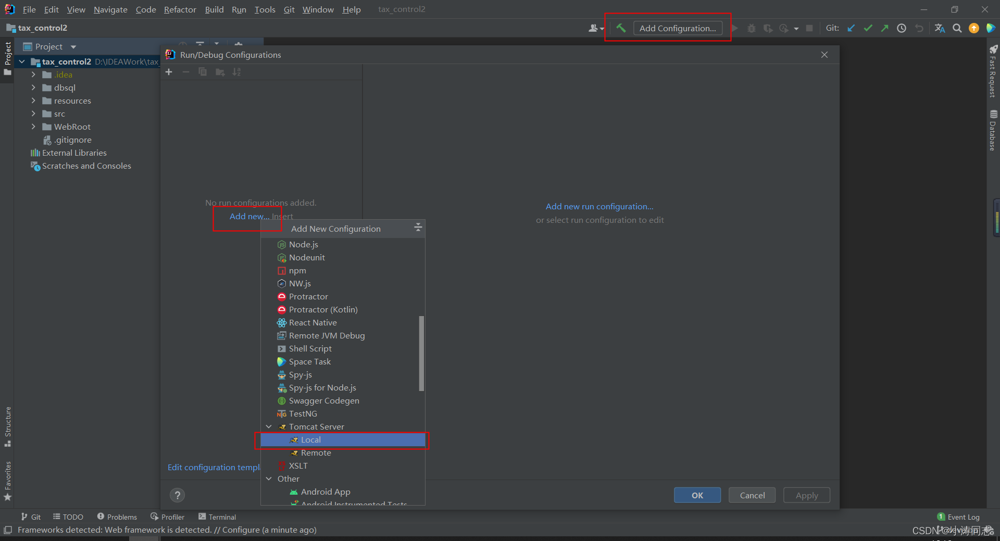
点击 ‘+’ ，选择项目使用的Tomcat版本后，点击OK
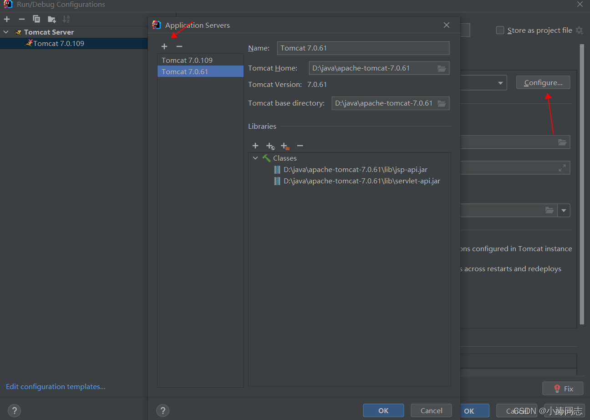
配置项目路径、端口号、jdk版本。点击OK
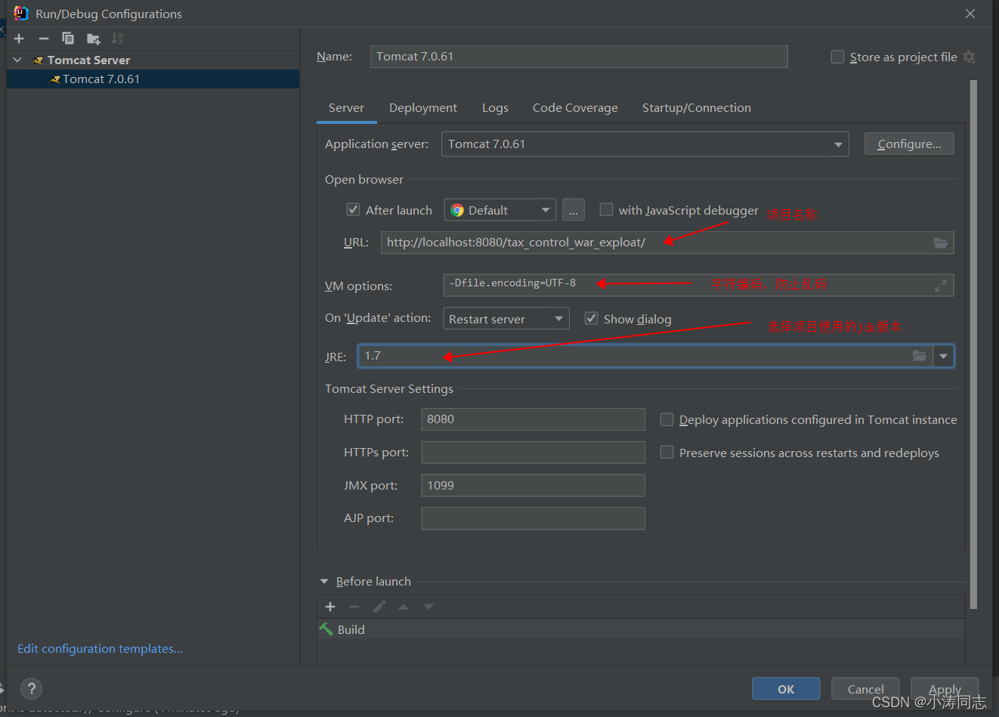

**第三步：** 项目配置
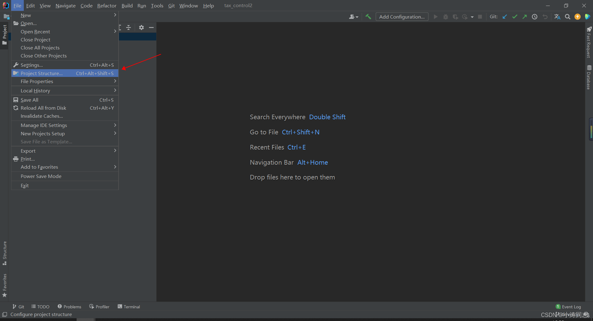
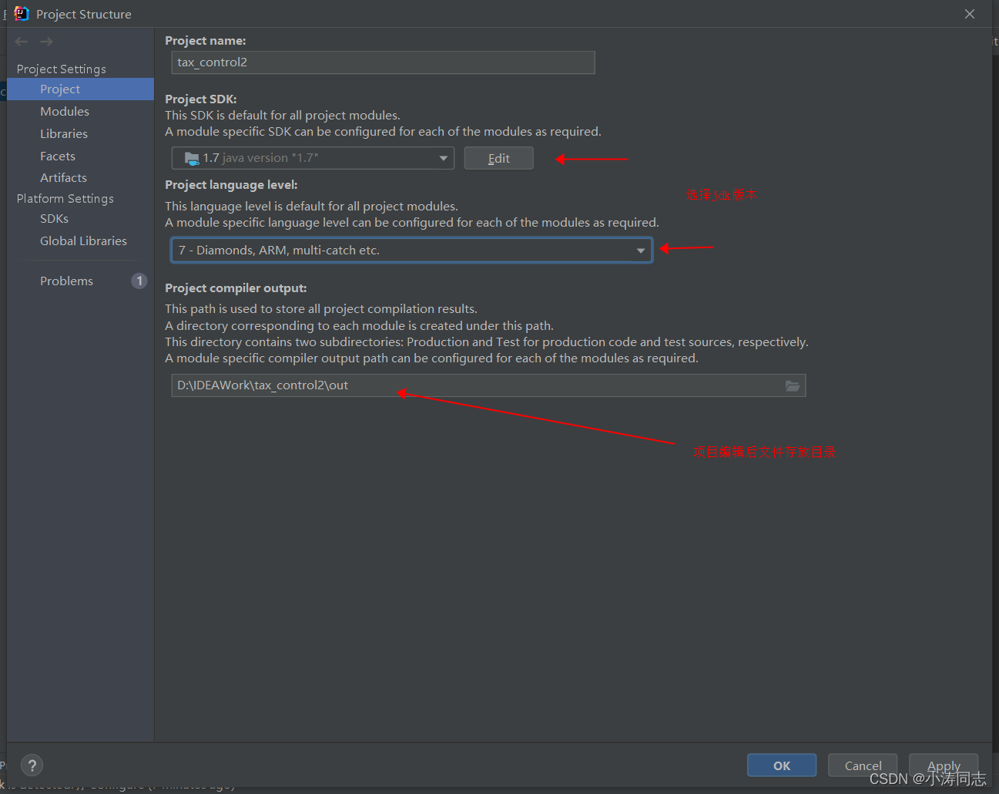
点击Library选择Tomcat
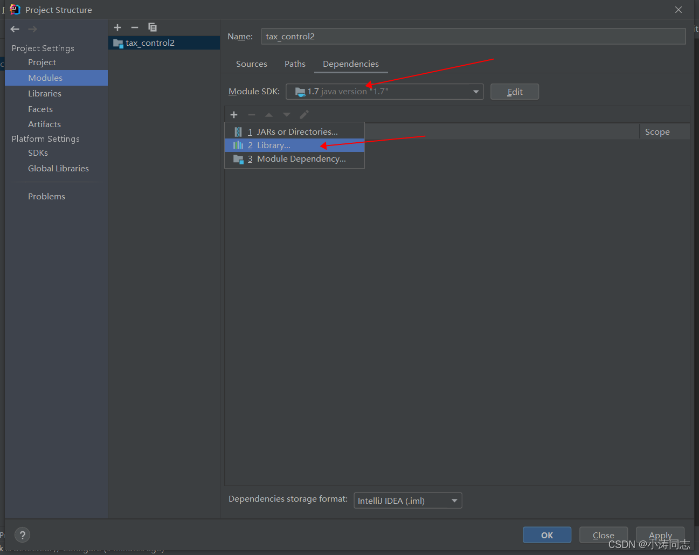
设置源文件类型
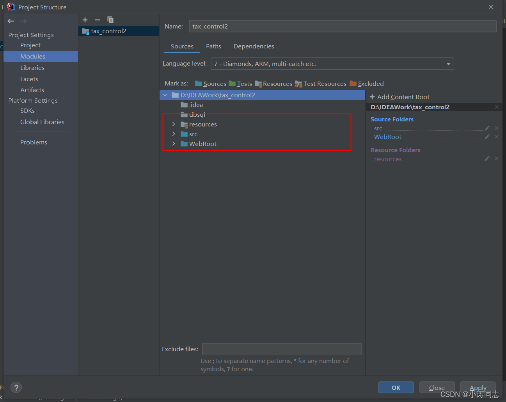
点击项目名称，新增Spring、web模块，点击Spring，点击 ‘+’ 全选中后点击OK
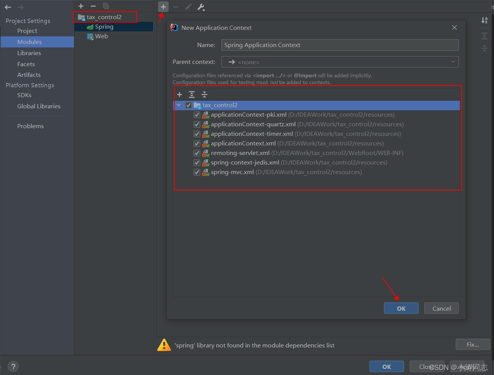
点击web，上面为web.xml所在路径，下面是WebROOT所在路径，然后点击警号中的 Create Artifact
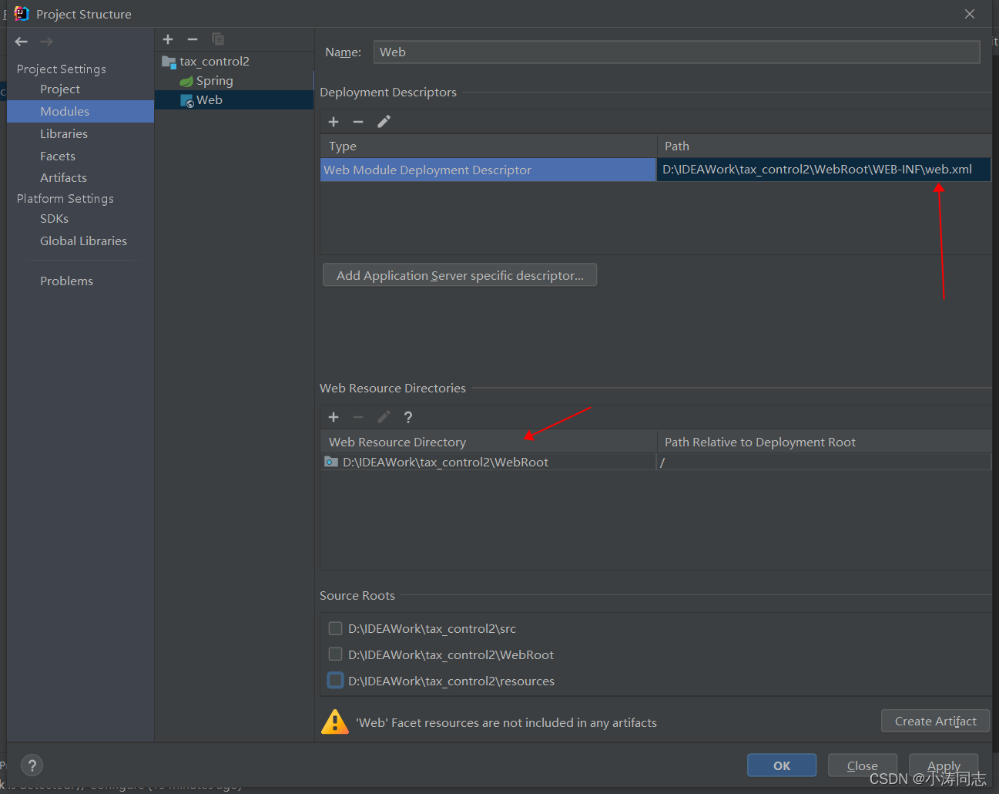
跳转到此页面，名称为设置Tomcat时项目的名称
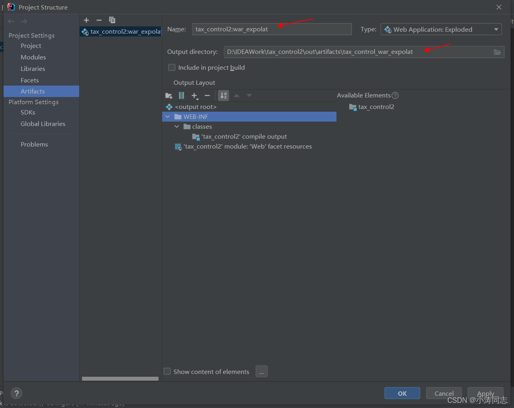
选择项目中的lib目录，将包引进来
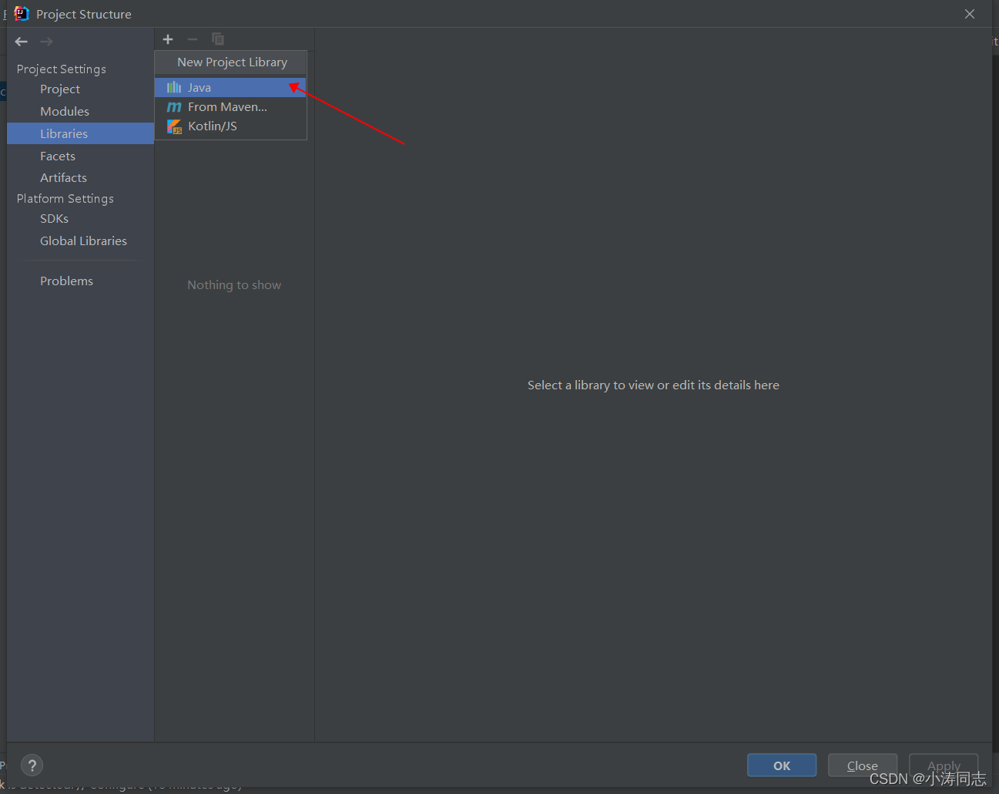
再次点击Tomcat配置，将编译包加载进来
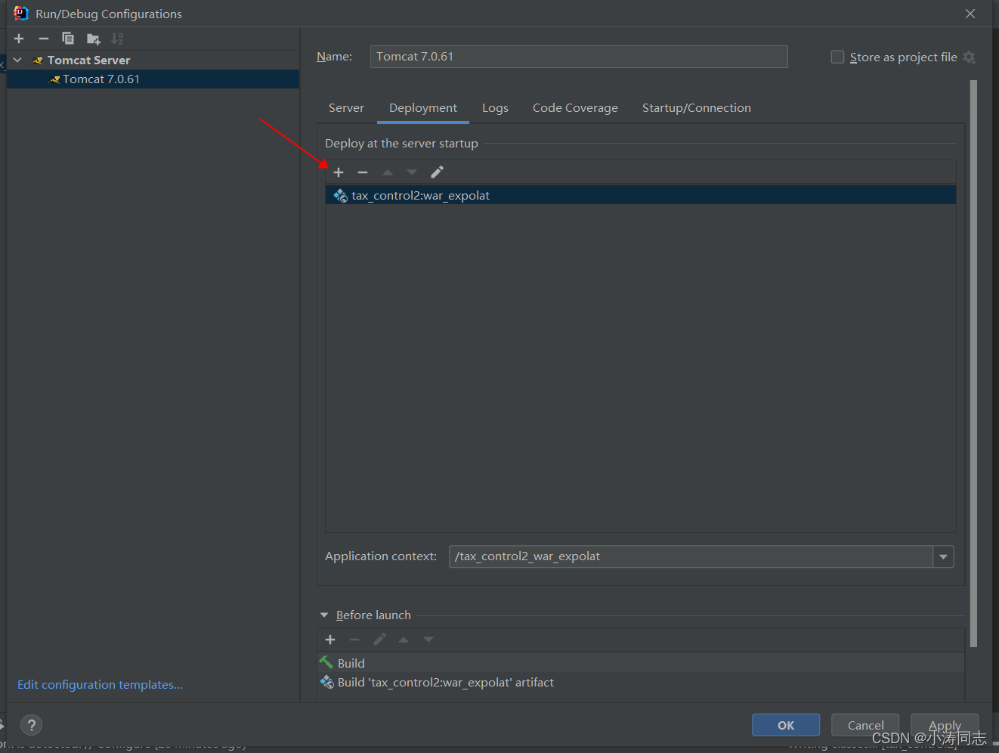
全部配置完成，点击启动，项目启动成功。

# 项目启动后页面css没有样式

>  https://blog.csdn.net/weixin_45394371/article/details/120335766

## 前言

写好的代码，在windows的tomcat上面打包运行都正常。结果到macOs上和linux服务器上 一样的代码，一样的tomcat配置运行以后项目出现无css、js效果等问题。

## 过程

开始以为是spring拦截了静态资源，结果看过请求以后，发现所有请求都成功请求回来，控制台也无报错。浏览器也换了又换，缓存清了又清，始终不能解决。感觉问题是前端问题，所以找了个前端大佬朋友来给我看了一下，果然发现一些端倪。
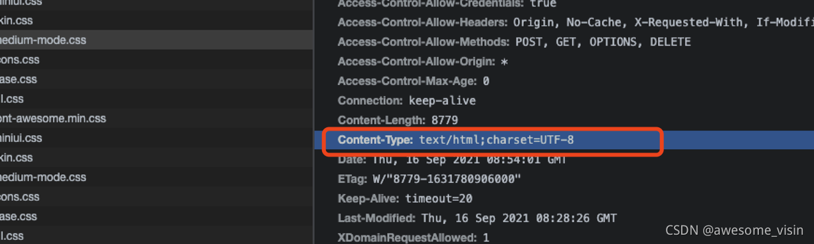
这些css的响应头里的类型又问题！！！ content-type变成了text/html 而内容类型 正常情况下应该是text/css
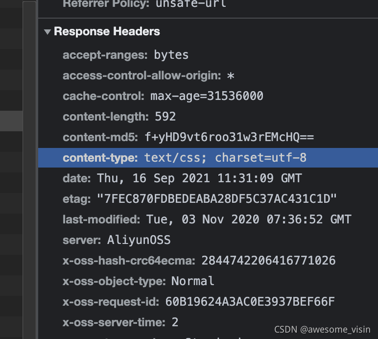所以导致这些css、js文件 不能被浏览器正常当作css 、js解析。才会出现文件请求都正常，就是没有效果的问题。

## 排查

那知道了原因，就得来排查问题。第一时间想到的 就是tomcat的配置问题。所以找到tomcat的web.xml文件 发现css文件并没有进行映射
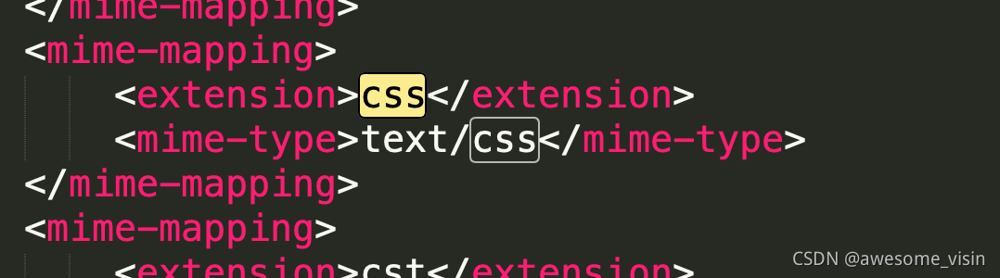
那会是什么情况呢，既然不是容器的问题，那就是后台给返回请求的时候出问题了，而所有的请求 都会经过过滤器。卧槽 该不会。。于是我打开后台代码，找到过滤器，直到看见这行代码
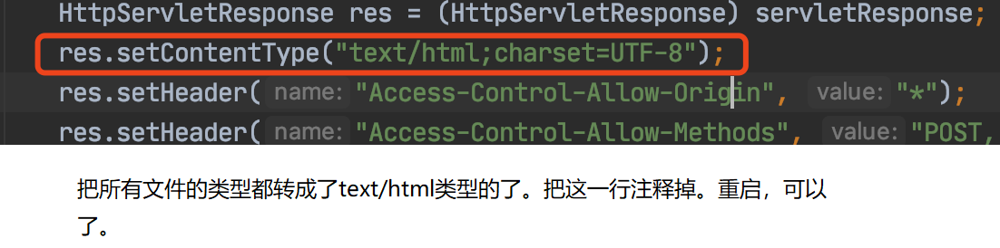
卧槽，原来是内容类型被强制设置成了text/html。是解决中文到浏览器中乱码问题的。结果在windows上没发生问题，打包到linux环境下就出问题，坑的一批。于是果断注释 重新打包运行。完美解决。
