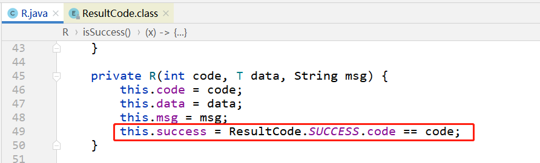
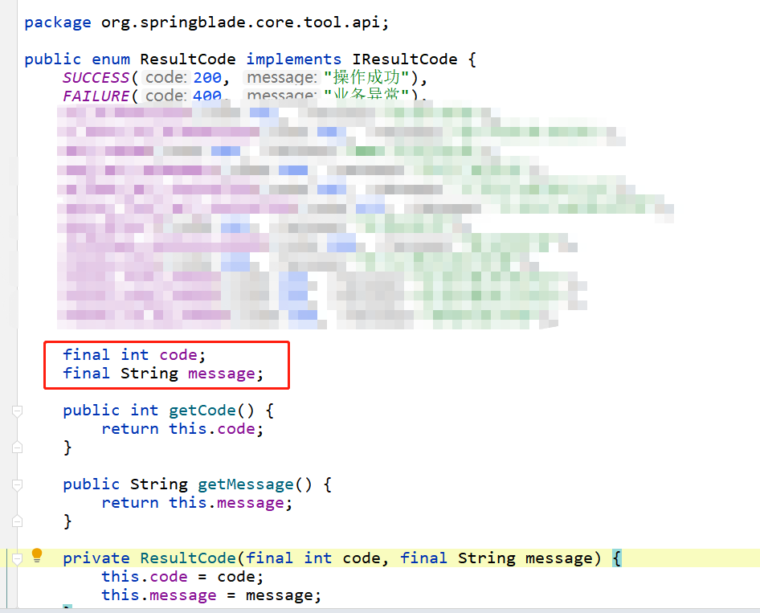
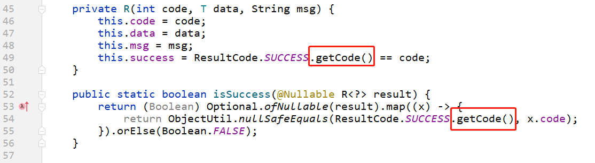
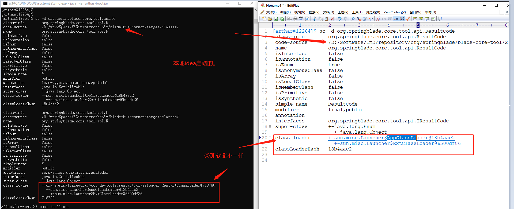
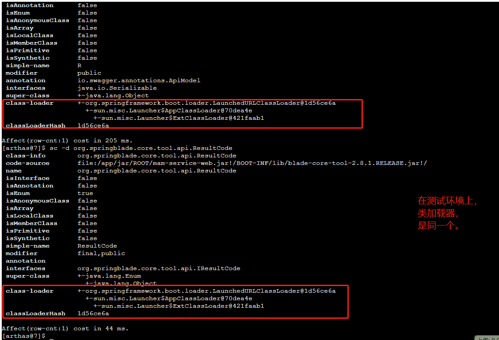

# 问题

今天在本地启动服务，调用接口却抛异常了：

```java
tried to access field org.springblade.core.tool.api.ResultCode.code from class org.springblade.core.tool.api.R
```


# 源码





如上图，

**编译不报错，运行时却报错了。**

我赶紧到测试环境和生产环境去看一下，发现：**测试环境和生产环境接口全都正常，没有报错的。**


`ResultCode` 类是三方jar包，`R` 之前也是三方jar包中同一个package中的类。

但是由于返回值缺少部分字段，就在classpath中重写了（相同的包名、类名）


# 解决

改成枚举中的public getCode()方法：




# 思考

从此bug的表现：在idea本地启动时，报错；在服务器上启动时不报错。

猜测是和idea启动方式有关。我本地idea使用debug启动，并且开发过程中都有热加载。我猜测是类加载器不一样导致的。

安装arthas:

```
curl -O https://arthas.aliyun.com/arthas-boot.jar;java -jar arthas-boot.jar 
```

先查看本地的R和ResultCode两个类的类加载器：发现类加载器不一样。

因为R类在classpath下，需要使用热加载类加载器：



查询测试环境上，两个类的类加载器：发现类加载器是一样的。




**综上可见，package 字段修饰符，还需要保证使用同一个类加载器。**


相同的：类的权限定名一样，如果使用不同的类加载器加载，则会出现  A.class != A.class