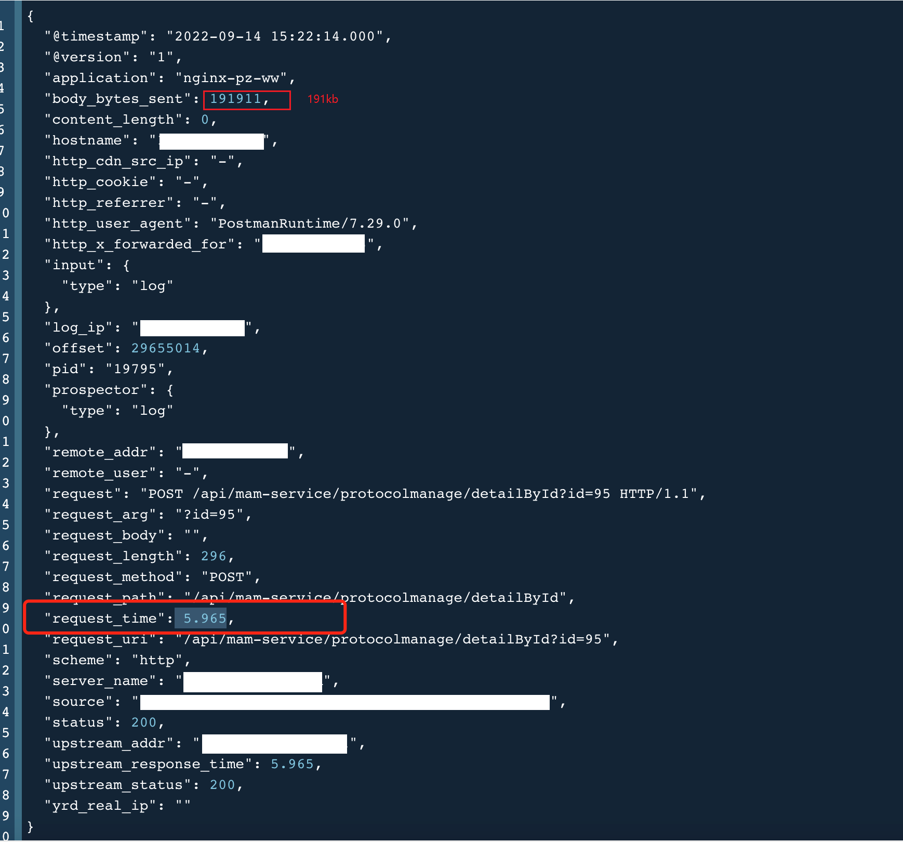

# 问题描述

每个APP都有用户协议，比如用户登录协议、用户注册协议。

今天公司的APP送审被驳回，原因之一是因为用户协议页面响应太慢，客户点击协议链接之后，需要6~9秒才能看到协议内容。

所以排查了一下。


# 用户协议实现逻辑

用户协议的内容，是在数据库保存的html富文本，根据协议id查询协议详情接口，接口返回后，把协议内容展示出来。

# 抓包

既然页面展示比较慢，那就看看接口多长时间响应。

经过抓包，发现当协议内容达到150kb时，响应时间明显变慢；协议内容在45kb时，响应时间很快。

# 加缓存

检查了一下，接口是有缓存的：当redis缓存中没有对应id的协议时，从数据库中查询，查询完放到缓存后，http接口返回给前端。

既然有缓存，那接口方面，其实没有什么优化措施了。


# 查日志

查日志发现：后端服务接口日志显示几十ms，接口返回是非常快的，说明redis缓存起作用了。


# nginx日志

查看nginx的日志，发现nginx响应时间5.965秒：



nginx日志中：如果接口返回数据量比较小，则响应时间就很快：


所以猜测是nginx的原因导致的，所以找运维工程师。

运维回复：


> 翻看Nginx官方文档，对该变量的解释是：
>
> ```applescript
> $upstream_response_time
> 
>    keeps time spent on receiving the response from the upstream server; 
>    the time is kept in seconds with millisecond resolution. 
>    Times of several responses are separated by commas and colons like addresses in the $upstream_addr variable.
> ```
>
> 翻译过来：`upstream_response_time`是与上游（FPM）建立连接开始到接收完内容花费的时间，单位为毫秒。
>
> 

从nginx层面看，此接口从请求到响应，使用了5.965秒 。

运维在容器中，直接调用接口（不走nginx），发现容器中的接口返回时间确实是很长的：5.921秒


```shell
# curl 命令查看接口响应时间
curl -o /dev/null -s -w "time_connect: %{time_connect}\ntime_starttransfer: %{time_starttransfer}\ntime_total: %{time_total}\n" --request POST 'http://xxxx.com/xxxxx' -H "Content-Type:application/json" -d '{"current": 1,"size": 20}'
```

此时，压力就到了开发这边了：

> **为什么从java日志中看到的响应时间只有几十毫秒，**
>
> **从nginx日志中看到响应时间有5.9秒呢 ？？？ **


# Java中打印的日志

根据java日志中的打印内容，找到打印日志的代码，发现是使用AOP记录了所有controller接口的请求参数、返回值等信息：

```java
@Around(
		"execution(!static org.springblade.core.tool.api.R *(..)) && " +
			"(@within(org.springframework.stereotype.Controller) || " +
			"@within(org.springframework.web.bind.annotation.RestController))"
	)
	public Object aroundApi(ProceedingJoinPoint point) throws Throwable {
		//     省略部分代码。
		// 打印执行时间
		long startNs = System.nanoTime();
		log.info(beforeReqLog.toString(), beforeReqArgs.toArray());
		// aop 执行后的日志
		StringBuilder afterReqLog = new StringBuilder(200);
		// 日志参数
		List<Object> afterReqArgs = new ArrayList<>();
		afterReqLog.append("\n\n===============  Response Start  ================\n");
		try {
			Object result = point.proceed();
			// 打印返回结构体
			if (BladeLogLevel.BODY.lte(level)) {
				afterReqLog.append("===Result===  {}\n");
				afterReqArgs.add(JsonUtil.toJson(result));
			}
			return result;
		} finally {
            // 【！！！！！！！！！！！！！！！ 这里计算接口处理时间 ！！！！！！！！！！！！！！！！！！！】
			long tookMs = TimeUnit.NANOSECONDS.toMillis(System.nanoTime() - startNs);
			afterReqLog.append("<=== {}: {} ({} ms)\n");
			afterReqArgs.add(requestMethod);
			afterReqArgs.add(requestUrl);
			afterReqArgs.add(tookMs);
			afterReqLog.append("===============   Response End   ================\n");
			log.info(afterReqLog.toString(), afterReqArgs.toArray());
		}
	}
```

计算接口响应时间的位置是在 finnaly 代码块中，也是没有问题的。

那么问题出在哪里了呢？


# 上神器：Arthas

**当时想的是：接口是使用SpringBoot 的controller写的，controller的方法返回之后，还有很多处理，比如需要把返回数据转成json、把json字符串写到response输出流中等等吧。**

**所以就想用Arthas监控一下这个接口，看看每个方法调用都花费多长时间：**


用Arthas抓到了两个方法调用，并且能看到每个方法执行时间。


熟悉Spring AOP原理的都知道，耗时最长的这个方法，其实执行的是AOP的增强方法。

所以我找到了AOP的方法，去抓一下AOP方法完整调用及每个方法的耗时：


打开这个AOP的源码：


问题原因找到了，解决方法也就简单了。

# 解决方法

从这个AOP的环绕通知注解上：

```java
@Around(
		"execution(!static org.springblade.core.tool.api.R *(..)) && " +
			"(@within(org.springframework.stereotype.Controller) || " +
			"@within(org.springframework.web.bind.annotation.RestController))"
	)
```

能知道，这个AOP拦截的是Controller接口中返回值为 R 类型的方法。

那么偏方治大病：

只需要把查询协议详情的这个接口返回值，改成 `Object`就行了。也就是把：

```java
    @PostMapping("/detailById")
    public R<ProtocolManageVO> detailById(int id) {
        return R.data(xxxService.detail(id));
    }
```

改成：（返回值改成 Object ）

```java
    @PostMapping("/detailById")
    public Object detailById(int id) {
        return R.data(xxxService.detail(id));
    }
```


修改、提交、发版、验证、解决了！


# 后续

> 问题：为什么 log.info() 打印200kb的日志需要耗时6秒呢？