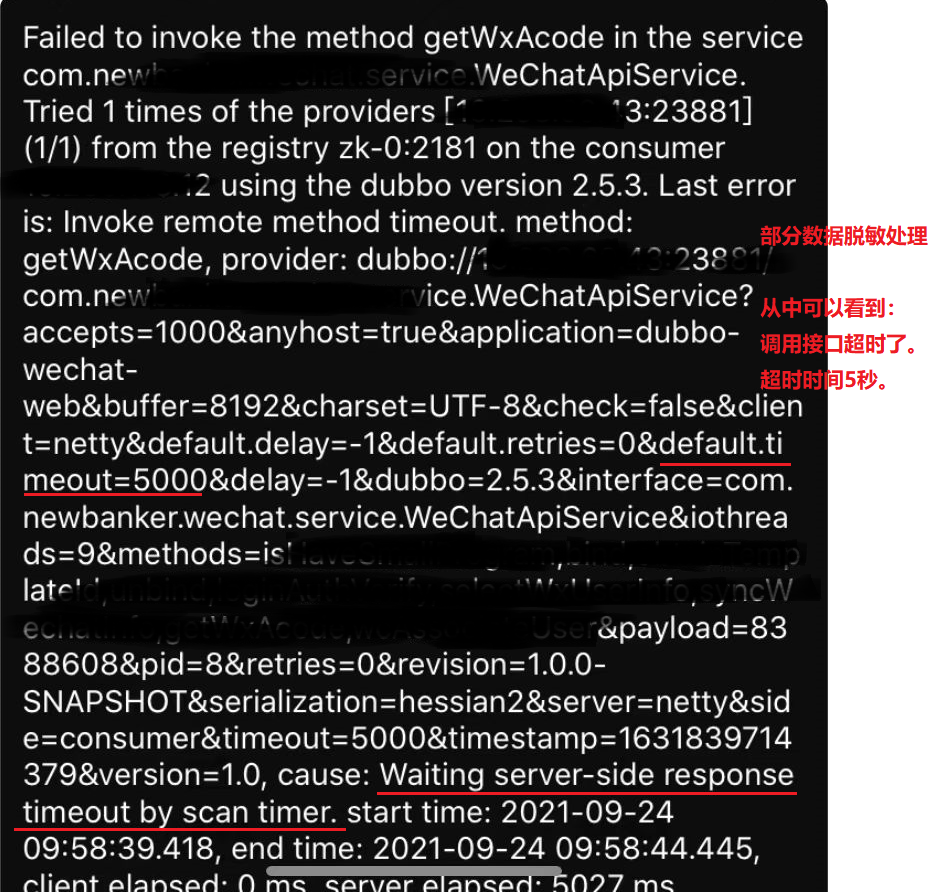
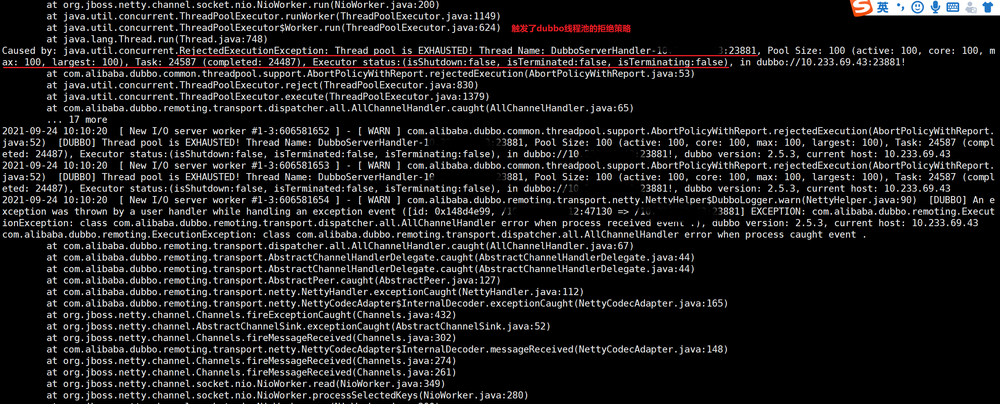
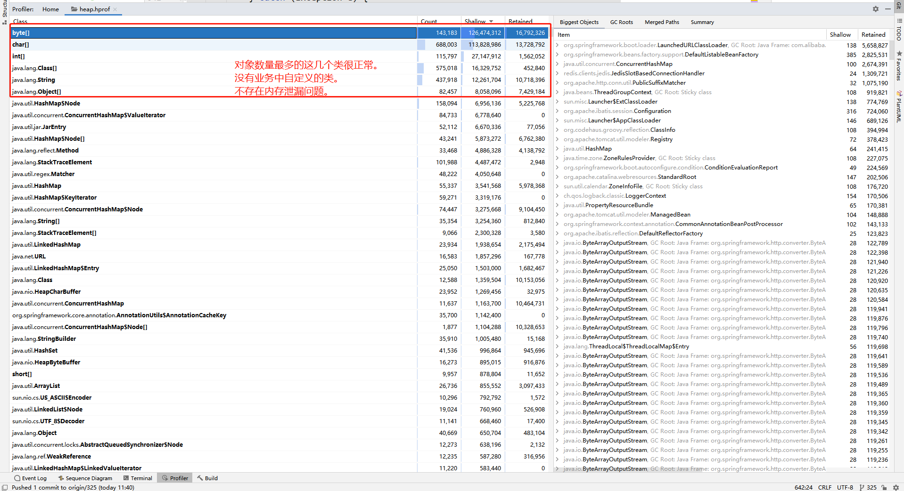
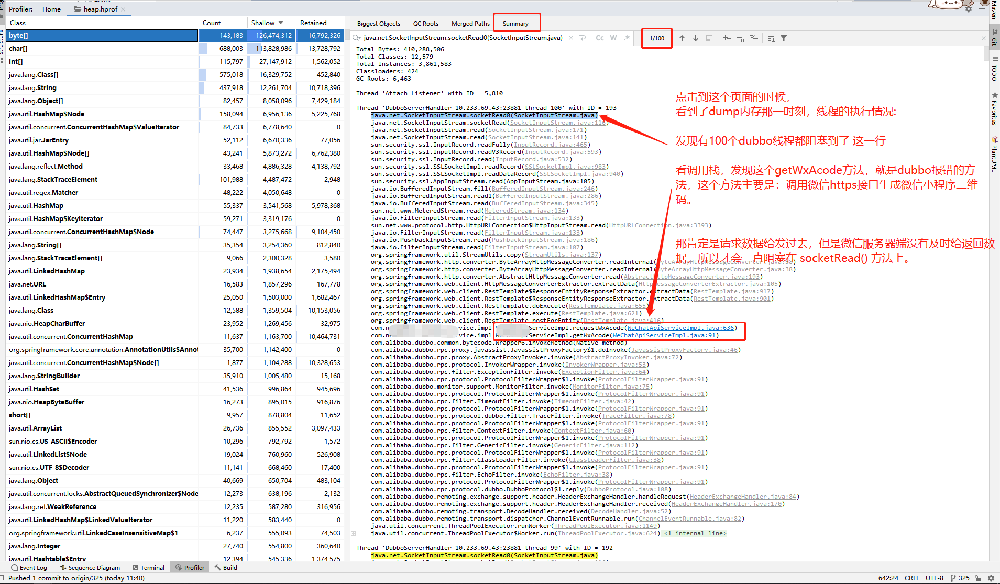
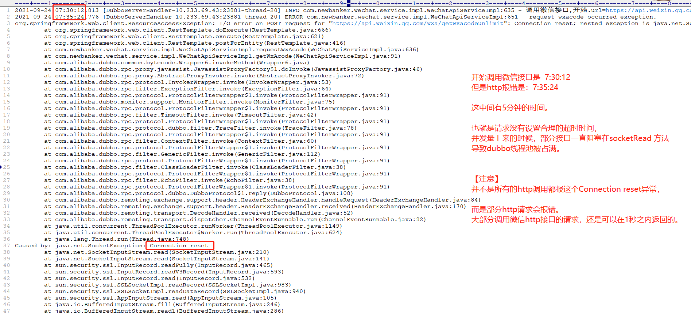

# bug描述

今天早上，客户APP生成微信小程序二维码又报错了。

这已经是第三次出现这种问题了，之前出现这种问题，为了快速解决都是直接重启对应的服务。客户说这次一定要找到根本原因并解决掉。

# 问题排查

运维发来异常日志：

我们知道，dubbo处理业务请求，是使用的线程池来做的——收到请求之后，直接交给线程池。

那么这**线程池满了**，从上图日志中看到，dubbo线程池有活跃线程：100个，核心线程数100，最大线程数100。

那么问题来了，线程池中的这些线程到底在干啥呢？那么慢，一直处理不完业务请求吗？

所以让运维把内存dump下来，并把dump文件发来。

# 内存dump

使用jdk自带的命令：

> jps
>
> jmap -dump:format=b,file=/apps/logs/heap.hprof  9        (备注：这里的9是java进程的进程号)

使用idea打开内存dump文件后，发现：

**到这里基本确定了：为什么dubbo线程池被占满：因为调用微信http接口一直不返回，阻塞到`socketRead()`方法上。**

那么问题来了：为什么会一直阻塞到 socketRead() 方法上呢？

排查运行日志发现：

这足以说明问题了：httpClient 没有设置合理的超时时间，使用的默认5分钟超时，导致部分http请求阻塞到socketRead() 方法上，

这样存在异常的http请求多了，慢慢的就把dubbo的线程池给占满了。

# 解决方案

**给httpClient设置超时时间。**

我们项目调用微信的这个接口，是使用的 RestTemplate。 网上给 RestTemplate 设置超时时间的博客很多，这里就不在赘述。

# 为什么Connection reset?

> 这一般是服务器的问题，需要检查服务器网络策略。并且这家客户确实是自建机房，没有使用阿里云。
>
> 托管的机房容易出各种问题，没有大厂专业，线路稳定性也差一点，这个错误遇见防火墙的时候常常遇见，直接被防火墙给卡断了就会是 reset
>
> reset 一般是服务器再发起请求的时候就出错了，都没到对方那里，
>
> 卡断的地方有的是本地服务器，或对方服务器，链接直接被丢失，但大概率是本地的问题，refused 大概率是对方
>
> 防火墙的策略还是很复杂的，ip，port 仅是最基本简单的。当然也不一定是防火墙策略导致的，只是有防火墙可能会遇到，线路不稳定也会出现。

以上来自大神朋友的聊天记录。

基本上意思是 Connection reset 是网络策略层面导致的。具体还是需要运维去排查。

（目前我对网络了解的还不多，就不班门弄斧了，有兴趣可以百度查一查。）

# 总结

### 问题原因

由于网络策略层面的问题，导致java进程中使用httpClient请求微信接口，超过5分钟未返回数据，并报错：Connection reset

### 解决办法

两个路线解决：
1、运维去排查网络策略
2、开发人员给httpClient加上超时时间，避免把dubbo线程池占满。

# 经验总结

一般来说，客户是自建机房，总是会配置很多的网络策略，无论是防火墙还是DNS，还是其他的网络策略。所以如果代码相同、其他客户环境上没有问题，只是这一家自建机房的客户存在问题，并且代码中又用到了http请求，那么大多情况都是自建机房的网络策略问题。此时找到日志之后，让运维去排查。

但是本案例中，httpClient没有设置超时时间，确实也把dubbo线程池给占满了，导致此微服务中的所有dubbo接口都无法对外提供服务。这也是代码不健壮的表现。

