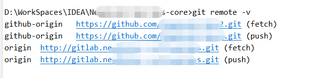
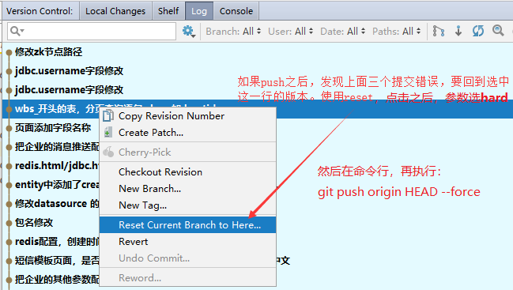
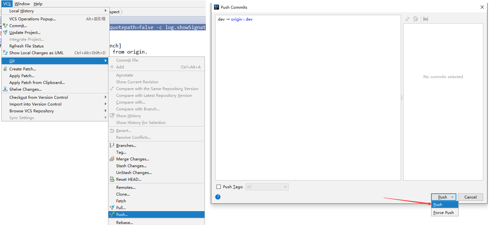

#  注意

我的电脑是windows所以下面的一些命令都是基于windows的。

比如findstr对应linux的grep命令

# Git全局配置和单个仓库的用户名邮箱配置

配置全局的用户名和邮箱

```
git config --global user.name "github’s Name"

git config --global user.email "github@xx.com"

git config --list --show-origin | findstr user
```


如果你公司的项目是放在自建的gitlab上面, 如果你不进行配置用户名和邮箱的话, 则会使用全局的, 这个时候是错误的, 正确的做法是针对公司的项目, 在项目根目录下进行单独配置

```bash
# 设置git本地项目用户名、邮箱 —— 使用个人邮箱
git config user.name "LiuXianfa" && git config user.email "745024471@qq.com" && git config --list --show-origin | findstr user && git config credential.helper "store --file .git/.git-credentials" && git config --list --show-origin | findstr credential
```

在linux系统上设置
```bash
# 设置git本地项目用户名、邮箱 —— 使用个人邮箱
git config user.name "LiuXianfa" \
    && git config user.email "745024471@qq.com" \
    && git config credential.helper "store --file .git/.git-credentials" \
    && git config --list --show-origin | grep user \
    && git config --list --show-origin | grep credential
```


git config --list 查看项目配置+全局配置, 使用的时候会优先使用当前项目的配置

加上 *--show-origin* 参数可以展示出是全局配置还是项目配置

参考：https://blog.csdn.net/pintu274111451/article/details/79767970

## GIT 拉取所有远程分支

```
git clone https://github.com/tanguosheng/spring-framework.git
git branch -r | grep -v '\->' | while read remote; do git branch --track "${remote#origin/}" "$remote"; done
git fetch --all
git pull --all
```


注：window系统cmd无法识别第一步中的命令，请使用git bash命令行

参考：https://www.freesion.com/article/89381170624/

# 推送所有本地分支到remote仓库

```
git remote add origin http://gitlab.xxx.com/xxx/xxx.git
git push -u origin --all
git push -u origin --tags
```


# 设置git remote仓库地址

git remote -v # 查看远程仓库地址



其中origin对应的源为默认源。

```
git remote set-url origin http://gitlab.xxx.com/xxx/xxx.git  
```


# $ git config --list

可以查看配置的一些东西。可以看到 user.name 和 user.email 分别是什么。。

如果你没有初始化过。那么直接：

$ git config --global user.name "输入你的用户名"

$ git config --global user.email "输入你的邮箱"

 

# 撤销提交

## 一、commit 到本地，但没有 push

1. 找到上次 Git commit 的 id

   git log

   找到你想撤销的 <commit_id>

2. git reset --hard <commit_id>

   完成撤销，同时将代码恢复到前一 <commit_id> 对应的版本。

3. git reset <commit_id>

   完成 Commit 命令的撤销，但是不对代码修改进行撤销，可以直接通过 git commit 重新提交对本地代码的修改。

## 二：push 之后的回退方法

   git reset --hard <commit_id>

   git push origin HEAD --force



 

 


# git操作报错及解决

> ====20:01  Can't Update==================================
>
> ​    No tracked branch configured for branch bug_SpringAOP_20180403 or the branch doesn't exist.
>
> ​    To make your branch track a remote branch call, for example,
>
> ​    git branch --set-upstream-to origin/bug_SpringAOP_20180403 bug_SpringAOP_20180403 (show balloon)

原因：新建了分支，只是在本地存在，需要 push。

执行：git -c core.quotepath=false -c log.showSignature=false push --progress --porcelain origin refs/heads/dev:dev --set-upstream

或者：idea 操作：




