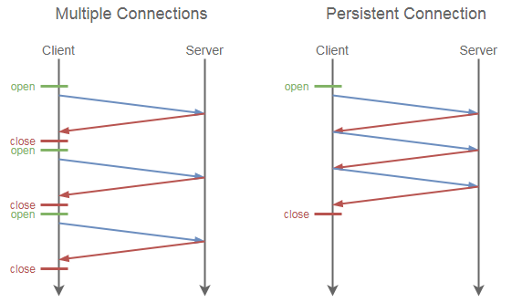
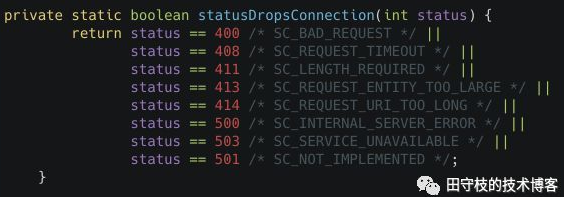
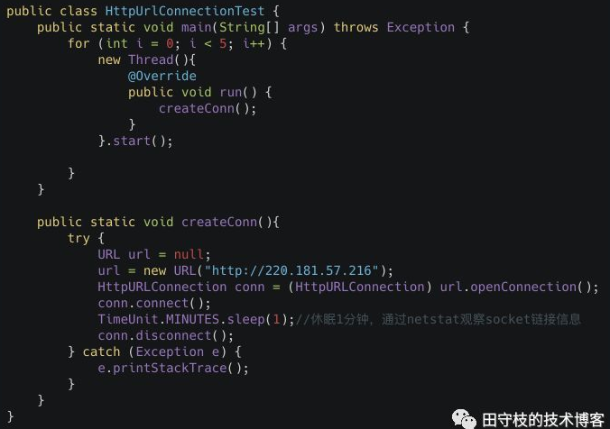
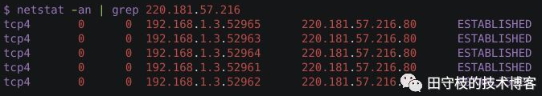
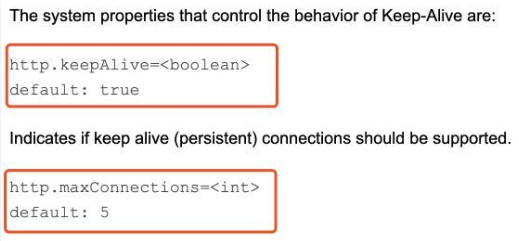
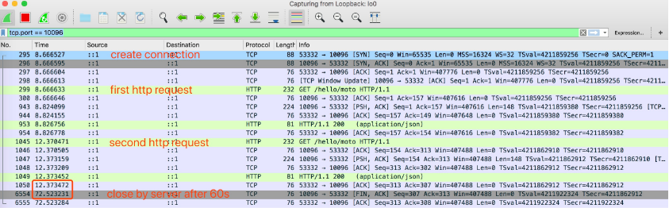
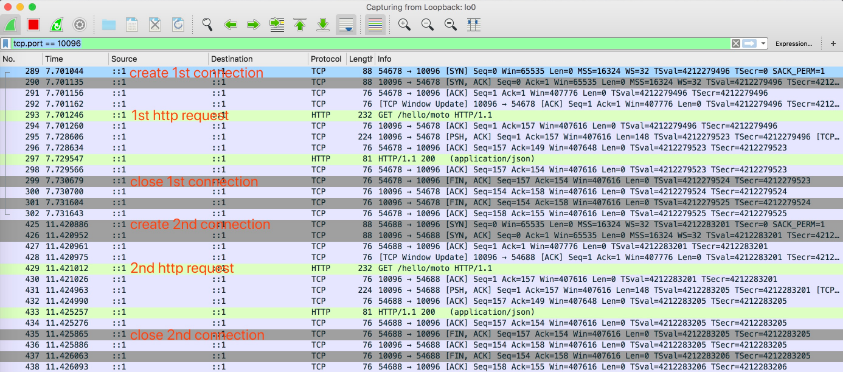

> Http——Keep-Alive机制
> https://www.cnblogs.com/caoweixiong/p/14720254.html


HTTP keep-alive 也称为 HTTP 长连接。它通过重用一个 TCP 连接来发送/接收多个 HTTP请求，来减少创建/关闭多个 TCP 连接的开销。

 

# **1. HTTP中的keep-alive**

## **1.1 为什么HTTP是短连接**

众所周知，HTTP是短连接，client向server发送一个request，得到response后，连接就关闭。之所以这样设计使用，主要是考虑到实际情况。

例如，用户通过浏览器访问一个web站点上的某个网页，当网页内容加载完毕之后，用户可能需要花费几分钟甚至更多的时间来浏览网页内容，

此时完全没有必要继续维持底层连。当用户需要访问其他网页时，再创建新的连接即可。

因此，HTTP连接的寿命通常都很短。这样做的好处是，可以极大的减轻服务端的压力。一般而言，一个站点能支撑的最大并发连接数也是有限的，

面对这么多客户端浏览器，不可能长期维持所有连接。每个客户端取得自己所需的内容后，即关闭连接，更加合理。

 

## **1.2 为什么要引入keep-alive**

通常一个网页可能会有很多组成部分，除了文本内容，还会有诸如：js、css、图片等静态资源，有时还会异步发起AJAX请求。

只有所有的资源都加载完毕后，我们看到网页完整的内容。然而，一个网页中，可能引入了几十个js、css文件，上百张图片，

如果每请求一个资源，就创建一个连接，然后关闭，代价实在太大了。

基于此背景，我们希望**连接**能够在**短时间**内得到复用，在加载同一个网页中的内容时，尽量的复用连接，这就是HTTP协议中keep-alive属性的作用。

- HTTP 1.0 中默认是关闭的，需要在http头加入"Connection: Keep-Alive"，才能启用Keep-Alive；
- HTTP 1.1 中默认启用Keep-Alive，如果加入"Connection: close "，才关闭。

 

## **1.3 什么是keep-alive？**

keep-alive 是客户端和服务端的一个约定，如果开启 keep-alive，则服务端在返回 response 后不关闭 TCP 连接；

同样的，在接收完响应报文后，客户端也不关闭连接，发送下一个 HTTP 请求时会重用该连接。

在 HTTP/1.0 协议中，如果请求头中包含：

```
Connection: keep-alive
```

则代表开启 keep-alive，而**服务端的返回报文头中，也会包含相同的内容**。

在 HTTP/1.1 协议中，默认开启 keep-alive，除非显式地关闭它：

```
Connection: close
```

 

## **1.4 用还是不用，这是个问题**

keep-alive 技术创建的目的，就是能在多次 HTTP 之间重用同一个 TCP 连接，从而**减少创建/关闭多个 TCP 连接的开销（包括响应时间、CPU 资源、减少拥堵等）**，

参考如下示意图（来源：维基百科）：



然而天下没有免费的午餐，如果客户端在接收完所有的信息之后还**没有关闭连接**，**则服务端相应的资源还在被占用（尽管已经没用了）**。

例如 Tomcat 的 BIO 实现中，未关闭的连接会占用对应的处理线程，如果一个长连接实际上已经处理完毕，但关闭的超时时间未到，

则该线程会一直被占用（使用 NIO 的实现没有该问题）。

显然，**如果客户端和服务端的确需要进行多次通信，则开启 keep-alive 是更好的选择**，例如在微服务架构中，通常微服务的使用方和提供方会长期有交流。

**在一些 TPS/QPS 很高的 REST 服务中，如果使用的是短连接（即没有开启keep-alive），则很可能发生客户端端口被占满的情形**。

这是由于短时间内会创建大量TCP 连接，而在 TCP 四次挥手结束后，客户端的端口会处于 TIME_WAIT一段时间(2*MSL)，

这期间端口不会被释放，从而导致端口被占满。这种情况下最好使用长连接。

 

## **1.5 如何处理keep-alive**

对于**客户端**来说，不论是浏览器，还是手机App，或者我们直接在Java代码中使用HttpUrlConnection，**只是负责在请求头中设置Keep-Alive**。

而**具体的连接复用时间的长短，通常是由web服务器控制的**。

**在HTTP协议中，Keep-Alive属性保持连接的时间长短是由服务端决定的，通常配置都是在几十秒左右。**

例如，在tomcat中，我们可以server.xml中配置以下属性：


说明如下：

- **maxKeepAliveRequests：**一个连接上，最多可以发起多少次请求，默认100，超过这个次数后会关闭。
- **keepAliveTimeout：**底层socket连接最多保持多长时间，默认60秒，超过这个时间连接会被关闭。 

当然，这不是所有内容，在一些异常情况下，keepalive也会失效。tomcat会根据http响应的状态码，判断是否需要丢弃连接(笔者这里看的是tomcat 9.0.19的源码)。

org.apache.coyote.http11.Http11Processor#statusDropsConnection



 

**1.6 客户端如何开启？**

现在我们用到的几乎所有工具都是默认开启长连接的：

- 对于**浏览器**而言，几乎你现在用的浏览器（包括 IE6）都默认使用 keep-alive 了。
- **Java8** 中的 **`HttpURLConnection`** 默认开启长连接，但是默认连接池中只保留 5 个长连接，如果同时超过 5 个线程在使用，则会创建新的连接，结束后多于 5 个的部分会被客户端主动关闭。
- **Apache `HttpClient`** 默认为每个地址保留 2 个长连接，连接池中最多共保留 20 个连接。
- **Python requests** 如果使用 session 则会默认开启长连接。

 

## **1.7 服务端如何实现？**

不同的服务端对 keep-alive 的实现方式不同，就连 tomcat 不同的工作模式下，处理的方式也不同。这里大致说下 NIO 模式(tomcat 9.0.22)下的处理逻辑：

- 在 `NioEndpoint#SocketProcessor` 类中，只会关闭内部状态为 `CLOSED` 的端口：

```
if (state == SocketState.CLOSED) {
    poller.cancelledKey(key, this.socketWrapper);
}
```

- 而在 `Http11Processor#service` 方法中，如果是 keep-alive 的连接，最终的内部状态会是 `OPEN`

```
} else if (this.openSocket) {
    return this.readComplete ? SocketState.OPEN : SocketState.LONG;
} else {
```

- 被保留的连接，超时时间之后，会在 `NioEndpoint#Poller#timeout` 方法中被关闭：

```
} else if (!NioEndpoint.this.processSocket(socketWrapper, SocketEvent.ERROR, true)) {
    this.cancelledKey(key, socketWrapper);
}
```

另外，如果使用 spring boot，可以通过 `server.connection-timeout` 配置项来调整 keep-alive 连接的保留时间，

如果不设置则为每个 server 自己的默认配置，Tomcat 默认为 **60s**

 

## **1.8 JDK对keep-alive的支持**

前文讲解了HTTP协议中，以tomcat为例说明了server端是如何处理keepalive的。**但这并不意味着在client端，除了设置keep-alive请求头之外，就什么也不用考虑了**。

在客户端，我们可以通过HttpUrlConnection来进行网络请求。当我们创建一个HttpUrlConnection对象时，其底层实际上会创建一个对应的Socket对象。

**我们要复用的不是HttpUrlConnection，而是底层的Socket**。

下面这个案例，演示了同时创建5个HttpUrlConnection：



运行这段代码，然后通过**netstat**命令观察tcp的socket连接信息：

****

可以看到，当我们创建5个HttpUrlConnection后，底层的确创建了对应数量的TCP socket连接。其中，192.168.1.3是本机ip，220.181.57.216是服务端ip。

当然，我们的重点是Java如何帮我们实现底层socket链接的复用。JDK对keepalive的支持是透明的，keepAlive默认就是开启的。

我们需要做的是，学会正确的使用姿势。官网上有说明，参见：

https://docs.oracle.com/javase/8/docs/technotes/guides/net/http-keepalive.html

```
When the application finishes reading the response body or when the application calls close() on the InputStream returned by URLConnection.getInputStream(), the JDK's HTTP protocol handler will try to clean up the connection and if successful, put the connection into a connection cache for reuse by future HTTP requests.
```

这段话的含义是：当通过URLConnection.getInputStream()读取响应数据之后(在这里是HttpUrlConnection)，应该调用InputStream的close方法关闭输入流，

JDK http协议处理器会将这个连接放到一个连接缓存中，以便之后的HTTP请求进行复用。

翻译成代码，当发送一次请求，得到响应之后，不是调用HttpURLConnection.disconnect方法关闭，这会导致底层的socket连接被关闭。

我们应该通过如下方式关闭，才能进行复用：

```
InputStream in=HttpURLConnection.getInputStream();//处理in.close()
```

这里并不打算提供完整的代码，官方已经给出的了代码示例，可参考上述链接。在实际开发中，通常是一些第三方sdk，如http-client、ok-http、RestTemplate等。

需要说明的是，只要我们的使用姿势正确。JDK对keepalive的支持对于我们来说是透明的，不过jdk也提供了相关系统属性配置来控制keeplive的默认行为，

如下：



说明如下：

- **http.keepAlive：**默认值为true。也就说是，即使我们不显示指定keep-alive，HttpUrlConnection也会自动帮我们加上。
- **http.maxConnections：**的默认值是5。表示对于同一个目标IP地址，进行KeepAlive的连接数量。举例来说，你针对同一个IP同时创建了10个HttpUrlConnection，对应底层10个socket，但是JDK底层只会其中5个进行KeepAlive，多余的会关闭底层socket连接。

最后，尽管你可能不直接使用HttpUrlConnection，习惯于使用http-client、ok-http或者其他第三方类库。

但是了解JDK原生对keep-alive的支持，也是很重要的。首先，你在看第三方类库的源码时，可能就利用到了这些特性。

 

## **1.9 抓包实验**

抓包之下，再复杂的逻辑也将显露无疑。我们使用 [Wireshark](https://www.wireshark.org/) 抓包。

使用了 keep-alive 的请求如下：



- 第二次 Http 请求时，并没有创建的连接的过程（没有 `SYN`），而是重用之前的连接
- 在默认 60s 超时后，由服务端发送 `FIN` 报文关闭连接。

而不开启 keep-alive 的请求过程如下：



可以看到，与 keep-alive 不同，每次请求结束时都关闭当前连接，之后重新创建新的连接。

 

# **2. HTTP与TCP中keep-alive的区别**

- **HTTP协议(七层)**的Keep-Alive意图在于**连接复用**，希望可以短时间内在同一个连接上进行多次请求/响应。**核心在于：时间要短，速度要快。**

　　  举个例子，你搞了一个好项目，想让马云爸爸投资，马爸爸说，"我很忙，最多给你3分钟”，你需要在这三分钟内把所有的事情都说完。

- **TCP协议(四层)**的KeepAlive机制意图在于**保活、心跳，检测连接错误**。**核心在于：虽然频率低，但是持久。**

　　  当一个TCP连接两端长时间没有数据传输时(通常默认配置是2小时)，发送keepalive探针，探测链接是否存活。

　　  例如，我和厮大聊天，开了语音，之后我们各自做自己的事，一边聊天，有一段时间双方都没有讲话，然后一方开口说话，

　　  首先问一句，"老哥，你还在吗？”，巴拉巴拉..。又过了一会，再问，"老哥，你还在吗？”。

 

 

引用：

- https://cloud.tencent.com/developer/article/1430022
- https://lotabout.me/2019/Things-about-keepalive/