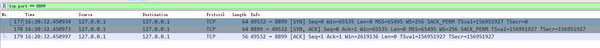
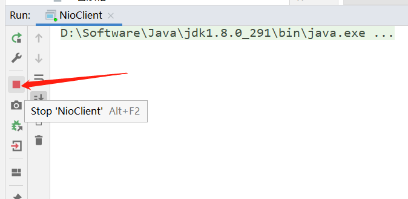
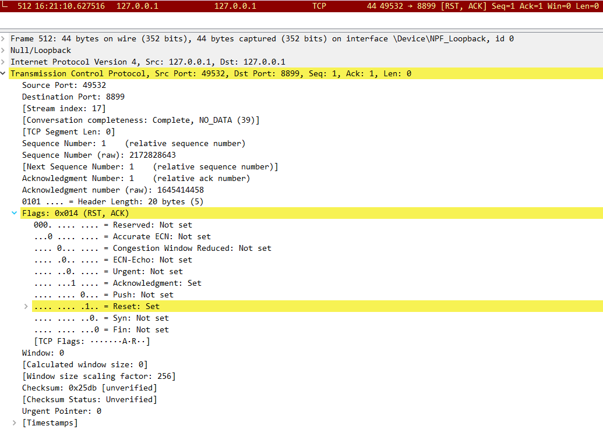
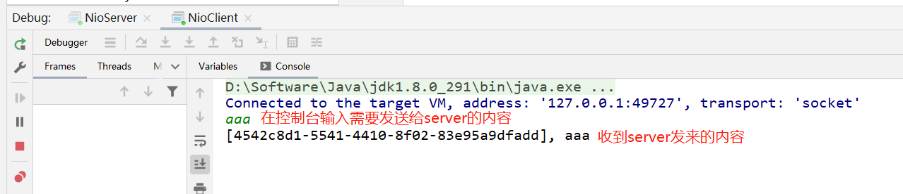
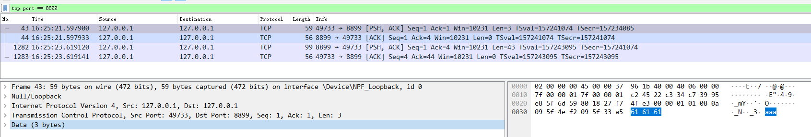
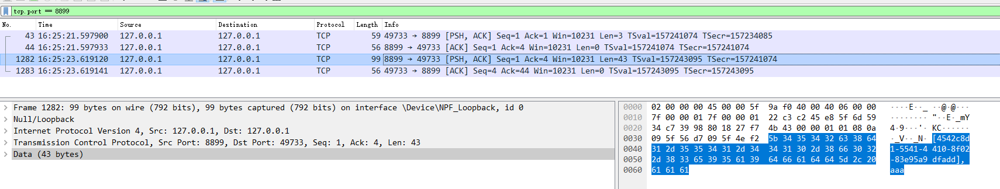

# Nio服务端：

NioServer.java

# Nio客户度：

NioClient.java


# 客户端启动、停止

1、启动服务端

2、启动客户端

此时抓包：



3、强制关闭client：




client给server端发送RST包，如下图。



对于server端，RST也是一个TCP数据包，

server端内核把此数据读取到接收缓冲区后，应用程序从接收缓冲区读数据，

应用程序发现TCP的flag是RST，此时就会抛出异常：

```java
java.io.IOException: 远程主机强迫关闭了一个现有的连接。
	at sun.nio.ch.SocketDispatcher.read0(Native Method)
	at sun.nio.ch.SocketDispatcher.read(SocketDispatcher.java:43)
	at sun.nio.ch.IOUtil.readIntoNativeBuffer(IOUtil.java:223)
	at sun.nio.ch.IOUtil.read(IOUtil.java:197)
	at sun.nio.ch.SocketChannelImpl.read(SocketChannelImpl.java:378)
	at NioServer.read(NioServer.java:73)
	at NioServer.lambda$main$0(NioServer.java:41)
	at java.lang.Iterable.forEach(Iterable.java:75)
	at NioServer.main(NioServer.java:36)
```


# 客户端给服务端发送消息










