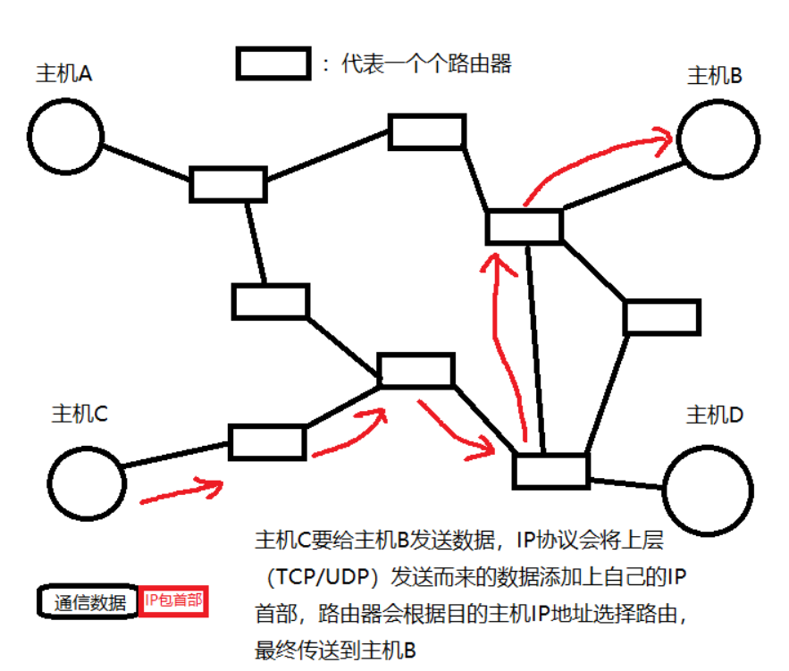
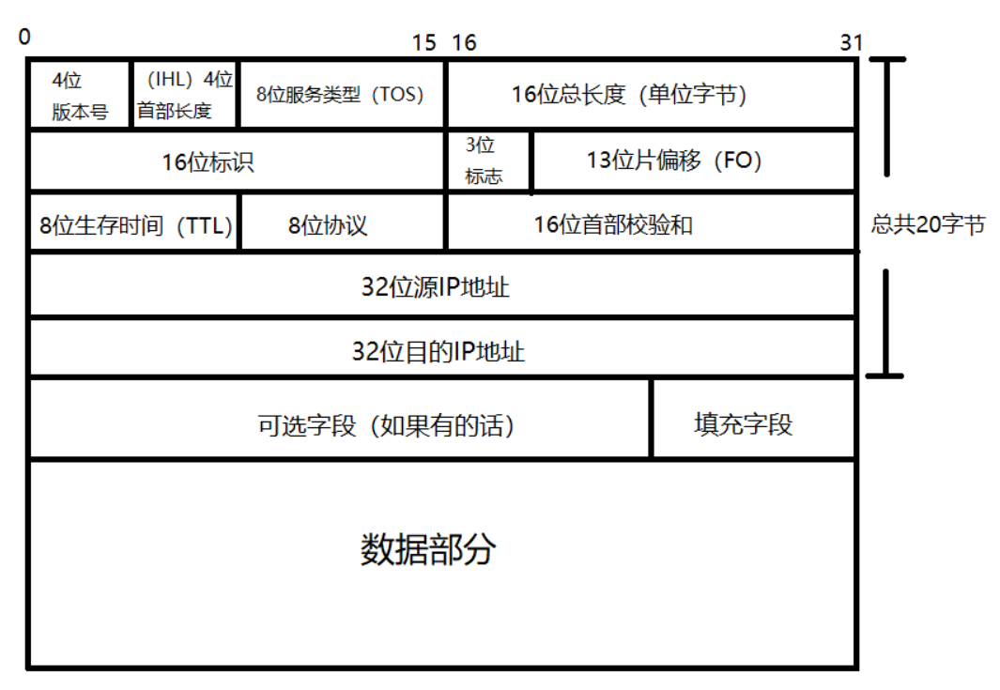
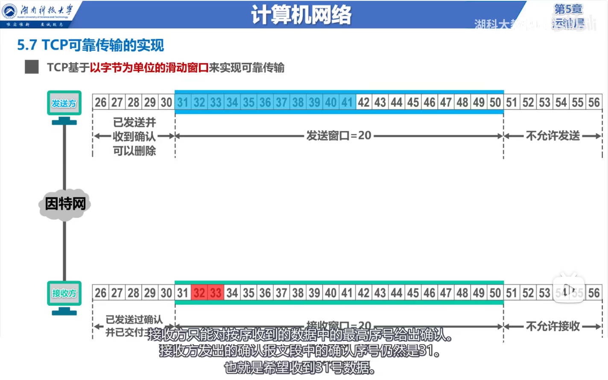
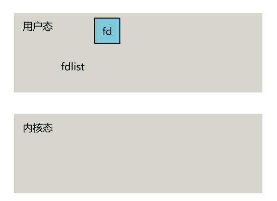

# OSI 7层参考模型

### 应用层

- 应用层
- 表示层
- 会话层

### 传输控制层

- TCP
- UDP

### 网络层

	IP协议

		如果想要在互联网这个共享网络中精确定位到一台主机，那么就一定需要该主机的IP地址。主机是拥有IP地址，但是不能进行路由控制（Routing，意思是中转、分组数据包），路由器（Router）这种设备既有IP地址，又可以进行路由控制；我们可以将接入互联网中的主机和路由器都叫做节点。

- 下一跳

	- 根据当前ip和子网掩码做与运算。找到网关。把数据直接发给网关对应IP的机器
	- 每经过一台网络设备，ip头中的TTL就会减1。当TTL=0的时候，网络设备就会把此ip数据包丢弃。

### 链路层

- MAC

	- 给下一跳发送的数据，需要携带下一跳的mac地址。
	- 如果本机没有下一跳的mac地址，则先使用art协议，查询下一跳的mac地址。
	- 下一跳，收到数据后，判断IP地址是不是自己，如果不是的话，把数据包中的mac地址修改成自己下一跳的mac地址，继续发送数据包
	- 如果ip地址就是自己：自己机器根据端口号处理此消息。

### 物理层

# IO模型：描述了应用层程序和内核之间如何交互。

- 阻塞，等待直到数据存在
- nio非阻塞，没有数据返回null
- 多路复用器

# Tcp

### 面向链接

- 是一个双向连接，通过三次握手之后创建连接，四次挥手之后释放连接。

### 可靠的

- 在数据传输过程中，每个数据包都需要对方ack，否则超时重传。

### 流式通信协议

- 传输控制层协议
- int socket（int domain ，int type，int protocol）

	- type协议类型：
	tcp的类型是：SOCK_STREAM 流式协议
	UDP协议的类型是：SOCK_DGRAM 报式传输协议
	- protocol：协议类型
	0：tcp
	- 返回文件描述符，可以作为监听，也可以作为通信

### 三次握手

- 参考视频： https://www.bilibili.com/video/BV1Gf4y137dF

- c syn s
s syn-ack c
c ack s
- 三次握手后，c s分别创建资源

	- 可使用 cd /proc/$$/fd 查看文件描述符
	- socket

		- 套接字：四元组：源ip端口+目标ip端口
		能确定唯一的链接
		- Recv-Q

			- 数据接收队列

		- Send-Q

			- 需要发送的数据，内核保存到这个对接，就结束了。

- netstat -natp

### 数据传输

- 接收到数据后，都需要发送ack，
否则超时重传

### 滑动窗口

- 【TCP滑动窗口动态演示-哔哩哔哩】https://www.bilibili.com/video/BV1qi4y1V7cz
- 滑动窗口演示 https://www.bilibili.com/video/BV1FE411C7dk 视频疑问：
  - 疑问：发送0~4号数据包，0号数据包发送时丢失。Receiver没有收到0号数据包，Receiver不应该发送1、 2、 3、 4 的ack 才对吧？
  - 解答：是的，这个视频有问题。
  - 详见：https://www.bilibili.com/video/BV1p7411e7py  7:17
  - 
- TCP两次挥手，你见过吗？那四次握手呢？ https://mp.weixin.qq.com/s/tWysfUVbOMa8CmdmJ_SUaQ 

### 心跳ack包

传输控制层每隔一段时间，发送心跳ack包

确保对方仍然存在。

### 四次分手

c fin s
s fin-ack c
s fin c
c fin-ack s

### 三次握手+数据发送+ack+四次分手不可分割

- LVS，负载均衡服务器必须把一个tcp链接路由到指定服务器
- DDos攻击：客户端只发送syn请求，但就是不响应ack。服务器就一直有大量的tcp链接等待中

### 每次数据包大小都是固定的，默认 1460字节

- 对方在收到数据包之后，需要发送ack确认消息。

tcpdump -nn -i eth0 port 8080

### 沾包，拆包是什么？

- tcp是背锅侠  tcp协议本身并没有问题
- 当使用tcp协议开发应用程序时，客户端发送给服务端消息长度不固定，比如做IM系统中的发送的消息内容长度不固定，此时如果直接使用tcp进行发送消息，虽然tcp每次发送的数据包大小固定（1460字节）但是这些字节对应的消息内容可能是一个长句被拆开，或者几个短句被粘连。

**主流的协议解决方案可以归纳如下：**

- 消息定长，例如每个报文的大小固定为20个字节，如果不够，空位补空格；
- 在包尾增加回车换行符进行切割；
- 将消息分为消息头和消息体，消息头中包含表示消息总长度的字段；
- 更复杂的应用层协议。

- 从业务方面解决办法：消息头中使用4字节int类型，记录消息长度。收到消息后，先读取4字节，转成int类型 int length。然后再次从socket中读取length个字节长度。然后再转成业务中适应的消息。

**Netty解决TCP粘包/拆包问题示例**

todo：

### 发送缓冲，接收缓冲

- 注意：在linux内核中，数据会保存在socket对应文件描述符中的发送缓冲中，计算机硬件会从发送缓冲中通过网卡发送出去。
接受缓冲同理。

### RST 报文

## 为什么要学习IO和Epoll

### C10k

- Apache httpd线程模型
- nginx线程模型

### IO模型

- 同步/阻塞

	- Java BIO的问题

		- 文件IO

			- 内存拷贝：
使用输入流读文件时，用户态程序调用需要系统调用：在系统调用之前，会插入int x80中断，CPU在直行到int x80中断时，会对用户态程序保护执行现场（把用户态执行信息保存到内存），然后调用内核。
在内核程序中：CPU先在内存中开辟一个page cache（一般都是4kb），然后把内存总线控制权交给DMA控制器，让DMA去把磁盘中的数据读取到内存中的这个page cache中。
而在DMA读取磁盘数据到内存的这段时间，CPU又可以执行其他线程的指令。
当DMA控制器吧数据从磁盘搬运到内存page cache中后，DMA控制器会给CPU发送一个中断指令，并归还内存总线控制权。
经过CPU时间片轮转后，当CPU收到中断指令后，CPU收到内存总线控制权，次数CPU就会唤醒用户态程序，把内存中page cache中的数据，返回给用户态。
此时会出现数据的拷贝：从内核态拷贝到用户态。
			- 数据拷贝：
磁盘--（通过DMA控制器）--内核内存page cache--用户态内存
			- CPU切换：
用户态--内核态--DMA--内核态--用户态
			- 缺点

				- 用户态读取过程是阻塞的
				- 数据从内核态拷贝到用户态
				- CPU上下文切换

		- 网络IO

			- server端代码
			- client端代码
			- 上面server端缺点：accept方法，read方法都是阻塞方法。如果其中任意方法阻塞，都会影响另一个方法的处理。
			- 解决方案：accept接收到的每个client socket，都交给单独的线程处理。
此方案的缺点：如果server端有10K个客户端连接，则server端会产生10K个线程处理。

- 异步

	- 注意：Java BIO和 NIO都是同步的！！
这里后面会细说。

- 非阻塞

	- 文件IO

		- 注意：Java NIO相对于BIO，只是【非阻塞】的。
NIO在Java中，表示的是NonBlockingIO。
		- 代码示例

			- 子主题 1

		- JavaNIO，是非阻塞的，在read方法时，如果没有数据，不会一直等待直到有数据。

	- 网络IO

- 多路复用器

	- select
	- poll
	- epoll

## IO多路复用器

### select

- 在内核中，使用一个线性表，每次最多检测1024个fd的变化。每次检测都需要只用一个bitmap，用于标识对应线性表的下标位fd状态，如果bitmap有变化，则需要遍历bitmap——遍历是为了查询到那个fd变化了（这一步骤中，内核只会返回bitmap中是否有文件描述符状态变化，并不会返回哪个文件变化，所以需要遍历bitmap，时间复杂度O(n)）
另外每次bitmap都需要进行内存拷贝。
- 个人疑问：select是在内核中实现的，那么为什么说bitmap需要内存拷贝呢？感觉不需要了
	
- 

### poll

### epoll

