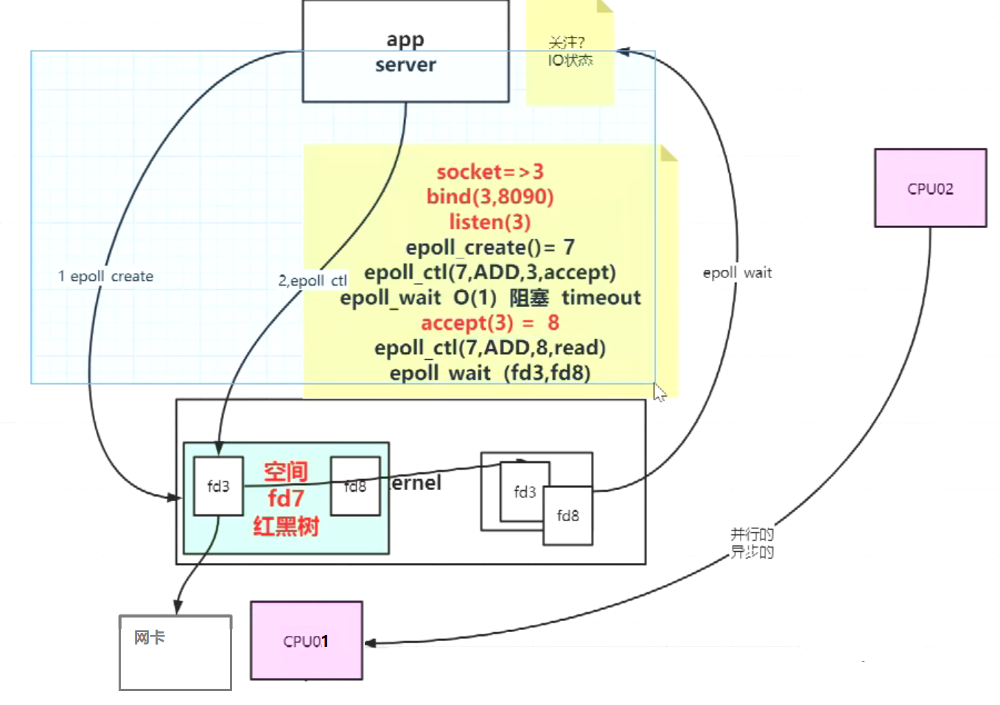

poll

> [man 2 poll](images/image-20210902215801303.png)

# [p6 Epoll](https://www.bilibili.com/video/BV1Af4y117ZK?p=6)

> select() will block.
> poll() will block.
> epoll_wait() will block.
>
> 都可以设置参数时间。
>
> - [man 2 epoll_create](images/image-20210902220224953.png)
>
> - [man 2 epoll_ctl](images/image-20210902220303248.png)
>
> - [man 2 epoll_wait](images/image-20210902220335285.png)
> - [man 2 close](images/image-20210902220407084.png)

