> 转自：https://mp.weixin.qq.com/s/pV-ovk1Nup2b9P5pp_lxGA
>
> 作者：坤哥
>
> 


今天我们先聊一下高并发下的网络 IO 模型设计

高并发即我们所说的 C10K（一个server 服务 1w 个 client）,C10M，写出高并发的程序相信是每个后端程序员的追求，高并发架构其实有一些很通用的架构设计，如无锁化，缓存等，今天我们主要研究下高并发下的网络 IO 模型设计，我们知道不管是 Nginx，还是 Redis，Kafka，RocketMQ 等中间件，都能轻松支持非常高的 QPS，其实它们背后的网络 IO 模型设计理念都是一致的，所以了解这一块对我们了解设计出高并发的网络 IO 框架具体重要意义，本文将会从以下几个方面来循序渐近地向大家介绍如何设计出一个高并发的网络 IO 框架

- 传统网络 IO 模型的缺陷
- 针对传统网络 IO 模型缺陷的改进
- 多线程/多进程
- 阻塞改为非阻塞
- IO 多路复用
- Reactor 的几种模型介绍

### 传统网络 IO 模型的缺陷

我们首先来看下传统网络 IO 模型有哪些缺陷，主要看它们的阻塞点有哪些。我们用一张图来看下客户端和服务端的基于 TCP 的通信流程

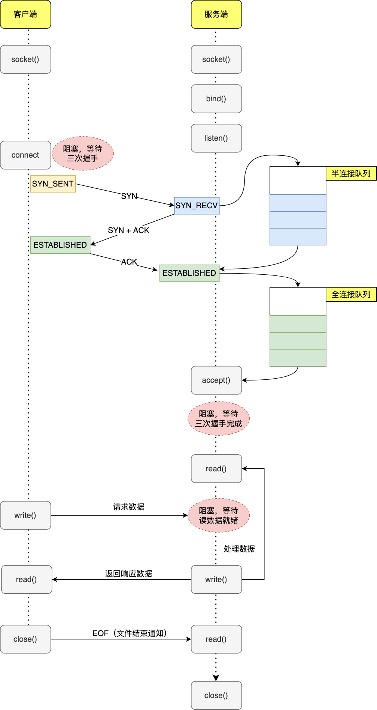

服务端的伪代码如下

```c
listenSocket = socket(); //调用socket系统调用创建一个主动套接字
bind(listenSocket);  //绑定地址和端口
listen(listenSocket); //将默认的主动套接字转换为服务器使用的被动套接字，也就是监听套接字
while (1) { //循环监听是否有客户端连接请求到来
   connSocket = accept(listenSocket); //接受客户端连接
   recv(connsocket); //从客户端读取数据，只能同时处理一个客户端
   send(connsocket); //给客户端返回数据，只能同时处理一个客户端
}
```

可以看到，主要的通信流程如下

1. server 创建监听 socket 后，执行 bind() 绑定 IP 和端口，然后调用 listen() 监听，代表 server 已经准备好接收请求了，listen 的主要作用其实是初始化半连接和全连接队列大小
2. server 准备好后，client 也创建 socket ，然后执行 connect 向 server 发起连接请求，**这一步会被阻塞**，需要等待三次握手完成，第一次握手完成，服务端会创建 socket（这个 socket 是连接 socket，注意不要和第一步的监听 socket 搞混了）,将其放入半连接队列中，第三次握手完成，系统会把 socket 从半连接队列摘下放入全连接队列中，然后 accept 会将其从全连接队列中摘下，之后此 socket 就可以与客户端 socket 正常通信了，默认情况下如果全连接队列里没有 socket，则 accept 会**阻塞等待**三次握手完成

经过三次握手后 client 和 server 就可以基于 socket 进行正常的进程通信了（即调用 write 发送写请求，调用 read 执行读请求），但需要注意的是 read，write 也很可能会被阻塞，需要满足一定的条件读写才会成功返回，在 LInux 中一切皆文件，socket 也不例外，每个打开的文件都有读写缓冲区，如下图所示

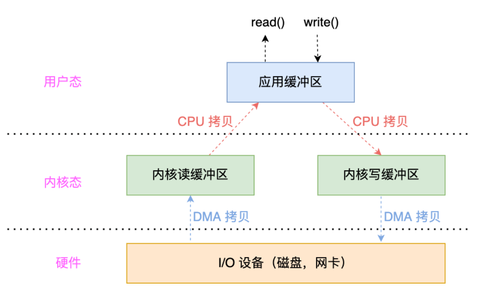

对文件执行 read()，write() 的具体流程如下

1. 当执行 read() 时，会从内核读缓冲区中读取数据，如果缓冲区中没有数据，则会**阻塞等待**，等数据到达后，会通过 DMA 拷贝将数据拷贝到内核读缓冲区中，然后会唤醒用户线程将数据从内核读缓冲区拷贝到应用缓冲区中
2. 当执行 write() 时，会将数据从应用缓冲区拷贝到内核写缓冲区，然后再通过 DMA 拷贝将数据从写缓冲区发送到设备上传输出去，如果写缓冲区满，则 write 会**阻塞等待**写缓冲区可写

经过以上分析，我们可以看到传统的 socket 通信会阻塞在 connect，accept，read/write 这几个操作上，这样的话如果 server 是单进程/线程的话，只要 server 阻塞，就不能再接收其他 client 的处理了，由此可知**传统的 socket 无法支持 C10K**

### 针对传统网络 IO 模型缺陷的改进

接下来我们来看看针对传统 IO 模型缺陷的改进，主要有两种

1. 多进程/线程模型
2. IO 多路程复用

#### 多进程/线程模型

如果 server 是单进程，阻塞显然会导致 server 无法再处理其他 client 请求了，那我们试试把 server 改成多进程的？只要父进程 accept 了 socket ，就 fork 一个子进程，把这个 socket 交给子进程处理，这样就算子进程阻塞了，也不影响父进程继续监听和其他子进程处理连接


程序伪代码如下

```c
while(1) {
  connfd = accept(listenfd);  // 阻塞建立连接
  // fork 创建一个新进程
  if (fork() == 0) {
    // accept 后子进程开始工作
    doWork(connfd);
  }
}
void doWork(connfd) {
  int n = read(connfd, buf);  // 阻塞读数据
  doSomeThing(buf);  // 利用读到的数据做些什么
  close(connfd);     // 关闭连接，循环等待下一个连接
}
```

通过这种方式确实解决了单进程 server 阻塞无法处理其他 client 请求的问题，但众所周知 fork 创建子进程是非常耗时的，包括页表的复制，进程切换时页表的切换等都非常耗时，每来一个请求就创建一个进程显然是无法接受的

为了节省进程创建的开销，于是有人提出把多进程改成多线程，创建线程（使用 pthread_create）的开销确实小了很多，但同样的，线程与进程一样，都需要占用堆栈等资源，而且碰到阻塞，唤醒等都涉及到用户态，内核态的切换，这些都极大地消耗了性能

由此可知采用多进程/线程的方式并不可取

**画外音**: 在 Linux 下进程和线程都是用统一的 task_struct 表示，区别不大，所以下文描述不管是进程还是线程区别都不大

#### 阻塞改为非阻塞

既然多进程/多线程的方式并不可取，那能否将进程的阻塞操作（connect，accept，read/write）改为非阻塞呢，这样只要调用这些操作，如果相应的事件未准备好，就立马返回 EWOULDBLOCK 或 EAGAIN 错误，此时进程就不会被阻塞了，使用 fcntl 可以可以将 socket 设置为非阻塞，以 read 为例伪代码如下

```c
connfd = accept(listenfd);
fcntl(connfd, F_SETFL, O_NONBLOCK);
// 此时 connfd 变为非阻塞，如果数据未就绪，read 会立即返回
int n = read(connfd, buffer) != SUCCESS; 
```

read 的非阻塞操作流程图如下

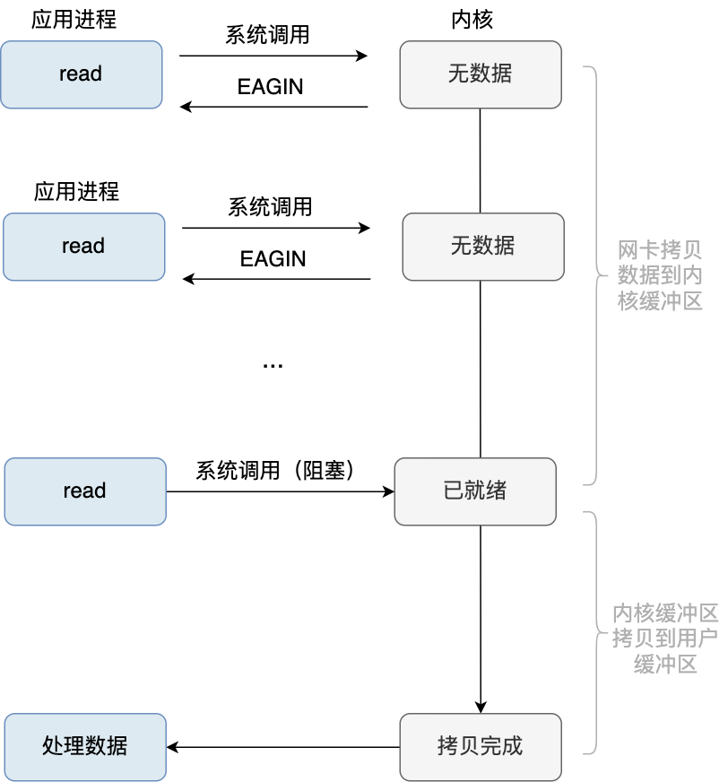


非阻塞read

这样的话调用 read 就不会阻塞等待而会马上返回了，也就实现了非阻塞的效果，不过需要注意的，我们这里说的非阻塞并非严格意义上的非阻塞，**这里的非阻塞只是针对网卡数据拷贝到内核缓冲区这一段，如果数据就绪后，再执行 read 此时依然是阻塞的，此时用户进程会占用 CPU 去把数据从内核缓冲区拷贝到用户缓冲区中**，可以看到这种模式是**同步非阻塞**的。

这里我们简单解释下阻塞/非阻塞，同步/非同步的概念

- **阻塞/非阻塞**指的是在数据从网卡拷贝到内核缓冲区期间，**进程能不能动**，如果能动，就是非阻塞的，不能动就是阻塞的

- **同步/非同步**指的是数据就绪后**是否需要用户进程亲自调用 read 来搬运数据（将数据从内核空间拷贝到用户空间）** ，如果需要，则是同步，如果不需要则是非同步（即异步），异步 I/O 示意图如下：

  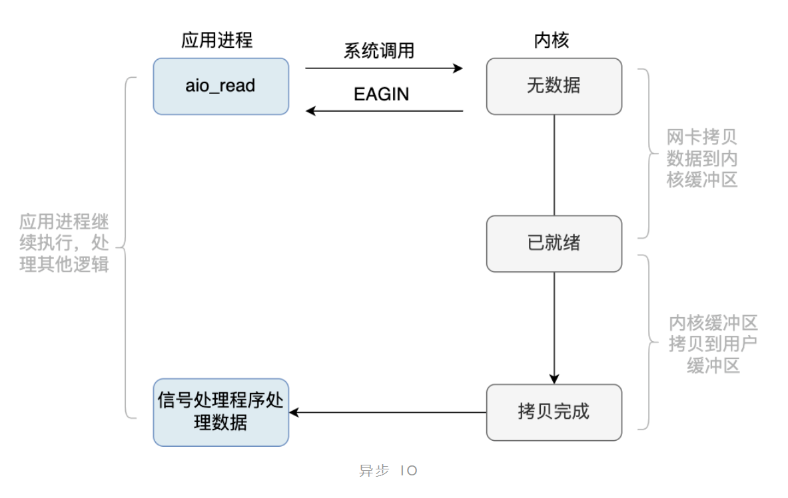

  异步 IO

异步 IO 执行流程如下：进程发起 I/O 请求后，让内核在整个操作处理完后再通知进程，这整个操作包括网卡拷贝数据到内核缓冲区，将数据从内核缓冲区拷贝到用户缓冲区这两个阶段，内核在处理数据期间（从无数据到拷贝完成），应用进程是可以继续执行其他逻辑的，异步编程需要操作系统支持，目前只有 windows 完美支持，Linux 暂不支持。可以看出异步 I/O 才是真正意义上的非阻塞操作，因为数据从内核缓冲区拷贝到用户缓冲区这一步不需要用户进程来操作，而是由内核代劳了

我们以一个案例来总结下阻塞/非阻塞，同步/异步：当你去餐馆点餐时，如果在厨师做菜期间，你啥也不能干，那就是阻塞，如果在此期间你可以玩手机，喝喝茶，**能动**，那就是非阻塞，如果厨师做好了菜，你需要亲自去拿，那就是同步，如果厨师做好了，菜由服务员直接送到你的餐桌，那就是非同步（异步）

现在回过头来看将阻塞转成非阻塞是否满足了我们的需求呢？看起来进程确实可以动了，但进程需要不断地以轮询数据的形式调用 accept，read/write 这些操作来询问内核数据是否就绪了，这些都是系统调用，对性能的消耗很大，而且会持续占用 CPU，导致 CPU 负载很高，**远不如等数据就绪好了再通知进程去取更高效**。这就好比，厨师做菜期间，你不断地去问菜做好了没有，显然没有意义，更高效的方式无疑是等厨师菜做好了主动通知你去取

#### IO 多路复用

经过前面的分析我们可以得出两个结论

1. 使用多进程/多线程 IO 模型是不可行的，这一步可以优化为单线程
2. 应该等数据就绪好了之后再通知用户进程去读取数据，而不是做毫无意义的轮询，注意这里的数据就绪不光是指前文所述的 read 的数据已就绪，而是泛指 accept，read/write 这三个事件的数据都已就绪

于是 IO 多路复用模型诞生了，它是指用一个进程来监听 listen socket（监听 socket） 的连接建立事件，connect socket（已连接 socket） 的读写事件（读写），一旦数据就绪，内核就会唤醒用户进程去处理这些 socket 的相应的事件

IO多路复用

IO多路复用

这里简单介绍一下 fd（文件描述符），以便大家更好地了解之后 IO 多路复用中出现的 fd 集合等概念

#### 文件系统简介

我们知道在 Linux 中无论是文件，socket，还是管道，设备等，一切皆文件，Linux 抽象出了一个 VFS（virtual file system） 层，屏蔽了所有的具体的文件，VFS 提供了统一的接口给上层调用，这样应用层只与 VFS 打交道，极大地方便了用户的开发，仔细对比你会发现，这和 Java 中的面向接口编程很类似


通过 open()，socket() 创建文件后，都有一个 fd（文件描述符） 与之对应，对于每一个进程，都有一个文件描述符列表（File Discriptor Table） 来记录其打开的文件，这个列表的每一项都指向其背后的具体文件，而**每一项对应的数组下标就是 fd**，对于用户而言，可以认为 fd 代表其背后指向的文件

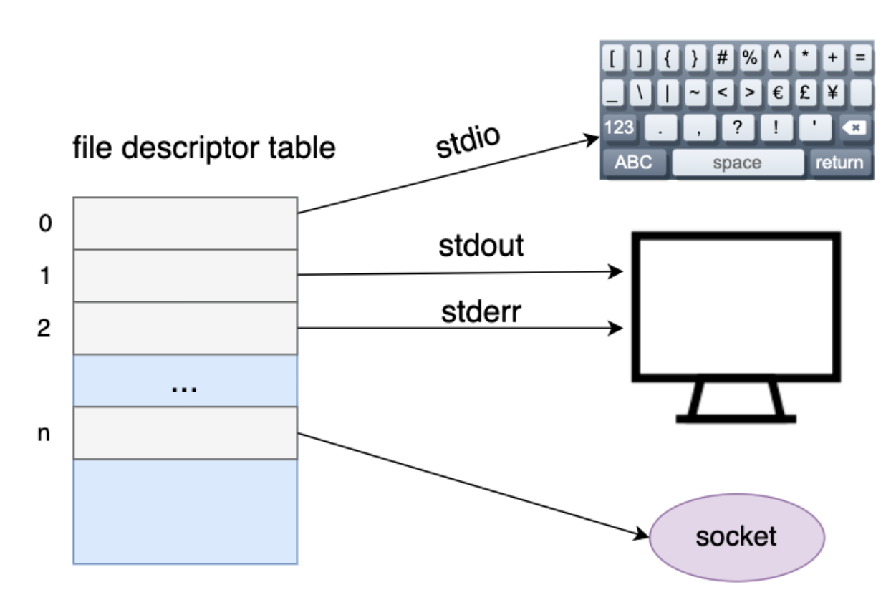

fd 的值从 0 开始，其中 0，1，2 是固定的，分别指向标准输入（指向键盘），标准输出/标准错误（指向显示器），之后每打开一个文件，fd 都会从 3 开始递增，但需要注意的是 fd 并不一定都是递增的，如果关闭了文件，之前的 fd 是可以被回收利用的

IO 多路复用其实也就是用一个进程来监听多个 fd 的数据事件，用户可以把自己感兴趣的 fd 及对应感兴趣的事件（accept，read/write）传给内核，然后内核就会检测 fd ，一旦某个 socket 有事件了，内核可以唤醒用户进程来处理

那么怎样才能知道某个 fd 是否有事件呢，一种很容易想到的做法是搞个轮询，每次调用一下 read(fd)，让内核告知是否数据已就绪，但是这样的话如果有 n 个感兴趣的 fd 就会有 n 次 read 系统调用，开销很大，显然不可接受

所以使用 IO 多路复用监听 fd 的事件可行，但必须解决以下三个涉及到性能瓶颈的点

1. 如何**高效**将用户感兴趣的 fd 和事件传给内核
2. 某个 socket 数据就绪后，内核如何**高效**通知用户进程进行处理
3. 用户进程如何高效处理事件

前面两步的处理目前有 select，poll，epoll 三种 IO 多路事件模型，我们一起来看看，看完你就会知道为啥 epoll 的性能是如此高效了

#### select

我们先来看下 select 函数的定义

```c
返回：若有就绪描述符则为其数目，若超时则为 0，若出错则为-1
int select(int maxfd, 
                     fd_set *readset, 
                     fd_set *writeset, 
                     fd_set *exceptset, 
                     const struct timeval *timeout);
```

maxfd 是待测试的描述符基数，为待测试的最大描述符加 1，readset，writeset，exceptset 分别为读描述符集合，写描述符集合，异常描述符集合，这三个分别通知内核，在哪些描述描述符上检测数据可以读，可写，有异常事件发生，timeout 可以设置阻塞时间，如果为 null 代表一直阻塞

这里需要说明一下，为啥 maxfd 为待测试的描述符加 1 呢，主要是因为数组的下标是从 0 开始的，假设进程新建了一个 listenfd，它的 fd 为 3，那么代表它有 4 个 感兴趣的 fd（每个进程有固定的 fd = 0,1,2 这三个描述符），由此可知 maxfd = 3 + 1 = 4


接下来我们来看看读，写，异常集合是怎么回事，如何设置针对 fd 的感兴趣事件呢，其实事件集合是采用了一种位结构（bitset）的方式，比如现在假设我们对标准输入（fd = 0），listenfd（fd = 3）的读事件感兴趣，那么就可以在 readset 对应的位上置 1

**画外音**：使用 FD_SET 可将相应位置置1，如 FD_SET(listenfd, &readset)

如下


即 readset 为 {1, 0,0, 1}，在调用 select 后会将 readset 传给内核，如果内核发现 listenfd 有连接已就绪的事件，则内核也会在将相应位置置 1（其他无就绪事件的 fd 对应的位置为 0）然后会回传给用户线程，此时的 readset 如下，即 {1,0,0,0}


于是进程就可以根据 readset 相应位置是否是 1（用 FD_ISSET(i, &read_set) 来判断）来判断读事件是否就绪了

需要注意的是由于 accept 的 socket 会越来越多，maxfd 和事件 set 都需要及时调整（比如新 accept 一个已连接的 socket，maxfd 可能会变，另外也需要将其加入到读写描述符集合中以让内核监听其读写事件）

可以看到 select 将感兴趣的事件集合存在一个数组里，然后一次性将数组拷贝给了内核，**这样 n 次系统调用就转化为了一次**，然后用户进程会阻塞在 select 系统调用上，由内核不断循环遍历，如果遍历后发现某些 socket 有事件（accept 或 read/write 准备好了），就会唤醒进程，并且会把数据已就绪的 socket 数量传给用户进程，动图如下


select 图解，图片来自《低并发编程》

select 的伪代码如下

```c
int listen_fd,conn_fd; //监听套接字和已连接套接字的变量
listen_fd = socket() //创建套接字
bind(listen_fd)   //绑定套接字
listen(listen_fd) //在套接字上进行监听，将套接字转为监听套接字

fd_set master_rset;  //被监听的描述符集合，关注描述符上的读事件

int max_fd = listen_fd

//初始化 master_rset 数组，使用 FD_ZERO 宏设置每个元素为 0 
FD_ZERO(&master_rset);
//使用 FD_SET 宏设置 master_rset 数组中位置为 listen_fd 的文件描述符为 1，表示需要监听该文件描述符
FD_SET(listen_fd,&master_rset);

fd_set working_set;

while(1) {

   // 每次都要将 master_set copy 给 working_set，因为 select 返回后 working_set 会被内核修改
     working_set = master_set
   /**
    * 调用 select 函数，检测 master_rset 数组保存的文件描述符是否已有读事件就绪，
    * 返回就绪的文件描述符个数，我们只关心读事件，所以其它参数都设置为 null 了
    */
   nready = select(max_fd+1, &working_set, NULL, NULL, NULL);

   // 依次检查已连接套接字的文件描述符
   for (i = 0; i < max_fd && nready > 0; i++) {
      // 说明 fd = i 的事件已就绪
      if (FD_ISSET(i, &working_set)) {
          nready -= 1;
          //调用 FD_ISSET 宏，在 working_set 数组中检测 listen_fd 对应的文件描述符是否就绪
         if (FD_ISSET(listen_fd, &working_set)) {
             //如果 listen_fd 已经就绪，表明已有客户端连接；调用 accept 函数建立连接
             conn_fd = accept();
             //设置 master_rset 数组中 conn_fd 对应位置的文件描述符为 1，表示需要监听该文件描述符
             FD_SET(conn_fd, &master_rset);
             if (conn_fd > max_fd) {
                max_fd = conn_fd;
             }
         } else {
            //有数据可读，进行读数据处理
           read(i, xxx)
        }
      }
    }
}
```

看起来 select 很好，但在生产上用处依然不多，主要是因为 select 有以下劣势：

1. 每次调用 select，都需要把 fdset 从用户态拷贝到内核态，在高并发下是个巨大的性能开销（可优化为不拷贝）
2. 调用 select 阻塞后，用户进程虽然没有轮询，但在内核还是通过遍历的方式来检查 fd 的就绪状态（可通过异步 IO 唤醒的方式）
3. select 只返回已就绪 fd 的数量，用户线程还得再遍历所有的 fd 查看哪些 fd 已准备好了事件（可优化为直接返回给用户进程数据已就绪的 fd 列表）

正在由于 1，2 两个缺点，所以 select 限制了 maxfd 的大小为 1024，表示只能监听 1024 个 fd 的事件，这离 C10k 显然还是有距离的

#### poll

poll 的机制其实和 select 一样，唯一比较大的区别其实是把 1024 这个限制给放开了，虽然通过放开限制可以使内核监听上万 socket，但由于以上说的两点劣势，它的性能依然不高，所以生产上也不怎么使用

#### epoll

接下来我们再来介绍下生产上用得最多的 epoll，epoll 其实和 select，poll 这两个系统调用不一样，它本来其实是个内核的数据结构，这个数据结构允许进程监听多个 socket 的 事件，一般我们通过 epoll_create 来创建这个实例

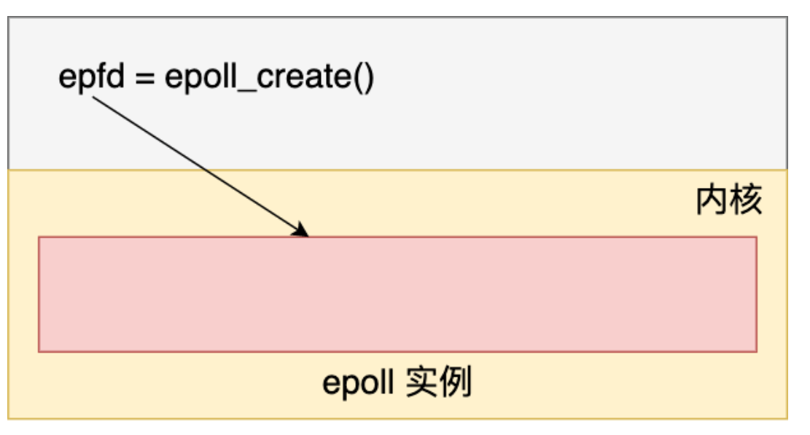

然后我们再调用 epoll_ctl 把 感兴趣的 fd 加入到 epoll 实例中的 interest_list，然后再调用 **epoll_wait** 即可将控制权交给内核，这样内核就会检测此 interest_list，如果发现 socket 已就绪就会把已就绪的 fd 加入到一个 ready_list（简称 rdlist） 中，然后再唤醒用户进程，之后用户进程只要遍历此 rdlist 即可

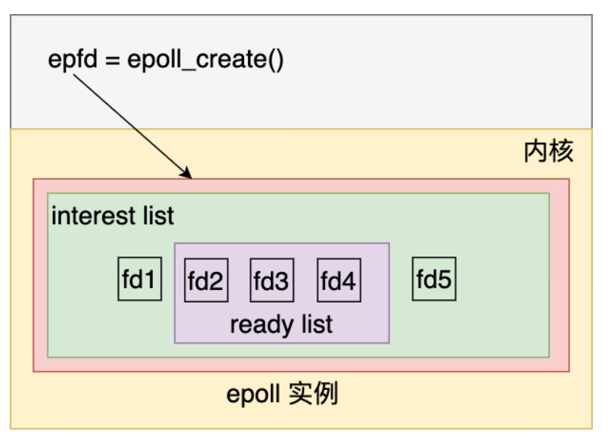

为了方便快速对 fd 进行增删改查，必须设计好 interest list 的数据结构，经综合考虑，内核使用了红黑树，而 rdlist 则采用了链表的形式，这样一旦在红黑树上发现了就绪的 socket ，就会把它放到 rdlist 中

epoll 的伪代码如下

```c
int sock_fd,conn_fd; //监听套接字和已连接套接字的变量
sock_fd = socket() //创建套接字
bind(sock_fd)   //绑定套接字
listen(sock_fd) //在套接字上进行监听，将套接字转为监听套接字

epfd = epoll_create(); //创建epoll实例，
//创建epoll_event结构体数组，保存套接字对应文件描述符和监听事件类型    
ep_events = (epoll_event*)malloc(sizeof(epoll_event) * EPOLL_SIZE);

//创建epoll_event变量
struct epoll_event ee
//监听读事件
ee.events = EPOLLIN;
//监听的文件描述符是刚创建的监听套接字
ee.data.fd = sock_fd;

//将监听套接字加入到监听列表中    
epoll_ctl(epfd, EPOLL_CTL_ADD, sock_fd, &ee); 

while (1) {
   //等待返回已经就绪的描述符 
   n = epoll_wait(epfd, ep_events, EPOLL_SIZE, -1); 
   //遍历所有就绪的描述符     
   for (int i = 0; i < n; i++) {
       //如果是监听套接字描述符就绪，表明有一个新客户端连接到来 
       if (ep_events[i].data.fd == sock_fd) { 
          conn_fd = accept(sock_fd); //调用accept()建立连接
          ee.events = EPOLLIN;  
          ee.data.fd = conn_fd;
          //添加对新创建的已连接套接字描述符的监听，监听后续在已连接套接字上的读事件      
          epoll_ctl(epfd, EPOLL_CTL_ADD, conn_fd, &ee); 

       } else { //如果是已连接套接字描述符就绪，则可以读数据
           ...//读取数据并处理
           read(ep_events[i].data.fd, ..)
       }
   }
}
```

epoll 的动图如下


epoll 图解，图片来自《低并发编程》

可以看到 epoll 很好地解决了 select 的痛点

1. 「每次调用 select 都把 fd 集合拷贝给内核」**优化为**「只有第一次调用 epoll_ctl 添加感兴趣的 fd 到内核的 epoll 实例中，之后只要调用 epoll_wait 即可，数据集合不再需要拷贝」
2. 「用户进程调用 select 阻塞后，内核会通过遍历的方式来同步检查 fd 的就绪状态」**优化为**「内核使用异步事件通知」
3. 「select 仅返回已就绪 fd 的数量，用户线程还得再遍历一下所有的 fd 来挨个检查哪个 fd 的事件已就绪了」**优化为**「内核直接返回已就绪的 fd 集合」

除了以上针对 select 痛点进行的改进之外，epoll 还引入了一种边缘触发（edge trigger，ET）的模式，这种模式也会让 epoll 在高并发下的表现更加优秀，而 select/poll 则只有水平触发模式（level trigger，LT），首先我们来了解一下什么是水平触发和边缘触发

- **水平触发**：只要读缓冲区可读（或可写缓冲区可写），就会一直触发可读（或可写）信号

  

- 边缘触发：当套接字的缓冲状态发生变化时才会触发读写信号。对于读缓冲，有新到达的数据被添加到读缓冲时才触发

  

对于水平触发而言，只要缓冲区里还有数据，内核就会不停地触发读事件，也就意味着如果收到了大量的数据而应用程序每次只会读取一小部分数据时就会不停地从内核态切换到用户态，浪费大量的内核资源，而对于边缘触发而言，只有在套接字的缓冲状态发生变化（即新收到数据或刚好发出数据）时才会触发读写信号，也就意味着内核只通知唤醒用户进程一次，这在高并发下无疑是更佳选择，当然了也正是由于边缘触发模式下内核只会触发一次的原因，read 要尽可能地将数据全部读走（一般是在一个循环里不断地 read ，直到没有数据），否则一旦没有新的数据进来，缓冲区中剩余的数据就无法读取了

既然 epoll 这么好，那么它的性能到底比 select，poll 强多少呢，关于这一点，我们最好做对其进行做下压测，我们来看下 libevent 框架对 select，poll，Epoll，Kqueue（可以认为是 mac 下的 epoll）的压测数据

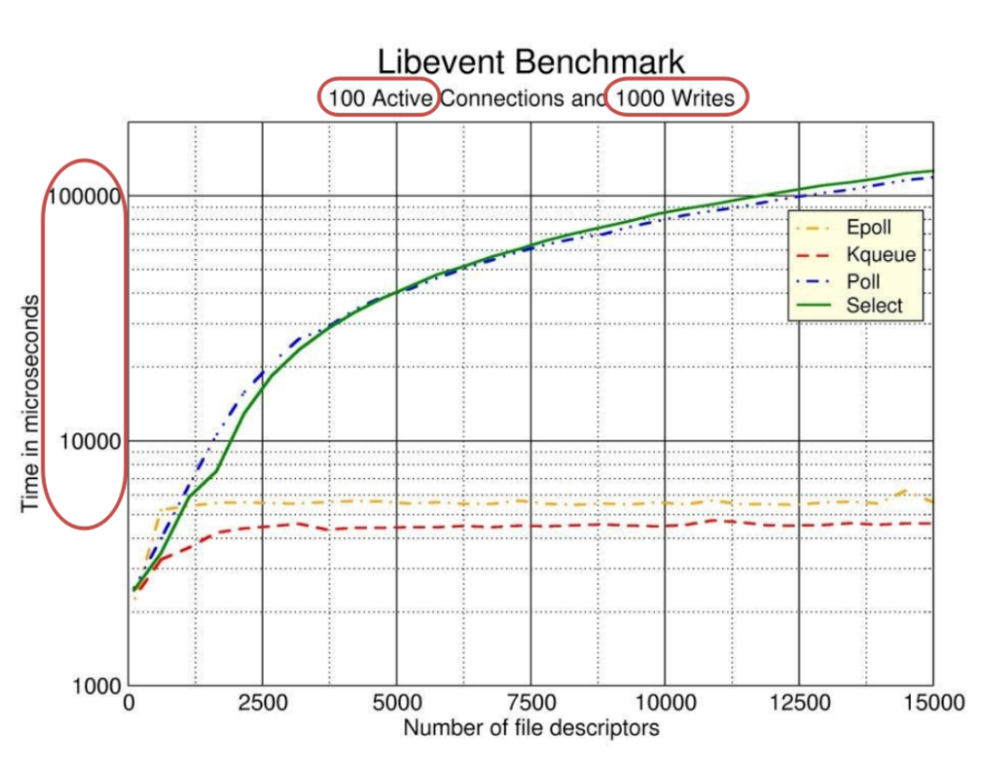

可以看到，**在 100 活跃连接（所谓活跃连接就是读写比较频繁），每个连接发生 1000 次读写操作的情况下**，随着句柄数量的增加，epoll 和 Kqueue 的响应时间几乎不变，而 select 和 poll 的响应时间则是急遽增加，所以 **epoll 非常适合应对大量网络连接，少量活跃连接的情况**

不过需要注意一下这里的**限制条件**：epoll 在应对大量网络连接时，只有在**活跃连接数较少**的情况下性能才表现优异，如果图中 15000 的网络连接都是活跃连接，那么 epoll 和 select 的表现是差不多的，甚至有可能 epoll 还不如 select，为什么会这样呢？

1. select/poll 的开销主要是因为无论就绪的 fd 有多少，都要遍历一遍全部的 fd 来找到就绪的 fd 再处理，如果活跃连接数很少，那么很多时间都浪费在遍历上了，但如有很多活跃连接，那遍历的开销就可忽略不计

2. 为什么活跃连接多，epoll 表现反而不佳呢，其实主要是因为在唤醒过程中 epoll 实现较为复杂，比如为了保证就绪队列的写入安全，使用了自旋锁，如下

   ```c
   static int ep_poll_callback(wait_queue_entry_t *wait, unsigned mode, int sync, void *key)
   {
      int pwake = 0;
      unsigned long flags;
      struct epitem *epi = ep_item_from_wait(wait);
      struct eventpoll *ep = epi->ep;
      int ewake = 0;
   
      /* 获得自旋锁 ep->lock来保护就绪队列
       * 自旋锁ep->lock在 epoll_wait() 调用的 ep_poll() 里被释放
       * /
      spin_lock_irqsave(&ep->lock, flags);
   
      /* If this file is already in the ready list we exit soon */
      /* 在这里将就绪事件添加到 rdllist */
      if (!ep_is_linked(&epi->rdllink)) {
          list_add_tail(&epi->rdllink, &ep->rdllist);
          ep_pm_stay_awake_rcu(epi);
      }
      ...
   }
   ```

   这样的话如果活跃连接多的话，锁的开销就比较大了

#### IO 多路复用+非阻塞

那么当 IO 多路程复用检查到数据就绪后（select()，poll()，epoll_wait() 返回后），该怎么处理呢，有人说直接 accept，read/write 不就完了，话是没错，但之前我们也说了，这些操作其实默认是阻塞的，**我们需要将其改成非阻塞**，为什么呢，数据不是已经就绪了吗，说明 accept，read/write 这些操作可以正常获取数据啊？

其实数据就绪只是说在调用 select()，poll()，epoll_wait() 返回时的数据是就绪的，但当你再去调用 accept，read/write 时可能就会变成未就绪了，举个例子：当某个 socket 接收缓冲区有新数据分节到达，然后 select 报告这个 socket 描述符可读，但随后，协议栈检查到这个新分节有错误，然后丢弃这个分节，这时候调用 read 则无数据可读，这样的话就会产生一个严重的后果：由于线程阻塞在了 read 上，便再也不能调用 select 来监听 socket 事件了，所以 **IO 多路程复用一定要和非阻塞配合使用**，也就是说要把 listenfd 和 connectfd 设置为非阻塞才行

### Reactor 模式

经过以上介绍相信大家对 IO 多路复用的原理有了比较深刻的理解，我们知道 IO 多路程复用是用一个进程来管理多个 socket 的， 那么是否还有优化的空间呢，我们以 select 为例来拆解一下 IO 多路复用的流程

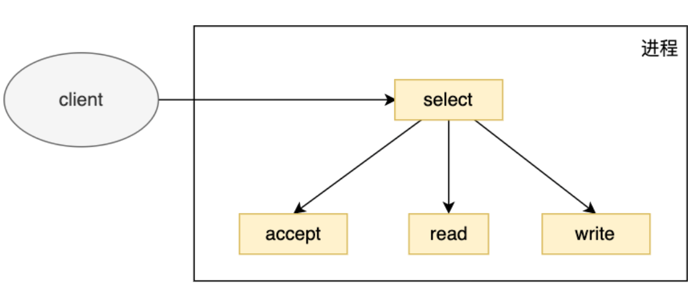

主要流程如下：调用 select 来监听连接，读写事件，收到事件后判断是否是监听 socket 上的事件，是的话调用 accept()，否则判断是否是已连接 socket 上的读写事件，是的话调用 read()，write()

#### 单进程/线程 Reactor

目前这样的写法没有问题，不过所有的逻辑都藕合在一起，可扩展性不是很好，我们可以将相近的功能划分到同一个模块（以类的形式）中如下

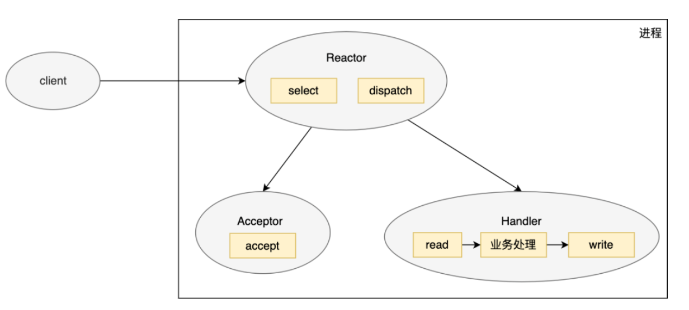

我们将其分成三个模块，Reactor， Acceptor，Handler，主要工作流程如下

1. Reactor 对象首先调用 select 来监听 socket 事件，收到事件后会通过 dispatch 分发
2. 如果是连接建立事件，则由 Acceptor 处理，Acceptor 通过调用 accept 接收连接，并且会创建一个 Handler 来处理后续的读写等事件
3. 如果不是连接建立事件，则 Reactor 会调用连接对应的 Handler 进行响应，handler 会完成 read，业务处理，write 的完整业务流程

以上这些操作其实和之前的 IO 多路复用一样，所有的的都是由一个进程进行操作的，这里多了一个新名词 Reactor，它指的是对事件的响应，如果来了一个事件就把相应的事件 dispatch 给对应的 acceptor 或 handler 对象来处理，由于整个操作都在一个进程里处理，我们把这种模式称为单 Reactor 模型，单 Reactor 要求对事件的响应要快，比如对数据业务的处理要快，像 Redis 就很适合，因为它的数据都是基于内存操作的（当然像 bigKey 这种异常场景除外）

#### 单 Reactor 多线程模型

如果在单进程 Reactor 模型中，业务处理耗时较长，那么线程就会被阻塞，就无法再处理其它事件了，可能会造成严重的性能问题，而且单进程 Reactor 还有一个劣势，那就是无法充分复用多核的优势，于是人们又提出了 单 Reactor 多线程模型，即把业务处理这一块放到一个线程池中处理

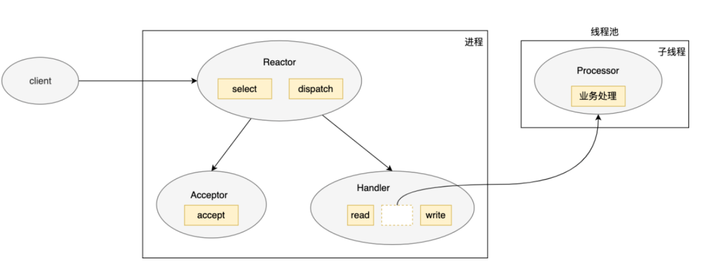

通过这种方式主进程的压力得到了释放，也充分复用了多核优势来提升并发度

但依然有如下两个瓶颈点

1. 子线程处理好数据后需要将其传给 handler 进行发送处理，这涉及到共享数据的互斥和保护机制
2. 主进程承担的所有事件的监听和响应，瞬时的高并发可能成为性能瓶颈

#### 多 Reactor 多进程/线程模型

为以解决单 Reactor 多线程模型存在的两个问题，人们又提出了多 Reactor 多进程/线程模型模块，示意图如下

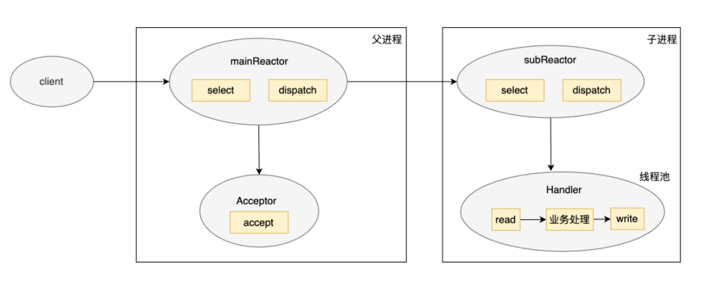

工作原理如下

1. 主进程主要负责 accept 连接，接收后会将其传给 subReactor，subReactor 将其连接加入连接队列中来监控其事件
2. 一旦子进程中有新的事件被监听到了，则 subReactor 会将其交给 Handler 进入处理

使用这种方式由于数据的 read，业务处理，write 都在一个线程中处理，所以避免了数据的同步加锁操作，父子进程职责很明确，父进程负责 accept，子进程则负责完成后续业务处理

以上介绍的只是标准的 Reactor 模型，但实际上生产上应用的 Reactor 不一定完全遵照这些标准，可能会有一些变化，比如 Nginx 的 Reactor 虽然也是多 Reactor 多进程模型，但它是一种变体：每个子进程都监听了同一个端口，内核接收到连接已建立的事件后会通过负载均衡的方式将其转给其中一个子进程，然后子进程会将其加入到连接队列中监控其事件，监控到事件后也不会转交给其他线程而是自己处理

### 总结

随着互联网的发展，server 面对的连接越来越多，传统的网络 IO 模型由于在 connect，accept，read/write 这三步中会有阻塞操作，显然无法满足我们 C10K 要求，于是人们提出了多进程/线程模型，每接收一个连接分配一个进程/线程来负责后续的交互，但创建进程/线程本身需要创建堆栈，复制页表等资源，而且进程/线程的上下文切换涉及到用户态，内核态的切换，会造成严重的性能瓶颈，那么把阻塞操作改成非阻塞呢，这样做进程/线程确实是不会被阻塞了，但也意味着 CPU 会做大量的无用功，承担不必要的高负载

综合考虑人们提出了 IO 多路复用这种先进的理念，即一个线程管理监听多个 socket 的事件，当然了其实将 socket 设置成非阻塞的，然后让一个线程不断地去轮询也是能达到一个线程监听多个 socket 的目的，但这样做需要对每个 socket 调用一个 read 系统调用，所以 IO 多路复用还有**另一层更重要的意义**：将多个系统调用转成一个系统调用再交给内核去监听事件。

IO 多路复用主要有三个模型，select，poll，epoll，每一个都是对前者的改进:

1. select 是每次调用时都要把 fd 集合拷贝给内核，而且内核是通过不断遍历这种同步的方式来检查 fd 是否有事件就绪，并且一旦检测到有事件后也只是返回有就绪事件的 fd 的个数，用户线程也需要遍历 fd 集合来查看 fd 是否已就绪，select 限制了 fd 的集合只能有 1024 个
2. poll 和 select 的原理差不多，只不过是放开了 1024 个 fd 的限制，fd 的个数可以任意设置，这样也就让支持 C10k 成为了可能，但由于它的实现机制与 select 类似，所以也存在和 select 一样的性能瓶颈
3. 为了彻底解决 select，poll 的性能瓶颈，epoll 出现了，它把需要监听的 fd 传给内核 epoll 实例，epoll 以红黑树的形式来管理这些 fd，这样每次 epoll 只需调用 epoll_wait 即可将控制权转给内核来监听 fd 的事件，避免了无意义的 fd 集合的拷贝，同时由于红黑树的高效，一旦某个 socket 来事件了，可以迅速从红黑树中查找到相应的 socket，然后再唤醒用户进程，此过程是异步的，比起 select 的同步唤醒又是一大进步，此时唤醒用户进程后，内核会把数据已就绪的 fd 放到一个就绪列表里传给用户进程，用户进程只需要遍历此就绪列表即可，比起 select 需要全部遍历也是一大进步，除此之外 epoll 引入了边缘触发让其在高并发下的表现也更加优异，正是由于 epoll 对 select，poll 的这些改进，也让它成为了 IO 多路复用绝对的王者

IO 多路复用是指用一个进程/线程去监听多个 socket 的事件，也即意味着一旦事件就绪了进程需要快速地处理这些事件（不然其他 socket 事件的处理的会阻塞），这种对 Redis 非常合适，因为它是基于内存操作的，处理非常快，但对于其它的开源框架，只有一个进程/线程显然是不太满足业务需要的，比如业务处理，可能是 CPU 密集型的，如果只一个进程/线程的话，可能会阻塞在业务处理上，于是人们基于 IO 多路复用又提出了 Reactor 模型，Reactor 即对事件的反应，然后派发事件给相应的处理器，Reator 模型有多个变种，如单 Reactor，单 Reactor 多线程，多 Reacor 多进程/线程模型，这三种模型各有各的优势，主要是为了充分利用多线程/多核来提升性能或是为了避免瞬时的高并发让主线程崩溃

由此可见，网络 IO 模型经历了传统的网络 IO 模型 ---> IO 多路程复用（select，poll，epoll） --> Reactor 模型这三个阶段，主要是为了满足日益增长的 C10k 甚至 C100K 等超高连接数的要求。