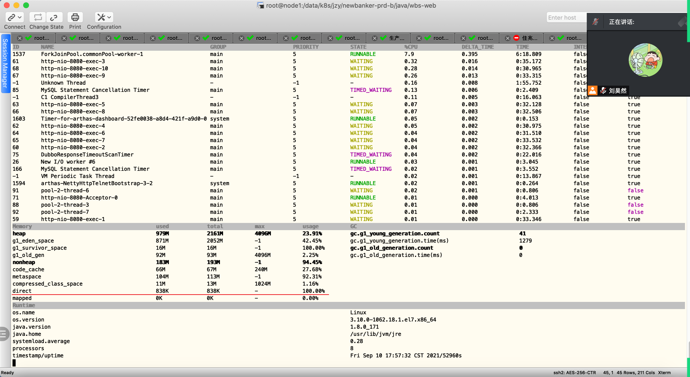

# Java内存--直接内存（Direct Memory）---NIO

直接内存并不是虚拟机运行时数据区的一部分，也不是Java虚拟机规范中定义的内存区域。但是这部分内存也被频繁地使用，而且可能导致OutOfMemoryError异常出现。

在JDK1.4中新加入了NIO（New INput/Output）类，引入了一种基于通道（Channel）与缓冲区（Buffer）的I/O方式，它可以使用Native函数库直接分配堆外内存，

然后通过一个存储在Java堆中的DirectByteBuffer对象作为这块内存的引用进行操作。这样能在一些场景中显著提高性能，因此避免了在Java堆和Native堆中来回复制数据。

