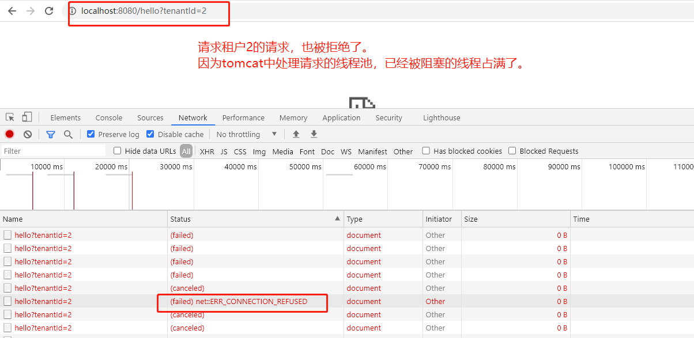

# [多租户Multi-Tenancy](http://niyanchun.com/multitenant-database-design-in-saas.html)


多租户（Multi-Tenancy）是SaaS中一个基础功能，本文介绍多租户下的数据库设计。

## 多租户设计

因为数据库分了database、schema、table这三个层次（尽管并非所有数据库都实现了），所以多租户也有了三种比较常用的设计：

1. **database-based multitenancy**：也称per-database-per-tenant，即一个租户一个数据库实例。
2. **schema-based multitenancy**：也称per-schema-per-tenant，即一个租户一个schema，但都共享同一个数据库实例。
3. **table-based multitenancy**：也称partitioned (discriminator) approach，即所有租户都使用一个表，然后通过在所有表中增加一个字段（通常就是租户id）来区分不同租户。数据库实例和表都是共享的。

审视一下三种设计方案，从1到3隔离程度越来越低，共享程度越来越高。我们从以下一些维度对比一下它们各自的优劣（注意：**对比主要是从数据库角度看的，而不是整个SaaS**）：

- **可扩展性**：隔离度越高，扩展性越差。数据库实例在数据库中是一个比较重的资源，虽然RDBMS中一般没有对database的个数做限制，但一个数据库服务器上面创建成千上万个数据库实例的场景应该是很少见的吧。所以从1到3，扩展性依次变差。
- **隔离性**：主要是数据的隔离、负载的隔离。这个很明显，隔离性1最好，3最差，2适中。
- **成本/资源利用率**：这里的成本主要指数据库的成本，或者说硬件的资源利用率。隔离程度越高，利用率越差。比如很多业务其实都有业务高峰和低峰，如果能把高峰不在同一时间段的业务部署在一起，自然是能够提升资源的利用率。
- **开发复杂度**：主要体现在查询、过滤、database/schema/table切换等。1和2适中，3难度高一些。
- **运维复杂度**：性能监控、管理；database/schema/table的管理；租户数据恢复；容灾等。扩展其实也算运维的一部分，第一个已经讨论过了，这里就不包含扩展了。从监控、管理、租户数据恢复、容灾等考虑，隔离度越高，越简单。
- **可定制性**：根据不同租户的需求进行定制的难度，这个自然也是隔离度越高，定制化越好做。

实际中如何选择呢？这个要根据实际业务场景和各个方案的优劣进行选择了，没有完美方案，只有更适合你的方案。而且比如你选择了MySQL，那方案2就不存在了，因为MySQL中没有区分Database和Schema。还有这里只是比较学术的划分了一下设计方案，实际中一些大型SaaS会实现更复杂、灵活的多租户数据库方案，以平衡各个方案的优劣，这部分推荐一篇文章：[Multi-tenant SaaS database tenancy patterns](https://docs.microsoft.com/en-us/azure/sql-database/saas-tenancy-app-design-patterns)。

原文链接：http://niyanchun.com/multitenant-database-design-in-saas.html


# [SpringBoot项目使用动态切换数据源实现多租户SaaS方案](https://blog.csdn.net/qq_36521507/article/details/103452961)

这种实现方案的问题

- 只能在程序启动的时候，把所有租户的数据源都初始化。


# Nb多租户数据库切换方案
- NewBanker udsc-config

```xml
<!-- 多租户数据源 -->
<bean id="dataSource" class="com.newbanker.udsc.config.ds.NBDataSource" destroy-method="close" />
```

# 思考

- 如果是让我来从零设计一个方案。我会如何思考？如何在网上查找资料？
  - NewBanker udsc-config直接在beans.xml中配置NbDataSource的方式，其实是最原始的配置方式。偏方治大病：
  - 很久以前还没有SpringBoot时，配置数据源都是需要在beans.xml中配置一个 javax.sql.DataSource 实现类
  - 那时候，配置的都是 c3p0或dbcp的数据源 。还有 mybatis 中什么SQLSessionFactory都需要自己配置。
- 我的思路估计也会使用 **AbstractRoutingDataSource** 来实现。
  - 目前提供的有两种实现：
  - 一种是在项目启动时，把链接上配置中心ZooKeeper，把所有租户的数据源都初始化好：
  - 一种是懒加载模式的：com.anxiaole.multitenancy.lazyLoad.LazyLoadRoutingDataSource
- 详见  [MultiTenancyApplication.java](src\main\java\com\anxiaole\multitenancy\MultiTenancyApplication.java) 验证步骤：
  - 1、数据库中执行 \DayDayUp\MultiTenancy\src\main\resources\sql\db.sql
  - 2、本地启动 ZooKeeper  使用默认端口号:2181
  - 3、修改数据库连接账号、密码.
  - 4、启动项目.
  - 5、调用接口:
  - 调用  http://localhost:8080/hello?tenantId=1 接口,会返回:   (当前租户id:1)   你好:[这是从数据库2中查询出来的名字].
  - 调用  http://localhost:8080/hello?tenantId=2 接口,会返回:   (当前租户id:2)   你好:[这是从数据库2中查询出来的名字].


# 发现一个潜在的bug

## 问题描述

在自己实现`多租户数据源切换`的时候，发现一种场景：

如果租户在ZooKeeper中配置了数据源，但是配置的数据源是错误的：比如配置账号密码错误，从而导致在连接数据源的时候，根本无法成功连接。此时Druid默认的处理方式是：**主线程等待，创建子线程轮询，直到成功。**

- Druid数据源默认这样处理的原因是：大多数据服务都是在启动时连接数据库，如果数据库连接不上，主线程就会一直等待 `TIMED_WAITING (parking)` 直到获取数据库连接成功。并且在等待之前，会创建一个线程： `com.alibaba.druid.pool.DruidDataSource.CreateConnectionThread` 。此线程一直尝试获取数据库连接。直到成功。
- 这样默认处理的目的就是：在启动时检查数据库配置是否正确，如果不正确，项目就一直启动不起来。此时开发人员就会去检查配置文件等。

- 但是对于多租户场景，是在查询/修改租户数据库的时候，才去初始化数据源。如果此租户jdbc配置错误，使用Druid数据源默认配置，则会导致查询数据库的当前线程阻塞。

如果某一时刻，此租户涌入大量http请求，会把tomcat的http-nio线程池直接打满（全都是阻塞状态-等待数据库连接成功的线程）。从而导致应用程序无法处理其他租户的任何http请求。


## 验证猜想

在本地的 `MultiTenancy` 项目验证：

1、设置tomcat最大线程数量为10：

```yml
server:
  tomcat:
    threads:
      max: 10
    accept-count: 5
    max-connections: 10
    connection-timeout: 10s
```

2、暂时注释掉优化配置


3、启动项目 MultiTenancyApplication

4、把租户为1的数据源配置修改错误，然后疯狂调用接口


5、jstack <pid> | grep getConnection -b7


6、查看一下总共有多少tomcat线程在阻塞状态。（需要调用很多次接口）


7、当所有的tomcat线程都在阻塞状态时，此时调用任何接口，会发现请求直接被拒绝了：

后续的所有接口都是失败。




## 服务器上验证

在本地验证完，我想看一下我们公司服务器的有没有此问题。（感觉也是有的。）

连接上服务器，查看 sc-service 微服务：

这里看到已经有一个Dubbo线程在阻塞了。如果此租户的dubbo请求来的比较多，那对应的dubbo线程池也会被占满。（dubbo也有线程池专门处理consumer的请求，其实原理和tomcat的线程池一样）


2、附录：Druid创建数据库连接的线程


## bug现象

如果这个bug发生了，在排查的时候，会有以下现象：

- 对应微服务的所有接口都无法返回，都是拒绝状态。其他微服务的接口正常。

  - 如果一个微服务有多个副本，还会造成如下症状：

  - 此微服务的所有接口，发生间歇性的异常。（微服务A存在2个副本，则微服务A的所有接口一次正常，一次异常）
  - 因为请求被nginx轮询的转发到微服务A的不同upstream节点上了。

- 在服务器排查时，cpu、内存、io都是正常的：

  使用 `arthas` 的 `dashboard` 命令查看cpu和内存占用：

  

- 如果是遇到问题再排查的话，只能使用 `jstack <pid> | grep http-nio -A3 ` 命令，发现 线程名包含 `http-nio` 的线程都是 WAITING 状态，才能找到一些线索。然后在根据线程栈来慢慢排查。最后能排查到是 `DruidDataSource#getConnection` 阻塞导致的。


## 解决方案

创建数据源之后，主要是设置三个参数：

```java
DruidDataSource dataSource = DruidDataSourceFactory.createDataSource(properties);
// 获取链接时:失败重试10次.默认是1
dataSource.setConnectionErrorRetryAttempts(10);

// 下面这两个缺一不可：
// 获取链接时:重试次数结束后,跳出循环
dataSource.setBreakAfterAcquireFailure(true);
// 获取数据库链接失败超过重试次数后:快速失败
dataSource.setFailFast(true);
```


# 参考文章

[Multi-tenant SaaS database tenancy patterns](https://docs.microsoft.com/en-us/azure/sql-database/saas-tenancy-app-design-patterns)

[SaaS模式与技术架构](http://www.360doc.com/content/20/0227/16/36367108_895232258.shtml)