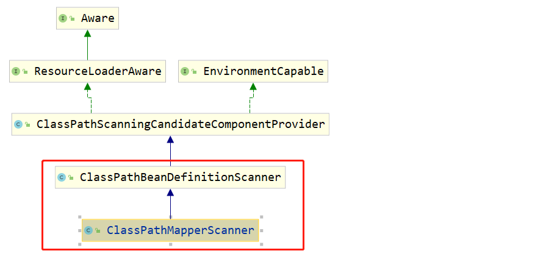
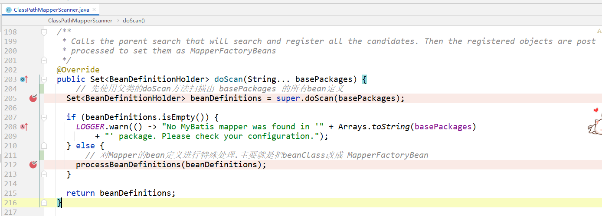
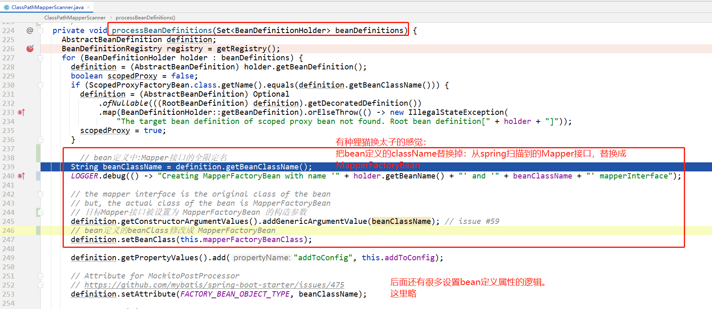
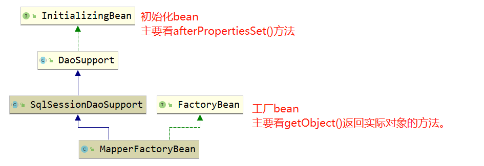
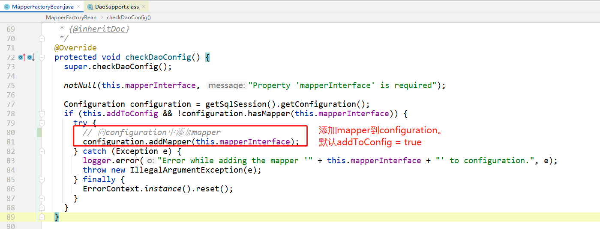
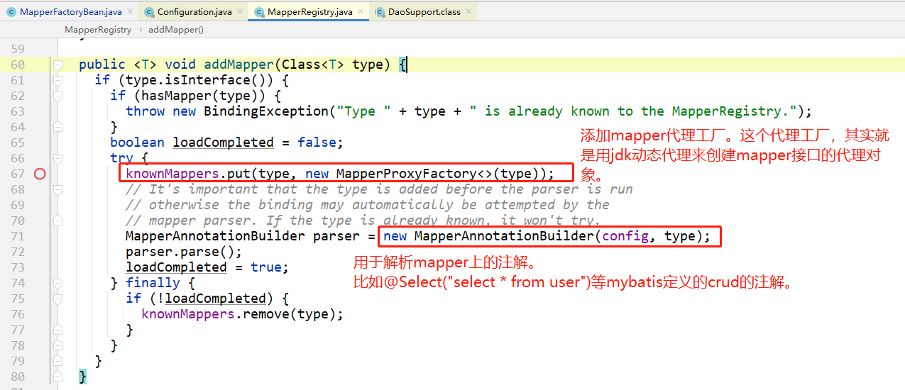
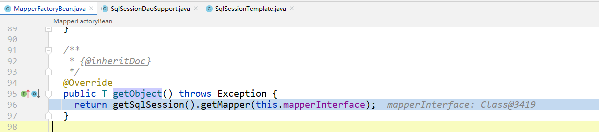
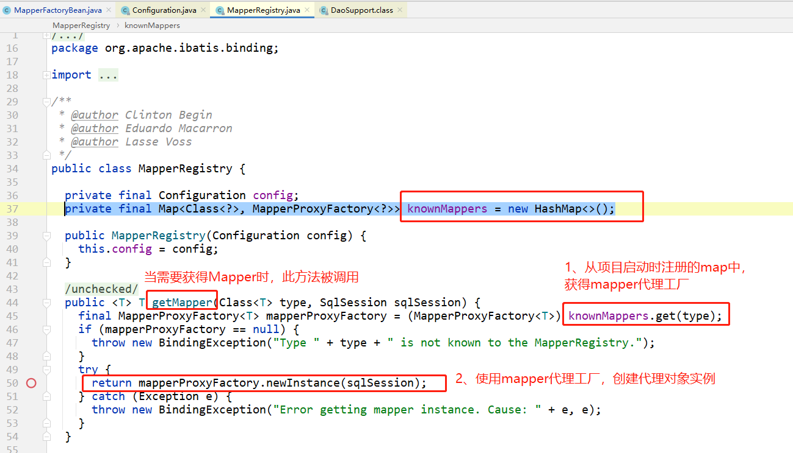
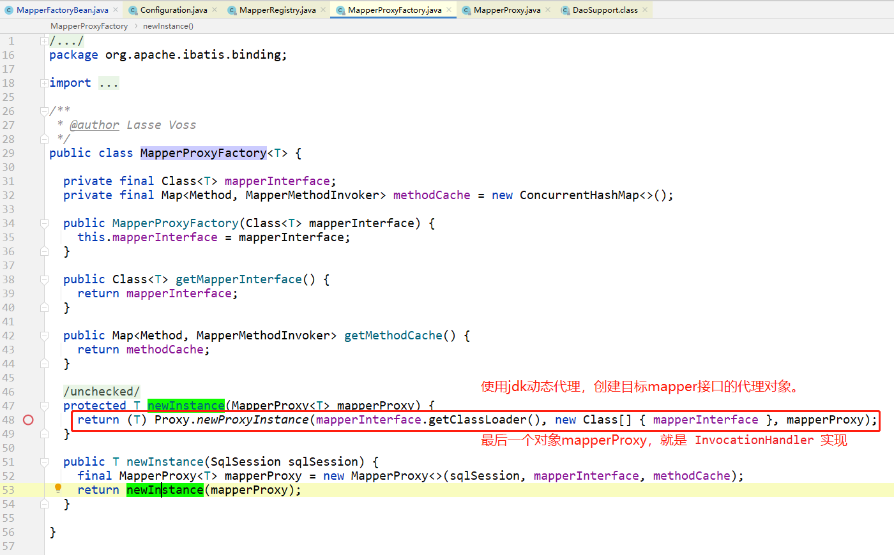
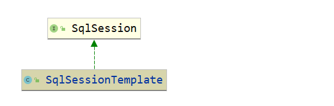

# 前言

周瑜老师公开课【[spring核心扩展点底层原理解析](https://www.bilibili.com/video/BV1GZ4y1c7i6?p=46)】：

- [spring中bean的生命周期](https://www.bilibili.com/video/BV1GZ4y1c7i6?p=47)
- [spring中扩展点底层原理](https://www.bilibili.com/video/BV1GZ4y1c7i6?p=49)
- [spring整合MyBatis底层原理](https://www.bilibili.com/video/BV1GZ4y1c7i6?p=50)

其中对后两个课题有所疑问：想知道spring整合MyBatis底层原理，同时这个原理也体现spring扩展点的真实案例。

所以fork了[mybatis-spring源码](https://github.com/liuxianfa520/mybatis-spring)。自己翻了翻源码。

通过看源码解答心中的疑问，在源码中寻找答案，让看源码效率更高。


# 【疑问】为什么向spring容器中注入 SqlSessionFactoryBean 就可以使用@Autowired获得Mapper?

- 其实是不可以的。通过[mybatis-spring官方getting-start文档](https://github.com/liuxianfa520/mybatis-spring/blob/master/src/site/zh/markdown/getting-started.md)，我们看到：如果使用Mapper接口定义持久层，需要两个步骤：

- 1）配置 SqlSessionFactoryBean：

  ```xml
  <bean id="sqlSessionFactory" class="org.mybatis.spring.SqlSessionFactoryBean">
    <!-- 依赖数据源dataSource：在这之前也需要配置数据源dataSource，这里忽略dataSource的配置。-- >
    <property name="dataSource" ref="dataSource" /> 
  </bean>
  ```

- 2）配置 MapperFactoryBean：

  ```xml
  <bean id="userMapper" class="org.mybatis.spring.mapper.MapperFactoryBean">
    <property name="mapperInterface" value="org.mybatis.spring.sample.mapper.UserMapper" />
    <property name="sqlSessionFactory" ref="sqlSessionFactory" />
  </bean>
  ```

- 此时在Service就可以使用了：

  ```java
  @Service("userService")
  public class UserServiceImpl implements UserService {
    @Autowired
    private UserMapper userMapper;
  
    public User getUserById(String id) {
      return userMapper.getUser(id);
    }
  }
  ```

  有同学就说了，这个例子是只配置了一个UserMapper，那我项目中有很多Mapper接口，这样配置岂不是有多少Mapper接口，就需要配置多少个 `org.mybatis.spring.mapper.MapperFactoryBean`？其实是的！不过有包扫描的方式：


# 【疑问】如果项目中有多个Mapper接口，想以`指定包名`的方式，让框架去扫描Mapper接口应该如何配置？是如何实现的？

- 配置：

  ```xml
  <!-- 配置SqlSessionFactory -->
  <bean id="sqlSessionFactory" class="org.mybatis.spring.SqlSessionFactoryBean">
     <property name="dataSource" ref="dataSourceFoo" />
  </bean>
  
  <!-- 配置Mapper扫描器 -->
  <bean class="org.mybatis.spring.mapper.MapperScannerConfigurer">
      <!-- 指定Mapper接口所在的包名。如需配置多个，可用英文逗号或分号分开 -->
  	<property name="basePackage" value="com.xxx.dao" />
  	<property name="sqlSessionFactoryBeanName" value="sqlSessionFactory" />
  </bean>
  ```

- Mapper包扫描器配置类 org.mybatis.spring.mapper.MapperScannerConfigurer

  这个类只是包扫描配置类，是为了配置起来比较方便而生的。具体包扫描的逻辑是在`后置处理bean定义注册器`时委托给  `ClassPathMapperScanner`实现的。

- 重写 `BeanDefinitionRegistryPostProcessor#postProcessBeanDefinitionRegistry` 方法*（表示了是在BeanDefinitionRegistry之后进行自定义处理）*：此方法中创建了`ClassPathMapperScanner`去扫描 `basePackage`。

- `ClassPathMapperScanner`是 `org.springframework.context.annotation.ClassPathBeanDefinitionScanner` 的子类。

  

- 在doScan方法包扫描bean：

  1）先使用spring默认的扫描逻辑扫描出Mapper的bean定义。

  2）然后对这些bean定义做特殊处理：

  

- 其实第一步没啥好多的，就利用了spring默认的包扫描逻辑，扫描出这个包中的所有类，然后包装成bean定义。

- 重要的是第二步 狸猫换太子：把真实的Mapper接口改成 org.mybatis.spring.mapper.MapperFactoryBean

  

那这个 MapperFactoryBean 是如何实现呢？


# 【疑问】为什么调用Mapper.java中的方法就可实现crud?

- 以前背面试题时，面试宝典告诉我们：是使用**`jdk动态代理`**实现的。
- 详见下面一章节的内容：MapperFactoryBean


# MapperFactoryBean



## 类层次结构

是 `org.springframework.beans.factory.InitializingBean` 和 `org.springframework.beans.factory.FactoryBean`两个接口的实现。所以主要需要看以下两个方法：

- afterPropertiesSet() 方法
- getObject() 方法

从bean的生命周期先后顺序来说，应该先看 `afterPropertiesSet()` 方法，这个方法是在`bean填充之后`被调用的。

而`MapperFactoryBean#getObject`方法在bean已经初始化完毕，才会被调用。

## afterPropertiesSet() 方法

主要是检查配置，然后初始化：





把 `MapperProxyFactory` 添加到`knownMappers`，这个`afterPropertiesSet()` 方法逻辑就结束了。

## getObject() 方法

org.mybatis.spring.mapper.MapperFactoryBean#getObject



`getSqlSession()` 方法返回的是一个 SqlSession 接口的实现类，而实际上此处返回的是：`SqlSessionTemplate` 。

> *我们知道 SqlSession 主要都是通过 `SqlSessionFactory#openSession()` 方法返回的，而且不同线程对应不同的 `SqlSession` 实例对象。那这里`SqlSessionTemplate` 是如何和对应线程绑定的呢？？？？这个问题下面 [SqlSessionTemplate]() 一节来详细讨论。*

 `getMapper()` 方法获得Mapper接口的代理对象：



> 【疑问】org.apache.ibatis.binding.MapperRegistry#getMapper 返回值没有缓存吗？难道每次getMapper时，都需要创建一个代理对象？
>
> 以下只是猜测，暂时还没有看到实际的源码做支撑，如果有朋友知道此问题的答案，欢迎提Issues一起沟通学习，感谢：
>
> 貌似MyBatis并没有对代理对象做任何缓存。但Mapper接口默认scope=singleton的，在和spring容器结合后，一个Mapper接口就对应一个bean对象。
>
> 而不是需要在每次调用mapper中的select/update/delete/save方法的时候，都需要调用 getMapper() 去使用jdk动态代理去创建代理对象。

## MapperProxyFactory

为目标Mapper接口创建代理对象的。



具体mapper是如何解析出SQL语句、如何执行SQL语句，都在 `org.apache.ibatis.binding.MapperProxy#invoke` 方法中了。

这个方法在这里就不展开说了。详见：todo：


# SqlSessionTemplate 

先简单说一下这个类的使用步骤：

配置：

```xml
<bean id="sqlSessionTemplate" class="org.mybatis.spring.SqlSessionTemplate">
   <constructor-arg ref="sqlSessionFactory" />
</bean>
```

使用：

```java
@Service
public class UserService {
	@Autowired
    private SqlSessionTemplate sqlSessionTemplate;
    
    public void findFirst() {
        // 这两种调用方式的到的效果都是一样的：都会查询到用户表的第一条数据。
    	User user1 = sqlSessionTemplate.getMapper(UserMapper.class).findFirst();
    	User user2 = sqlSessionTemplate.selectOne("com.xxx.dao.UserMapper.findFirst");
        // 注意 selectOne(String statement); 方法的参数是statement id。不是sql语句。
    }
    public void updateById(User user) {
        UserMapper mapper = sqlSessionTemplate.getMapper(UserMapper.class);
        mapper.updateById(user); // 这里不需要程序员自己commit。方法如果正常执行结束，会自动调用commit方法。
    }
}
```

是不是很简单。

而如果我们使用 SqlSessionFactory 实现上面的逻辑需要：

配置：

```xml
  <bean id="sqlSessionFactory" class="org.mybatis.spring.SqlSessionFactoryBean">
    <property name="dataSource" ref="dataSource"/>
  </bean>
```

使用：

```java
@Service
public class UserService {
	@Autowired
    private SqlSessionFactory sqlSessionFactory;
    
    public void findFirst() {
        SqlSession session = sqlSessionFactory.openSession();
        UserMapper mapper = session.getMapper(UserMapper.class);
        User user = mapper.selectById(1);
    }
    public void updateById(User user) {
        SqlSession session = sqlSessionFactory.openSession();
        UserMapper mapper = session.getMapper(UserMapper.class);
        mapper.updateById(user);
        session.commit(); // 需要自己提交事务。
    }
}
```

> 个人感觉：使用SqlSessionTemplate最主要的优点：
>
> 避免每次都需要 `SqlSessionFactory#openSession()` 获得`SqlSession`  (使用jdk动态代理实现)


通过配置文件可以看到，整个应用程序中只需要配置一个 `SqlSessionTemplate` 就可以了。但是本身 SqlSessionTemplate 就是 `SQLSession`：


【疑问】那问题就来了：每个线程都对应一个`SqlSession`对象。但是每个线程调用`getSqlSession()方法`都会返回这个单例的`SqlSessionTemplate` 对象，`SqlSessionTemplate` 是如何获得当前线程对应的SqlSession的呢？


# 【面试题】spring和mybatis整合之后为什么会导致mybatis一级缓存失效？？