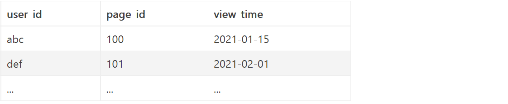

# MySQL各部分的执行顺序

> 作者：Soothingday
> 链接：https://www.jianshu.com/p/eacabb872206
> 来源：简书
> 著作权归作者所有。商业转载请联系作者获得授权，非商业转载请注明出处。


当我们选择执行一个SQL语句的时候，它会按照以下的顺序来进行执行：

> 1. FROM
> 2. WHERE
> 3. GROUP BY
> 4. HAVING
> 5. SELECT
> 6. DISTINCT
> 7. ORDER BY
> 8. LIMIT


**1. FROM**  

顾名思义，当执行查询语句的时候，首先需要知道的是它需要哪些表，正如我们去一个地方需要知道它的具体位置一样。

如果需要多个表的话在这一部分也需要按照一定的顺序进行表的join操作。


**2. WHERE**  

当确定需要读取哪些表的数据之后，我们就需要进行`where`的`数据过滤操作`，根据`where过滤条件`尽量减少读取的数据数量。

> 与此同时，由于where早于select执行，那么它是不知道`select`语句里面定义的别名的，所以在这里使用别名会导致SQL报错。

那么问题来了，为什么where的优先级要比group by，having, select之类的要高呢？

- 可以减少不必要的查询量，加快执行语句的速度。
- 举个栗子，比如我们可能需要userid从100到300的用户对于某一个页面的浏览次数，那么如果先执行`group by`再执行`where`的话，userid小于100的用户的数据也会被汇总进去，但实际上这些部分的数据是完全不需要的，计算它们完全是浪费系统资源（而且group by操作本身就是很耗资源的操作）


**3. GROUP BY**  

在完成`where`操作的过滤之后，如果语句中有`group by`的话则会对过滤后的数据进行`聚合操作`，聚合操作是多对一的转换，因此在聚合操作过后，除了用于`group by`的字段之外，其它字段的原始数据将会丢失，只能得到它们相应的聚合结果（比如sum()， avg()这样的方法）

在完成聚合操作之后，参与`group by`的字段以及其它字段对应的聚合值已经处于已知状态，后续的操作可以直接使用它们。


**4. HAVING**  

`having`操作主要做的是对`group by`聚合之后的分组结果进行过滤，可以根据参与`group by`的字段进行过滤，也可以根据其它字段的聚合值进行过滤。

因为聚合值在这里已经算是已知数据，因此这里是可以拿聚合函数做判断的。

> 如下题：
>
> 给定用户id，页面id，访问时间，求出最近一个月对页面id=100有访问记录 且 访问该页面次数大于10次的用户id。如下表，表名为views：
>
> 
>
> ```sql
> SELECT user_id FROM views 
> WHERE page_id = 100 
> GROUP BY page_id, user_id 
> HAVING count(*) > 10 AND datediff(curdate(), max(view_time)) < 31 AND page_id = 100
> ```

> 这里需要注意的是，
>
> - 虽然聚合函数可以用于做`having`里面的判断条件，但是它们在`select`里面设置的别名是不可以的，因为此时还没进行`select`阶段，SQL并不知道它们的别名是什么样子。
> - MySQL5.6及以上版本对group by进行了拓展，这些版本可以在`having`的时候使用别名。如果不希望使用的话，可以将MySQL的sql_mode调为ONLY_FULL_GROUP_BY  [参考链接](https://links.jianshu.com/go?to=https%3A%2F%2Fdba.stackexchange.com%2Fquestions%2F50391%2Fwhy-does-mysql-allow-having-to-use-select-aliases) 
> - `having`并不是一定要和`group by`成对出现的，它也可以单独存在。在没有`group by`的时候，此时默认只有一个组，但是需要注意的是：这时`having`里面参与过滤的字段需要在`select`里面存在，不然`having`会不知道这是分组里面的内容而导致报错。


**5. SELECT**  

 选取结果集中相对应的字段，在select中为字段设置的别名在此阶段及之后的操作中生效。


**6. DISTINCT**  

 去重操作，放在`select`之后有个原因是去重操作是要根据`select`里面所选字段来进行的。

> 需要注意的是`distinct`去重是只去重所有和已选字段完全重复的数据。
>
> 举个栗子，select distinct name, city只会去重姓名和城市完全重复的数据，而如果只有姓名相同，而城市不同，那么不会发生去重操作


**7. ORDER BY**  

对得到的结果按照特定字段顺序进行排列，这里可以使用别名


**8. LIMIT**  

设置显示结果集中的几条数据


