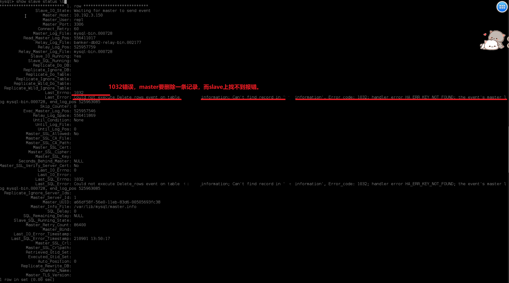
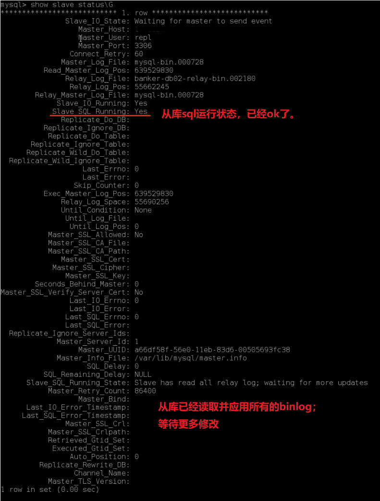

# 场景

今天要改一个bug，要把错误的资讯分类及对应分类下的资讯，全部删除。

大致需要执行：

```sql
-- 查询要删除的资讯分类的id
select id from information_category where length(xxxNo)<32;   
-- 删除这些资讯对应的资讯
delete from information where category_id in (select id from information_category where length(xxxNo)<32);
-- 删除资讯分类的id
delete from information_category where length(xxxNo)<32;
```

因为我不了解对应环境的数据库是主从部署的，

所以我直接在从库中执行了上述`delete`命令。

但是从网站页面上看，并没有删掉（因为删除的是从库的，主库的数据并没有变化。）

此时我又连接上了主库，执行了上述两个删除命令。


然后从库的binlog同步就报错了：

在从库上执行命令查看主从状态：

```
show slave status \G
```



好了，本次给运维挖的坑，已经挖完了。接下来就是找运维同学去填坑了。


异常文本信息：

```
Last_Error: Could not execute Delete_rows event on table [db.table]; Can't find record in [table], Error_code: 1032; handler error HA_ERR_KEY_NOT_FOUND; the event's master log mysql-bin.000007, end_log_pos 415955, Error_code: 1032
```


# 填坑

运维说：先在`从库`删除数据，再在`主库`删除数据时，主库会产生binlog并传给从库，从库去执行binlog中的命令，

此时从库在执行时，并不能找到对应的数据，所以主从同步就失败了，所以主从就不再同步。需要人为手动去解决。


解决办法：

在从库中：

```sql
stop slave;                                 -- 先停止主从同步
set global sql_slave_skip_counter=2;        -- binlog主从同步，跳过两个命令
start slave;                                -- 启动主从同步
```

执行之后，在从库执行下面sql，查询从库状态：

```sql
show slave status\G
```




# 感谢

最后，感谢我们的运维伙伴。嘿嘿~[尴尬笑]

