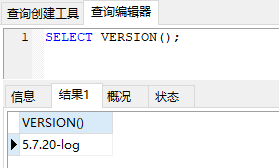
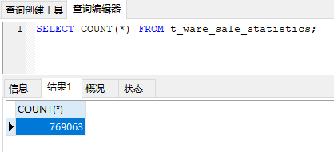
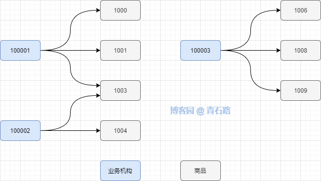
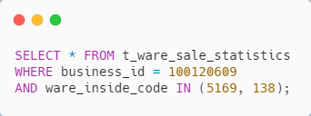

> 原文： 
>
> https://mp.weixin.qq.com/s/7xtNqN7Zs-ZaFkAFsGPE6g


文章来源：http://u6.gg/kj2tj

## **环境准备**

数据库版本：MySQL 5.7.20-log。




建表 SQL：

```
DROP TABLE IF EXISTS `t_ware_sale_statistics`;
CREATE TABLE `t_ware_sale_statistics` (
  `id` bigint(20) NOT NULL AUTO_INCREMENT COMMENT '主键id',
  `business_id` bigint(20) NOT NULL COMMENT '业务机构编码',
  `ware_inside_code` bigint(20) NOT NULL COMMENT '商品自编码',
  `weight_sale_cnt_day` double(16,4) DEFAULT NULL COMMENT '平均日销量',
  `last_thirty_days_sales` double(16,4) DEFAULT NULL COMMENT '最近30天销量',
  `last_sixty_days_sales` double(16,4) DEFAULT NULL COMMENT '最近60天销量',
  `last_ninety_days_sales` double(16,4) DEFAULT NULL COMMENT '最近90天销量',
  `same_period_sale_qty_thirty` double(16,4) DEFAULT NULL COMMENT '去年同期30天销量',
  `same_period_sale_qty_sixty` double(16,4) DEFAULT NULL COMMENT '去年同期60天销量',
  `same_period_sale_qty_ninety` double(16,4) DEFAULT NULL COMMENT '去年同期90天销量',
  `create_user` bigint(20) DEFAULT NULL COMMENT '创建人',
  `create_time` datetime NOT NULL DEFAULT CURRENT_TIMESTAMP COMMENT '创建时间',
  `modify_user` bigint(20) DEFAULT NULL COMMENT '最终修改人',
  `modify_time` datetime NOT NULL DEFAULT CURRENT_TIMESTAMP ON UPDATE CURRENT_TIMESTAMP COMMENT '最终修改时间',
  `is_delete` tinyint(2) DEFAULT '2' COMMENT '是否删除，1：是，2：否',
  PRIMARY KEY (`id`) USING BTREE,
  KEY `idx_business_ware` (`business_id`,`ware_inside_code`) USING BTREE
) ENGINE=InnoDB DEFAULT CHARSET=utf8mb4 ROW_FORMAT=DYNAMIC COMMENT='商品销售统计';
```


初始化数据：准备了 769063 条数据。



# **需求背景**


业务机构下销售商品，同个业务机构可以销售不同的商品，同个商品可以在不同的业务机构销售，也就说：业务机构与商品是多对多的关系。


假设现在有 n 个机构，每个机构下有几个商品，如何查询出这几个门店下各自商品的销售情况？


具体点，类似如下：



如何查出 100001 下商品 1000、1001、1003 、100002 下商品 1003、1004 、 100003 下商品 1006、1008、1009 的销售情况。


相当于是双层列表（业务机构列表中套商品列表）的查询；业务机构列表和商品列表都不是固定的，而是动态的。


那么问题就是：如何查询多个业务机构下，某些商品的销售情况。PS：问题经我一描述，可能更模糊了，大家明白意思了就好！


# **循环查询**


这个很容易想到，在代码层面循环业务机构列表，每个业务机构查一次数据库，伪代码如下：


具体的 SQL 类似如下：



SQL 能走索引：


实现简单，也好理解，SQL 也能走索引，一切看起来似乎很完美，然而现实是：部门开发规范约束，不能循环查数据库，哦豁，这种方式只能放弃，另寻其他方式了。


# **OR 拼接**


通过 MyBatis 的动态 SQL 功能，进行 SQL 拼接，类似如下：


具体的 SQL 类似如下：


SQL 也能走索引：


实现简单，也好理解，SQL 也能走索引，而且只查询一次数据库，貌似可行。唯一可惜的是：有点费 OR，如果业务机构比较多，那 SQL 会比较长。作为候选人之一吧，我们接着往下看。


# **混查过滤**


同样是利用 Mybatis 的动态 SQL ，将 business_id 列表拼在一起，ware_inside_code 拼在一起。


类似如下：


具体的 SQL 类似如下：


SQL 也能走索引：


实现简单，也好理解，SQL 也能走索引，而且只查询一次数据库，似乎可行。但是：查出来的结果集大于等于我们想要的结果集，你品，你细品！


所以还需要对查出来的结果集进行一次过滤，过滤出我们想要的结果集，姑且也作为候选人之一吧，我们继续往下看。


# **行行比较**


SQL-92 中加入了行与行比较的功能，这样一来，比较谓词 = 、< 、> 和 IN 谓词的参数就不再只是标量值了，还可以是值列表了。


当然，还是得用到 Mybatis 的动态 SQL ，类似如下：


具体的 SQL 类似如下：


SQL 同样能走索引：


实现简单，SQL 也能走索引，而且只查询一次数据库，感觉可行，只是：有点不好理解，因为我们平时这么用的少，所以这种写法看起来很陌生。


另外，行行比较是 SQL 规范，不是某个关系型数据库的规范，也就说关系型数据库都应该支持这种写法。


# **总结**

- 最后选择了“行行比较”这种方式来实现了需求，别问我为什么，问就是逼格高！
- 某一个需求的实现往往有很多种方式，我们需要结合业务以及各种约束综合考虑，选择最合适的那个。
- 行行比较是 SQL-92 中引入的，SQL-92 是 1992 年制定的规范，行行比较不是新特性，而是很早就存在的基础功能！