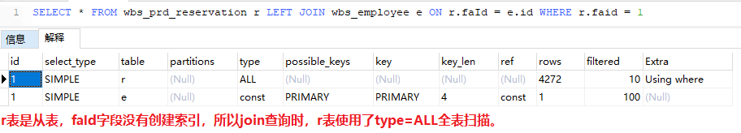
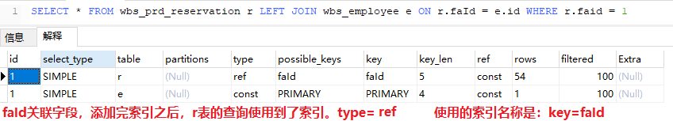

## 【转载】如何科学破解慢SQL?

> 以下文章来源于**后端研究所** ，作者**大白斯基**
>
> [**后端研究所**专注后端开发，记录所思所得。](https://mp.weixin.qq.com/s/OOh1G1DvtQ3-dEIXEKuWtw)


今天和大家聊一个常见的问题：慢SQL。

通过本文你将了解到以下内容：

- 慢SQL的危害
- SQL语句的执行过程
- 存储引擎和索引的那些事儿
- 慢SQL解决之道

后续均以MySQL默认存储引擎InnoDB为例进行展开，话不多说，开搞！

## 1.慢SQL的危害

慢SQL，就是跑得很慢的SQL语句，你可能会问慢SQL会有啥问题吗？

试想一个场景：

> 大白和小黑端午出去玩，机票太贵于是买了高铁，火车站的人真是乌央乌央的。
>
> 马上检票了，大白和小黑准备去厕所清理下库存，坑位不多，排队的人还真不少。
>
> 小黑发现其中有3个坑的乘客贼慢，其他2个坑位换了好几波人，这3位坑主就是不出来。
>
> 等在外面的大伙，心里很是不爽，长期占用公共资源，后面的人没法用。
>
> 小黑苦笑道：这不就是厕所版的慢SQL嘛！

这是实际生活中的例子，换到MySQL服务器也是一样的，毕竟科技源自生活嘛。

MySQL服务器的资源(CPU、IO、内存等)是有限的，尤其在高并发场景下需要快速处理掉请求，否则一旦出现慢SQL就会阻塞掉很多正常的请求，造成大面积的失败/超时等。


## 2.SQL语句执行过程


客户端和MySQL服务端的交互过程简介：

1. 客户端发送一条SQL语句给服务端，服务端的连接器先进行账号/密码、权限等环节验证，有异常直接拒绝请求。
2. 服务端查询缓存，如果SQL语句命中了缓存，则返回缓存中的结果，否则继续处理。
3. 服务端对SQL语句进行词法解析、语法解析、预处理来检查SQL语句的合法性。
4. 服务端通过优化器对之前生成的解析树进行优化处理，生成最优的物理执行计划。
5. 将生成的物理执行计划调用存储引擎的相关接口，进行数据查询和处理。
6. 处理完成后将结果返回客户端。

客户端和MySQL服务端的交互过程简图：

俗话说"条条大路通罗马"，优化器的作用就是找到这么多路中最优的那一条。

存储引擎更是决定SQL执行的核心组件，适当了解其中原理十分有益。

## 3. 存储引擎和索引的那些事儿

### 3.1 存储引擎

InnoDB存储引擎(Storage Engine)是MySQL默认之选，所以非常典型。

存储引擎的主要作用是进行数据的存取和检索，也是真正执行SQL语句的组件。

InnoDB的整体架构分为两个部分：内存架构和磁盘架构，如图：


> 存储引擎的内容非常多，并不是一篇文章能说清楚的，本文不过多展开，我们在此只需要了解内存架构和磁盘架构的大致组成即可。

InnoDB 引擎是面向行存储的，数据都是存储在磁盘的数据页中，数据页里面按照固定的行格式存储着每一行数据。

> 行格式主要分为四种类型Compact、Redundant、Dynamic和Compressed，默认为Compact格式。


#### 磁盘预读机制和局部性原理

当计算机访问一个数据时，不仅会加载当前数据所在的数据页，还会将当前数据页相邻的数据页一同加载到内存，磁盘预读的长度一般为页的整倍数，从而有效降低磁盘IO的次数。


#### 磁盘和内存的交互

MySQL中磁盘的数据需要被交换到内存，才能完成一次SQL交互，大致如图：


- 扇区是硬盘的读写的基本单位，通常情况下每个扇区的大小是 512B
- 磁盘块文件系统读写数据的最小单位，相邻的扇区组合在一起形成一个块，一般是4KB
- 页是内存的最小存储单位，页的大小通常为磁盘块大小的 2^n 倍
- InnoDB页面的默认大小是16KB，是数倍个操作系统的页


#### 随机磁盘IO

MySQL的数据是一行行存储在磁盘上的，并且这些数据并非物理连续地存储，这样的话要查找数据就无法避免随机在磁盘上读取和写入数据。

对于MySQL来说，当出现大量磁盘随机IO时，大部分时间都被浪费到寻道上，磁盘呼噜呼噜转，就是传输不了多少数据。

> 一次磁盘访问由三个动作组成：
>
> - 寻道：磁头移动定位到指定磁道
> - 旋转：等待指定扇区从磁头下旋转经过
> - 数据传输：数据在磁盘与内存之间的实际传输

对于存储引擎来说，如何有效降低随机IO是个非常重要的问题。

### 3.2 索引

可以实现增删改查的数据结构非常多，包括：哈希表、二叉搜索树、AVL、红黑树、B树、B+树等，这些都是可以作为索引的候选数据结构。

结合MySQL的实际情况：磁盘和内存交互、随机磁盘IO、排序和范围查找、增删改的复杂度等等，综合考量之下B+树脱颖而出。

B+树作为多叉平衡树，对于范围查找和排序都可以很好地支持，并且更加矮胖，访问数据时的平均磁盘IO次数取决于树的高度，因此B+树可以让磁盘的查找次数更少。

在InnoDB中B+树的高度一般都在2~4层，并且根节点常驻内存中，也就是说查找某值的行记录时最多只需要1~3次磁盘I/O操作。

MyISAM是将数据和索引分开存储的，InnoDB存储引擎的数据和索引没有分开存储，这也就是为什么有人说Innodb索引即数据，数据即索引，如图：


说到InnoDB的数据和索引的存储，就提到一个名词：**聚集索引**。

#### 聚集索引

聚集索引将索引和数据完美地融合在一起，是每个Innodb表都会有的一个特殊索引，一般来说是借助于表的主键来构建的B+树。

假设我们有student表，将id作为主键索引，那么聚集索引的B+树结构，如图：


- 非叶子节点不存数据，只有主键和相关指针
- 叶子节点包含主键、行数据、指针
- 叶子节点之间由双向指针串联形成有序双向链表，叶子节点内部也是有序的

聚集索引按照如下规则创建：

- 有主键时InnoDB利用主键来生成
- 没有主键，InnoDB会选择一个非空的唯一索引来创建
- 无主键且非NULL唯一索引时，InnoDB会隐式创建一个自增的列来创建

假如我们要查找id=10的数据，大致过程如下：

- 索引的根结点在内存中，10>9 因此找到P3指针
- P3指向的数据并没有在内存中，因此产生1次磁盘IO读取磁盘块3到内存
- 在内存中对磁盘块3进行二分查找，找到ID=9的全部值

#### 非聚集索引

非聚集索引的叶子节点中存放的是二级索引值和主键键值，非叶子节点和叶子节点都没有存储整行数据值。

假设我们有student表，将name作为二级索引，那么非聚集索引的B+树结构，如图：


由于非聚集索引的叶子节点没有存储行数据，如果通过非聚集索引来查找非二级索引值，需要分为两步：

- 第一：通过非聚集索引的叶子节点来确定数据行对应的主键
- 第二：通过相应的主键值在聚集索引中查询到对应的行记录

我们把通过非聚集索引找到主键值，再根据主键值从聚集索引找对于行数据的过程称为：**回表查询**。

换句话说：select * from student where name = 'Bob' 将产生回表查询，因为在name索引的叶子节点没有其他值，只能从聚集索引获得。

所以如果查找的字段在非聚集索引就可以完成，就可以避免一次回表过程，这种称为：覆盖索引，所以select * 并不是好习惯，需要什么拿什么就好。

假如我们要查找name=Tom的记录的所有值，大致过程如下：

- 从非聚集索引开始，根节点在内存中，按照name的字典序找到P3指针
- P3指针所指向的磁盘块不在内存中，产生1次磁盘IO加载到内存
- 在内存中对磁盘块3的数据进行搜索，获得name=tom的记录的主键值为4
- 根据主键值4从聚集索引的根节点中获得P2指针
- P2指针所指向的磁盘块不在内存中，产生第2次磁盘IO加载到内存
- 将上一步获得的数据，在内存中进行二分查找获得全部行数据

上述查询就包含了一次回表过程，因此性能比主键查询慢了一倍，因此尽量使用主键查询，一次完事。

## 4. 慢SQL解决思路

出现慢SQL的原因很多，我们抛开单表数亿记录和无索引的特殊情况，来讨论一些更有普遍意义的慢SQL原因和解决之道。

我们从两个方面来进行阐述：

- 数据库表索引设置不合理
- SQL语句有问题，需要优化


### 4.1 索引设置原则

程序员的角度和存储引擎的角度是不一样的，索引写的好，SQL跑得快。

- **索引区分度低**

假如表中有1000w记录，其中有status字段表示状态，可能90%的数据status=1，可以不将status作为索引，因为其对数据记录区分度很低。

- **切忌过多创建索引**

每个索引都需要占用磁盘空间，修改表数据时会对索引进行更新，索引越多，更新越复杂。

> 因为每添加一个索引，.ibd文件中就需要多维护一个B+Tree索引树，如果某一个table中存在10个索引，那么就需要维护10棵B+Tree，写入效率会降低，并且会浪费磁盘空间。

- **常用查询字段建索引**

如果某个字段经常用来做查询条件，那么该字段的查询速度会影响整个表的查询速度，属于热门字段，为其建立索引非常必要。

- **常排序/分组/去重字段建索引**

对于需要经常使用ORDER BY、GROUP BY、DISTINCT和UNION等操作的字段建立索引，可以有效借助B+树的特性来加速执行。

- **主键和外键建索引**

主键可以用来创建聚集索引，外键也是唯一的且常用于表关联的字段，也需要建索引来提高性能。

### 4.2 SQL的优化

如果数据库表的索引设置比较合理，SQL语句书写不当会造成索引失效，甚至造成全表扫描，迅速拉低性能。

#### 索引失效

我们在写SQL的时候在某些情况下会出现索引失效的情况：

- **对索引使用函数**

> select id from std upper(name) = 'JIM';

- **对索引进行运算**

> select id from std where id+1=10;

- **对索引使用<> 、not in 、not exist、!=**

> select id from std where name != 'jim';

- **对索引进行前导模糊查询**

> select id from std name like '%jim';

- **隐式转换会导致不走索引**

> 比如：字符串类型索引字段不加引号，select id from std name = 100;保持变量类型与字段类型一致

- **非索引字段的or连接**

> 并不是所有的or都会使索引失效，如果or连接的所有字段都设置了索引，是会走索引的，
>
> 一旦有一个字段没有索引，就会走全表扫描。

- **联合索引仅包含复合索引非前置列**

> 联合索引包含key1，key2，key3三列，但SQL语句没有key1，根据联合索引的最左匹配原则，不会走联合索引。
> 例如：select name from table where key2 = 1 and key3 = 2;

- **联合join查询**

  - 从表的关联字段未创建索引    *(一般来说，主表的id都是主键索引，但是都会把从表的关联字段忘记创建索引)*

    给关联字段创建索引：`ALTER TABLE wbs_prd_reservation ADD INDEX (faId);`   执行之后：

  - 联合字段数据类型、字符集不一样

    > 如果关联字段数据类型不一样，在数据关联判断关联条件是否相等时，就需要进行隐式类型转换。
    >
    > 如果数据类型都是varchar，但是字符集不一样，也会进行隐式数据转换。[详见](./慢查询优化——Using join buffer (Block Nested Loop).md#解决方案)

#### 好的建议

- **使用连接代替子查询**

> 对于数据库来说，在绝大部分情况下，连接会比子查询更快，使用连接的方式，MySQL优化器一般可以生成更佳的执行计划，更高效地处理查询
> 而子查询往往需要运行重复的查询，子查询生成的临时表上也没有索引， 因此效率会更低。

- **LIMIT偏移量过大的优化**

> 禁止分页查询偏移量过大，如limit 100000,10

- **使用覆盖索引**
  减少select * ，借助覆盖索引，减少回表查询次数。
- **多表关联查询时，小表在前，大表在后**

> 在MySQL中，执行from后的表关联查询是从左往右执行的，第一张表会涉及到全表扫描，所以将小表放在前面，先扫小表，扫描快效率较高，在扫描后面的大表，或许只扫描大表的前100行就符合返回条件并return了。

- **调整Where字句中的连接顺序**

> MySQL采用从左往右的顺序解析where子句，可以将过滤数据多的条件放在前面，最快速度缩小结果集。

- **使用小范围事务，而非大范围事务**
- **联合索引，遵循最左匹配原则**
- **使用联合索引，而非建立多个单独索引**

### 4.3 慢SQL的分析

在分析慢SQL之前需要通过MySQL进行相关设置：

- 开启慢SQL日志
- 设置慢SQL的执行时间阈值

```
开启：SET GLOBAL slow_query_log = 1;
开启状态：SHOW VARIABLES LIKE '%slow_query_log%';
设置阈值：SET GLOBAL long_query_time=3;
查看阈值：SHOW GLOBAL VARIABLES LIKE 'long_query_time%'; 
```

#### explain分析SQL

explain命令只需要加在select之前即可，例如:

> explain select * from std where id < 100;

该命令会展示sql语句的详细执行过程，帮助我们定位问题，网上关于explain的用法和讲解很多，本文不再展开。

## 5. 小结

本文从慢SQL的危害、Innodb存储引擎、聚集索引、非聚集索引、索引失效、SQL优化、慢SQL分析等角度进行了阐述。

MySQL的很多知识点都非常复杂，并非一两篇文章能讲清楚的，因此本文在很多地方显得很单薄，好在网上资料非常多。

如果本文能在某些方面对读者有所启发，足矣。