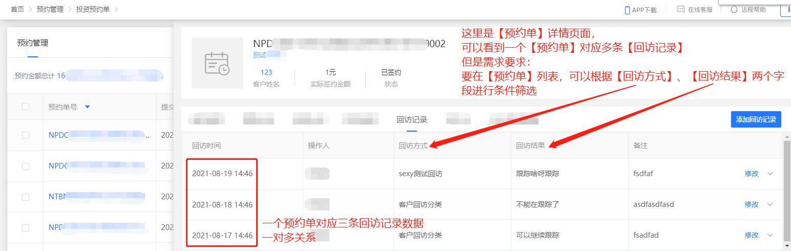
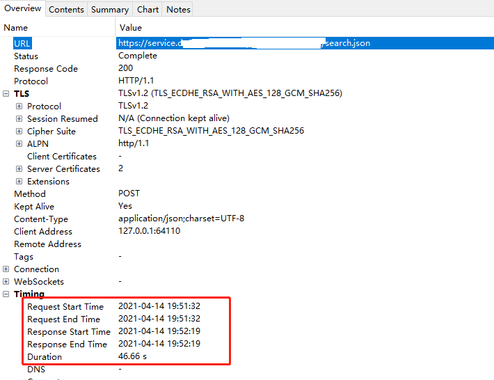
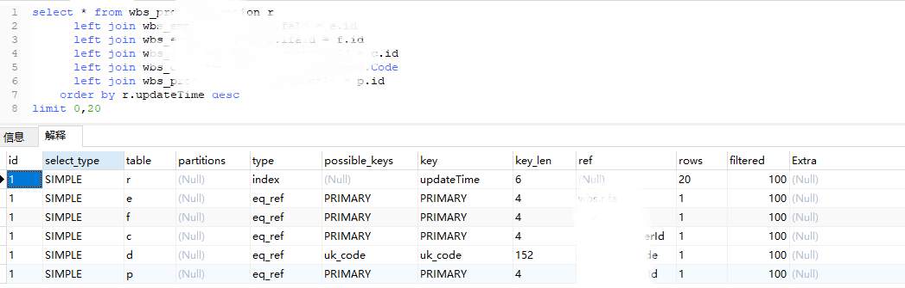

此问题已经解决，记录一下解决的过程。


# 业务需求



# 排查日志

抓包发现此接口需要执行46.66秒




日志中：


从日志中也证明了，此查询sql就是执行的非常慢。


# Explain 解释


上面红圈中的，都是需要优化的问题。

但是**最严重的就是子查询的问题：**

> **基础知识：Dependent Subquery意味着什么**
>
> 官方含义为：
>
> > SUBQUERY：子查询中的第一个SELECT；
> >
> > DEPENDENT SUBQUERY：子查询中的第一个SELECT，**取决于外面的查询** 。
>
> 换句话说，就是 **子查询的查询依赖于外层的查询。子查询的执行效率受制于外层查询的记录数，那还不如拆成两个独立查询顺序执行呢**。
>
> 参考：https://www.cnblogs.com/zhengyun_ustc/archive/2013/11/29/slowquery3.html


# 解决方案

把查询 `wbs_prd_revisit_log` 表的逻辑拆成两个查询：

- 先根据请求参数查询 `wbs_prd_revisit_log`表，查询出预约单`ids`，

- 然后根据预约单id，使用in查询预约单表。


根据ids查询预约单表:（已简化）

```xml
<select id="search">
 		select * from wbs_xxxxxxx1 r
			left join wbs_xxxxxxx2  on  xxxx = xxxx (脱敏处理)
			left join wbs_xxxxxxx3  on  xxxx = xxxx (脱敏处理)
			left join wbs_xxxxxxx4  on  xxxx = xxxx (脱敏处理)
        <where>
            <if test="query.ids != null and query.ids.size() > 0">
                r.id in 
                <foreach collection="query.ids" item="item" open="(" close=")" separator=",">
                    #{item}
                </foreach>
            </if>
        </where>
		order by r.updateTime desc
</select>
```


# 效果

改完之后：


只有`r.updateTime` 使用到了`filesort`文件排序，因为`r.updateTime`字段没创建索引。添加一个索引就行了：

```sql
ALTER TABLE `wbs_prd_reservation` ADD INDEX (`updateTime`);
```

创建完索引之后，就没有 `Using filesort` 文件排序了。



> - 参与排序的字段，如果存在索引，会使用到索引，
>
> - 但是创建索引并不是那么简单的：需要结合业务，结合表结构，如果存在多个字段参与where、order by、group by，则尽量创建联合索引；因为一个表中创建太多的索引，对性能也有影响。
>
> 详见： [【转载】如何科学破解慢SQL.md](【转载】如何科学破解慢SQL.md) 


# 总结

问题原因：查询使用了**Dependent Subquery子查询**，主要就是 客户回访记录表子查询导致的慢查询。

解决方案：需要手动把【回放方式、回放结果】两个字段的筛选，使用java编码方式实现，然后再根据ids查询预约单表。

 

**优化后，此方案可到达的效果：**

**经过上述优化方案后，原本47秒返回结果，优化后在0.5~3秒返回正确结果。**


# 参考

[慎用MySQL子查询，尤其是看到DEPENDENT SUBQUERY标记时](https://www.cnblogs.com/zhengyun_ustc/archive/2013/11/29/slowquery3.html)


# [实战] 部门子查询

如下图：这个SQL语句的作用是：

- 查询部门信息，及返回部门及其子部门对应的人数。
- 这里第18行，使用了 `a.deptCode Like concat(dept.code, '%')`    其实就是为了查询  **部门及其子部门** 


## 执行时间

使用 arthas trace 监控方法执行时间：发现执行了**133秒**


发现这个sql存在 **非常严重的慢查询** 问题！！


## 思路

首先这个sql主要的问题就是使用了**依赖性子查询**，这样是非常非常慢的，所以思路就是把这个子查询拆分出去：

- 第一个sql查询部门数据
- 第二个sql统计每个部门的人数
- 在程序中：根据部门编号，统计出此部门及其子部门的人数。并拼接到list中。

> 说明：由于我们的部门编号是有层级关系的，
>
> 比如部门编号是 ：
>
> c01
>
> c0101
>
> c0102
>
> c0103
>
> c02
>
> c0201
>
> c0202
>
> 所以写了一个方法，统计部门及其子部门的人数：
>
> ```java
> /**
>  * 根据部门前缀,统计总人数
>  *
>  * @param map 部门对应人数的map
>  * @param deptCode 部门编号
>  * @return 部门及其子部门的人数
>  */
> private static int getCountByDeptCodePrefix(Map<String, Integer> map, String deptCode) {
>     return map.keySet().stream()
>               .filter(Objects::nonNull)
>               .filter(e -> e.startsWith(deptCode))
>               .mapToInt(map::get)
>               .sum();
> }
> 
> public static void main(String[] args) {
>     HashMap<String, Integer> map = new HashMap<>();
>     map.put("c01",      1);
>     map.put("c0101",    1);
>     map.put("c0102",    3);
>     map.put("c0105",    8);
>     map.put("c02",      10);
>     System.out.println(getCountByDeptCodePrefix(map, "c01")); // 返回 13
> }
> ```


## 实施步骤

有了上面的方法，然后把sql拆分长两个：

- 第一个sql查询部门数据

  ```sql
  select *  -- 查询*是为了脱敏
  from department dept
  WHERE dept.entId = #{entId,jdbcType=NUMERIC}
     and dept.deleted = 0 
     <if test="name != null and name !=''">
        and dept.name like concat('%',#{name},'%')
     </if>
     <if test="deptCodeList != null">
        <foreach collection="deptCodeList" item="deptCode" index="index" open="and (" close=")" separator="or">
            dept.code like concat(#{deptCode},'%')
        </foreach>
     </if>
  order by dept.parentCode,dept.seq
  ```

- 第二个sql统计每个部门的人数

  ```sql
  SELECT a.deptCode, count(DISTINCT(e.id)) empCnt
  FROM emp_dept a
  JOIN employee e ON a.empId = e.id
  JOIN department d ON d.id = a.deptId
  WHERE and d.deleted = 0
      <if test="name != null and name !=''">
          and d.name like concat('%',#{name},'%')
      </if>
      <if test="deptCodeList != null">
          <foreach collection="deptCodeList" item="deptCode" index="index" open="and(" close=")" separator="or">
              d.code like concat(#{deptCode},'%')
          </foreach>
      </if>
  GROUP BY a.deptId
  ```

- 由于第二个sql语句查询的是部门对应的人数，所以在程序中，还需遍历部门并调用 `getCountByDeptCodePrefix()` 方法对统计部门及其子部门的人数：

  ```java
  // 先根据条件查询出部门信息：名称、id、状态等
  List<DeptEmpCntVo> allDept = employeeDao.queryAllByDept(entId, name, deptCodeList);
  // 再单独统计部门的员工数量   key:部门编号,value:此部门的人数
  Map<String, Integer> deptCountMap = employeeDao.queryEmpCountByDept(entId, name, deptCodeList)
                                                  .stream()
                                                  .collect(Collectors.toMap(e -> String.valueOf(e.get("deptCode")), 
                                                                            e -> (Integer) e.get("empCnt"), 
                                                                            (e, e2) -> e2));
  for (DeptEmpCntVo deptEmpCntVo : allDept) {   
       String code = deptEmpCntVo.getCode(); // 当前部门编号
       deptEmpCntVo.setEmpCnt(getCountByDeptCodePrefix(deptCountMap, code)); // 统计并设置部门及其子部门人数
  }
  ```

  


## 优化效果


