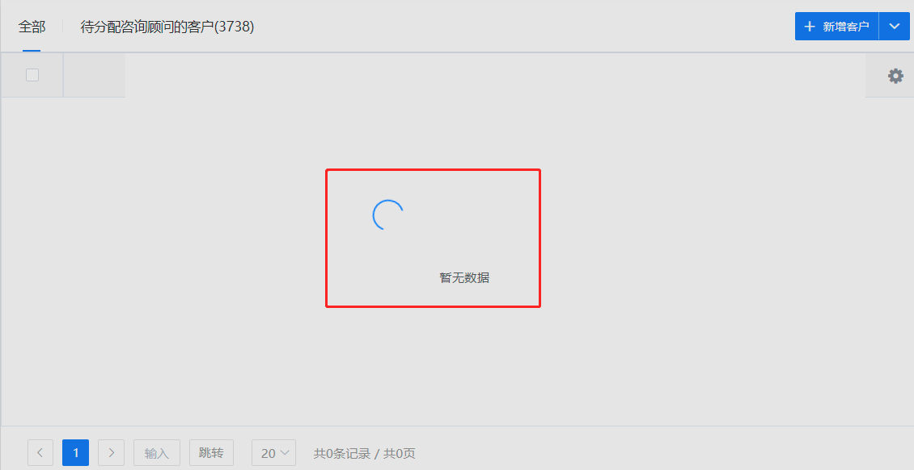
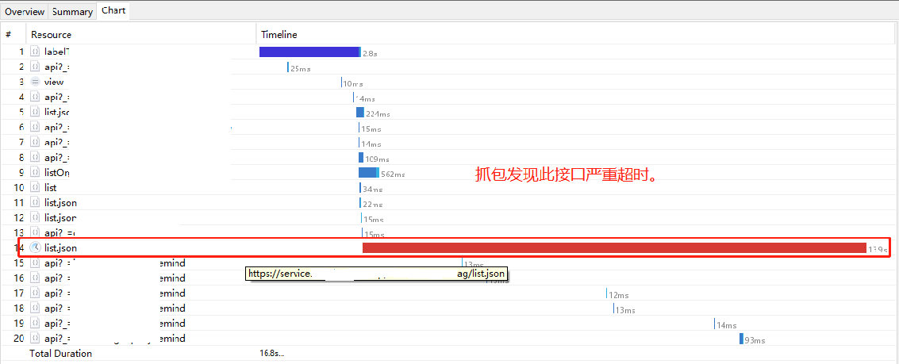
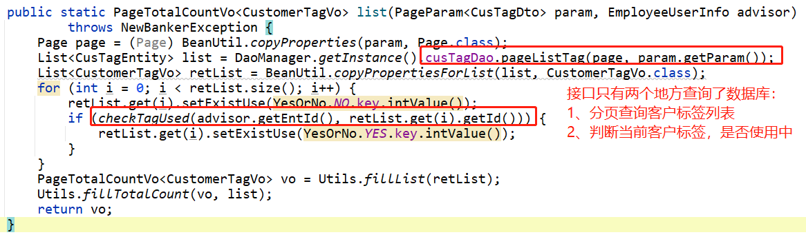
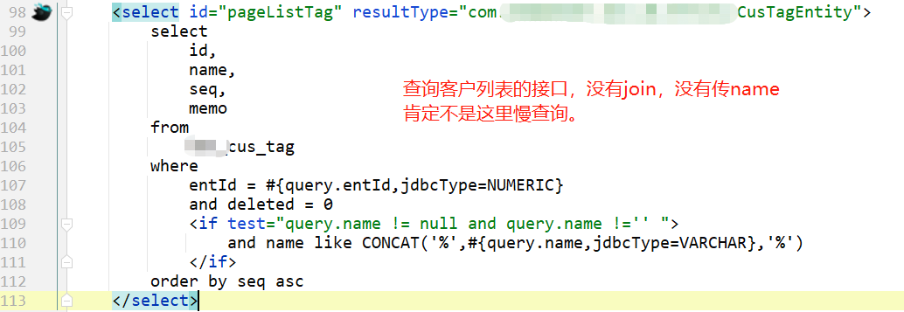
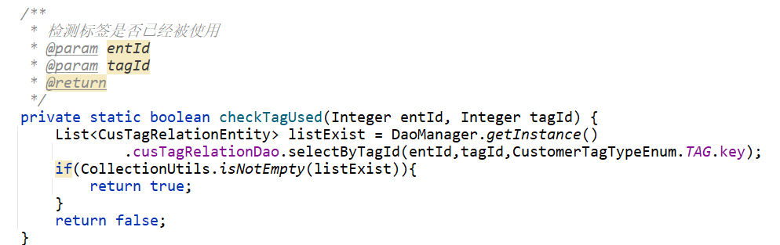
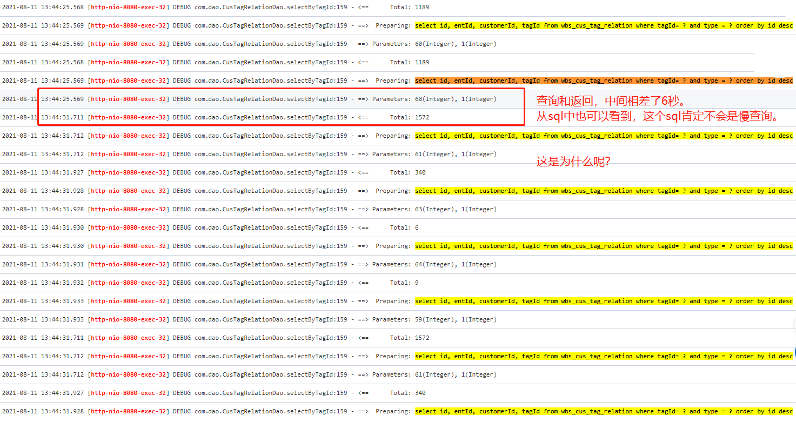

今天线上系统的客户列表查询非常慢，经常需要40多秒才能返回，甚至有时候接口会504超时。

# 问题分析

看到接口返回较慢，偶尔504接口超时的问题，我第一反应就是那地方出现慢查询了。

先抓包一下，看看是哪个接口返回较慢：

知道了哪个接口比较慢，那就分析一下代码逻辑：

分页查询客户标签：

判断标签是否在使用中：

实现逻辑是：根据标签id，查询客户与标签的关联表，如果返回的list不为空，则说明当前标签正在使用中。

这地方也不会有查询啊。

> 到这里突然没有思路了。
>
> 直接从源码上分析来看，并没有什么复杂的sql查询。
>
> 肯定不存在慢查询。
>
> 没有思路了，就抱着排查问题基本步骤，看了一下日志。一看日志发现不对劲了。

# 查看日志

从日志中看到，在判断标签是否正在使用的sql语句：

`select * from wbs_cus_tag_relation whre tagId = ? and type=? order by id desc`

偶尔返回的时间比较长，甚至达到6秒。

那看到这里的日志，肯定问题就出在这里了。

# 修改方案

首先，判断客户标签是否在使用中，我们完全可以使用 select count(1) ，查询总数，如果总数count大于0，则表示标签正在使用中。

所以我也是这样来修改的。

# 原因分析

todo: 导致的查询数据6秒没有返回的根本原因是什么呢？

