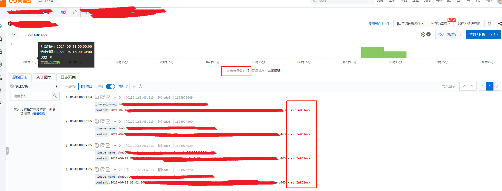
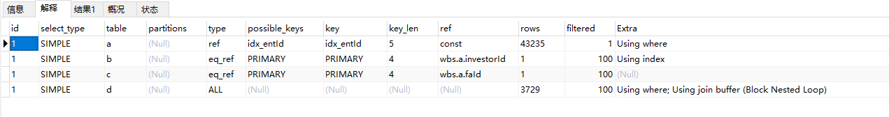

# bug描述：

定时任务使用xxl-job，在每天8点执行任务调度：使用curl调用一个http接口，扫描当天哪些客户过生日，然后给对应的理财师发送客户生日提醒。

今天理财师早上收到了同一个客户生日提醒，收到了7次。


# 分析

八点定时任务执行：


查看日志：发现总共调用了16次：



sc任务执行日志，发现curl http接口超时：


在nginx中，wbs-web总共有5个upstream ip，nginx访问日志中，看到客户端总共调用了三次，并且都是504超时。

问了一下运维，我们的nginx调用upstream的超时时间是1分钟。

**那么问题来了：为什么这个/http/xxxx/xxxxx.json 接口在1分钟内都没有执行完呢？**


对于此bug，解决方法：

1、方案一：执行定时任务改成异步。任务提交之后http请求立即返回结果。

2、方案二：根据日期，添加redis锁，redis锁过期时间当天23:59:59

 

另外：

接口执行比较长，是因为存在慢查询，SQL语句是：（已脱敏）

```sql
select * from
   a
   left join b on a.investorId = b.id
   left join c on a.faId = c.id
   left join d on d.userId = c.id
where 
   a.entId = #{entId,jdbcType=NUMERIC}
   and birthdayRemindDate = DATE_FORMAT(SYSDATE(),'%m-%d')
   and deleted = 0
```

SQL语句解释一下：


上图可以看到这个SQL总共有两个问题：

- 表a 和表d，查询是使用的全表扫描type=ALL。
- 表d存在 **Using join buffer (Block Nested Loop)**


# 解决方案

问题找到了，解决方案就比较简单了。

## 解决全表扫描

对于表a全表扫描，是因为在where中，使用了where a.entId = ? ，而且entId字段并没有索引，导致的全表扫描。

所以添加entId字段索引：

```sql
ALTER TABLE `a` ADD INDEX `idx_entId` (`entId`);
```

另外，我看了一下a.investorId字段是否存在索引，主要是因为在left join时使用的：

```sql
left join b on a.investorId = b.id
```

发现 a.investorId 没有索引，所以加上索引：

```
ALTER TABLE `a` ADD INDEX `idx_investorId` (`investorId`);
```

添加上两个索引后，SQL解释：发现table a的type改成了ref。已经不是全表扫描了。




## 解决 **Using join buffer (Block Nested Loop)**

参考：https://blog.csdn.net/losedguest/article/details/105574729 中说：

> 通过EXPLAIN发现，extra中有数据是Using join buffer (Block Nested Loop)
>
> 1.字段数据类型不一致(建立索引也不会生效)
>
> 2.未建立索引/或者索引不正确

根据第1条，我看了一下d表的userId字段，发现是varchar(50) 所以需要把userId字段改成int(11)

避免在left join 时MySQL内部进行类型转换。

所以执行SQL：

```sql
ALTER TABLE `d`
MODIFY COLUMN `userId` int(11) NULL DEFAULT NULL AFTER `entId`;
```

然后：


再给userId字段添加索引：

```sql
ALTER TABLE `d`
ADD INDEX `idx_userId` (`userId`);
```


# 总结

关联查询如果存在慢查询，解决思路：

给关联子表的字段添加索引，并且关联字段的数据类型必须是相同的数据类型，避免在join时隐式类型转换。


