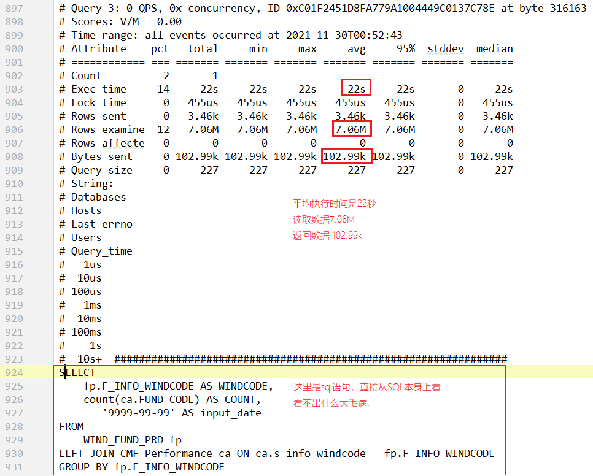
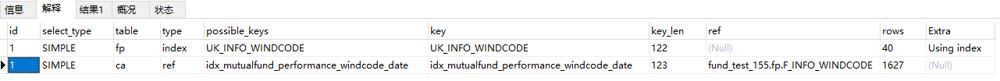
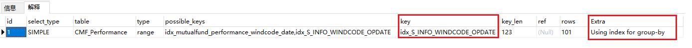
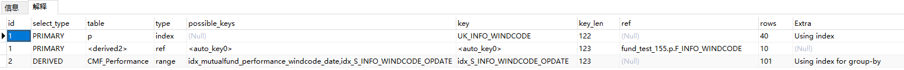

# pt-query-digest分析慢查询日志

> pt-query-digest 慢查询分析工具
>
> 具体使用方法详见：[慢查询优化——使用慢查询日志.md](慢查询优化——使用慢查询日志.md)

某天，运维给我发了公司生产环境MySQL的慢查询日志，使用`pt-query-digest`工具分析了一下：



> 先说一下这个SQL语句的作用：统计每个基金的业绩表现的数量。
>
> 在定时任务中：如果某只基金没有业绩表现（也就是COUNT = 0的情况），则从wind库中查询此基金的所有基金业绩表现，保存到`CMF_Performance` 表中。


根据上图得知：

- 平均执行时间是22秒；执行频率不高，每小时就执行了1次。
- 此sql语句执行时，从磁盘读取数据7.06M
- 返回数据102.99k

根据上面三点，可以分析出：

- 首先这肯定是慢查询了，而且非常非常的慢！！
- 读取数据和返回数据差值很大，猜测是没有使用到索引；所以第一反应就是加索引。（虽然这个第一反应是错误的，具体往下看）
- 我们知道，两个表进行left join，需要在关联字段上创建索引。所以下面我们需要检查两个表的关联字段有没有索引。


# 解释 Explain



从这个解释的输出结果，**发现type=index和type=ref，并且key都是使用了索引了，那说明两个表关联的时候，都创建了索引了。完全没有问题啊。**

# 问题来了

既然两个表都有索引，并且查询时也走索引了，为什么查询时间还需要22秒呢？？？？


# 发现端倪

正当没有头绪的时候，突然使用`select count(1)`看了一下两个表的数据量：

- WIND_FUND_PRD 表数据量：3565
- CMF_Performance 表数据量：7482681

再结合这个慢查询语句，仔细想了一下，突然想到：

> 这个查询语句没有`where`条件，是两表关联之后，再统计两个表的全量数据。
>
> 所以：先不说两个表的join效率如何，MySQL只是把 `CMF_Performance` 表的700多万条数据从磁盘中读取到内存中，都需要费多少时间、费多少内存了。原来上面的读取的7.06M的数据，是读取了700多万条数据导致的。

# 根本原因

所以问题的根本原因应并不是索引是否存在、索引是否失效，而是这个查询要读取700多万条数据导致的 —— 因为没有where条件，那肯定是需要读取两个表的全量数据。


# 解决方案

## 第一个方案：减少join的数据量

我们想到的第一个方案是减少join的数据量，具体来说就是：

先从 基金业绩表现表 CMF_Performance 中查询两个星期的数据（减少数据量），然后再和基金产品表进行left join 关联。


修改后的sql语句是：

```sql
-- 先在 CMF_Performance  表的 OPDATE 字段创建索引
alter table CMF_Performance add index `idx_OPDATE`(`OPDATE`);

-- 查询语句改成：
SELECT
    fp.F_INFO_WINDCODE AS WINDCODE,
    fp.FUND_CODE AS fundCode,
    MAX(ca.OPDATE) AS OPDATE
FROM WIND_FUND_PRD fp
LEFT JOIN (
    SELECT  S_INFO_WINDCODE, OPDATE
    FROM CMF_Performance
    WHERE OPDATE > DATE_SUB(CURDATE(), INTERVAL 2 WEEK)
) ca ON ca.S_INFO_WINDCODE = fp.F_INFO_WINDCODE
GROUP BY fp.F_INFO_WINDCODE
```

这么改之后，确实不到22秒就返回数据了。但是这个查询还是不能在1秒之内就返回数据，也就说其本身还是个慢查询。


## 第二个方案：避免回表

> 画外音：
>
> 当时我脑海中的思路是：在`left join`关联`CMF_Performance`表时，其实我只需要两个字段就行了：`S_INFO_WINDCODE` 和 最大的 `OPDATE` ，也就是：
>
> ```sql
> SELECT S_INFO_WINDCODE, max(OPDATE) maxOPDATE
> FROM CMF_Performance
> GROUP BY S_INFO_WINDCODE;
> -- 备注：这个SQL语句统计出来的数据量，小于或等于 基金产品表的数据条数。
> ```
>
> 所以当时就想，能不能创建一个`视图`，当`left join`查询的时候，不需要读取 `CMF_Performance` 表中的700多万条数据，而是直接查询一个中间统计出来的结果数据。这样的话，相当于3000条数据和3000条数据进行`left join`表关联，那效率肯定比 3000条数据和700万条数据`left join` 关联强的多！！
>
> 但是查询了一下发现，MySQL的`视图`只是一个逻辑概念，本身并不存储数据，所以当查询视图的时候，还是去查询的原始表。
>
> 过了一会，突然想到：**覆盖索引** 的概念！！！

### 覆盖索引

覆盖索引：只需要在一棵辅助索引树上就能获取SQL所需的所有列数据，就无需回表。速度更快。

> 更多覆盖索引的讲解，详见博客：[mysql覆盖索引与回表](https://www.jianshu.com/p/8991cbca3854)

所以，创建了联合索引：

```sql
alter table CMF_Performance 
add index `idx_S_INFO_WINDCODE_OPDATE`(`S_INFO_WINDCODE`,`OPDATE`);
```

此时下面这个查询：就非常快了，基本上1秒内就返回了。

```sql
SELECT S_INFO_WINDCODE, max(OPDATE) maxOPDATE
FROM CMF_Performance
GROUP BY S_INFO_WINDCODE;
```



使用的索引正是新创建的这个索引；并且Extra最后一列中：`Using index for group-by`


### 慢查询优化后的SQL

```sql
SELECT
    WINDCODE,
    OPDATE
FROM WIND_FUND_PRD p
LEFT JOIN (
	SELECT S_INFO_WINDCODE AS WINDCODE, MAX(OPDATE) AS OPDATE
	FROM CMF_Performance
	GROUP BY S_INFO_WINDCODE
) b ON p.F_INFO_WINDCODE = b.WINDCODE
```



优化后sql语句执行耗时：

贼快 ！！！ 不到1秒就查询结束了！！！ 


# 总结

常规的sql优化手段，都是说不让使用子查询，但是经过这次慢查询优化过程，感觉到：

- 还是应该多了解底层原理知识（因为之前了解过`覆盖索引`的只是，所以能突然想到）
- 不要循规蹈矩（别人都说：不能使用子查询）
- SQL优化还是要根据  业务场景、SQL具体用法、数据结构   等特定的场景，特定去分析。
- 此次慢查询优化的总体思路：就是使用`覆盖索引`避免回表 （避免700多万数据的查询）


