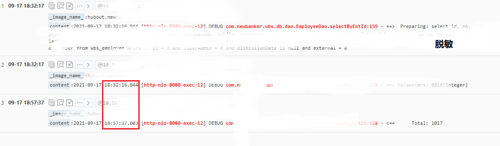
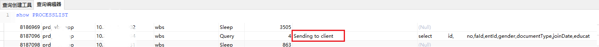

# bug

/saas/visitLog/list.json 接口504超时。

查看源码发现代码逻辑是：

- 先查询出访问日志，访问日志有各操作人id——`operatorId`，这个id是员工表的id，需要根据`operatorId`查询出员工名称，返回员工名称。
- 在查询员工名称的时候，使用的是：
  - list = select * from employee where status = 1 and deleted = 1 
  - empNameMap = list.stream().map(e -> e.getName()).collect(Collectors.toMap(KeyEntity::getId, ParamEntity::getName, (e, e2) -> e2));

如上，已经看到问题了：

如果要根据`operatorId`查询员工名称，不要使用 `selectAll()` 这种方式查询。

解决办法也比较好理解：

用到哪个员工，就查询哪些员工。也就是： `selectEmployeeByIds(operatorIds);`

下面我们主要看一下原写法的所产生的问题：

# 日志

从日志中发现，这个查询从 18:32:16 开始执行，在 18:57:37 数据返回了，中间花费了57.37-32.16=**25.21分钟**！！！

难道是慢查询？

我们`explain`一下：

其实只是一个简单的查询，基本上把所有未删除的、状态启用的员工都返回了。所以type=ALL 也是理解的。

那总共有多少数据呢？

在对应的db中执行一下，发现查询时间很快：**0.189秒。总共1017条数据。**

这明明就很快啊，那为什么从日志中看到使用了**25分钟**才返回数据呢？

# SHOW PROCESSLIST

在db中执行这个命令，可以看到当前这一瞬间，服务器在执行哪些任务：

看到，查询到的数据是一直在 **Sending to client** 状态。

# 问题分析

从这里也是看到了 selectAll 的方式查询数据的弊端：

- 虽然没有慢查询，但是数据需要从数据库发送到jvm业务代码中。这也是要走网络通信的，也是要消耗带宽的。

- 另外在数据从server端发送的client的时候，其实这个数据库连接connection是不会被释放的，其他的线程是无法使用这个数据库连接的。
  - 如果这样的查询比较多的时候，那么大量的connection都在传输数据，那么并发上来的时候，就数据库连接池中就没有可用的connection。
  - 这时，就会导致此进程中的其他controller接口，获取不到connection，就会等待池返回connection，就会导致接口很慢，甚至504超时。

