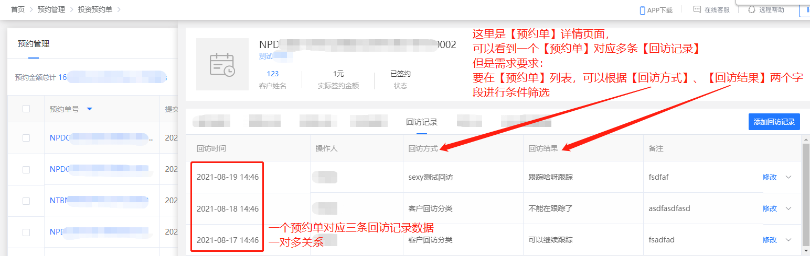
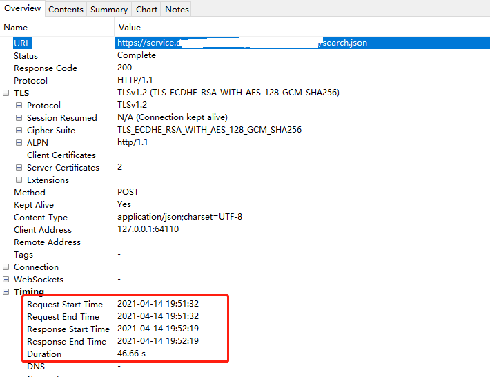
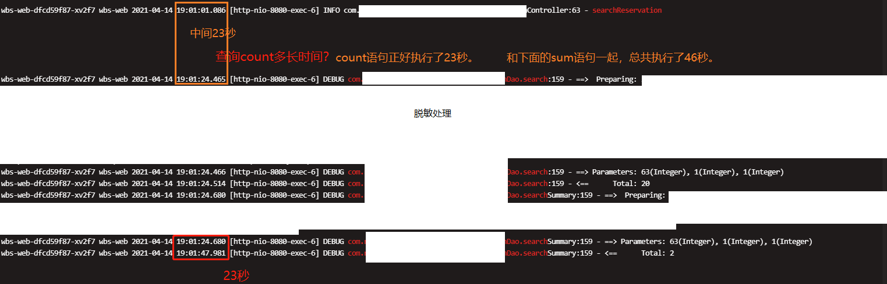
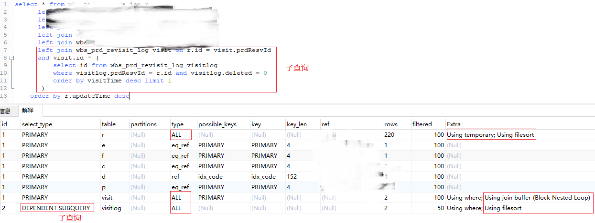
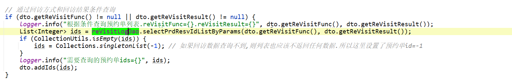
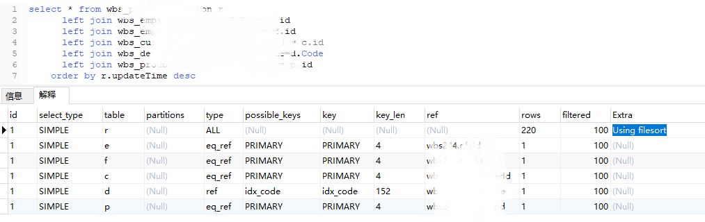
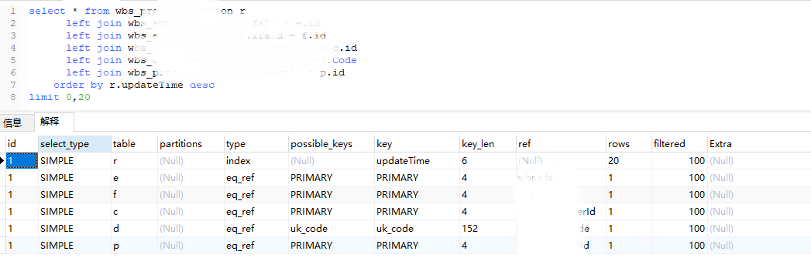

此问题已经解决，记录一下解决的过程。


# 业务需求



# 排查日志

抓包发现此接口需要执行46.66秒




日志中：



从日志中也证明了，此查询sql就是执行的非常慢。


# Explain 解释



上面红圈中的，都是需要优化的问题。

但是**最严重的就是子查询的问题：**

> **基础知识：Dependent Subquery意味着什么**
>
> 官方含义为：
>
> > SUBQUERY：子查询中的第一个SELECT；
> >
> > DEPENDENT SUBQUERY：子查询中的第一个SELECT，**取决于外面的查询** 。
>
> 换句话说，就是 **子查询的查询依赖于外层的查询。子查询的执行效率受制于外层查询的记录数，那还不如拆成两个独立查询顺序执行呢**。
>
> 参考：https://www.cnblogs.com/zhengyun_ustc/archive/2013/11/29/slowquery3.html


# 解决方案

把查询 `wbs_prd_revisit_log` 表的逻辑拆成两个查询：

- 先根据请求参数查询 `wbs_prd_revisit_log`表，查询出预约单`ids`，

- 然后根据预约单id，使用in查询预约单表。



根据ids查询预约单表:（已简化）

```xml
<select id="search">
 		select * from wbs_xxxxxxx1 r
			left join wbs_xxxxxxx2  on  xxxx = xxxx (脱敏处理)
			left join wbs_xxxxxxx3  on  xxxx = xxxx (脱敏处理)
			left join wbs_xxxxxxx4  on  xxxx = xxxx (脱敏处理)
        <where>
            <if test="query.ids != null and query.ids.size() > 0">
                r.id in 
                <foreach collection="query.ids" item="item" open="(" close=")" separator=",">
                    #{item}
                </foreach>
            </if>
        </where>
		order by r.updateTime desc
</select>
```


# 效果

改完之后：



只有`r.updateTime` 使用到了`filesort`文件排序，因为`r.updateTime`字段没创建索引。添加一个索引就行了：

```sql
ALTER TABLE `wbs_prd_reservation` ADD INDEX (`updateTime`);
```

创建完索引之后，就没有 `Using filesort` 文件排序了。



> - 参与排序的字段，如果存在索引，会使用到索引，
>
> - 但是创建索引并不是那么简单的：需要结合业务，结合表结构，如果存在多个字段参与where、order by、group by，则尽量创建联合索引；因为一个表中创建太多的索引，对性能也有影响。
>
> 详见： [【转载】如何科学破解慢SQL.md](【转载】如何科学破解慢SQL.md) 


# 参考

[慎用MySQL子查询，尤其是看到DEPENDENT SUBQUERY标记时](https://www.cnblogs.com/zhengyun_ustc/archive/2013/11/29/slowquery3.html)

