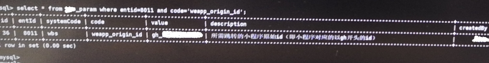

# 遇到此问题的场景

今天需求上线，上线流程中，需要运营人员在配置中心*（我公司自己开发的配置中心）*配置一个变量：

```
参数代码：weapp_origin_id
参数值：gh_xxxxxxxxxxx   （以脱敏）
参数描述：表示小程序原始id
```

但是运营人员在新增配置时候报错：


> 画外音：
>
> 这张表在MySQL数据库中，使用的`参数代码code`字段作为唯一索引，所以当`参数代码code`重复的时候，就会报这个错误。

所以我就跟运营人员说：这个code已经存在了，已经配置过了，所以就检查一下配置的参数值是否正确就行了。

过了一小会儿，运营人员跟我说：在`列表`中没有这个配置项：（第一页数据）


第二页数据中也没有参数代码=weapp_origin_id


> 画外音：
>
> 当时正在和小伙伴儿吃饭，听到运营人员给我的描述和截图，我一脸懵逼。有图有真相，我不得不信。
>
> 但是思来想去，却又想不到哪里出了问题。
>
> 于是给运维一个SQL 语句，查询数据库，发现数据确实存在：
>
> 
>
> 作为一个5年经验的crud程序员，实在想不到为什么在列表中没有，新增时却又报错说已存在。。。。

而当我自己登录到系统的时候，设置分页条件每一页展示50条数据时，这个配置是存在的：


当我把分页条件设置成每页显示10条时，bug复现了：第一页和第二页都没有`weapp_origin_id`这个code。

随后我发现第一页的数据，并`不是`按照id升序排序的：


查看这个页面分页查询的SQL语句发现：select SQL没有使用order by来设置排序条件。

此时，一个问题在我脑海中浮现：

# 问题

**MySql数据库InnoDB存储引擎表，默认是根据什么排序的？**


# 先说结论

**不写order by 默认是根据select语句使用的索引来判断的。**

也就是如果查询使用的是主键索引，那就是按照主键id升序排序。

如果走的是某个索引，那就按照这个索引的顺序来排序。

> 在[MyISAM以及InnoDB引擎默认排序方式](https://blog.csdn.net/leining_chris/article/details/39497703)博客中描述的是：
>
> 在使用MyISAM存储引擎进行`全表查询`时，如果表没有进行过删除、替换以及更新操作，那么查询结果将按照插入顺序进行排序.
>
> 如果在使用 *InnoDB* 作为存储引擎进行`全表查询`时，查询结果将按照主键进行排序，而不是按照插入顺序进行排序的。
>
> 画外音：
>
> 上文之所以说查询结果是按照主键进行排序的。那是因为指定的一个前提：
>
> 执行 `select * from table_name` ，也就是全表查询时。


# 验证

表结构及数据：（可以直接在自己MySQL数据库中执行并按照步骤验证）

```sql
CREATE TABLE `wbs_param_test` (
  `id` int(11) unsigned NOT NULL AUTO_INCREMENT,
  `entId` int(11) NOT NULL COMMENT '企业Id',
  `systemCode` varchar(50) NOT NULL DEFAULT 'wbs' COMMENT '所属系统编码',
  `code` varchar(50) NOT NULL DEFAULT '' COMMENT '参数代码',
  `value` varchar(1000) NOT NULL DEFAULT '' COMMENT '参数值',
  `description` varchar(200) DEFAULT '' COMMENT '参数描述',
  PRIMARY KEY (`id`),
  UNIQUE KEY `Unique:entId,systemCode,code` (`entId`,`systemCode`,`code`) USING BTREE
) ENGINE=InnoDB AUTO_INCREMENT=49 DEFAULT CHARSET=utf8 COMMENT='参数表';


INSERT INTO `wbs_param_test` (`id`, `entId`, `systemCode`, `code`, `value`, `description`) VALUES ('29', '8011', 'wbs', 'appDownLoadQrCodeUrl', 'test', '理财师APP下载二维码图片地址');
INSERT INTO `wbs_param_test` (`id`, `entId`, `systemCode`, `code`, `value`, `description`) VALUES ('30', '8011', 'wbs', 'appDownLoadUrl', 'test', '理财师APP下载页面地址');
INSERT INTO `wbs_param_test` (`id`, `entId`, `systemCode`, `code`, `value`, `description`) VALUES ('31', '8011', 'wbs', 'enableIm', 'test', '');
INSERT INTO `wbs_param_test` (`id`, `entId`, `systemCode`, `code`, `value`, `description`) VALUES ('32', '8011', 'wbs', 'enableMessage', 'test', '');
INSERT INTO `wbs_param_test` (`id`, `entId`, `systemCode`, `code`, `value`, `description`) VALUES ('33', '8011', 'wbs', 'growio', 'test', '');
INSERT INTO `wbs_param_test` (`id`, `entId`, `systemCode`, `code`, `value`, `description`) VALUES ('34', '8011', 'wbs', 'MICRO_MARKETING', 'test', '微营销开关状态(v2.4.1之后默认都开启微营销)');
INSERT INTO `wbs_param_test` (`id`, `entId`, `systemCode`, `code`, `value`, `description`) VALUES ('35', '8011', 'wbs', 'showNewBankerExpert', 'test', '是否在专家库列表展示专家');
INSERT INTO `wbs_param_test` (`id`, `entId`, `systemCode`, `code`, `value`, `description`) VALUES ('36', '8011', 'wbs', 'weapp_origin_id', 'test', '所需跳转的小程序原始id（即小程序对应的以gh开头的id）');
INSERT INTO `wbs_param_test` (`id`, `entId`, `systemCode`, `code`, `value`, `description`) VALUES ('37', '8011', 'wbs', 'marketing_datasource', 'test', '');
INSERT INTO `wbs_param_test` (`id`, `entId`, `systemCode`, `code`, `value`, `description`) VALUES ('38', '8011', 'wbs', 'FaAppFullCardTemplate', 'test', '');
INSERT INTO `wbs_param_test` (`id`, `entId`, `systemCode`, `code`, `value`, `description`) VALUES ('39', '8011', 'wbs', 'enableOneAccountLogin', 'test', '');
INSERT INTO `wbs_param_test` (`id`, `entId`, `systemCode`, `code`, `value`, `description`) VALUES ('40', '8011', 'wbs', 'POSITION_TYPE', 'test', '');
INSERT INTO `wbs_param_test` (`id`, `entId`, `systemCode`, `code`, `value`, `description`) VALUES ('41', '8011', 'wbs', 'emailParams', 'test', '发送email参数');
INSERT INTO `wbs_param_test` (`id`, `entId`, `systemCode`, `code`, `value`, `description`) VALUES ('48', '8011', 'wbs', 'LIVE_DOMAIN', 'test', '直播需求添加的直播域名');

```


## 分页查询SQL

### 第一页SQL

```sql
SELECT * FROM `wbs_param_test` WHERE entId = 8011 LIMIT 0,10;
```


### 第二页SQL

```sql
SELECT * FROM `wbs_param_test` WHERE entId = 8011 LIMIT 10,10;
```


## 解释-EXPLAIN

### 第一页

```sql
EXPLAIN SELECT * FROM `wbs_param_test` where entId = 8011 limit 0,10
```


### 第二页

```sql
EXPLAIN SELECT * FROM `wbs_param_test` WHERE entId = 8011 LIMIT 10,10;
```


### 对比

对比发现：

- **第一页查询使用了联合索引`Unique:entId,systemCode,code`**。

  - 而此联合索引是`非聚集索引`。此索引存数据时，是按照：`entId升序、systemCode升序、code升序`来排序的。【todo：此处应该有个图示】
  - 所以第一页查询的SQL的排序类似于：`order by entId,systemCode,code`。由于表中实际数据中，`entId`和`systemCode`的值都一样，所以表现的就是按照`code升序`排序的。

- **第二页查询并没有使用索引，而是使用的全表扫描。**

  - 因为此表中数据总共就14条，在查询第二页的时候，其实就是查询表中后四条数据。
  - 此时MySQL查询优化器就决定使用全表扫描。
  - 又因为MySQL数据库InnoDB存储引擎中的表，是`索引组织表`，必须存在`主键`。如果开发人员没有设置表中哪个字段作为主键的话，就会根据规则自定义选择一个字段作为主键。此规则详见：[todo]()

  - 而此表中的主键是`id`字段。也就是说在使用`全表扫描type=ALL`查询的时候，会使用`主键索引`进行从小到大依次取数据。(`主键索引` 学名为：`聚集索引`)
  - 所以第二页的数据顺序，才是按照`id`从小到大排序的。


# 总结

在MySQL数据库中：

- 在使用 *MyISAM* 存储引擎进行`全表查询`时，如果表没有进行过删除、替换以及更新操作，那么查询结果将按照插入顺序进行排序.
- 如果在使用 *InnoDB* 作为存储引擎进行`全表查询`时，查询结果将按照主键进行排序，而不是按照插入顺序进行排序的。
- InnoDB存储引擎的表，**不写order by 的话，会根据select语句使用的索引来决定数据顺序。**


# 参考

- [MySQL EXPLAIN type类型说明](https://blog.csdn.net/qq_27676247/article/details/79387637)

- MySQL索引，包含但不限于`聚集索引`、`非聚集索引`，强烈推荐阅读**《MySQL技术内幕：InnoDB存储引擎（第2版姜承尧著）》第5章　索引与算法**

