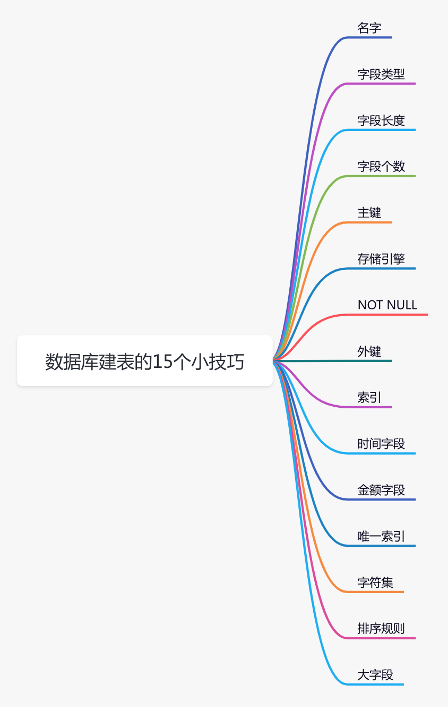

> 原文：https://mp.weixin.qq.com/s/NM-aHaW6TXrnO6la6Jfl5A
>
> 作者：苏三


这里只摘抄出重点，详情点击上面原文查看。





## 1.名字

### **1.6 索引名**

在数据库中，索引有很多种，包括：主键、普通索引、唯一索引、联合索引等。

每张表的主键只有一个，一般使用：`id`或者`sys_no`命名。

普通索引和联合索引，其实是一类。在建立该类索引时，可以加`ix_`前缀，比如：ix_product_status。

唯一索引，可以加`ux_`前缀，比如：ux_product_code。

## 2.字段类型

以下原则可以参考一下：

1. 尽可能选择占用存储空间小的字段类型，在满足正常业务需求的情况下，从小到大，往上选。
2. 如果字符串长度固定，或者差别不大，可以选择char类型。如果字符串长度差别较大，可以选择varchar类型。
3. 是否字段，可以选择bit类型。
4. 枚举字段，可以选择tinyint类型。（枚举的值不要使用数字0）
5. 主键字段，可以选择bigint类型。
6. 金额字段，可以选择decimal类型。
7. 时间字段，可以选择datetime类型。

## 3.字段长度

`**varchar`代表的是`字节`长度，还是`字符`长度呢？**

**答：在mysql中除了`varchar`和`char`是代表`字符`长度之外，其余的类型都是代表`字节`长度。**

biginit(n) 这个`n`表示什么意思呢？

假如我们定义的字段类型和长度是：bigint(4)，bigint实际长度是`8`个字节。

现在有个数据a=1，a显示4个字节，所以在不满4个字节时前面填充0（前提是该字段设置了zerofill属性），比如：0001。

当满了4个字节时，比如现在数据是a=123456，它会按照实际的长度显示，比如：123456。

但需要注意的是，有些mysql客户端即使满了4个字节，也可能只显示4个字节的内容，比如会显示成：1234。

**所以bigint(4)，这里的4表示显示的长度为4个字节，实际长度还是占8个字节。**


## 5. 主键

在创建表时，一定要创建`主键`。

因为主键自带了主键索引，相比于其他索引，主键索引的查询效率最高，因为它不需要回表。

此外，主键还是天然的`唯一索引`，可以根据它来判重。

在`单个`数据库中，主键可以通过`AUTO_INCREMENT`，设置成`自动增长`的。

注意：主键不要使用uuid！！！

## 6.存储引擎

建议我们在使用`mysql8`以后的版本时，直接使用默认的`innodb`存储引擎即可，无需额外修改存储引擎。

## 7. NOT NULL

**我们在定义字段时，应该尽可能明确该字段`NOT NULL`。**

为什么呢？

我们主要以innodb存储引擎为例，myslam存储引擎没啥好说的。

**主要有以下原因：**

1. **在innodb中，需要额外的空间存储null值，需要占用更多的空间。**
2. **null值可能会导致索引失效。**
3. **null值只能用`is null`或者`is not null`判断，用`=号`判断永远返回false。**

非常有必要给NOT NULL的字段设置默认值，特别是后面新增的字段。

例如：

```sql
alter table product_sku add column  brand_id int(10) not null default 0;
```

## 8.外键

互联网系统中，一般建议不使用外键。因为这类系统更多的是为了性能考虑，宁可牺牲一点数据一致性和完整性。

除了`外键`之外，`存储过程`和`触发器`也不太建议使用，他们都会影响性能。

## 9. 索引

在创建联合索引的时候，需要使用注意`最左匹配原则`，不然，建的联合索引效率可能不高。

对于数据重复率非常高的字段，比如：状态，不建议单独创建普通索引。因为即使加了索引，如果mysql发现`全表扫描`效率更高，可能会导致索引失效。

如果你对索引失效问题比较感兴趣，可以看看我的另一篇文章《[聊聊索引失效的10种场景，太坑了](https://mp.weixin.qq.com/s?__biz=MzkwNjMwMTgzMQ==&mid=2247491626&idx=1&sn=18fc949c06f04fe8f4c29b6fc5c66f9c&chksm=c0e838c2f79fb1d45c6f9b2ab188bb4663414690bab0718a7d46beb875e6b83e5e67ec27d2ff&token=660773166&lang=zh_CN&scene=21#wechat_redirect)》，里面有非常详细的介绍。

## 10.时间字段

`时间字段`的类型，我们可以选择的范围还是比较多的，目前mysql支持：date、datetime、timestamp、varchar等。

`varchar`类型可能是为了跟接口保持一致，接口中的时间类型是String。

但如果哪天我们要通过时间范围查询数据，效率会非常低，因为这种情况没法走索引。

`date`类型主要是为了保存`日期`，比如：2020-08-20，不适合保存`日期和时间`，比如：2020-08-20 12:12:20。

而`datetime`和`timestamp`类型更适合我们保存`日期和时间`。

但它们有略微区别。

- `timestamp`：用4个字节来保存数据，它的取值范围为`1970-01-01 00:00:01` UTC ~ `2038-01-19 03:14:07`。此外，它还跟时区有关。
- `datetime`：用8个字节来保存数据，它的取值范围为`1000-01-01 00:00:00` ~ `9999-12-31 23:59:59`。它跟时区无关。

优先推荐使用`datetime`类型保存日期和时间，可以保存的时间范围更大一些。

> 温馨提醒一下，在给时间字段设置默认值是，建议不要设置成：`0000-00-00 00:00:00`，不然查询表时可能会因为转换不了，而直接报错。

## 11.金额字段

`float`和`double`可能会丢失精度，因此推荐大家使用`decimal`类型保存金额。

一般我们是这样定义浮点数的：decimal(m,n)。

其中`n`是指`小数`的长度，而`m`是指`整数加小数`的总长度。

假如我们定义的金额类型是这样的：decimal(10,2)，则表示整数长度是8位，并且保留2位小数。

## 12.唯一索引

如果是联合的唯一索引，字段值出现null时，则唯一性约束可能会失效。

关于唯一索引失效的问题，感兴趣的小伙伴可以看看我的另一篇文章《[明明加了唯一索引，为什么还是产生重复数据？](https://mp.weixin.qq.com/s?__biz=MzkwNjMwMTgzMQ==&mid=2247497090&idx=1&sn=53b81535a9815853382c3a4bff8c844b&chksm=c0e82d6af79fa47ccfece23a8b0ad46ef6c647f1d2f961823eed181732c47e250ed0cbcfe6fd&token=1169141359&lang=zh_CN&scene=21#wechat_redirect)》。

> 创建唯一索引时，相关字段一定不能包含null值，否则唯一性会失效。

## 13.字符集

mysql中支持的`字符集`有很多，常用的有：latin1、utf-8、utf8mb4、GBK等。

这4种字符集情况如下：

`latin1`容易出现乱码问题，在实际项目中使用比较少。

而`GBK`支持中文，但不支持国际通用字符，在实际项目中使用也不多。

从目前来看，mysql的字符集使用最多的还是：`utf-8`和`utf8mb4`。

其中`utf-8`占用3个字节，比`utf8mb4`的4个字节，占用更小的存储空间。

但utf-8有个问题：即无法存储emoji表情，因为emoji表情一般需要4个字节。

由此，使用utf-8字符集，保存emoji表情时，数据库会直接报错。

所以，**建议在建表时字符集设置成：`utf8mb4`，会省去很多不必要的麻烦。**

## 14. 排序规则

不知道，你关注过没，在mysql中创建表时，有个`COLLATE`参数可以设置。

例如：

```sql
CREATE TABLE `order` (
  `id` bigint NOT NULL AUTO_INCREMENT,
  `code` varchar(20) COLLATE utf8mb4_bin NOT NULL,
  `name` varchar(30) COLLATE utf8mb4_bin NOT NULL,
  PRIMARY KEY (`id`),
  UNIQUE KEY `un_code` (`code`),
  KEY `un_code_name` (`code`,`name`) USING BTREE,
  KEY `idx_name` (`name`)
) ENGINE=InnoDB AUTO_INCREMENT=5 DEFAULT CHARSET=utf8mb4 COLLATE=utf8mb4_bin
```

它是用来设置`排序规则`的。

**字符排序规则跟字符集有关**，比如：字符集如果是`utf8mb4`，则字符排序规则也是以：`utf8mb4_`开头的，常用的有：`utf8mb4_general_ci`、`utf8mb4_bin`等。

**其中utf8mb4_general_ci排序规则，对字母的大小写不敏感。说得更直白一点，就是不区分大小写。**

**而utf8mb4_bin排序规则，对字符大小写敏感，也就是区分大小写。**

说实话，这一点还是非常重要的。

假如order表中现在有一条记录，name的值是大写的YOYO，但我们用小写的yoyo去查，例如：

```
select * from order where name='yoyo';
```

如果字符排序规则是utf8mb4_general_ci，则可以查出大写的YOYO的那条数据。

如果字符排序规则是utf8mb4_bin，则查不出来。

## 15.大字段

我们在创建表时，对一些特殊字段，要额外关注，比如：`大字段`，即占用较多存储空间的字段。

比如：用户的评论，这就属于一个大字段，但这个字段可长可短。

但一般会对评论的总长度做限制，比如：最多允许输入500个字符。

如果直接定义成`text`类型，可能会浪费存储空间，所以建议将这类字段定义成`varchar`类型的存储效率更高。

当然，我还见过更大的字段，即该字段直接保存合同数据。

一个合同可能会占`几Mb`。

在mysql中保存这种数据，从系统设计的角度来说，本身就不太合理。

像合同这种非常大的数据，可以保存到`mongodb`中，然后在mysql的业务表中，保存mongodb表的id。


