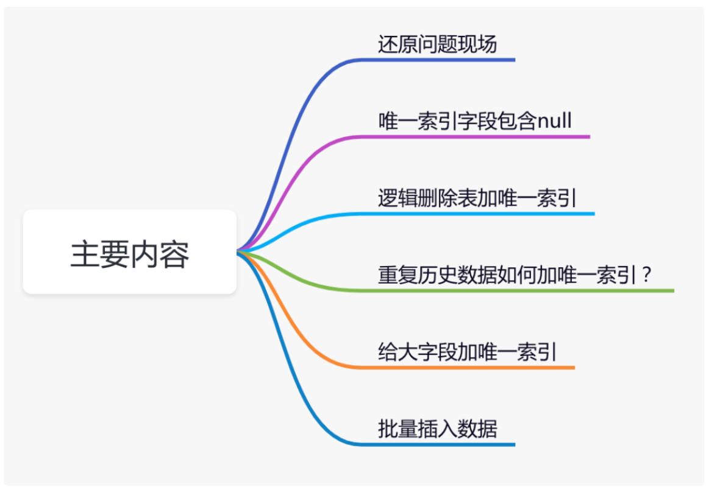
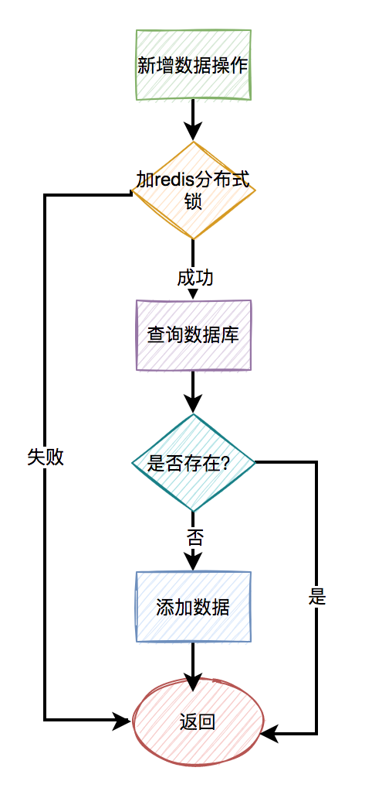

>  原文：https://mp.weixin.qq.com/s/aguE0APy24G23CD-5vOwiQ
>
> 作者：苏三

前段时间我踩过一个坑：在`mysql8`的一张`innodb`引擎的`表`中，加了`唯一索引`，但最后发现`数据`竟然还是`重复`了。

到底怎么回事呢？

本文通过一次踩坑经历，聊聊唯一索引，一些有意思的知识点。



## 1.还原问题现场

前段时间，为了防止商品组产生重复的数据，我专门加了一张`防重表`。

如果大家对防重表，比较感兴趣，可以看看我的另一篇文章 《[高并发下如何防重？](https://mp.weixin.qq.com/s?__biz=MzkwNjMwMTgzMQ==&mid=2247495570&idx=1&sn=eed3102c7dffc4ddbc59844dd9b865a5&chksm=c0e8377af79fbe6c29aefa3ae3aab48c6459b673005e2f97ae402172f6e5cdf8573aea5e7663&token=758132007&lang=zh_CN&scene=21#wechat_redirect)》，里面有详细的介绍。

问题就出在商品组的防重表上。

具体表结构如下：

```
CREATE TABLE `product_group_unique` (
  `id` bigint NOT NULL,
  `category_id` bigint NOT NULL,
  `unit_id` bigint NOT NULL,
  `model_hash` varchar(255) COLLATE utf8mb4_bin DEFAULT NULL,
  `in_date` datetime NOT NULL,
  PRIMARY KEY (`id`)
) ENGINE=InnoDB DEFAULT CHARSET=utf8mb4 COLLATE=utf8mb4_bin;
```

为了保证数据的`唯一性`，我给那种商品组防重表，建了唯一索引：

```
alter table product_group_unique add unique index 
ux_category_unit_model(category_id,unit_id,model_hash);
```

根据分类编号、单位编号和商品组属性的hash值，可以唯一确定一个商品组。

给商品组防重表创建了`唯一索引`之后，第二天查看数据，发现该表中竟然产生了重复的数据：表中第二条数据和第三条数据重复了。

这是为什么呢？

## 2.唯一索引字段包含null

如果你仔细查看表中的数据，会发现其中一个比较特殊地方：商品组属性的hash值（model_hash字段）可能为`null`，即商品组允许不配置任何属性。

在product_group_unique表中插入了一条model_hash字段等于100的重复数据：执行结果：从上图中看出，mysql的唯一性约束生效了，重复数据被拦截了。

接下来，我们再插入两条model_hash为null的数据，其中第三条数据跟第二条数据中category_id、unit_id和model_hash字段值都一样。从图中看出，竟然执行成功了。

换句话说，如果唯一索引的字段中，出现了null值，则唯一性约束不会生效。

最终插入的数据情况是这样的：

1. 当model_hash字段不为空时，不会产生重复的数据。
2. 当model_hash字段为空时，会生成重复的数据。

> 我们需要特别注意：创建唯一索引的字段，都不能允许为null，否则mysql的唯一性约束可能会失效。


## 3.逻辑删除表加唯一索引

我们都知道唯一索引非常简单好用，但有时候，在表中它并不好加。

不信，我们一起往下看。

通常情况下，要删除表的某条记录的话，如果用`delete`语句操作的话。

例如：

```
delete from product where id=123;
```

这种delete操作是`物理删除`，即该记录被删除之后，后续通过sql语句基本查不出来。（不过通过其他技术手段可以找回，那是后话了）

还有另外一种是`逻辑删除`，主要是通过`update`语句操作的。

例如：

```
update product set delete_status=1,edit_time=now(3) 
where id=123;
```

逻辑删除需要在表中额外增加一个删除状态字段，用于记录数据是否被删除。在所有的业务查询的地方，都需要过滤掉已经删除的数据。

通过这种方式删除数据之后，数据任然还在表中，只是从逻辑上过滤了删除状态的数据而已。

其实对于这种逻辑删除的表，是没法加唯一索引的。

为什么呢？

假设之前给商品表中的`name`和`model`加了唯一索引，如果用户把某条记录删除了，delete_status设置成1了。后来，该用户发现不对，又重新添加了一模一样的商品。

由于唯一索引的存在，该用户第二次添加商品会失败，即使该商品已经被删除了，也没法再添加了。

这个问题显然有点严重。

有人可能会说：把`name`、`model`和`delete_status`三个字段同时做成`唯一索引`不就行了？

答：这样做确实可以解决用户逻辑删除了某个商品，后来又重新添加相同的商品时，添加不了的问题。但如果第二次添加的商品，又被删除了。该用户第三次添加相同的商品，不也出现问题了？

由此可见，如果表中有逻辑删除功能，是不方便创建唯一索引的。

但如果真的想给包含逻辑删除的表，增加唯一索引，该怎么办呢？

### **3.1 删除状态+1**

通过前面知道，如果表中有逻辑删除功能，是不方便创建唯一索引的。

其根本原因是，记录被删除之后，delete_status会被设置成1，默认是0。相同的记录第二次删除的时候，delete_status被设置成1，但由于创建了唯一索引（把name、model和delete_status三个字段同时做成唯一索引），数据库中已存在delete_status为1的记录，所以这次会操作失败。

我们为啥不换一种思考：不要纠结于delete_status为1，表示删除，当delete_status为1、2、3等等，只要大于1都表示删除。

这样的话，每次删除都获取那条相同记录的最大删除状态，然后加1。

这样数据操作过程变成：

1. 添加记录a，delete_status=0。
2. 删除记录a，delete_status=1。
3. 添加记录a，delete_status=0。
4. 删除记录a，delete_status=2。
5. 添加记录a，delete_status=0。
6. 删除记录a，delete_status=3。

由于记录a，每次删除时，delete_status都不一样，所以可以保证唯一性。

该方案的优点是：不用调整字段，非常简单和直接。

缺点是：可能需要修改sql逻辑，特别是有些查询sql语句，有些使用delete_status=1判断删除状态的，需要改成delete_status>=1。

### **3.2 增加时间戳字段**

导致逻辑删除表，不好加唯一索引最根本的地方在逻辑删除那里。

我们为什么不加个字段，专门处理逻辑删除的功能呢？

答：可以增加`时间戳`字段。

把name、model、delete_status和timeStamp，四个字段同时做成唯一索引

在添加数据时，timeStamp字段写入默认值`1`。

然后一旦有逻辑删除操作，则自动往该字段写入时间戳。

这样即使是同一条记录，逻辑删除多次，每次生成的时间戳也不一样，也能保证数据的唯一性。

时间戳一般精确到`秒`。

除非在那种极限并发的场景下，对同一条记录，两次不同的逻辑删除操作，产生了相同的时间戳。

这时可以将时间戳精确到`毫秒`。

该方案的优点是：可以在不改变已有代码逻辑的基础上，通过增加新字段实现了数据的唯一性。

缺点是：在极限的情况下，可能还是会产生重复数据。

### **3.3 增加id字段**

其实，增加时间戳字段基本可以解决问题。但在在极限的情况下，可能还是会产生重复数据。

有没有办法解决这个问题呢？

答：增加`主键`字段：delete_id。

该方案的思路跟增加时间戳字段一致，即在添加数据时给delete_id设置默认值1，然后在逻辑删除时，给delete_id赋值成当前记录的主键id。

把name、model、delete_status和delete_id，四个字段同时做成唯一索引。

这可能是最优方案，无需修改已有删除逻辑，也能保证数据的唯一性。

## 4. 重复历史数据如何加唯一索引？

前面聊过如果表中有逻辑删除功能，不太好加唯一索引，但通过文中介绍的三种方案，可以顺利的加上唯一索引。

但来自灵魂的一问：如果某张表中，已存在`历史重复数据`，该如何加索引呢？

最简单的做法是，增加一张`防重表`，然后把数据初始化进去。

可以写一条类似这样的sql：

```
insert into product_unqiue(id,name,category_id,unit_id,model) 
select max(id), select name,category_id,unit_id,model from product
group by name,category_id,unit_id,model;
```

这样做可以是可以，但今天的主题是直接在原表中加唯一索引，不用防重表。

那么，这个唯一索引该怎么加呢？

其实可以借鉴上一节中，增加`id`字段的思路。

增加一个delete_id字段。

不过在给product表创建唯一索引之前，先要做数据处理。

获取相同记录的最大id：

```
select max(id), select name,category_id,unit_id,model from product
group by name,category_id,unit_id,model;
```

然后将delete_id字段设置成1。

然后将其他的相同记录的delete_id字段，设置成当前的主键。

这样就能区分历史的重复数据了。

当所有的delete_id字段都设置了值之后，就能给name、model、delete_status和delete_id，四个字段加唯一索引了。

完美。

## 5.给大字段加唯一索引

接下来，我们聊一个有趣的话题：如何给大字段增加唯一索引。

有时候，我们需要给几个字段同时加一个唯一索引，比如给name、model、delete_status和delete_id等。

但如果model字段很大，这样就会导致该唯一索引，可能会占用较多存储空间。

我们都知道唯一索引，也会走索引。

如果在索引的各个节点中存大数据，检索效率会非常低。

由此，有必要对唯一索引长度做限制。

目前mysql innodb存储引擎中索引允许的最大长度是3072 bytes，其中unqiue key最大长度是1000 bytes。

如果字段太大了，超过了1000 bytes，显然是没法加唯一索引的。

此时，有没有解决办法呢？

### **5.1 增加hash字段**

我们可以增加一个hash字段，取大字段的hash值，生成一个较短的新值。该值可以通过一些hash算法生成，固定长度16位或者32位等。

我们只需要给name、hash、delete_status和delete_id字段，增加唯一索引。

这样就能避免唯一索引太长的问题。

但它也会带来一个新问题：

一般hash算法会产生hash冲突，即两个不同的值，通过hash算法生成值相同。

当然如果还有其他字段可以区分，比如：name，并且业务上允许这种重复的数据，不写入数据库，该方案也是可行的。

### **5.2 不加唯一索引**

如果实在不好加唯一索引，就不加唯一索引，通过其他技术手段保证唯一性。

如果新增数据的入口比较少，比如只有job，或者数据导入，可以单线程顺序执行，这样就能保证表中的数据不重复。

如果新增数据的入口比较多，最终都发mq消息，在mq消费者中单线程处理。

### **5.3 redis分布式锁**

由于字段太大了，在mysql中不好加唯一索引，为什么不用`redis分布式锁`呢？

但如果直接加给name、model、delete_status和delete_id字段，加`redis分布式锁`，显然没啥意义，效率也不会高。

我们可以结合5.1章节，用name、model、delete_status和delete_id字段，生成一个hash值，然后给这个新值加锁。

即使遇到hash冲突也没关系，在并发的情况下，毕竟是小概率事件。



## 6.批量插入数据

有些小伙们，可能认为，既然有redis分布式锁了，就可以不用唯一索引了。

那是你没遇到，批量插入数据的场景。

假如通过查询操作之后，发现有一个集合：list的数据，需要批量插入数据库。

如果使用redis分布式锁，需要这样操作：

```
for(Product product: list) {
   try {
        String hash = hash(product);
        rLock.lock(hash);
        //查询数据
        //插入数据
    } catch (InterruptedException e) {
       log.error(e);
    } finally {
        rLock.unlock();
    }
}
```

需要在一个循环中，给每条数据都加锁。

这样性能肯定不会好。

当然有些小伙伴持反对意见，说使用redis的`pipeline`批量操作不就可以了？

也就是一次性给500条，或者1000条数据上锁，最后使用完一次性释放这些锁？

想想都有点不靠谱，这个锁得有多大呀。

极容易造成锁超时，比如业务代码都没有执行完，锁的过期时间就已经到了。

针对这种批量操作，如果此时使用mysql的唯一索引，直接批量insert即可，一条sql语句就能搞定。

数据库会自动判断，如果存在重复的数据，会报错。如果不存在重复数据，才允许插入数据。