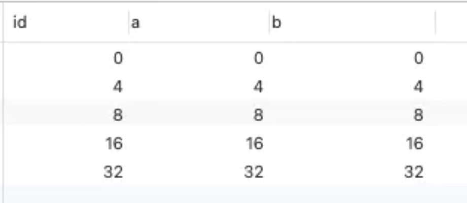
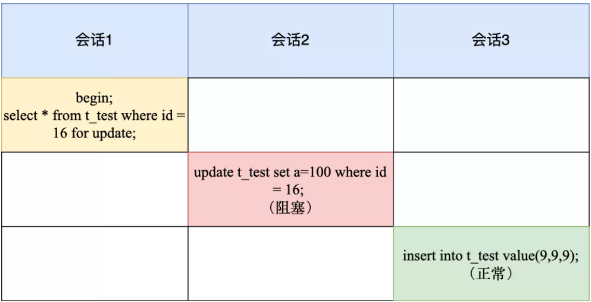
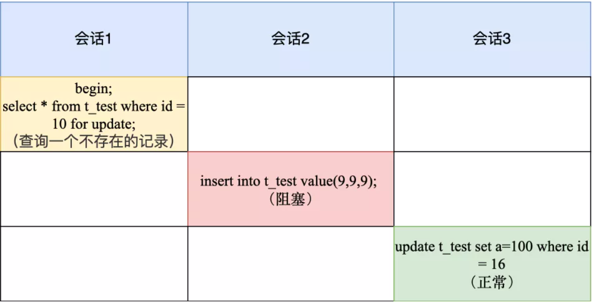
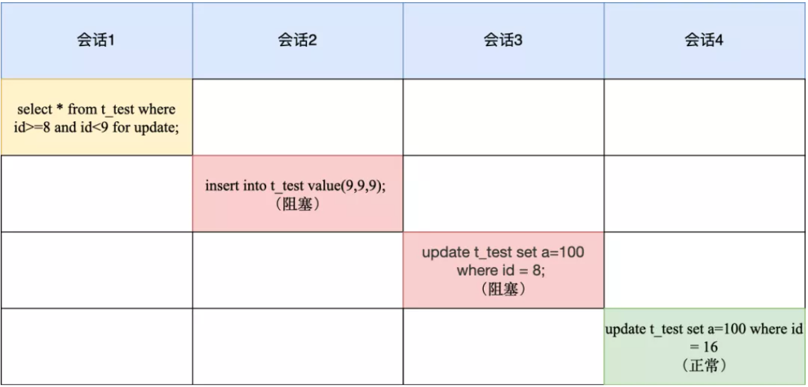
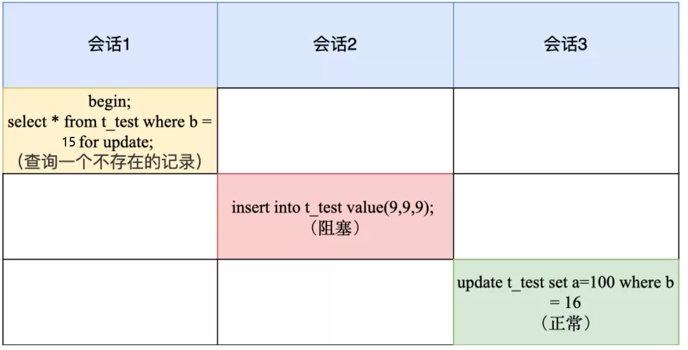

> 转载自：
>
> 原创                小林coding 
>
> 微信公众号    CodingLin
>
> 收录于话题    [#图解MySQL](https://mp.weixin.qq.com/mp/appmsgalbum?__biz=MzUxODAzNDg4NQ==&action=getalbum&album_id=1955634887135199237&scene=173&from_msgid=2247497197&from_itemidx=1&count=3&nolastread=1&uin=&key=&devicetype=Windows+10+x64&version=6303051e&lang=zh_CN&ascene=0&fontgear=2)


# 【转】MySQL 的全局锁、表锁和行锁

在前一篇文章我讲了下 MySQL 的全局锁、表记锁和行级别锁，其中行级锁只提了概念，并没有具体说。

因为行级锁加锁规则比较复杂，不同的场景，加锁的形式还不同，所以这次就来好好介绍下行级锁。

对记录加锁时，**加锁的基本单位是 next-key lock**，它是由记录锁和间隙锁组合而成的，**next-key lock 是前开后闭区间，而间隙锁是前开后开区间**。

但是，next-key lock 在一些场景下会退化成记录锁或间隙锁。

那到底是什么场景呢？今天，我们就以下面这个表来进行实验说明。

> 事务隔离级别
>
> 以下实验都是在MySQL默认的事务隔离级别：**可重复读** 下完成的。



其中，id 是主键索引（唯一索引），b 是普通索引（非唯一索引），a 是普通的列。

注意，**我的 MySQL 的版本是 8.0.26，不同版本的加锁规则可能是不同的**。


# 唯一索引等值查询

当我们用唯一索引进行等值查询的时候，查询的记录存不存在，加锁的规则也会不同：

- **当查询的记录是存在的，在用「唯一索引进行等值查询」时，next-key lock 会退化成「记录锁」**。
- **当查询的记录是不存在的，在用「唯一索引进行等值查询」时，next-key lock 会退化成「间隙锁」**。

接下里用两个案例来说明。

> 先看看记录是存在的。

来看下面这个例子：



会话1加锁变化过程如下：

1. 加锁的基本单位是 next-key lock，因此会话1的加锁范围是(8, 16];
2. 但是由于是用唯一索引进行等值查询，且查询的记录存在，所以 **next-key lock 退化成记录锁，因此最终加锁的范围是 id = 16 这一行**。

所以，会话 2 在修改 id=16 的记录时会被锁住，而会话 3 插入 id=9 的记录可以被正常执行。

> 接下来，看看记录不存在的情况

来看看，下面这个例子：



会话1加锁变化过程如下：

1. 加锁的基本单位是 next-key lock，因此主键索引 id 的加锁范围是(8, 16];
2. 但是由于查询记录不存在，next-key lock 退化成间隙锁，因此最终加锁的范围是 (8,16)。

所以，会话 2 要往这个间隙里面插入 id=9 的记录会被锁住，但是会话 3 修改 id =16 是可以正常执行的，因为 id = 16 这条记录并没有加锁。

# 唯一索引范围查询

范围查询和等值查询的加锁规则是不同的。

举个例子，下面这两条查询语句，查询的结果虽然是一样的，但是加锁的范围是不一样的。

```
select * from t_test where id=8 for update;
select * from t_test where id>=8 and id<9 for update;
```

做个实验就知道了。



会话 1 加锁变化过程如下：

1. 最开始要找的第一行是 id = 8，因此 next-key lock(4,8]，但是由于 id 是唯一索引，且该记录是存在的，因此会退化成记录锁，也就是只会对 id = 8 这一行加锁；
2. 由于是范围查找，就会继续往后找存在的记录，也就是会找到 id = 16 这一行停下来，然后加 next-key lock (8, 16]，但由于 id = 16 不满足 id < 9，所以会退化成间隙锁，加锁范围变为 (8, 16)。

所以，会话 1 这时候主键索引的锁是记录锁 id=8 和间隙锁(8, 16)。

会话 2 由于往间隙锁里插入了 id = 9 的记录，所以会被锁住了，而 id = 8 是被加锁的，因此会话 3 的语句也会被阻塞。

由于 id = 16 并没有加锁，所以会话 4 是可以正常被执行。

# 非唯一索引等值查询

当我们用非唯一索引进行等值查询的时候，查询的记录存不存在，加锁的规则也会不同：

- **当查询的记录存在时，除了会加 next-key lock 外，还额外加间隙锁，也就是会加两把锁**。
- **当查询的记录不存在时，只会加 next-key lock，然后会退化为间隙锁，也就是只会加一把锁。**

接下里用两个案例来说明。

> 我们先来看看查询的值存在的情况。

比如下面这个例子：


会话 1 加锁变化过程如下：

1. 先会对普通索引 b 加上 next-key lock，范围是(4,8];
2. 然后因为是非唯一索引，且查询的记录是存在的，所以还会加上间隙锁，规则是向下遍历到第一个不符合条件的值才能停止，因此间隙锁的范围是(8,16)。

所以，会话1的普通索引 b 上共有两个锁，分别是 next-key lock (4,8] 和间隙锁 (8,16) 。

那么，当会话 2 往间隙锁里插入 id = 9 的记录就会被锁住，而会话 3 和会话 4 是因为更改了 next-key lock 范围里的记录而被锁住的。

然后因为 b = 16 这条记录没有加锁，所以会话 5 是可以正常执行的。

> 接下来，我们看看查询的值不存在的情况

直接看案例：



会话 1 加锁变化过程如下：

1. 先会对普通索引 b 加上 next-key lock，范围是(8,16];
2. 但是由于查询的记录是不存在的，所以不会再额外加个间隙锁，但是 next-key lock 会退化为间隙锁，最终加锁范围是 (8,16)。

会话 2 因为往间隙锁里插入了 b = 9 的记录，所以会被锁住，而 b = 16 是没有被加锁的，因此会话 3 的语句可以正常执行。


# 非唯一索引范围查询

非唯一索引和主键索引的范围查询的加锁也有所不同，不同之处在于**普通索引范围查询，next-key lock 不会退化为间隙锁和记录锁**。

来看下面这个案例：


会话 1 加锁变化过程如下：

1. 最开始要找的第一行是 b = 8，因此 next-key lock(4,8]，但是由于 b 不是唯一索引，并不会退化成记录锁。
2. 但是由于是范围查找，就会继续往后找存在的记录，也就是会找到 b = 16 这一行停下来，然后加 next-key lock (8, 16]，因为是普通索引查询，所以并不会退化成间隙锁。

所以，会话 1 的普通索引 b 有两个 next-key lock，分别是 (4,8] 和(8, 16]。这样，你就明白为什么会话 2 、会话 3 、会话 4 的语句都会被锁住了。

# 总结

这次我以 **MySQL 8.0.26** 版本做了几个实验，让大家了解了唯一索引和非唯一索引的行级锁的加锁规则。

这里需要注意的是，不同的版本加锁规则可能会有所不同。我这里总结下， 我这个 MySQL 版本的行级锁的加锁规则。

唯一索引等值查询：

- 当查询的记录是存在的，next-key lock 会退化成「记录锁」。
- 当查询的记录是不存在的，next-key lock 会退化成「间隙锁」。

非唯一索引等值查询：

- 当查询的记录存在时，除了会加 next-key lock 外，还额外加间隙锁，也就是会加两把锁。
- 当查询的记录不存在时，只会加 next-key lock，然后会退化为间隙锁，也就是只会加一把锁。

非唯一索引和主键索引的范围查询的加锁规则不同之处在于：

- 唯一索引在满足一些条件的时候，next-key lock 退化为间隙锁和记录锁。
- 非唯一索引范围查询，next-key lock 不会退化为间隙锁和记录锁。

这些加锁规则其实很好总结的，大家自己可以用我文中的案例测试一遍，看一下你的 MySQL 版本和我的 MySQL 版本的加锁规则有什么不同。

就说到这啦， 我们下次见啦！


# 评论补充

## 一、非唯一索引加锁的时候，唯一索引什么情况会加锁，什么情况不加锁？

1、如果用select ... in share mode 的语句，能走覆盖索引，那么主键索引就不会被加锁的，因为不会回表访问主键索引上的数据。

2、如果用select ... for update，不管能否走覆盖索引，都会在主键索引上，对满足查询条件的数据进行加锁。此时的主键索引加锁的规则同：[唯一索引等值查询](#唯一索引等值查询)  [唯一索引范围查询](#唯一索引范围查询)


## 二、在InnoDB中，锁是加载索引上的。

对于本例中的 a字段，因为没有索引，所以不会加next-key lock，也不会加行级锁，会直接加表级锁。


## 三、MySQL默认事务隔离级别如何解决幻读

InnoDB 引擎的默认隔离级别虽然是「可重复读」，但是它通过next-key lock 锁（行锁和间隙锁的组合）来锁住记录之间的“间隙”和记录本身，防止其他事务在这个记录之间插入新的记录，这样就避免了幻读现象。

