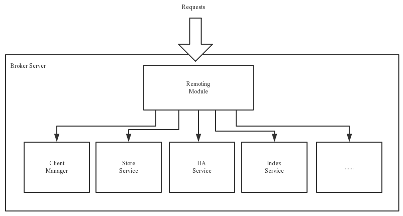

# 中文文档

国内镜像：https://www.itmuch.com/books/rocketmq/

github官方：https://github.com/apache/rocketmq/tree/rocketmq-all-4.5.1/docs/cn

---

# 视频

[【尚硅谷】2021新版RocketMQ教程丨深度掌握MQ消息中间件](https://www.bilibili.com/video/BV1cf4y157sz)

对应文档：[分布式消息队列RocketMQ.pdf](./尚硅谷RocketMQ/分布式消息队列RocketMQ.pdf)

对应源码：[代码.zip](./尚硅谷RocketMQ/代码.zip)

---

# 源码阅读

## NameServer

[NameServer启动.md](./源码阅读/NameServer/NameServer启动.md)
[RouteInfoManager路由表管理器.md](./源码阅读/NameServer/RouteInfoManager路由表管理器.md)
[请求处理器DefaultRequestProcessor.md](./源码阅读/NameServer/请求处理器DefaultRequestProcessor.md)

## 启动流程

[Broker启动流程.md](./源码阅读/启动流程/Broker启动流程.md)

NameServer启动流程.md

Producer启动流程.md

Consumer启动流程.md

## Broker各组件

在broker中，接收到一个请求之后，需要经过以下这些组件协同工作，才能确定mq消息发送成功。

### 网络组件Remoting

[网络组件Remoting.md](./源码阅读/网络组件Remoting/网络组件Remoting.md)

[NettyRequestProcessor.md](./源码阅读/网络组件Remoting/NettyRequestProcessor.md)

### 客户端管理器ClientManager

[客户端管理器.md](./源码阅读/客户端管理器/客户端管理器.md)

### 存储组件StoreService

### 高可用HAService

### 索引服务IndexService

