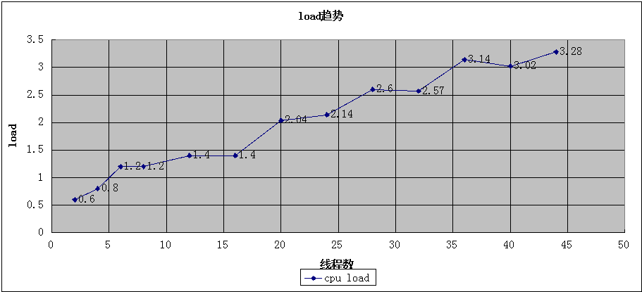

原创文章，转载请注明出处：http://jameswxx.iteye.com/blog/2093785

 

# 一  机器部署

## 1.1 机器组成

1台nameserver

1台broker 异步刷盘

2台producer

2台consumer

 

## 1.2 硬件配置

CPU 两颗x86_64cpu,每颗cpu12核，共24核

内存 48G

网卡 千兆网卡

磁盘 除broker机器的磁盘是RAID10，共1.1T，其他都是普通磁盘约500G

 

## 1.3 部署结构

橙色箭头为数据流向，黑色连接线为网络连接

 

 

## 1.4 内核参数

broker是一个存储型的系统，针对磁盘读写有自己的刷盘策略，大量使用文件内存映射，文件句柄和内存消耗量都比较巨大。因此，系统的默认设置并不能使RocketMQ发挥很好的性能，需要对系统的pagecache，内存分配，I/O调度，文件句柄限制做一些针对性的参数设置。

 

**系统I/O和虚拟内存设置**

echo 'vm.overcommit_memory=1' >> /etc/sysctl.conf

echo 'vm.min_free_kbytes=5000000' >> /etc/sysctl.conf

echo 'vm.drop_caches=1' >> /etc/sysctl.conf

echo 'vm.zone_reclaim_mode=0' >> /etc/sysctl.conf

echo 'vm.max_map_count=655360' >> /etc/sysctl.conf

echo 'vm.dirty_background_ratio=50' >> /etc/sysctl.conf

echo 'vm.dirty_ratio=50' >> /etc/sysctl.conf

echo 'vm.page-cluster=3' >> /etc/sysctl.conf

echo 'vm.dirty_writeback_centisecs=360000' >> /etc/sysctl.conf

echo 'vm.swappiness=10' >> /etc/sysctl.conf

 

**系统文件句柄设置**

echo 'ulimit -n 1000000' >> /etc/profile

echo 'admin hard nofile 1000000' >> /etc/security/limits.conf

 

**系统I/O调度算法**

deadline

 

## 1.5 JVM参数

**采用RocketMQ默认设置**

 -server -Xms4g -Xmx4g -Xmn2g -XX:PermSize=128m -XX:MaxPermSize=320m -XX:+UseConcMarkSweepGC -XX:+UseCMSCompactAtFullCollection -XX:CMSInitiatingOccupancyFraction=70 -XX:+CMSParallelRemarkEnabled -XX:SoftRefLRUPolicyMSPerMB=0 -XX:+CMSClassUnloadingEnabled -XX:SurvivorRatio=8 -XX:+DisableExplicitGC -verbose:gc -Xloggc:/root/rocketmq_gc.log -XX:+PrintGCDetails -XX:-OmitStackTraceInFastThrow 

 

# 二  性能评测

## 2.1 评测目的

压测单机TPS，评估单机容量

 

## 2.2 评测指标

最高的TPS不代表最适合的TPS，必须在TPS和系统资源各项指标之间取得一个权衡，系统资源快达到极限，但尚能正常运转，此时的TPS是比较合适的。比如ioutil最好不要超过75%,cpu load最好不超过总的核数或者太多，没有发生频繁的swap导致较大的内存颠簸。所以不能只关注TPS，同时要关注以下指标：

消息：TPS

cpu：load,sy,us

内存：useed,free,swap,cache,buffer

I/O：iops,ioutil,吞吐量(数据物理读写大小/秒)

网络：网卡流量

 

## 2.3 评测方式

两台producer起等量线程，不间断的向broker发送大小为2K的消息，2K消息意味着1000个字符，这个消息算比较大了，完全可以满足业务需要。

 

## 2.4 评测结果

TPS比较高

  经过长时间测试和观察，单个borker TPS高达16000，也就是说服务器能每秒处理16000条消息，且消费端及时消费，从服务器存储消息到消费端消费完该消息平均时延约为1.3秒，且该时延不会随着TPS变大而变大，是个比较稳定的值。

 

Broker稳定性较高

  两台producer一共启动44个线程10个小时不停发消息，broker非常稳定，这可简单意味着实际生产环境中可以有几十个producer向单台broker高频次发送消息，但是broker还会保持稳定。在这样比较大的压力下，broker的load最高才到3（24核的cpu），有大量的内存可用。

  而且，连续10几小时测试中，broker的jvm非常平稳，没有发生一次fullgc，新生代GC回收效率非常高，内存没有任何压力，以下是摘自gclog的数据：

2014-07-17T22:43:07.407+0800: 79696.377: [GC2014-07-17T22:43:07.407+0800: 79696.377: [ParNew: 1696113K->18686K(1887488K), 0.1508800 secs] 2120430K->443004K(3984640K), 0.1513730 secs] [Times: user=1.36 sys=0.00, real=0.16 secs] 

新生代大小为2g，回收前内存占用约为1.7g，回收后内存占用17M左右，回收效率非常高。

 

 关于磁盘IO和内存

  平均单个物理IO耗时约为0.06毫秒，IO几乎没有额外等待，因为await和svctm基本相等。整个测试过程，没有发生磁盘物理读，因为文件映射的关系，大量的cached内存将文件内容都缓存了，内存还有非常大的可用空间。

 

系统的性能瓶颈

  TPS到达16000后，再就上不去了，此时千兆网卡的每秒流量约为100M，基本达到极限了，所以网卡是性能瓶颈。不过，系统的IOUTIL最高已经到达40%左右了，这个数字已经不低了，所以即使网络流量增加，但是系统IO指标可能已经不健康了，总体来看，单机16000的TPS是比较安全的值。

 

 

 

以下是各项指标的趋势

TPS

*TPS最高可以压倒16000左右，再往上压，TPS有下降趋势*

 

CPU

*随着线程数增加，最后稳定在3左右，对于总共24核的两颗CPU，这点load根本不算什么*

 

**内存**
*内存非常平稳，总量48G，实际可用内存非常高*
*没有发生swap交换，不会因为频繁访问磁盘导致系统性能颠簸*
*大量内存被用来作为文件缓存，见cached指标，极大的避免了磁盘物理读*

 

**磁盘吞吐量**

*随着线程数增加，磁盘物理IO每秒数据读写大约为70M左右*

 

**磁盘****IOPS**
*随着线程数增加，磁盘IOPS大约稳定在5000左右*
*注意非常重要的细节，即使在高达16000TPS时，磁盘仍然没有发生物理读，这和内存的cached指标是遥相呼应的，文件几乎全部在内存里，没有发生一次物理读，所以文件读的效率非常高，消息消费非常快*

 

**IO百分比**

*随着线程数增加，IO百分比最后稳定在40%左右，这个数字可以接受*

 

**网络**

*系统使用的千兆网卡，理论传输最大值为128M/秒，实际能达到100M就不错了。从图中可以看到，不断往上压请求，但是网卡流量已经上不去了*

 

 