# Broker定时任务线程池

本文主要学习一下broker中都有哪些定时任务。

既然是broker，那么直接找到 org.apache.rocketmq.broker.BrokerStartup 中的`BrokerController` 

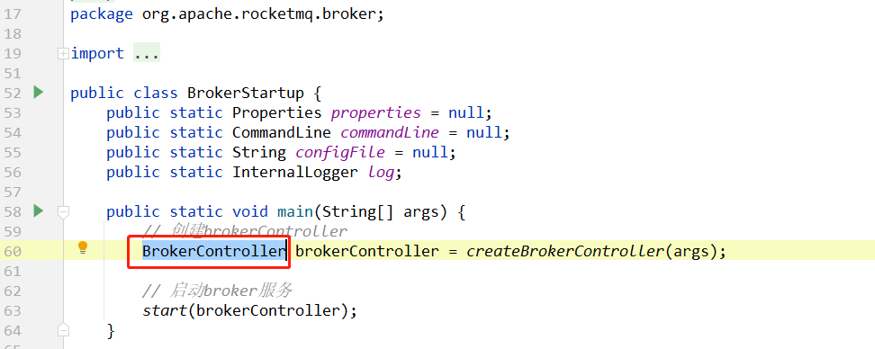

因为`broker的定时任务线程池`肯定是这个类的属性。

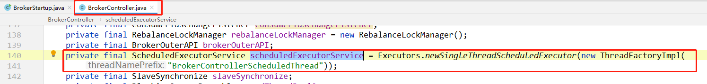

# broker都注册了哪些定时任务

> 那么broker都注册了哪些定时任务呢？
>
> 只需要找一下 `scheduledExecutorService` 都在哪里使用的就行了：总共注册了10个定时任务。
>
> 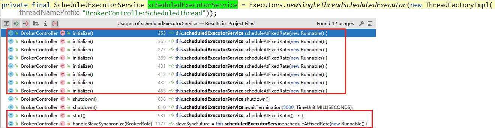

## 启动broker时，向所有NameServer注册自己

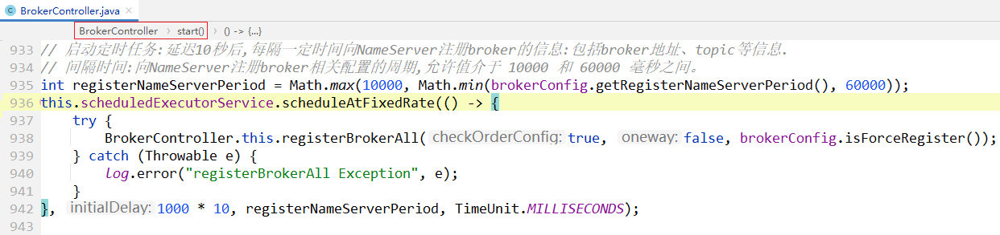

具体逻辑 详见：[RouteInfoManager路由表管理器.md](../NameServer\RouteInfoManager路由表管理器.md)  

## 如果broker是slave，则每隔10秒从master同步数据

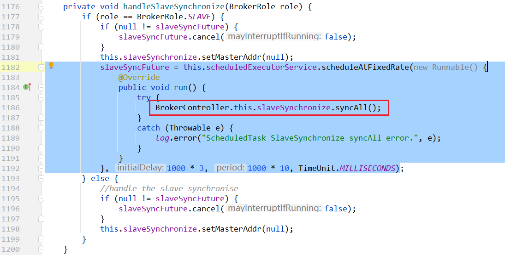

# 持久化任务

## 默认每隔5秒,把消费偏移量信息持久化到磁盘中.

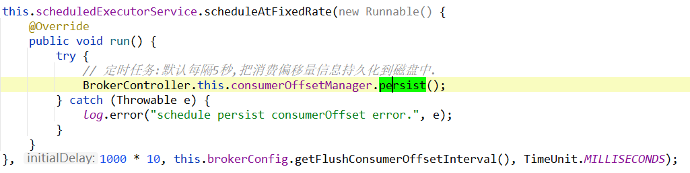

持久化任务。

## 每隔10秒,把消费者过滤器数据持久化到磁盘

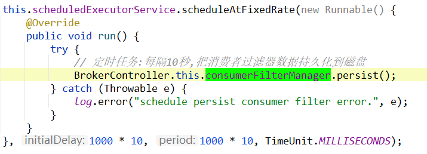

# 默认关闭的定时任务

## [默认关闭] 每隔3分钟,判断是否要保护broker

根据一个开关,去禁用broker的消费.不过默认是关闭的.

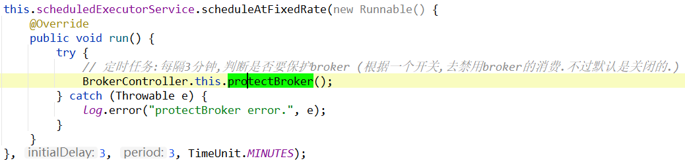

## [默认关闭] 每隔2分钟去获取一下NameServer地址

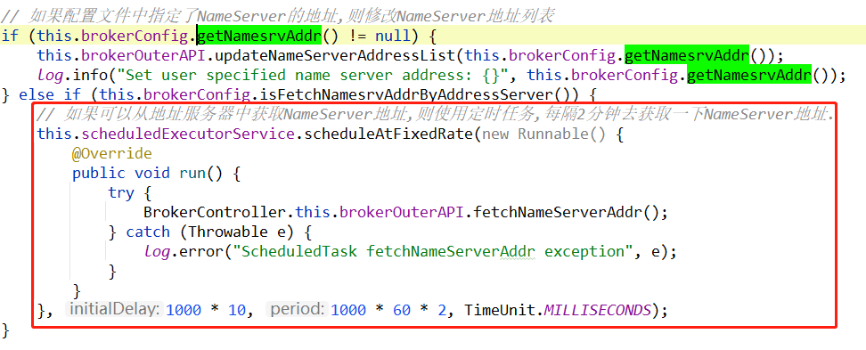

一般来说，在启动broker的时候，都会配置NameServer的地址。

而且 `fetchNamesrvAddrByAddressServer` 默认是`false`，

所以这个定时任务，除非自己开启，默认情况是不会执行的。

# 打印日志的定时任务

## 每天记录broker状态,并打印到日志中

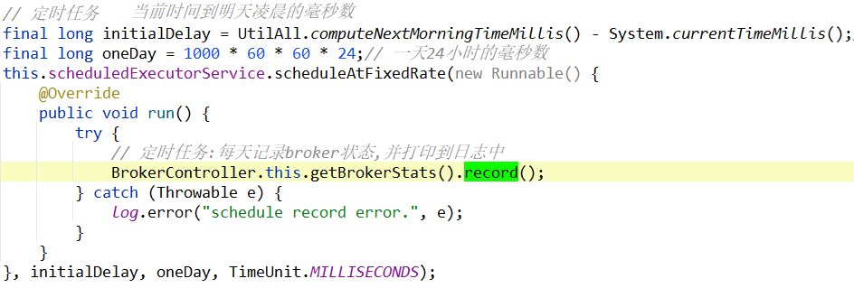

## 每隔1秒,打印水印

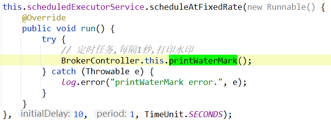

## 每隔60秒,打印正在调度的字节数量

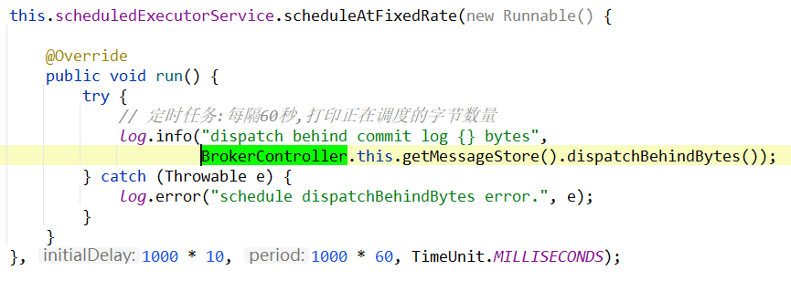

## 如果是master,每隔60秒打印master和slave之间的不同

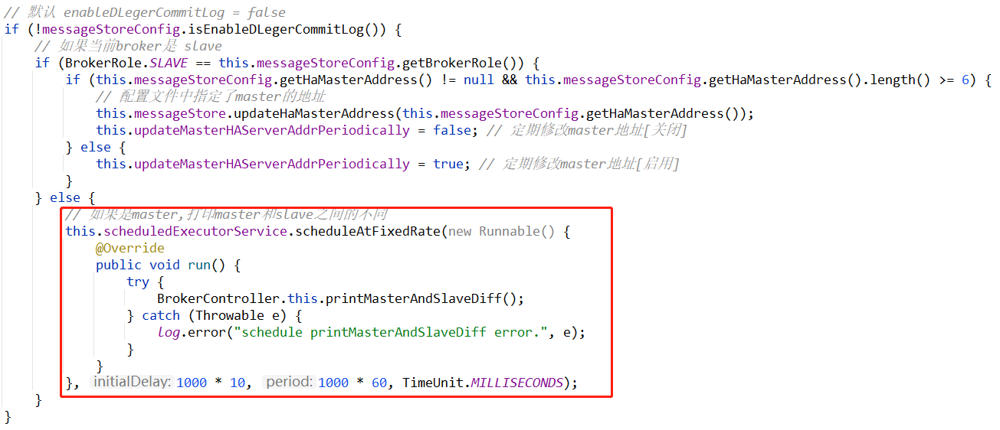

