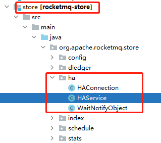

# broker高可用


# 说明

broker分为maste和slave：

- master的brokerId=0，slave的brokerId != 0
- master接收producer生产的消息，并把消息保存到commitLog文件中。
- master接收consumer发送的commitOffset，并使用 `ConsumerOffsetManager` 进行持久化。
- slave不接受任何 `写` 操作，只接收consumer拉取消息去消费。slave的数据都是从master同步过来的。
- 使用 org.apache.rocketmq.broker.slave.SlaveSynchronize 进行和master的数据同步。


# 高可用HA监听端口号

org.apache.rocketmq.store.config.MessageStoreConfig#haListenPort

```java
package org.apache.rocketmq.store.config;

public class MessageStoreConfig {
    private int haListenPort = 10912;
}
```


# 高可用HA服务

从源码上看，高可用ha是在`store`包中的：




# 复制HA

## 1、slave的commitLog数据,是从哪里同步的?

- [producer生产mq消息给broker时，master会以同步阻塞方式把mq消息复制到slave](https://docs.qq.com/flowchart/DQVNZQUNacU9rd0V2)


## 2、如果master是异步复制slave，是如何处理的呢？

- todo：