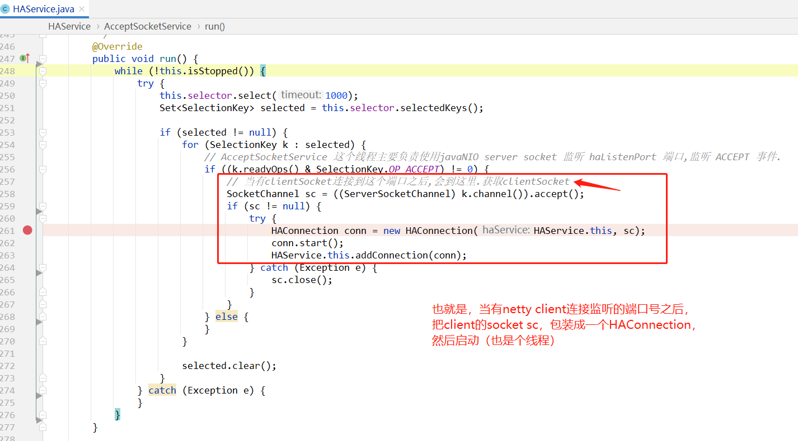

# broker高可用

broker高可用（HA），其实就是每个broker节点都有复制——slave节点。

主从复制有两种：

- 早期RocketMQ使用 `HAService` 实现。

- 后来单独写了 `DLedger` 来做主从选举、主从同步。

本文只讨论第一种第一种情况，使用 `HAService` 来实现主从数据同步的。


# 流程图

[RocketMQ 主从同步 https://bpmhvbyegn.feishu.cn/docs/doccnB0W7Epc4vehMpSAHaOa8Mb](https://bpmhvbyegn.feishu.cn/docs/doccnB0W7Epc4vehMpSAHaOa8Mb)


# 说明

broker分为maste和slave：

- master的brokerId=0，slave的brokerId != 0
- master接收producer生产的消息，并把消息保存到commitLog文件中。
- master接收consumer发送的commitOffset，并使用 `ConsumerOffsetManager` 进行持久化。
- slave不接受任何 `写` 操作，只接收consumer拉取消息去消费。slave的数据都是从master同步过来的。
- 主从元数据同步：使用 org.apache.rocketmq.broker.slave.SlaveSynchronize 进行和master的数据同步。

如果broker是master，则使用 `org.apache.rocketmq.store.ha.HAService` 负责。

如果broker是slave ，则使用  `org.apache.rocketmq.store.ha.HAService.HAClient`  负责。


# HA服务端

org.apache.rocketmq.store.ha.HAService

### 构造方法


```java
package org.apache.rocketmq.store.ha;

public class HAService {

    private final DefaultMessageStore defaultMessageStore;
    /**
     * 使用javaNIO server socket 监听 HaListenPort,
     * 监听clientSocket的ACCEPT事件.
     * 当有新的clientSocket连接的时候,就把clientSocket封装成 {@link HAConnection},然后添加到 {@link #connectionList}中.
     */
    private final AcceptSocketService acceptSocketService;
    private final GroupTransferService groupTransferService;
    private final HAClient haClient;
    
    public HAService(final DefaultMessageStore defaultMessageStore) throws IOException {
        this.defaultMessageStore = defaultMessageStore;
        // ha监听端口号
        this.acceptSocketService = new AcceptSocketService(defaultMessageStore.getMessageStoreConfig().getHaListenPort());
        this.groupTransferService = new GroupTransferService();
        this.haClient = new HAClient();
    }
}
```

当RocketMQ的存储模块实例化的时候，如果RocketMQ没有启动`DLedger模式`，就去实例化 `HAService`。

### 启动start()

一般来说，当RocketMQ初始化的时候，都会调用start()方法：


HAService启动：启动各种线程。


---

#### acceptSocketService.beginAccept()


因为主从之间数据同步是使用的netty。所以这里创建netty的server端：

- 开启server网络socket
- 监听端口号
- 配置非阻塞
- 监听netty客户端的网络连接。

---


#### acceptSocketService.start()

启动线程Thread

acceptSocketService 的类结构是：

```
class AcceptSocketService extends ServiceThread implements Runnable {
        @Override
        public void run() {
            // 线程方法。
        }
}
```

所以这里主要就是使用Thread新创建一个线程：

```java
this.thread = new Thread(this, getServiceName());
this.thread.setDaemon(isDaemon);
this.thread.start();
```

那么所有的线程逻辑都在run()方法中。




HAConnection 在后面具体讲解： [HAConnection](#HAConnection)

---


#### groupTransferService.start()

```java
class GroupTransferService extends ServiceThread {

}
```

也是个内部类。这个也在后面讲。[GroupTransferService](#GroupTransferService)

---


#### haClient.start()

org.apache.rocketmq.store.ha.HAService.HAClient

HAClient线程主要负责：

1、slave先连接master.如果连接master成功,则继续.

2、当前时间是否应该给master上报offset

- 是：2.1、给master上报最大偏移量。如果上报offset不成功,就 closeMaster()

3、等待 OP_READ 事件  (也就是:等待master给slave发送信息.在slave端收到信息,就是信息'可读'事件)

4、处理读事件 —— 处理从master读到的数据.

- 【处理从master读取到的commitLog文件数据.】
- 最新读取到的数据长度,大于,消息头+body的长度,表示至少有一条完整的消息  *(如果不成立,说明消息不完整,则继续使用从socketChannel读取数据,直到一条数据完整读取.)*
- 追加commitLog数据.  这里只处理一条数据.也就是 长度= bodySize.   bodySize之后的数据会在continue等待下一次遍历时处理.

5、如果commitLog偏移量有新增(也就是slave收到新的commitLog数据时),才上报最新的偏移量.

6、最后，判断是否超时.如果超时则断开master的连接. closeMaster();


# HA客户端

org.apache.rocketmq.store.ha.HAService.HAClient

> 画外音：
>
> 这里需要说明的是，并不是HAService就是master使用的，HAClient是slave使用。
>
> 而是应该基于netty的层面去看：
>
> netty的server端，使用HAService
>
> netty的client端，使用HAClient


# HAConnection 

broker主从数据同步时，每两个broker之间的网络连接包装。


# GroupTransferService


# 疑问

## 1、slave的commitLog数据,是从哪里同步的?

- [producer生产mq消息给broker时，master会以同步阻塞方式把mq消息复制到slave](https://docs.qq.com/flowchart/DQVNZQUNacU9rd0V2)


## 2、如果master是异步复制slave，是如何处理的呢？

- todo：

## 3、ha高可用端口号是？

org.apache.rocketmq.store.config.MessageStoreConfig#haListenPort

```java
package org.apache.rocketmq.store.config;

public class MessageStoreConfig {
    private int haListenPort = 10912;
}
```

**broker无论是主还是从，都会使用java nio监听此端口号！！**

在store模块中，只要没有启用DLedger模式，就会使用 org.apache.rocketmq.store.ha.HAService 来进行commitLog文件的主从同步。


### server端：

当broker真正`start` 时，会使用nio监听此端口号：（无论是主从，都会监听此端口号，作为网络I/O中的server端。）


### client端：

org.apache.rocketmq.store.ha.HAService.HAClient#HAClient

这个client是各线程。

从run方法中，client会先去连接master，如果连接成功master，则会：

- 给master上报offset
- 从master读取commitLog数据，如果读取成功，则slave使用store模块，把commitlog数据保存到磁盘中 。
- 判断是否超时。

> 画外音：
>
> 这个master的地址是从哪来的？

```java
@Override
public void run() {
    while (!this.isStopped()) {
        try {
            // 1、slave先连接master.如果连接master成功,则继续.
            if (this.connectMaster()) {
                // 2、当前时间是否应该给master上报offset
                if (this.isTimeToReportOffset()) {
                    // 2.1、给master上报最大偏移量
                    boolean result = this.reportSlaveMaxOffset(this.currentReportedOffset);
                    if (!result) {
                        // 上报offset不成功,就关闭master之间的socketChannel网络连接
                        this.closeMaster();
                    }
                }
                // 3、等待 OP_READ 事件  (也就是:等待master给slave发送信息.在slave端收到信息,就是信息'可读'事件)
                //     master给slave发送的消息是:
                this.selector.select(1000);
                // 4、处理读事件 —— 处理从master读到的数据.
                boolean ok = this.processReadEvent();
                if (!ok) {
                    this.closeMaster();
                }
                // 5、如果commitLog偏移量有新增(也就是slave收到新的commitLog数据时),才上报最新的偏移量.
                if (!reportSlaveMaxOffsetPlus()) {
                    continue;
                }
                // 6、判断是否超时.如果超时则断开master的连接.
                long interval = HAService.this.getDefaultMessageStore().getSystemClock().now() - this.lastWriteTimestamp;
                if (interval > HAService.this.getDefaultMessageStore().getMessageStoreConfig().getHaHousekeepingInterval()) {
                    this.closeMaster();
                }
            } else {
                // 这里,slave没有成功连接master,则让此线程等5秒.
                this.waitForRunning(1000 * 5);
            }
        } catch (Exception e) {
            this.waitForRunning(1000 * 5);
        }
    }
}
```


### HAClient中master地址：

org.apache.rocketmq.store.ha.HAService.HAClient#masterAddress

```java
class HAClient extends ServiceThread {
    private final AtomicReference<String> masterAddress = new AtomicReference<>();
```

这个HAMaster地址,只有slave broker才会有（才能获取到）,
如果broker是master角色,则获取为空.
因为:broker向NameServer注册时:NameServer会做如下处理:

org.apache.rocketmq.namesrv.routeinfo.RouteInfoManager#registerBroker


### Ha模式，如何确定broker是master还是slave

是开发者在配置文件中配置的。

RocketMQ主从同步一个重要的特征：主从同步不具备主从切换功能，即当master节点宕机后，slave不会接管消息发送，但可以提供消息读取。

https://www.jianshu.com/p/60e1639161f5


如果需要使用主从自主切换，需要启用RocketMQ的DLedger模式：
   https://zhuanlan.zhihu.com/p/77166786
   https://blog.csdn.net/nihui123/article/details/127107500


