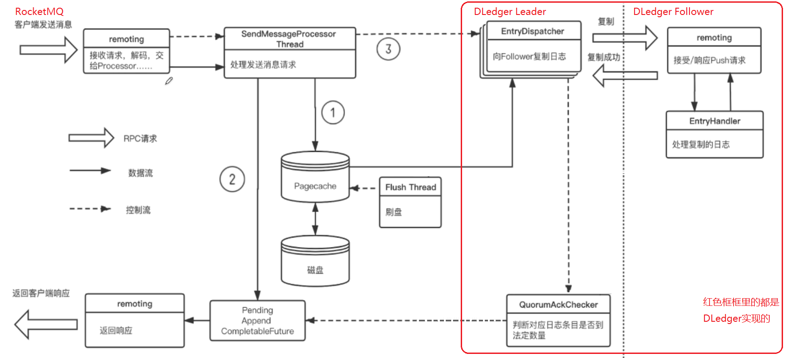

> 本文参考：
>
> https://www.bilibili.com/video/BV1Hc411h7pc

# RocketMQ多副本架构的演进


2主2从同步/异步复制方式提供broker高可用。

## 缺点

当master宕机，slave无法自动变为master；需要人工参与：手动重启master 或者 把slave修改配置文件，改成master。

## 解决思路


- 使用ZooKeeper实现主从选举（缺点：需要进入其他中间件；）
- 使用Raft协议实现主从选举

## 使用DLedger模式部署方式


- DLedger模式下，使用`DLedgerCommitLog`代替原来的`CommitLog`
- 使broker拥有选主、复制的能力。
- 使用角色透传的方式，把raft的角色，传递给broker。
  - raft协议中的Leader对应broker的master
  - follower对应broker的slave
- 好处：broker基于DLedger拥有自动选主的能力，自动变换master-slave之间的角色。

# DLedger模式集群模式部署

## 参考配置：[*链接*](https://gitee.com/anxiaole/rocketmq/blob/master/distribution/conf/dledger/broker-n0.conf)

```properties
# broker集群名称
brokerClusterName = RaftCluster
# broker名称
brokerName=RaftNode00
# 监听端口号
listenPort=30911
# NameServer地址
namesrvAddr=127.0.0.1:9876
# 持久化配置文件存储路径
storePathRootDir=/tmp/rmqstore/node00
# commitLog文件存储路径
storePathCommitLog=/tmp/rmqstore/node00/commitlog


# ================== 以下是DLedger配置项 ===================
# 是否开启DLedger模式.默认为false.如果要使用DLedger模式,就改成true
enableDLegerCommitLog=true
# DLedger组名(建议和brokerName保持一致)
dLegerGroup=RaftNode00
# 包含DLedger组中的所有节点地址.(同一组中,配置是一致的)
dLegerPeers=n0-127.0.0.1:40911;n1-127.0.0.1:40912;n2-127.0.0.1:40913
## DLedger节点id.(must be unique,必须唯一) 
dLegerSelfId=n0
# 发送消息线程池数量
sendMessageThreadPoolNums=16
```


## 部署文档：

[Dledger快速搭建](https://gitee.com/anxiaole/rocketmq/blob/master/docs/cn/dledger/quick_start.md)

[Dledger集群搭建](https://gitee.com/anxiaole/rocketmq/blob/master/docs/cn/dledger/deploy_guide.md)

注意：

- 升级过程需要停机

- 升级时，需要把master和slave上的持久化数据、commitLog 等数据，进行对其之后，再启动集群。

  > RocketMQ-on-DLedger 组中的每个节点，可以兼容旧的 Commitlog ，但其 Raft 复制过程，只能针对新增加的消息。因此，为了避免出现异常，需要保证 旧的 Commitlog 是一致的。  
  > 如果旧的集群是采用 Master-Slave 方式部署，有可能在shutdown时，其数据并不是一致的，建议通过md5sum 的方式，检查最近的最少 2 个 Commmitlog 文件，如果发现不一致，则通过拷贝的方式进行对齐。  
  >
  > 虽然 RocketMQ-on-DLedger Group 也可以以 2 节点方式部署，但其会丧失容灾切换能力（2n + 1 原则，至少需要3个节点才能容忍其中 1 个宕机）。  
  > 所以在对齐了 Master 和 Slave 的 Commitlog 之后，还需要准备第 3 台机器，并把旧的 Commitlog 从 Master 拷贝到 第 3 台机器（记得同时拷贝一下 config 文件夹）。  
  >
  > 在 3 台机器准备好了之后，旧 Commitlog 文件也保证一致之后，就可以开始走下一步修改配置了。

## DLedger模式集群部署

> https://www.bilibili.com/video/BV1Hc411h7pc
>
> 13:05


# DLedger性能、可靠性优化



DLedger 是完全异步的线程模型

> todo：疑问：master是在什么时候刷盘的呢？是需要超过半数复制成功之后，再刷盘吗？如果是的话，是如何实现的？如果不是，感觉会出现问题：
>
> - 比如：master先刷盘，然后复制的过程中全部宕机了。slave没有复制成功。但是此时master已经刷盘了。
>
> todo：疑问2：DLedger模式都是异步处理各个步骤。如果异步流程失败会造成不一致吗？
>


Leader向每个follower发送日志，都是使用独立的线程

- 每个 `EntryDispatcher`线程负责给唯一的一个`follower`节点发送日志，并记录数据同步位点。
- `QueorumAckChecker`负责收集每个Follower的日志复制情况，并返回给客户端。


pipeline数据丢失问题解决：

少量数据重传。


## DLedger模式优化


