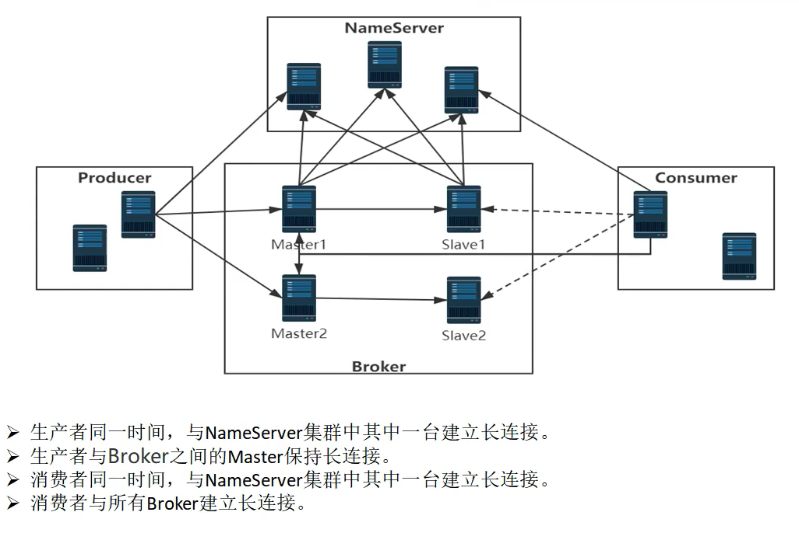

在RocketMQ中各个组件之间用于数据交换的通道，都是基于netty的长连接，那么为了维护长连接的状态，就需要有一个【客户端管理器】的概念。


一般来说，对于长链接的优点：

- 启动时一次创建连接，后续直接复用连接就行了。不需要像http这种，每次请求都重新创建连接。

缺点：

- 由于时长链接，所以可能因为网络不稳定的等原因，需要定时检查连接通道的状态是否OK。一般都是client端定时发送心跳，server端接收心跳请求并记录client端的信息。如果超过一定时间没有接受到心跳，则认为和client之间的网络通道已经断开。


# client端发送心跳

在RocketMQ中，producer和consumer都是client角色，broker是server角色。

所以producer和consumer都需要使用定时任务发送心跳请求给broker。

## 心跳请求的请求code:

```java
package org.apache.rocketmq.common.protocol;
public class RequestCode {
    /**
     * 心跳请求   （忽略其他请求code）
     */
    public static final int HEART_BEAT = 34;
}    
```


## 定时任务

> producer和consumer启动之后，需要每隔一段时间定时给broker发送心跳请求。
>
> 这个启动定时任务`startScheduledTask()` 方法是在 `MQClientInstance` 中：org.apache.rocketmq.client.impl.factory.MQClientInstance#startScheduledTask

- producer端启动：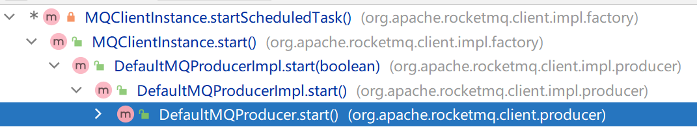

  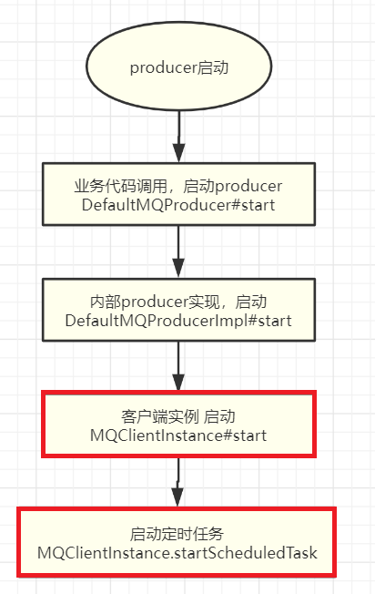


`MQClientInstance#startScheduledTask` 中，注册心跳定时任务：

```java
// 定时任务：移除已下线的broker 和 给所有broker发送心跳请求。
this.scheduledExecutorService.scheduleAtFixedRate(new Runnable() {
    @Override
    public void run() {
        try {
            // 移除已下线的broker
            MQClientInstance.this.cleanOfflineBroker();
            // 【给所有的broker发送心跳。】
            MQClientInstance.this.sendHeartbeatToAllBrokerWithLock();
        } catch (Exception e) {
            log.error("ScheduledTask sendHeartbeatToAllBroker exception", e);
        }
    }
}, 1000, this.clientConfig.getHeartbeatBrokerInterval(), TimeUnit.MILLISECONDS);
```


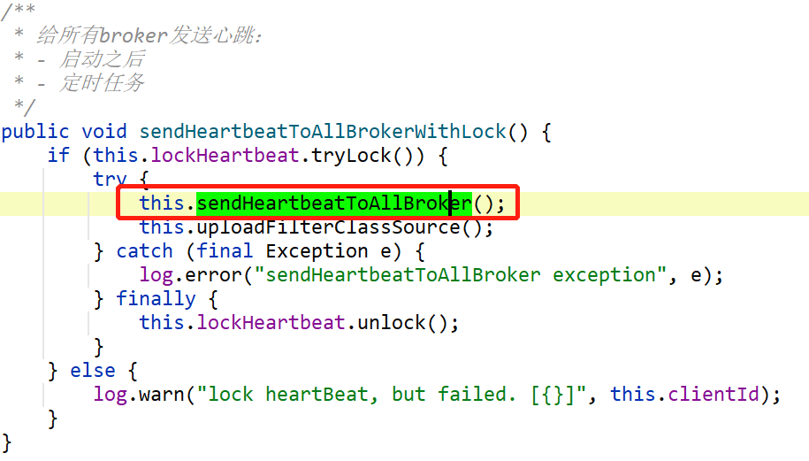

给所有broker发送心跳：

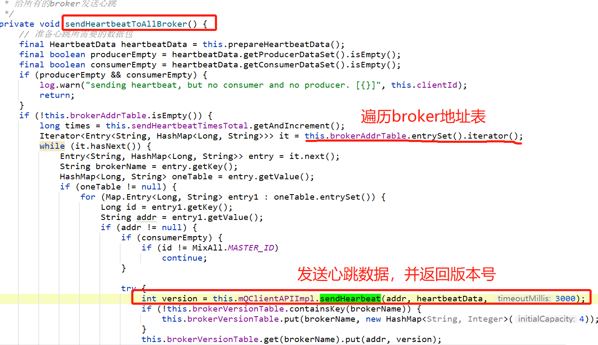

使用客户端api发送心跳请求：

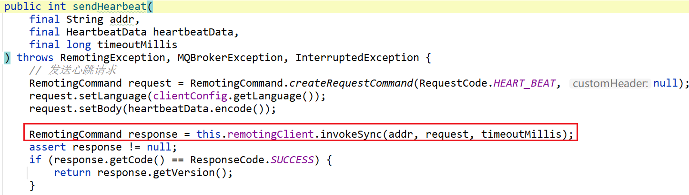


## 启动之后发送心跳

> 在启动成功之后，也会直接调用 `sendHeartbeatToAllBrokerWithLock()` 方法给broker发送心跳。
>
> 这里以producer的启动来举例。

业务代码直接调用`start()`方法，用于启动producer：

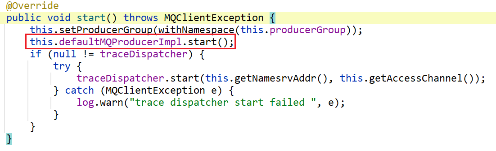

启动：

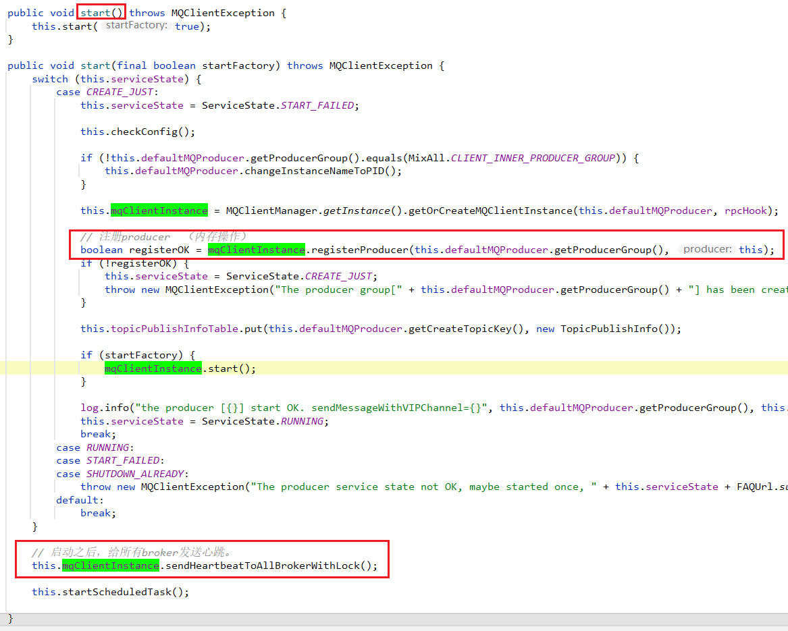


# server端接收心跳

server端接收心跳请求，其实就是broker中的请求处理器：

`ClientManageProcessor` 支持以下三种请求：

| 请求类别                        | 描述             |
| ------------------------------- | ---------------- |
| RequestCode#HEART_BEAT          | 心跳请求         |
| RequestCode#UNREGISTER_CLIENT   | 注销客户端       |
| RequestCode#CHECK_CLIENT_CONFIG | 检查客户端的配置 |

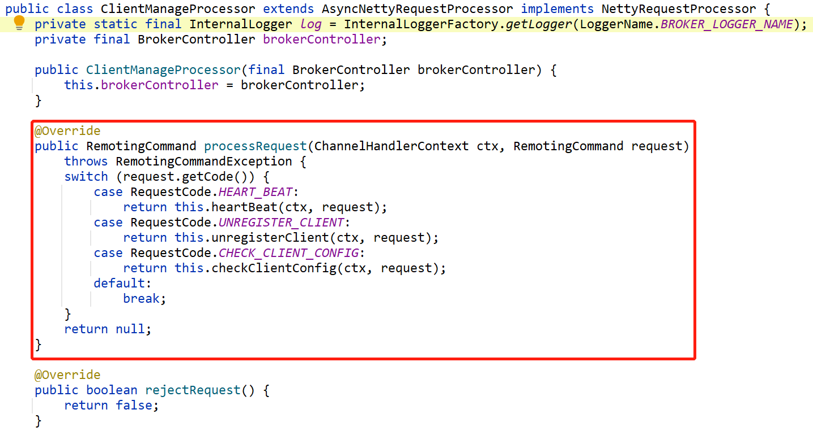

## 心跳请求：

```java
case RequestCode.HEART_BEAT:
    return this.heartBeat(ctx, request);
```

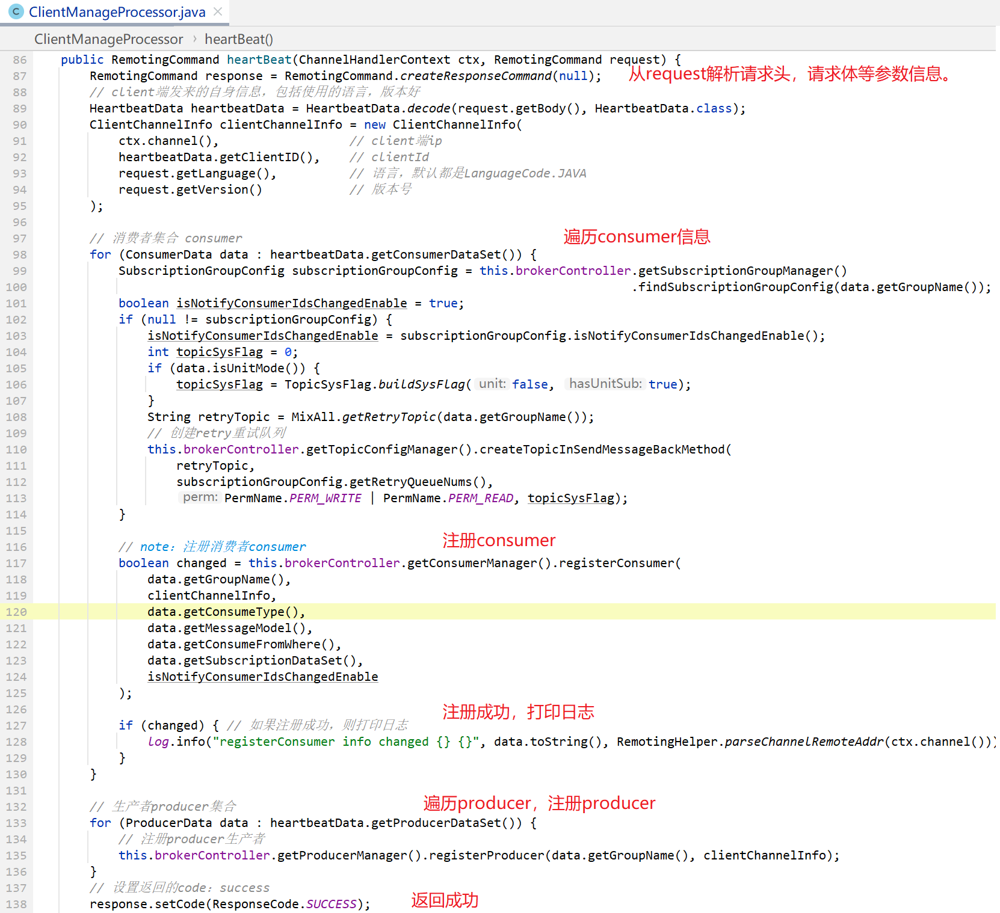

上图，在请求处理器中，

- 先遍历consumerSet，然后使用`ConsumerManager`注册consumer，

- 然后遍历producerSet，使用`ProducerManager`注册producer。

那么顾名思义：

- ProducerManager 是在broker端，管理消费者 consumer 相关信息的 。
- ProducerManager 是在broker端，管理生产者 producer 相关信息的 。

## ConsumerManager 消费者管理器

有两个重要的方法：一个是注册consumer，一个是注销consumer，

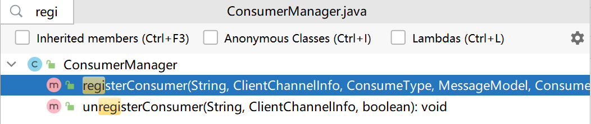

那么在内部肯定有个实例变量，用于记录已经管理的consumer集合：

```java
/**
 * 集合
 * 用于记录consumer信息
 * 
 * @see #registerConsumer    注册consumer
 * @see #unregisterConsumer  注销consumer
 */
private final ConcurrentMap<String/* Group */, ConsumerGroupInfo> consumerTable = 
    new ConcurrentHashMap<>(1024);
```

#### registerConsumer() 注册

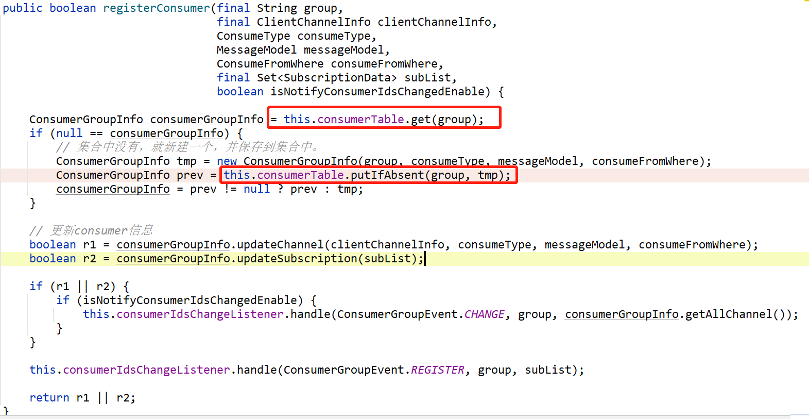


#### unregisterConsumer() 注销

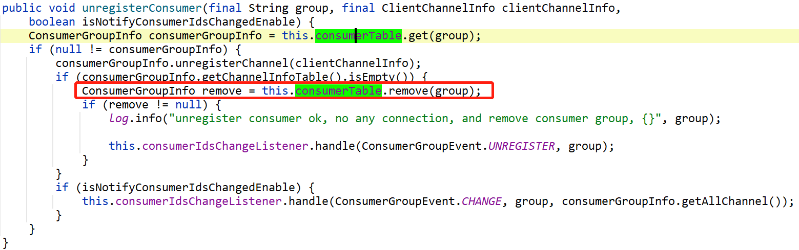

#### scanNotActiveChannel() 扫描不存活的通道

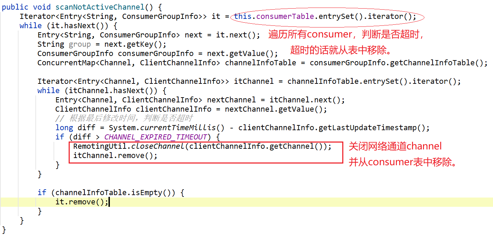


另外，还有一些工具方法：

#### findChannel() 查找consumer

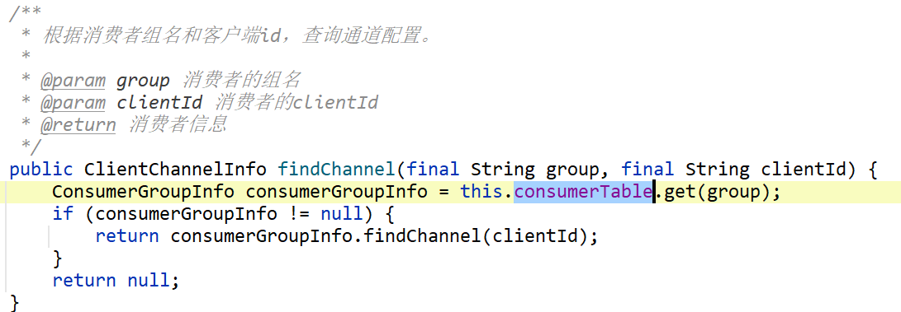


## ProducerManager 生产者管理器


## 注销请求：

```java
case RequestCode.UNREGISTER_CLIENT:
    return this.unregisterClient(ctx, request);
```

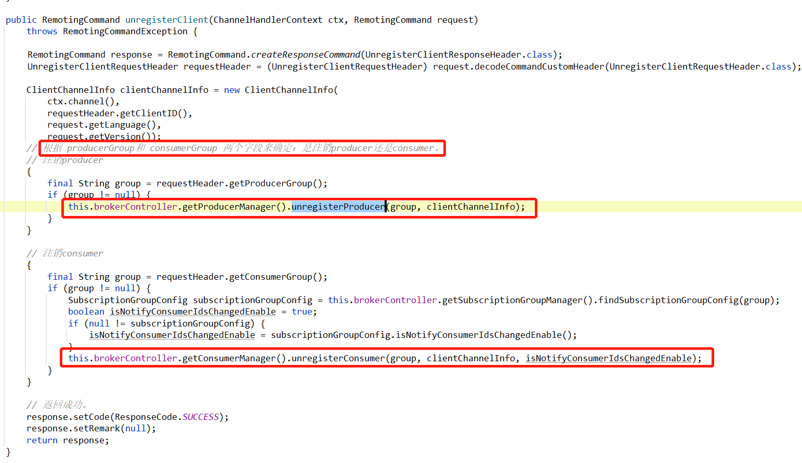


# server端维护channel

> 上面，我们学习了client如何发送心跳，server如何接收心跳并维护与client长连接表。
>
> 但是还有一个场景没有讲解：
>
> 如果经过很长时间，client都没有给server端发送过心跳，则server端需要从表中，删掉这个client的连接，并主动关掉和client之间的长连接。
>
> 流程图见：https://docs.qq.com/flowchart/DQWhaaG9XZXVYR1l6

这个定时任务是在 `ClientHousekeepingService` 中，这个类有两个作用：

- 1、broker定时去扫描异常的channel
- 2、channel事件监听器：监听channel的关闭事件、channel的异常事件、channel闲置事件


## 构造函数

```java
public class ClientHousekeepingService implements ChannelEventListener {
    private final BrokerController brokerController;

    public ClientHousekeepingService(final BrokerController brokerController) {
        this.brokerController = brokerController;
    }
}    
```

成员变量个 `BrokerController` ，只要拿到这个控制器，基本上broker的任何模块都可以调用到了。


## 定时任务

> 先说server的定时任务。

成员变量：

```java
/**
 * 定时任务线程池
 */
private ScheduledExecutorService scheduledExecutorService =
    Executors.newSingleThreadScheduledExecutor();
```

定时任务的线程池，是个单线程的可调度执行器。在RocketMQ中的定时任务，都是使用这个可调度线程池来完成的。


在启动方法中：创建定时任务：

**延迟10秒后，每个10秒，去执行定时任务：broker定时去扫描异常的channel**

```java
// 启动
public void start() {
    this.scheduledExecutorService.scheduleAtFixedRate(new Runnable() {
        @Override
        public void run() {
            try {
                // 定时任务：broker定时去扫描异常的channel
                ClientHousekeepingService.this.scanExceptionChannel();
            } catch (Throwable e) {
                log.error("Error occurred when scan not active client channels.", e);
            }
        }
    }, 1000 * 10, 1000 * 10, TimeUnit.MILLISECONDS);
}

// 扫描异常的client channel
private void scanExceptionChannel() {
    this.brokerController.getProducerManager().scanNotActiveChannel();
    this.brokerController.getConsumerManager().scanNotActiveChannel();
    this.brokerController.getFilterServerManager().scanNotActiveChannel();
}
```


## channel事件监听器

作为channel事件监听器，如果我们直接监听到channel已经关闭、或者已经异常、或者已经idle空闲事件，则可以直接在事件中从client信息表中删掉channel，并在网络层面关掉channel通道。

```java
public class ClientHousekeepingService implements ChannelEventListener {
}
```

`ClientHousekeepingService`实现接口：`ChannelEventListener`

```java
package org.apache.rocketmq.remoting;

import io.netty.channel.Channel;

/**
 * 网络io通道事件监听器
 */
public interface ChannelEventListener {
    /**
     * 连接建立
     */
    void onChannelConnect(final String remoteAddr, final Channel channel);

    /**
     * 关闭
     */
    void onChannelClose(final String remoteAddr, final Channel channel);

    /**
     * 异常
     */
    void onChannelException(final String remoteAddr, final Channel channel);

    /**
     * 闲置
     */
    void onChannelIdle(final String remoteAddr, final Channel channel);
}
```

从这个接口的包名中，我们知道，这个监听器不是netty的监听器，是RocketMQ自己定义的监听器。

其中有四个方法，非常的见名识意。这里就不赘述。


`ClientHousekeepingService`实现中对于这四个方法的实现：

```java
// 当channel连接的时候，并不会直接保存到client信息表中。而是等待client发送来的心跳请求。
@Override
public void onChannelConnect(String remoteAddr, Channel channel) {
}

/**
 * 当channel关闭时，需要让producer和consumer管理器去移除channel。<br/>
 * 注意：这里并不知道参数 channel 这个通道具体是producer还是consumer的通道，所以需要ProducerManager和ConsumerManager都去尝试关闭channel
 *
 * @param remoteAddr 远程地址。producer或者consumer的地址
 * @param channel    网络channel
 */
@Override
public void onChannelClose(String remoteAddr, Channel channel) {
    doChannelCloseEvent(remoteAddr, channel);
}

@Override
public void onChannelException(String remoteAddr, Channel channel) {
    doChannelCloseEvent(remoteAddr, channel);
}

@Override
public void onChannelIdle(String remoteAddr, Channel channel) {
    doChannelCloseEvent(remoteAddr, channel);
}

// 让ProducerManager和ConsumerManager分别去检查这个channel，从client信息表中删除并断开网络连接通道。
private void doChannelCloseEvent(String remoteAddr, Channel channel) {
    this.brokerController.getProducerManager().doChannelCloseEvent(remoteAddr, channel);
    this.brokerController.getConsumerManager().doChannelCloseEvent(remoteAddr, channel);
    this.brokerController.getFilterServerManager().doChannelCloseEvent(remoteAddr, channel);
}
```


# ClientRemotingProcessor

详见：[client端的请求处理器](../网络组件Remoting/NettyRequestProcessor.md#client%E7%AB%AF%E7%9A%84%E8%AF%B7%E6%B1%82%E5%A4%84%E7%90%86%E5%99%A8)


# DefaultConsumerIdsChangeListener

针对consumer的clientId发生变更的场景，会通知该consumerGroup下的所有client立即进行rebalance动作。

[客户端负载均衡](https://gitee.com/anxiaole/rocketmq/blob/master/docs/cn/design.md#4-%E8%B4%9F%E8%BD%BD%E5%9D%87%E8%A1%A1)


# 总结

综上，我们一起学习了，在broker中的另一个组件：客户端管理器

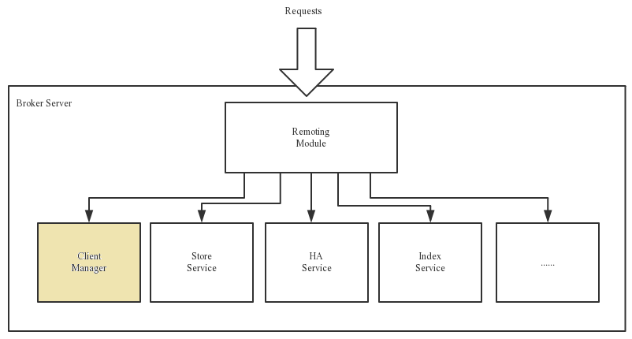


站在broker的角度，producer和consumer都是`客户端`—— `MQClientInstance`


在`sendHeartbeatToAllBrokerWithLock()` 方法中，给broker发送心跳请求：

> RequestCode#HEART_BEAT


当broker收到request后，使用的是 `ClientManageProcessor` 这个请求处理器，负责请求的分发，`客户端管理器ClientManager`分为两个：

- ConsumerManager
- ProducerManager


最后，server端使用定时任务和channel监听器，去维护client信息表：

- 当client超时、client的channel关闭、异常、空闲的时候，去从client信息表中删除这个数据，
- 并在网络io层面，关闭与client端的网络连接。


# 参考：

https://www.jianshu.com/p/d78dc06377cc
