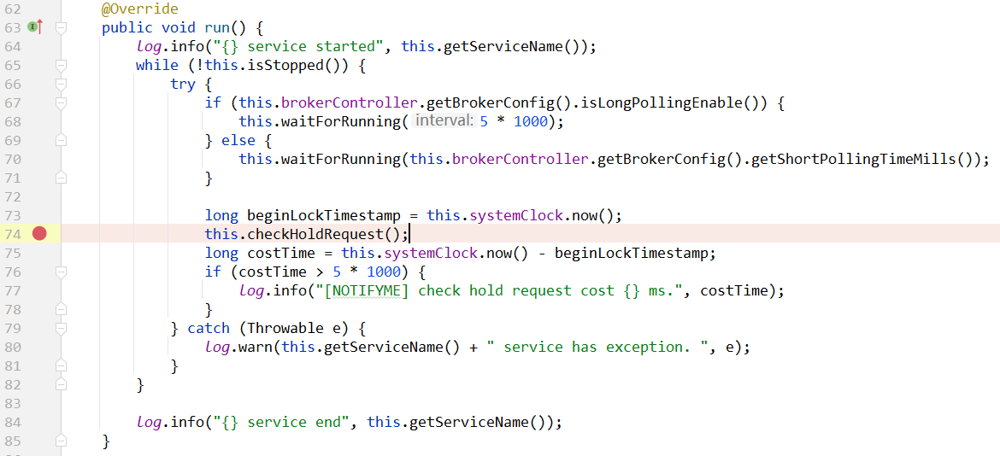

# 描述

当consumer使用**拉取**模式从broker获取最新消息去消费时，如果没有最新的消息 （PULL_NOT_FOUND），则使用 `PullRequestHoldService` 去记录这个拉取请求，当producer生产了最新的消息，broker就立即把最新消息给consumer发送回去。


# PullRequestHoldService


## 类结构

```java
package org.apache.rocketmq.broker.longpolling;

public class PullRequestHoldService extends ServiceThread {
}    
```


其父类 `ServiceThread`在RocketMQ中表示一个线程。所以后面肯定需要实现 [`run()` 方法](#run())


## 构造方法

```java
    private final SystemClock systemClock = new SystemClock();
    private final BrokerController brokerController;
    public PullRequestHoldService(final BrokerController brokerController) {
        this.brokerController = brokerController;
    }
```


## 属性

```java
private ConcurrentMap<String/* topic@queueId */, ManyPullRequest> pullRequestTable = new ConcurrentHashMap<>(1024);
```

`ManyPullRequest` 详见：[ManyPullRequest](#ManyPullRequest)

`pullRequestTable` 这个map的key是`topic@queueId` 格式的：

```java
private static final String TOPIC_QUEUEID_SEPARATOR = "@";
private String buildKey(final String topic, final int queueId) {
    return topic + TOPIC_QUEUEID_SEPARATOR + queueId;
}
```


## 方法

### run()




> 上面，获取ConsumeQueue最大的逻辑偏移量 流程详见：[获取ConsumeQueue最大的逻辑偏移量](#%E8%8E%B7%E5%8F%96ConsumeQueue%E6%9C%80%E5%A4%A7%E7%9A%84%E9%80%BB%E8%BE%91%E5%81%8F%E7%A7%BB%E9%87%8F)


# ManyPullRequest


# 获取ConsumeQueue最大的逻辑偏移量

```java
// 获取ConsumeQueue最大的逻辑偏移量
final long maxOffsetInQueue = this.brokerController.getMessageStore().getMaxOffsetInQueue(topic, queueId);
```

todo:


