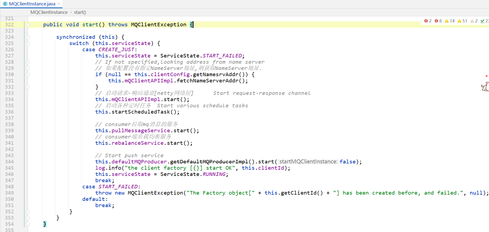
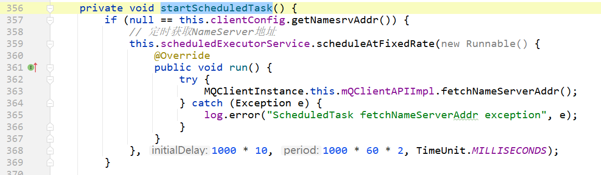
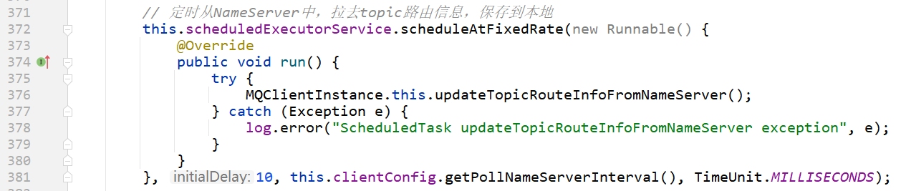
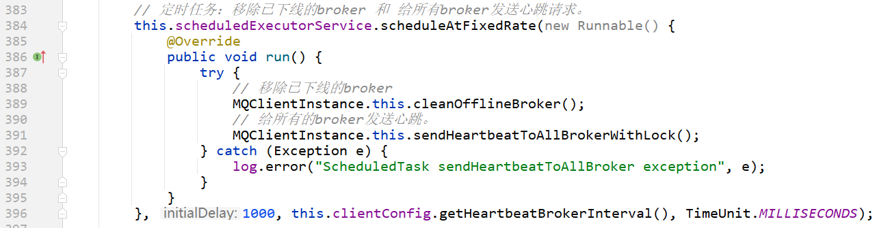
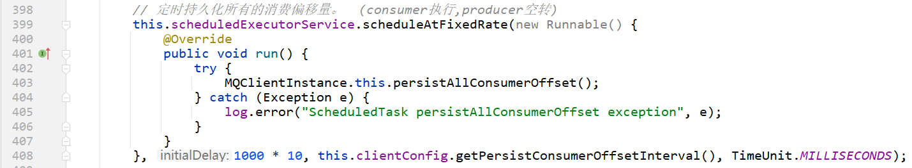
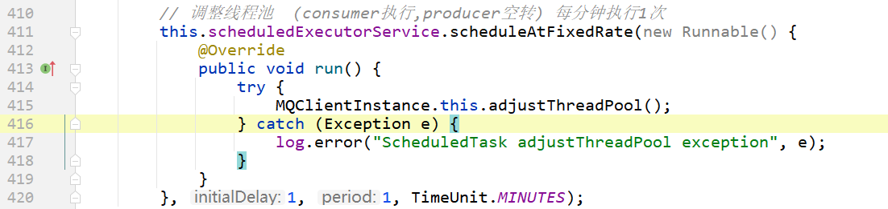

# RocketMQ中连接结构图


在RocketMQ中，producer和consumer都是作为客户端——client

通过上图，看到producer和consumer需要和NameServer和broker进行网络连接。这些网络连接都是通过netty来完成的。

在RocketMQ中，使用 `org.apache.rocketmq.client.impl.factory.MQClientInstance` 这个类封装了客户端。


# 类

```java
package org.apache.rocketmq.client.impl.factory;

/**
 * client表示:producer或consumer
 *
 * 在一个JVM中,所有消费者、生产者持有同一个MQClientInstance
 * MQClientInstance只会启动一次。
 */
public class MQClientInstance {
    
}
```


# 属性

## 生产者分组表和消费者分组表

```java
/**
 * note:记录producer列表
 *
 * @see RequestCode#HEART_BEAT
 */
private final ConcurrentMap<String/* producerGroup */, MQProducerInner> producerTable = new ConcurrentHashMap<String, MQProducerInner>();
/**
 * note:记录consumer列表
 *
 * @see RequestCode#HEART_BEAT
 */
private final ConcurrentMap<String/* consumerGroup */, MQConsumerInner> consumerTable = new ConcurrentHashMap<String, MQConsumerInner>();
```


## broker地址表

```java
/**
 * broker地址表
 *
 * 根据brokerName和brokerId,记录了broker的ip地址
 */
private final ConcurrentMap<String/* Broker Name */, HashMap<Long/* brokerId */, String/* address */>> brokerAddrTable = new ConcurrentHashMap<>();

/**
 * client给broker发送心跳之后,broker会给client返回version(int类型)   保存到这个map中.
 */
private final ConcurrentMap<String/* Broker Name */, HashMap<String/* brokerAddress */, Integer/*broker version*/>> brokerVersionTable = new ConcurrentHashMap<>();
```


## 本地路由表

```java
/**
 * client端本地路由表    topic路由表的本地缓存.
 *
 * key: topic名称
 * value: TopicRouteData  topic的路由信息
 *
 * 和此变量类似的: {@link DefaultMQProducerImpl#topicPublishInfoTable}
 */
private final ConcurrentMap<String/* topicName */, TopicRouteData> topicRouteTable = new ConcurrentHashMap<>();
```

1、从NameServer中获取路由表,并更新本地路由表缓存
如果参数 isDefault==true 则说明topic不存在.则获取默认topic,并使用默认topic的配置,新建一个topic.
2、需要给NameServer发送remoting远程消息 {@link RequestCode#GET_ROUTEINFO_BY_TOPIC}.
获取 {@link TopicRouteData} 之后,然后更新:

  - {@link #brokerAddrTable}
  - {@link #producerTable}
  - {@link #consumerTable}
  - {@link #topicRouteTable}

3、详见：[org.apache.rocketmq.client.impl.factory.MQClientInstance#updateTopicRouteInfoFromNameServer](https://gitee.com/anxiaole/rocketmq/blob/master/client/src/main/java/org/apache/rocketmq/client/impl/factory/MQClientInstance.java#L736)


## netty配置、客户端api

```java
/**
 * 使用netty作为网络I/O客户端时的配置
 */
private final NettyClientConfig nettyClientConfig;
/**
 * client向外发送任何rpc请求的api
 *
 * 文档:
 * https://gitee.com/anxiaole/DayDayUp/blob/master/RocketMQ/源码阅读/Consumer/客户端API——MQClientAPIImpl.md
 */
private final MQClientAPIImpl mQClientAPIImpl;
```


## 客户端定时任务线程池

```java
/**
 * 客户端定时任务线程池
 */
private final ScheduledExecutorService scheduledExecutorService = Executors.newSingleThreadScheduledExecutor(new ThreadFactory() {
    @Override
    public Thread newThread(Runnable r) {
        return new Thread(r, "MQClientFactoryScheduledThread");
    }
});
```


## 请求处理器

```java
/**
 * 请求处理器
 * 作用:broker或NameServer也会主动给producer或consumer发送RPC消息,
 * producer或consumer收到消息之后,使用这个处理器来处理.
 *
 * 文档:
 * https://gitee.com/anxiaole/DayDayUp/blob/master/RocketMQ/源码阅读/Consumer/客户端侧请求处理器ClientRemotingProcessor.md
 */
private final ClientRemotingProcessor clientRemotingProcessor;
```


## consumer拉取mq消息服务.

```java
/**
 * note: consumer拉取mq消息服务.
 *
 * 文档:
 * https://gitee.com/anxiaole/DayDayUp/blob/master/RocketMQ/源码阅读/Consumer/Consumer拉取mq消息服务PullMessageService.md
 */
private final PullMessageService pullMessageService;
```

## 负载均衡服务

```java
/**
 * 负载均衡服务
 * 文档:
 * https://gitee.com/anxiaole/DayDayUp/blob/master/RocketMQ/源码阅读/Consumer/消息队列分配策略算法-AllocateMessageQueueStrategy.md
 */
private final RebalanceService rebalanceService;
```

## 默认 MQ 生产者

```java
/**
 * 默认 MQ 生产者
 * producer门面
 */
private final DefaultMQProducer defaultMQProducer;
```

##  当前客户端状态

```java
/**
 * 当前客户端状态
 */
private ServiceState serviceState = ServiceState.CREATE_JUST;
```


# 构造方法

```java
public MQClientInstance(ClientConfig clientConfig, int instanceIndex, String clientId, RPCHook rpcHook) {
    this.clientId = clientId;
    this.clientConfig = clientConfig;
    this.instanceIndex = instanceIndex;
    this.nettyClientConfig = new NettyClientConfig();
    this.nettyClientConfig.setClientCallbackExecutorThreads(clientConfig.getClientCallbackExecutorThreads());
    this.nettyClientConfig.setUseTLS(clientConfig.isUseTLS());
    this.clientRemotingProcessor = new ClientRemotingProcessor(this);
    this.mQClientAPIImpl = new MQClientAPIImpl(this.nettyClientConfig, this.clientRemotingProcessor, rpcHook, clientConfig);

    if (this.clientConfig.getNamesrvAddr() != null) {
        this.mQClientAPIImpl.updateNameServerAddressList(this.clientConfig.getNamesrvAddr());
    }


    this.mQAdminImpl = new MQAdminImpl(this);

    // note:拉取消息服务
    this.pullMessageService = new PullMessageService(this);

    this.rebalanceService = new RebalanceService(this);

    this.defaultMQProducer = new DefaultMQProducer(MixAll.CLIENT_INNER_PRODUCER_GROUP);
    this.defaultMQProducer.resetClientConfig(clientConfig);

    this.consumerStatsManager = new ConsumerStatsManager(this.scheduledExecutorService);
}
```

启动




# 启动定时任务

客户端启动的定时任务： 所在方法： [org.apache.rocketmq.client.impl.factory.MQClientInstance#startScheduledTask](https://gitee.com/anxiaole/rocketmq/blob/master/client/src/main/java/org/apache/rocketmq/client/impl/factory/MQClientInstance.java#L356)

### 定时获取NameServer地址



### 定时从NameServer中，拉去topic路由信息，保存到本地



### 定时任务：移除已下线的broker 和 给所有broker发送心跳请求。



### 定时持久化所有的消费偏移量。  (consumer执行,producer空转)



### 调整线程池  (consumer执行,producer空转) 每分钟执行1次




