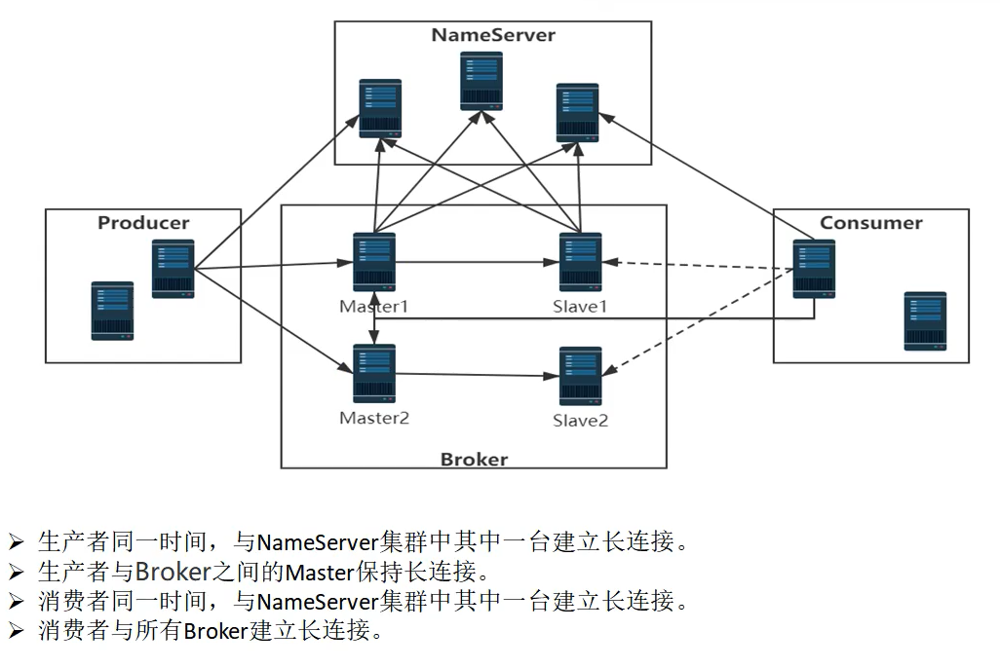
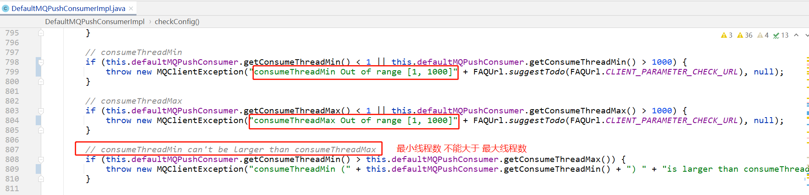

# Quick start

消费者,设置消费者组为 `my_consumer_group`

监听 `TopicTest` 队列，

并使用并发消息监听器`MessageListenerConcurrently`

```java
public class Consumer {

    public static void main(String[] args) throws InterruptedException, MQClientException {
        DefaultMQPushConsumer consumer = new DefaultMQPushConsumer("my_consumer_group");
        consumer.setConsumeFromWhere(ConsumeFromWhere.CONSUME_FROM_FIRST_OFFSET);
        consumer.subscribe("TopicTest", "*");
        consumer.setNamesrvAddr("name-server1-ip:9876;name-server2-ip:9876");
        consumer.registerMessageListener(new MessageListenerConcurrently() {
            @Override
            public ConsumeConcurrentlyStatus consumeMessage(List<MessageExt> msgs,
                ConsumeConcurrentlyContext context) {
                System.out.printf("%s Receive New Messages: %s %n", Thread.currentThread().getName(), msgs);
                return ConsumeConcurrentlyStatus.CONSUME_SUCCESS;
            }
        });
        consumer.start();
        System.out.printf("Consumer Started.%n");
    }
}
```

# RocketMQ中连接结构图




# 消费监听器

传送门：[消费监听器MessageListener.md](消费监听器MessageListener.md)


# 消费线程池

## DefaultMQPushConsumer

作用：基于 `推` 的consumer消费者

#### 注册并发消息监听器

org.apache.rocketmq.client.consumer.DefaultMQPushConsumer#registerMessageListener


当使用这个方法注册消息监听器时，实际上会把这个病发消息监听器设置到 `org.apache.rocketmq.client.impl.consumer.DefaultMQPushConsumerImpl#messageListenerInner` 属性中。


#### 设置consumer消费service

可选有两种：

- 并发消费的service
- 顺序消费的service


当consumer在启动的时，会使用`MessageListener`具体实现类型进行判断：

> MessageListener 就有`并发`和`顺序`两种，所以service也有两种。

```java
    public synchronized void start() throws MQClientException {
        switch (this.serviceState) {
            case CREATE_JUST:

                // 省略一部分代码...........

                // 根据注册的监听器类型[并发消息监听器/顺序执行消息监听器],来确定使用哪种消费服务.   
                if (this.getMessageListenerInner() instanceof MessageListenerOrderly) {
                    this.consumeOrderly = true;
                    this.consumeMessageService = new ConsumeMessageOrderlyService(this, (MessageListenerOrderly) this.getMessageListenerInner());
                } else if (this.getMessageListenerInner() instanceof MessageListenerConcurrently) {
                    this.consumeOrderly = false;
                    this.consumeMessageService = new ConsumeMessageConcurrentlyService(this, (MessageListenerConcurrently) this.getMessageListenerInner());
                }
                this.consumeMessageService.start();

                // 省略一部分代码..........
                this.serviceState = ServiceState.RUNNING;
                break;
            case RUNNING:
            case START_FAILED:
            case SHUTDOWN_ALREADY:
                throw new MQClientException("The PushConsumer service state not OK, maybe started once");
            default:
                break;
        }

        // 省略一部分代码..........
    }
```

如果使用的是并发消费的话，使用 `ConsumeMessageConcurrentlyService` ：

在实例化的时候，会创建一个线程池：


```java
// 无界队列,并且不可配置容量.那 DefaultMQPushConsumer#consumeThreadMax 配置就毫无意义了.
this.consumeRequestQueue = new LinkedBlockingQueue<Runnable>();
this.consumeExecutor = new ThreadPoolExecutor(
    this.defaultMQPushConsumer.getConsumeThreadMin(), // 默认20
    this.defaultMQPushConsumer.getConsumeThreadMax(), // 默认64
    1000 * 60,
    TimeUnit.MILLISECONDS,
    this.consumeRequestQueue,
    new ThreadFactoryImpl("ConsumeMessageThread_"));
```

consumer消费线程池参数：

- 默认最小消费线程数 20
- 默认最大消费线程数 64
- keepAliveTime = 60*1000      单位：秒
- 队列：`new LinkedBlockingQueue<>()` 无界队列
- 线程名称：前缀是：`ConsumeMessageThread_`

注意：因为线程池使用的是无界队列，那么设置的最大线程数，其实没有什么意义。


#### 修改线程池线程数

上面我们已经知道了，设置线程池的最大线程数是没什么用的。

那我们其实可以设置线程池的最小线程数，来修改consumer消费消息时的线程池大小。

```java
    public static void main(String[] args) throws InterruptedException, MQClientException {
        DefaultMQPushConsumer consumer = new DefaultMQPushConsumer("please_rename_unique_group_name_4");

        consumer.setConsumeThreadMin(30);
        consumer.setConsumeThreadMax(64);
        
        consumer.setConsumeFromWhere(ConsumeFromWhere.CONSUME_FROM_FIRST_OFFSET);
        consumer.subscribe("TopicTest", "*");
        consumer.registerMessageListener(new MessageListenerConcurrently() {

            @Override
            public ConsumeConcurrentlyStatus consumeMessage(List<MessageExt> msgs,
                ConsumeConcurrentlyContext context) {
                System.out.printf("%s Receive New Messages: %s %n", Thread.currentThread().getName(), msgs);
                return ConsumeConcurrentlyStatus.CONSUME_SUCCESS;
            }
        });
        consumer.start();
        System.out.printf("Consumer Started.%n");
    }
```

注意：`consumeThreadMin` 如果大于64，则也需要设置 `consumeThreadMax` 参数，因为有个校验：




-修改线程池线程数-SpringBoot版

如果consumer是使用spring boot进行集成的，则可以这样设置消费者线程数：


