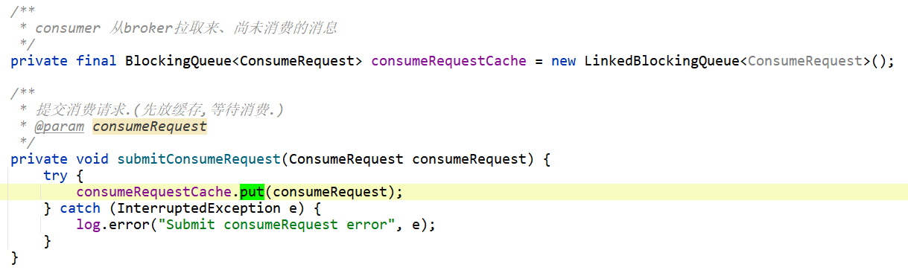

# 前言

在  [01消费者QuickStart.md](01消费者QuickStart.md)  中介绍了consumer分为两种：

- 基于 拉 pull 的消费者   
- 基于 推送 push 的消费者   传送门：[消费者拉取消息服务.md](消费者拉取消息服务.md)


本文主要研究基于 pull的消费者。


# 基于pull的消费者

```java
package org.apache.rocketmq.example.simple;

import java.util.List;
import org.apache.rocketmq.client.consumer.DefaultLitePullConsumer;
import org.apache.rocketmq.common.consumer.ConsumeFromWhere;
import org.apache.rocketmq.common.message.MessageExt;

public class LitePullConsumerSubscribe {

    public static volatile boolean running = true;

    public static void main(String[] args) throws Exception {
        DefaultLitePullConsumer litePullConsumer = new DefaultLitePullConsumer("lite_pull_consumer_test");
        litePullConsumer.setConsumeFromWhere(ConsumeFromWhere.CONSUME_FROM_FIRST_OFFSET);
        litePullConsumer.subscribe("TopicTest", "*");
        litePullConsumer.start();
        try {
            while (running) {
                List<MessageExt> messageExts = litePullConsumer.poll();
                System.out.printf("%s%n", messageExts);
            }
        } finally {
            litePullConsumer.shutdown();
        }
    }
}
```

从上面代码我们可以看到，基于pull的消费者：

- 使用 DefaultLitePullConsumer 类
- 在代码中，需要自己使用`while(running)` 控制是否继续消费
- 消费时，使用 `poll()` 方法，获取新消息。
- 与基于push的消费者不同的是：
  - 使用 `DefaultMQPushConsumer` 时需要设置消息监听器，当有新消息时，consumer会自动回调这个消息监听器。
  - 使用基于pull的消费者 `DefaultLitePullConsumer` 时，需要业务代码中主动调用`poll()` 方法获取新消息。如果没有新消息，则会阻塞一段时间。当有新消息时，`poll()` 方法才会返回。


接下来进行源码分析。

# DefaultLitePullConsumer

## 属性


## 构造方法：


## 启动：


[org.apache.rocketmq.client.impl.consumer.DefaultLitePullConsumerImpl#start](https://gitee.com/anxiaole/rocketmq/blob/master/client/src/main/java/org/apache/rocketmq/client/impl/consumer/DefaultLitePullConsumerImpl.java#L330)


在consumer启动的时候，会有很多组件进行初始化，这里只讲拉取消息相关的：

```java
// 初始化pull api   (负责从broker拉取消息)
initPullAPIWrapper();      
```


## 初始化拉取api


## 拉取消息

初始化`pullApiWrapper`之后，在consumer运行阶段，就需要去broker拉取消息。

> 使用这个结构图更容易理解：
>
> 
>
> topicA有4个queue，也就是有4个分区，分别是queue0~queue3
>
> 此topicA有三个consumer。分别是：consumer负责消费queue0和queue1中的消息；consumer2负责消费queue2中的消息；consumer3负责消费queue3中的消息。
>
> 这里画的箭头是从consumer到queue，是因为在broker中，有了新消息，都是consumer去拉取的。而不是broker推送给consumer的。


拉取消息有三个重载方法：


consumer去broker拉取消息的方法很简单：
指定queue、消息过滤表达式、开始偏移量、拉取多少个消息、超时时间等参数即可。
如果成功拉取到消息，则使用 

```java
this.pullAPIWrapper.processPullResult(mq, pullResult, subscriptionData);
```

方法去处理消息。


### 拉取消息

consumer从broker拉取消息，其实是给broker发送RPC请求 ，详见：[拉取消息请求](../../源码阅读/网络组件Remoting/请求类型及处理/PULL_MESSAGE.md)


### 处理消息

从broker拉取到的消息,最开始是二进制数据流,把消息二进制字节流,转换成消息 `List<MessageExt> msgList` 我们程序中才能正常使用。这个方法就是干这个事的。[源码](https://gitee.com/anxiaole/rocketmq/blob/master/client/src/main/java/org/apache/rocketmq/client/impl/consumer/PullAPIWrapper.java#L76)


### 小节

consumer给broker发送PULL_MESSAGE消息的流程已经明白了。

那么还有两个问题：

- 在什么时候consumer会给broker发送PULL_MESSAGE请求呢？
- 拉取到新的消息之后，会如何处理呢？   
- *这两个问题，详见下面*


## 拉取消息的定时任务

在consumer启动时，会启动一个定时任务：`PullTaskImpl`。

这个任务就是 **consumer从broker拉取mq消息的线程任务.**


图示：


每个 `PullTaskImpl` 都是一个线程：


其实这个`PullTask`主要做了如下事情：

- 判断启动状态、和其他各种状态
- 判断并获取当前consumer应该从指定的queue中，拉取消息的偏移量offset是多少。如果获取不到？延迟3秒后重试
- 从broker拉取消息.发送的请求类型是  RequestCode#PULL_MESSAGE
- 判断拉取消息的结果，如果是FOUND：也就是拉取到了新消息，则 `submitConsumeRequest()` 提交消费请求。
  - 其实只是把消息封装成 `ConsumeRequest` 对象，然后放到一个队列中：`BlockingQueue<ConsumeRequest> consumeRequestCache`
  - `BlockingQueue<ConsumeRequest> consumeRequestCache`  表示： consumer 从broker拉取来、尚未消费的消息
- 修改拉取偏移量。
  - *比如这次拉取到的消息的最大偏移量是100，那么下一次`PullTask`执行时，就会从101偏移量开始拉取新消息了。*


提交消费请求 `submitConsumeRequest()` 方法：



也就是最终拉取到的消息，都放到了  `consumeRequestCache` 阻塞队列中了。

## 消费消息

那么为什么把消息都放到这里呢？那当时是在消费时，需要从这个队列中获取消息了：


