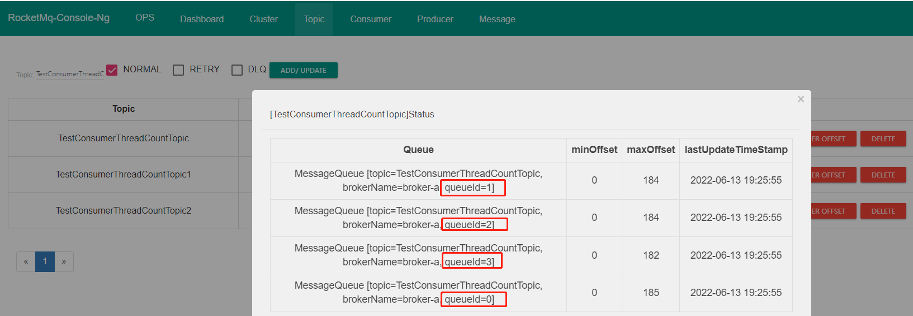
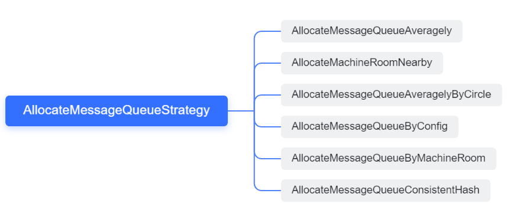

一个topic默认有4个队列



消息负载算法如果没有特殊的要求，尽量使用 AllocateMessageQueueAveragely、AllocateMessageQueueAveragelyByCircle. 因为分配算法比较直观。
消息队列分配遵循一个消费者可以分配多个消息队列，但同一个消息队列只会分配给一个消费者，故如果消费者个数大于消息队列数量，则有些消费者无法消费消息。


# AllocateMessageQueueStrategy

消息队列分配策略




## AllocateMessageQueueAveragely

消息队列平均分配策略算法（默认）

这里的平均分配算法，类似于分页的算法，将所有MessageQueue排好序类似于记录，将所有消费端Consumer排好序类似页数，
并求出每一页需要包含的平均size和每个页面记录的范围range，最后遍历整个range而计算出当前Consumer端应该分配到的MessageQueue


## Consumer根据topic负载均衡

org.apache.rocketmq.client.impl.consumer.RebalanceImpl#rebalanceByTopic

需要判断消费模式：

- 广播模式:消费者中的所有消费者,需要处理topic下的所有队列.所以无需'负载均衡'
- 集群模式：使用消息队列分配策略


## 定时负载均衡

在consumer中，会使用定时任务，每20秒做一次负载consumer重新分配queue：

org.apache.rocketmq.client.impl.consumer.RebalanceService


# consumer消费哪个queue记录的？

经过负载均衡分配之后，只是在consumer的内存中分配的，那需要把这个分配记录，通过心跳，上传给broker。


```java
boolean changed = this.updateProcessQueueTableInRebalance(topic, allocateResultSet, isOrder);
```

方法是和之前的对比，如果有变化，则返回值changed=true。

此时需要把消息队列变化，使用 `this.messageQueueChanged(topic, mqSet, allocateResultSet);` 发送给broker》


# client给broker发送心跳

 [HEART_BEAT.md](..\网络组件Remoting\请求类型及处理\HEART_BEAT.md) 


