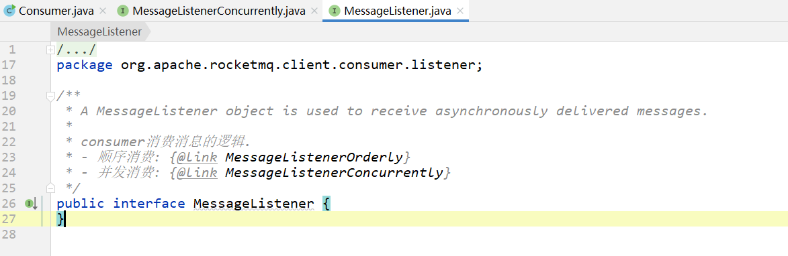
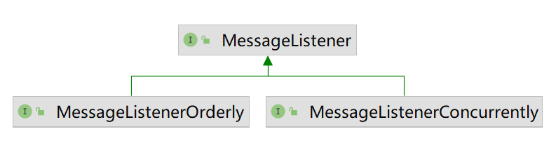
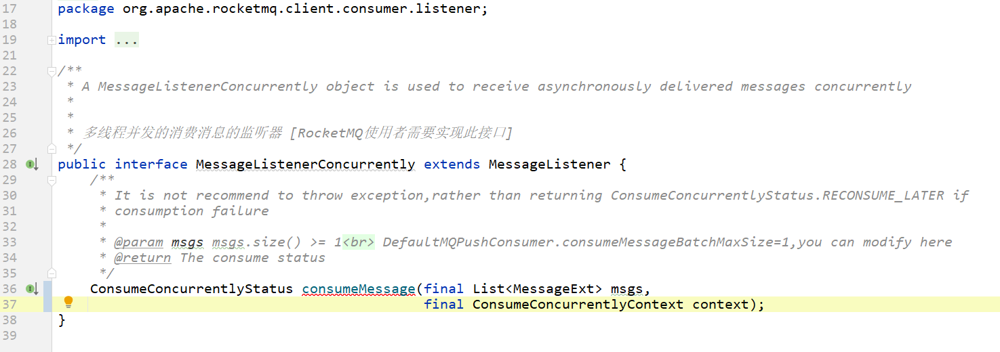

# 消费监听器

接口：org.apache.rocketmq.client.consumer.listener.MessageListener



有两个子接口：

```
 - 顺序消费: MessageListenerOrderly
 - 并发消费: MessageListenerConcurrently
```



## 并发消费监听器

MessageListenerConcurrently

作用：consumer并发消费消息的监听器



比如，在 quick start 中，就是使用的`并发消费消息监听器`：

```java
    consumer.registerMessageListener(new MessageListenerConcurrently() {
        @Override
        public ConsumeConcurrentlyStatus consumeMessage(List<MessageExt> msgs,
            ConsumeConcurrentlyContext context) {
            System.out.printf("%s Receive New Messages: %s %n", Thread.currentThread().getName(), msgs);
            return ConsumeConcurrentlyStatus.CONSUME_SUCCESS;
        }
    });
```

方法返回值，是个枚举：

```java
package org.apache.rocketmq.client.consumer.listener;

/**
 * 并发消费mq消息结果
 */
public enum ConsumeConcurrentlyStatus {

    /**
     * Success consumption
     * 成功消费
     */
    CONSUME_SUCCESS,

    /**
     * Failure consumption,later try to consume
     * 失败消费，稍后尝试消费
     *
     *
     * 如果 {@link MessageListener}返回的消费结果为 RECONSUME_LATER,则需要将这些消息发送给Broker延迟消息。
     * 如果给broker发送消息失败,将延迟5s后提交线程池进行消费。
     *
     * RECONSUME_LATER的消息发送入口: MQClientAPIImpl#consumerSendMessageBack,
     * 命令编码: {@link org.apache.rocketmq.common.protocol.RequestCode#CONSUMER_SEND_MSG_BACK}
     */
    RECONSUME_LATER;
}
```


> 画外音：
>
> 当前，我们在具体开发中，肯定不会直接使用这种方式来写consumer。
>
> 常用的Consumer实现是：
>
> 基于 `推` 的consumer： [DefaultMQPushConsumer](#DefaultMQPushConsumer)


## 顺序消费监听器

MessageListenerOrderly

作用：保证consumer消费消息时，按照producer发送消息的先后顺序进行消费。

