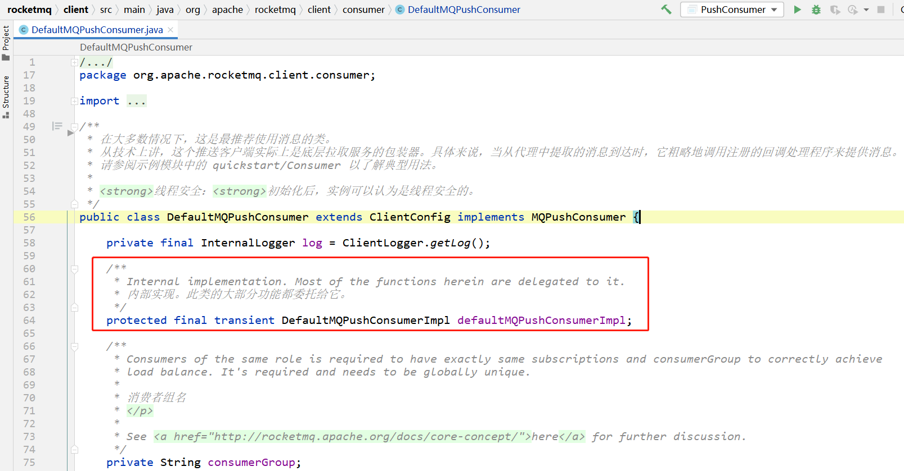
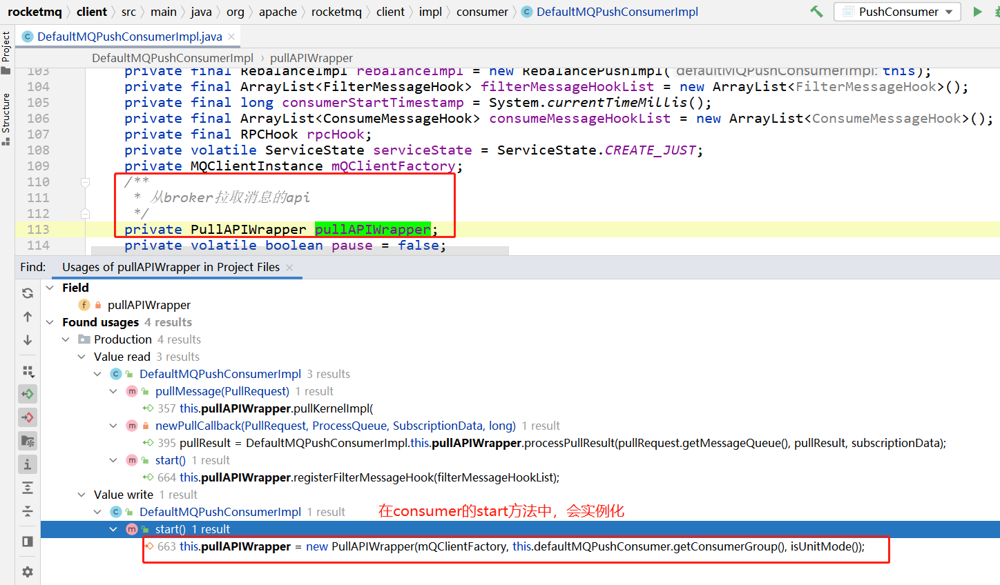
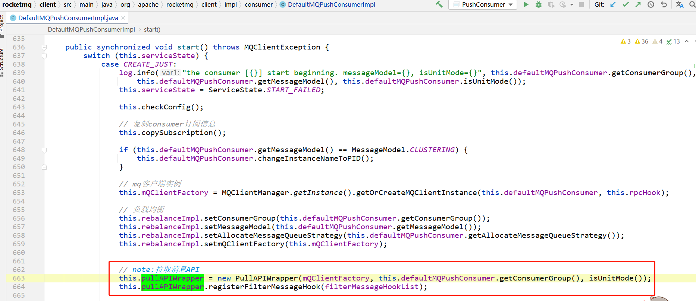
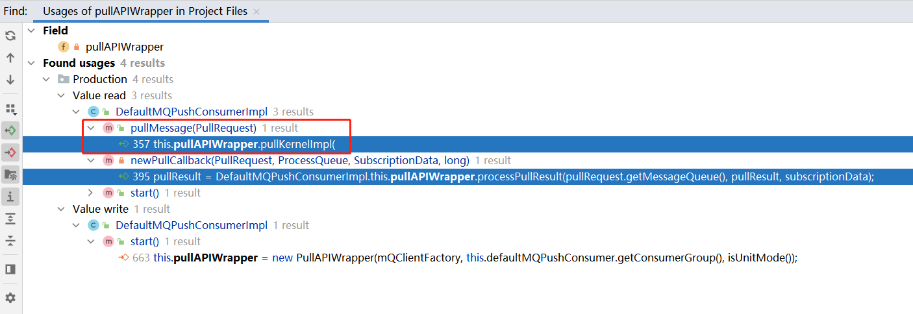
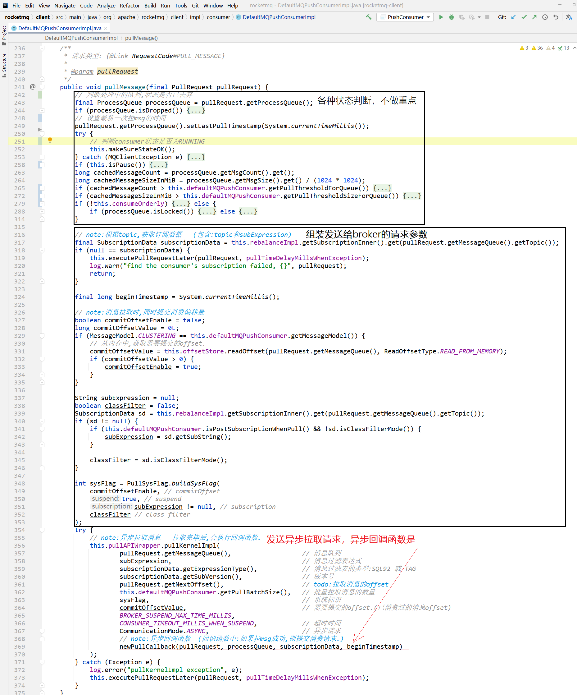
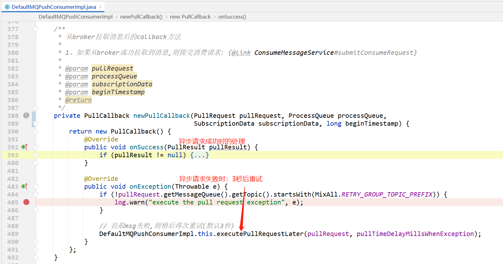
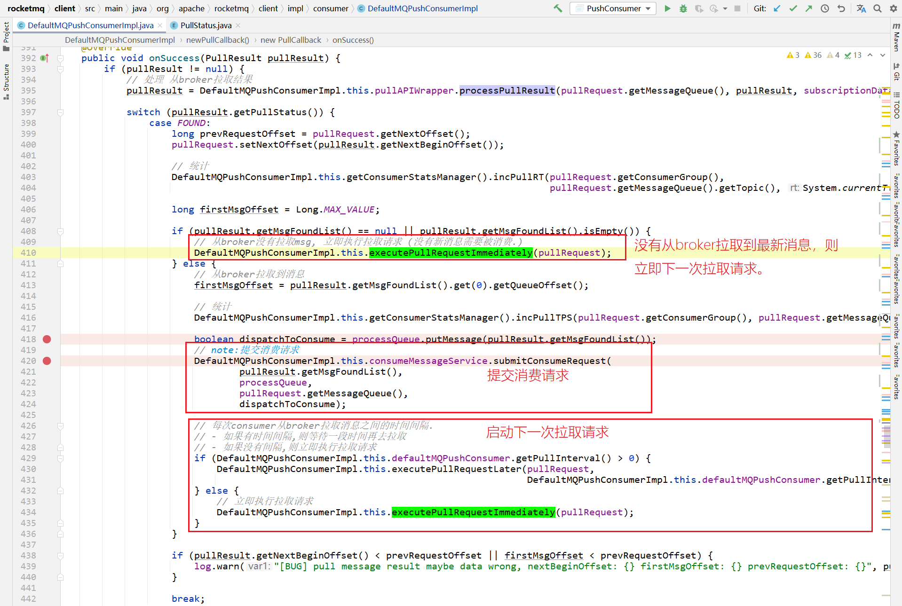
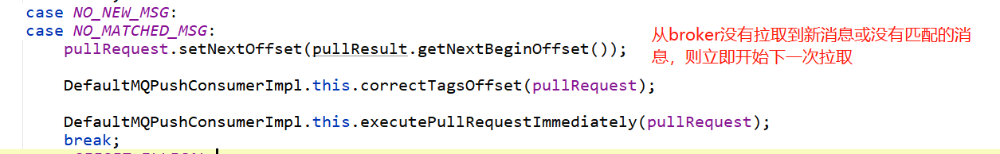
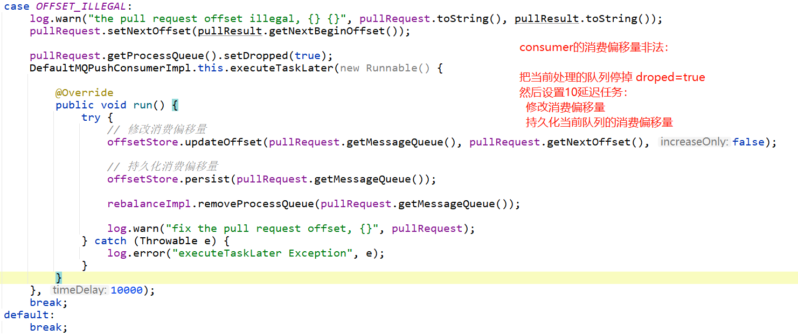

# 前言

在  [01消费者QuickStart.md](01消费者QuickStart.md)  中介绍了consumer分为两种：

- 基于 拉 pull 的消费者
- 记录 推送 push 的消费者

注意：其实RocketMQ中基于`push`，并不是broker有了新消息之后，主动给consumer发送消息，而是consumer内部使用 线程池 `scheduledExecutorService` 定时给broker发送请求，拉取最新的消息。如果从broker查询到了最新消息，则回调 `org.apache.rocketmq.client.consumer.listener.MessageListener` 实现类。

综上，基于`push`的consumer可以先分为两大步骤：

- 1、使用单例线程池从broker拉取消息
- 2、当有新消息时，在消费线程池中，调用 `org.apache.rocketmq.client.consumer.listener.MessageListener` 处理消费逻辑

本篇只来讲述consumer的消息拉取。

传送门： [消费者消费消息.md](消费者消费消息.md) 


# 消费者入口

org.apache.rocketmq.client.consumer.DefaultMQPushConsumer




```java
public class DefaultMQPushConsumerImpl implements MQConsumerInner {
    /**
     * Delay some time when exception occur
     * 发生异常时,延迟一段时间之后,再去重试拉取
     */
    private long pullTimeDelayMillsWhenException = 3000;
    /**
     * 当流量控制时,拉取任务延迟毫秒
     */
    private static final long PULL_TIME_DELAY_MILLS_WHEN_FLOW_CONTROL = 50;
    /**
     * 当暂停时,拉取任务延迟毫秒
     */
    private static final long PULL_TIME_DELAY_MILLS_WHEN_SUSPEND = 1000;
    
    /**
     * 从broker拉取消息的api
     */
    private PullAPIWrapper pullAPIWrapper;
    /**
     * 拉取任务是否暂停
     * 画外音:注意这个变量使用了volatile修饰,说明这个变量会在多线程环境下使用.
     */
    private volatile boolean pause = false;
    /**
     * 拉取消息
     * rpc请求类型: RequestCode#PULL_MESSAGE
     */
    public void pullMessage(final PullRequest pullRequest) {
        // 拉取消息的方法，这里先省略，下面会重点说这个方法。
        // 这里先理解 DefaultMQPushConsumerImpl 类中，有哪些关于pull拉取消息的成员：包括属性、方法等。
    }
}    
```

上面 `DefaultMQPushConsumerImpl` 默认基于push的消费者实现中，最重要的属性是：

```java
/**
 * 从broker拉取消息的api
 */
private PullAPIWrapper pullAPIWrapper;
```
最重要的方法是：

```java
/** 
 * 拉取消息 
 * rpc请求类型: RequestCode#PULL_MESSAGE
 */
public void pullMessage(final PullRequest pullRequest) {
    // 拉取消息的方法，这里先省略，下面会重点说这个方法。
    // 这里先理解 DefaultMQPushConsumerImpl 类中，有哪些关于pull拉取消息的成员：包括属性、方法等。
}
```


# PullAPIWrapper

> 从broker拉取消息的api
>
> 拉取消息时，也使用 `pullAPIWrapper` 来具体完成拉取任务的。

启动consumer时，会初始化这个属性：





> 画外音：
>
> 这里其实就是new出来一个对象，具体还是要看 `pullAPIWrapper` 如何使用。
>
> 也就是下面这个 `pullMessage(pullRequest)` 方法中。
>
> 

# pullMessage(pullRequest)



pullMessage方法已经分为了三部分：

- 参数、状态判断
- 组装请求参数
- 发送异步拉取请求【重要】


# 发送异步拉取请求

consumer去broker拉取消息，都是使用异步请求的。

详见：[PULL_MESSAGE.md](../../源码阅读/网络组件Remoting/请求类型及处理/PULL_MESSAGE.md)


# 异步回调函数

异步回调函数是匿名内部类：org.apache.rocketmq.client.consumer.PullCallback



异步请求成功时处理：

## 1、processPullResult 处理拉取请求的结果

```java
// 处理 从broker拉取结果
pullResult = DefaultMQPushConsumerImpl.this.pullAPIWrapper.processPullResult(pullRequest.getMessageQueue(), pullResult, subscriptionData);
```

处理完之后，判断状态：

## 2、如果从broker拉取到了新消息：



## 3、如果没有消息：



## 4、如果consumer拉取消息时，偏移量非法：



> 画外音：
>
> 什么情况下会发生 消费者消费偏移量 非法呢？


## 小节

通过上面这异步回调函数，我们知道了：

如果consumer从broker成功拉取到了新消息，则会提交消费请求：

```java
// note:提交消费请求
DefaultMQPushConsumerImpl.this.consumeMessageService.submitConsumeRequest(
        pullResult.getMsgFoundList(),
        processQueue,
        pullRequest.getMessageQueue(),
        dispatchToConsume);
```

消费消息传送门： [消费者消费消息.md](消费者消费消息.md) 


