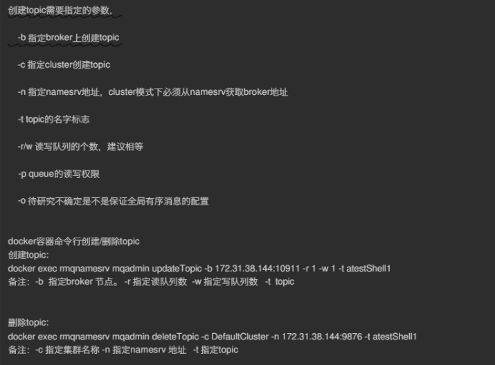
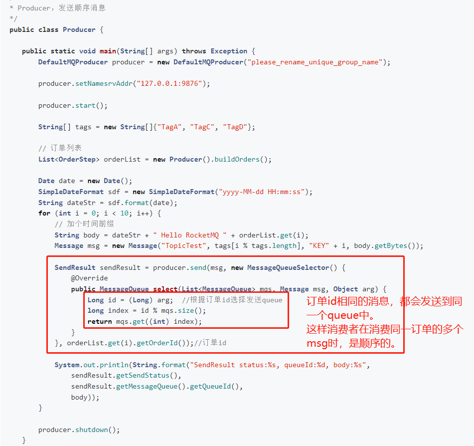
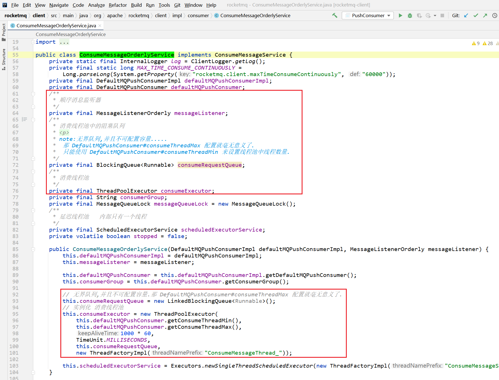
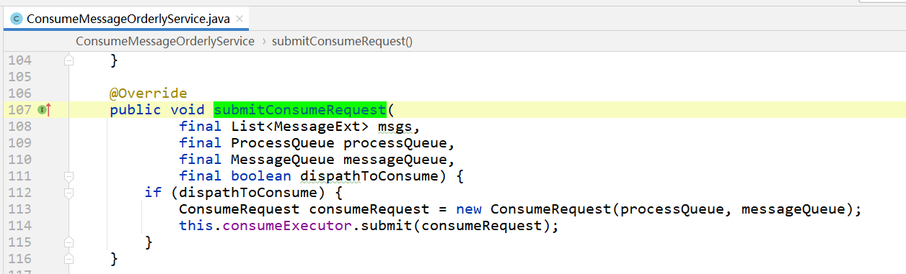
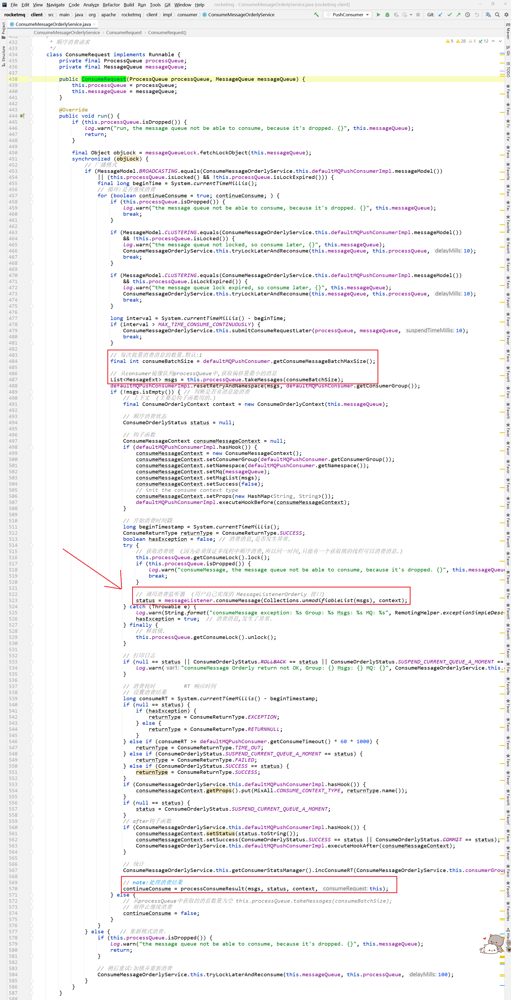

# 前言

在  [01消费者QuickStart.md](01消费者QuickStart.md)  中介绍了consumer分为两种：

- 基于 拉 pull 的消费者   传送门：[基于pull模式的消费者.md](基于pull模式的消费者.md)
- 基于 推送 push 的消费者

注意：其实RocketMQ中基于`push`，并不是broker有了新消息之后，主动给consumer发送消息，而是consumer内部使用 线程池 `scheduledExecutorService` 定时给broker发送请求，拉取最新的消息。如果从broker查询到了最新消息，则回调 `org.apache.rocketmq.client.consumer.listener.MessageListener` 实现类。

综上，基于`push`的consumer可以先分为两大步骤：

- 1、使用单例线程池从broker拉取消息
- 2、当有新消息时，在消费线程池中，调用 `org.apache.rocketmq.client.consumer.listener.MessageListener` 处理消费逻辑

本篇只来讲述consumer的消息消费。consumer如何从broker拉取消息，传送门： [1、消费者拉取消息服务.md](消费者拉取消息服务.md) 

> 注意：
>
> 这里主要讲解的是以【push】模式的consumer，也就是：[org.apache.rocketmq.client.consumer.DefaultMQPushConsumer](https://gitee.com/anxiaole/rocketmq/blob/master/client/src/main/java/org/apache/rocketmq/client/consumer/DefaultMQPushConsumer.java#L64)
>
> 也只有【push】模式的consumer从broker拉取到消息之后，会提交消费请求。


# 发起消费消息请求

在consumer拉取消息异步回调方法中：如果consumer从broker成功拉取到了新消息，则会提交消费请求：

```java
// note:提交消费请求
DefaultMQPushConsumerImpl.this.consumeMessageService.submitConsumeRequest(
        pullResult.getMsgFoundList(),
        processQueue,
        pullRequest.getMessageQueue(),
        dispatchToConsume);
```

> 上面方法的参数中 [ProcessQueue](https://gitee.com/anxiaole/rocketmq/blob/master/client/src/main/java/org/apache/rocketmq/client/impl/consumer/ProcessQueue.java#L39)：
>
> ```java
> ProcessQueue是MessageQueue在consumer端的快照。
> 
> PullMessageService从broker默认每次拉取32条消息，按消息的队列偏移量offset，按照从小到大顺序存放在ProcessQueue中的treeMap中，
> PullMessageService然后将消息提交到consumer的消费线程池中，当消息成功消费后从ProcessQueue中移除。
> ```

# 消费消息service

消费消息service ，有两种：

- 并发消费
- 顺序消费


# 并发消费service

org.apache.rocketmq.client.impl.consumer.ConsumeMessageConcurrentlyService

## 消息监听器

> 接口：org.apache.rocketmq.client.consumer.listener.MessageListener 
>
> [消费监听器MessageListener 文档传送门](消费监听器MessageListener.md)


## 并发消费线程池

在并发消费service中，其内部维护了一个线程池，当收到消费请求之后，直接丢给线程池来执行消费逻辑：


> 修改consumer消费线程池的方法：
>
>  [RocketMQ消费者消费线程池.md —— 修改线程池线程数 小节](RocketMQ消费者消费线程池.md)  


## 提交消费请求


这个提交消费请求的方法，其实很简单：

- 判断参数 `List<MessageExt> msgs` 是否超过 `consumeMessageBatchMaxSize` （默认1）
- 如果不超过，则直接把消息包装成 `ConsumeRequest` ，然后丢给线程池。
- 如果超过了，则把消息拆成多个 `ConsumeRequest` ，然后分别都给线程池。
- 那既然把`ConsumeRequest`丢给线程池了，肯定是实现了`Runnable`接口。


## 消费请求 ConsumeRequest


### 消费消息     run()方法

消费消息
1/ 消费前后钩子函数
2/ 记录消费开始时间   (为了后面判断消费是否超时)
3/ 消费消息，调用开发者自己实现的  {@link MessageListenerConcurrently#consumeMessage}  实现类
4/ 记录消费状态  (不重要)
5/ 处理消费结果: {@link #processConsumeResult}

 

其中第3步骤和第5步骤是重点。不过第3步骤很容易理解。

### 处理消费结果

第5步骤中，处理消费结果: {@link #processConsumeResult}

```java
处理消费结果     主要三个步骤:
1/ 消费状态管理器 —— 记录消费状态/统计信息等 (不是很重要)
2/ 根据 消费模式 ,处理消费失败的mq消息.(保证了集群消费模式,消息不丢失.)
3/ 处理消费成功的消息:修改消费成功的偏移量. {@link OffsetStore#updateOffset}
```


### **稍后提交消费请求**

如果消费消费消息异常时，会把消费请求 `ConsumeRequest` 放到一个调度线程池中——延迟5秒后，再此把请求放到 消费线程池中。

> 对于消费失败的请求：在两个线程池中左手倒右手，中间间隔了5秒钟。


# 顺序消费service

## 基本概念

> ## 11 集群消费（Clustering）
>
> 集群消费模式下,相同Consumer Group的每个Consumer实例平均分摊消息。
>
> ## 12 广播消费（Broadcasting）
>
> 广播消费模式下，相同Consumer Group的每个Consumer实例都接收全量的消息。
>
> ## 13 普通顺序消息（Normal Ordered Message）
>
> 普通顺序消费模式下，消费者通过同一个消息队列（ Topic 分区，称作 Message Queue） 收到的消息是有顺序的，不同消息队列收到的消息则可能是无顺序的。
>
> ## 14 严格顺序消息（Strictly Ordered Message）
>
> 严格顺序消息模式下，消费者收到的所有消息均是有顺序的。
>
> [更多>> 传送门](https://gitee.com/anxiaole/rocketmq/blob/master/docs/cn/concept.md#11-%E9%9B%86%E7%BE%A4%E6%B6%88%E8%B4%B9clustering)

## 消息顺序

> 消息有序指的是消息消费时，能按照producer发送消息的顺序来消费。
>
> 例如：一个订单产生了三条消息分别是订单创建、订单付款、订单完成。消费时要按照这个顺序消费才能有意义，但是同时订单之间是可以并行消费的。RocketMQ可以严格的保证消息有序。
>
> 顺序消息分为`全局顺序消息`与`分区顺序消息`，全局顺序是指某个Topic下的所有消息都要保证顺序；部分顺序消息只要保证每一组消息被顺序消费即可。
>
> - 全局顺序
>   对于指定的一个 Topic，所有消息按照严格的先入先出（FIFO）的顺序进行发布和消费。
>   适用场景：性能要求不高，所有的消息严格按照 FIFO 原则进行消息发布和消费的场景
> - 分区顺序
>   对于指定的一个 Topic，所有消息根据 sharding key 进行区块分区。 同一个分区内的消息按照严格的 FIFO 顺序进行发布和消费。 Sharding key 是顺序消息中用来区分不同分区的关键字段，和普通消息的 Key 是完全不同的概念。
>   适用场景：性能要求高，以 sharding key 作为分区字段，在同一个区块中严格的按照 FIFO 原则进行消息发布和消费的场景。

## 顺序消费样例

> 消息有序指的是可以按照消息的发送顺序来消费(FIFO)。RocketMQ可以严格的保证消息有序，可以分为`分区有序`或者`全局有序`。
>
> 顺序消费的原理解析：在默认的情况下消息发送会采取Round Robin轮询方式把消息发送到不同的queue(分区队列)；而消费消息的时候从多个queue上拉取消息，这种情况发送和消费是不能保证顺序。但是如果控制发送的顺序消息只依次发送到同一个queue中，消费的时候只从这个queue上依次拉取，则就保证了顺序。当发送和消费参与的queue只有一个，则是全局有序；如果多个queue参与，则为分区有序，即相对每个queue，消息都是有序的。
>
> 下面用订单进行分区有序的示例。一个订单的顺序流程是：创建、付款、推送、完成。订单号相同的消息会被先后发送到同一个队列中，消费时，同一个OrderId获取到的肯定是同一个队列。
>
> [详细说明的传送门](https://gitee.com/anxiaole/rocketmq/blob/master/docs/cn/RocketMQ_Example.md#2-%E9%A1%BA%E5%BA%8F%E6%B6%88%E6%81%AF%E6%A0%B7%E4%BE%8B)

### 全局顺序消息

> 当发送和消费参与的queue只有一个，则是全局有序；如果多个queue参与，则为分区有序，即相对每个queue，消息都是有序的。
>
> 个人理解：在producer发送消息时，把DefaultMQProducer的defaultTopicQueueNums设置成1   或者使用broker管理命令，提前创建好topic
>
> 建议还是使用mqadmin命令，提前创建好topic比较好。
>
> ```shell
> ### Update or create Topic
>     sh mqadmin updateTopic -b 127.0.0.1:10911 -t TopicA -r 1 -w 1
> ```
>
> 


### 分区顺序消息

分区顺序消息，还需要依赖producer发送端，也就是把相同分区的消息，发送到同一个queue中。

consumser能保证同一topic中，同一queue中的消息，消费是按照producer发送的顺序进行消费。




## 顺序消费service

org.apache.rocketmq.client.impl.consumer.ConsumeMessageOrderlyService

### 属性及构造方法




### 提交消费请求




### 消费请求 ConsumeRequest




