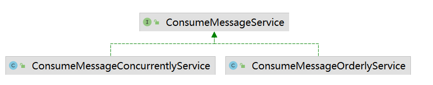

# 前言

在  [01消费者QuickStart.md](01消费者QuickStart.md)  中介绍了consumer分为两种：

- 基于 拉 pull 的消费者   传送门：todo
- 记录 推送 push 的消费者

注意：其实RocketMQ中基于`push`，并不是broker有了新消息之后，主动给consumer发送消息，而是consumer内部使用 线程池 `scheduledExecutorService` 定时给broker发送请求，拉取最新的消息。如果从broker查询到了最新消息，则回调 `org.apache.rocketmq.client.consumer.listener.MessageListener` 实现类。

综上，基于`push`的consumer可以先分为两大步骤：

- 1、使用单例线程池从broker拉取消息
- 2、当有新消息时，在消费线程池中，调用 `org.apache.rocketmq.client.consumer.listener.MessageListener` 处理消费逻辑

本篇只来讲述consumer的消息消费。consumer如何从broker拉取消息，传送门： [1、消费者拉取消息服务.md](消费者拉取消息服务.md) 

> 注意：
>
> 这里主要讲解的是以【push】模式的consumer，也就是：[org.apache.rocketmq.client.consumer.DefaultMQPushConsumer](https://gitee.com/anxiaole/rocketmq/blob/master/client/src/main/java/org/apache/rocketmq/client/consumer/DefaultMQPushConsumer.java#L64)
>
> 也只有【push】模式的consumer从broker拉取到消息之后，会提交消费请求。


# 发起消费消息请求

在consumer拉取消息异步回调方法中：如果consumer从broker成功拉取到了新消息，则会提交消费请求：

```java
// note:提交消费请求
DefaultMQPushConsumerImpl.this.consumeMessageService.submitConsumeRequest(
        pullResult.getMsgFoundList(),
        processQueue,
        pullRequest.getMessageQueue(),
        dispatchToConsume);
```


# 消费消息service

消费消息service ，有两种：

- 并发消费
- 顺序消费




# 并发消费service

org.apache.rocketmq.client.impl.consumer.ConsumeMessageConcurrentlyService

## 消息监听器

> 接口：org.apache.rocketmq.client.consumer.listener.MessageListener 
>
> [消费监听器MessageListener 文档传送门](消费监听器MessageListener.md)


## 并发消费线程池

在并发消费service中，其内部维护了一个线程池，当收到消费请求之后，直接丢给线程池来执行消费逻辑：


> 修改consumer消费线程池的方法：
>
>  [RocketMQ消费者消费线程池.md —— 修改线程池线程数 小节](RocketMQ消费者消费线程池.md)  


## 提交消费请求


这个提交消费请求的方法，其实很简单：

- 判断参数 `List<MessageExt> msgs` 是否超过 `consumeMessageBatchMaxSize` （默认1）
- 如果不超过，则直接把消息包装成 `ConsumeRequest` ，然后丢给线程池。
- 如果超过了，则把消息拆成多个 `ConsumeRequest` ，然后分别都给线程池。
- 那既然把`ConsumeRequest`丢给线程池了，肯定是实现了`Runnable`接口。


## 消费请求 ConsumeRequest


### 消费消息     run()方法

消费消息
1/ 消费前后钩子函数
2/ 记录消费开始时间   (为了后面判断消费是否超时)
3/ 消费消息，调用开发者自己实现的  {@link MessageListenerConcurrently#consumeMessage}  实现类
4/ 记录消费状态  (不重要)
5/ 处理消费结果: {@link #processConsumeResult}

 

其中第3步骤和第5步骤是重点。不过第3步骤很容易理解。

### 处理消费结果

第5步骤中，处理消费结果: {@link #processConsumeResult}

```java
处理消费结果     主要三个步骤:
1/ 消费状态管理器 —— 记录消费状态/统计信息等 (不是很重要)
2/ 根据 消费模式 ,处理消费失败的mq消息.(保证了集群消费模式,消息不丢失.)
3/ 处理消费成功的消息:修改消费成功的偏移量. {@link OffsetStore#updateOffset}
```


### **稍后提交消费请求**

如果消费消费消息异常时，会把消费请求 `ConsumeRequest` 放到一个调度线程池中——延迟5秒后，再此把请求放到 消费线程池中。

> 对于消费失败的请求：在两个线程池中左手倒右手，中间间隔了5秒钟。


# 顺序消费service

org.apache.rocketmq.client.impl.consumer.ConsumeMessageOrderlyService


