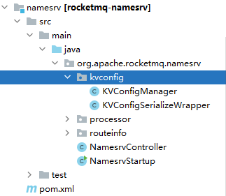
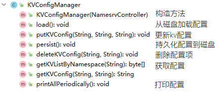
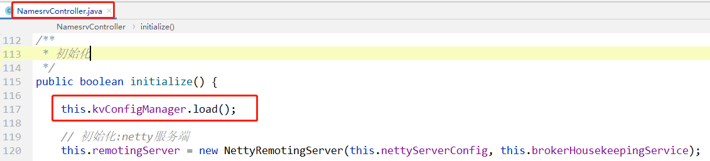
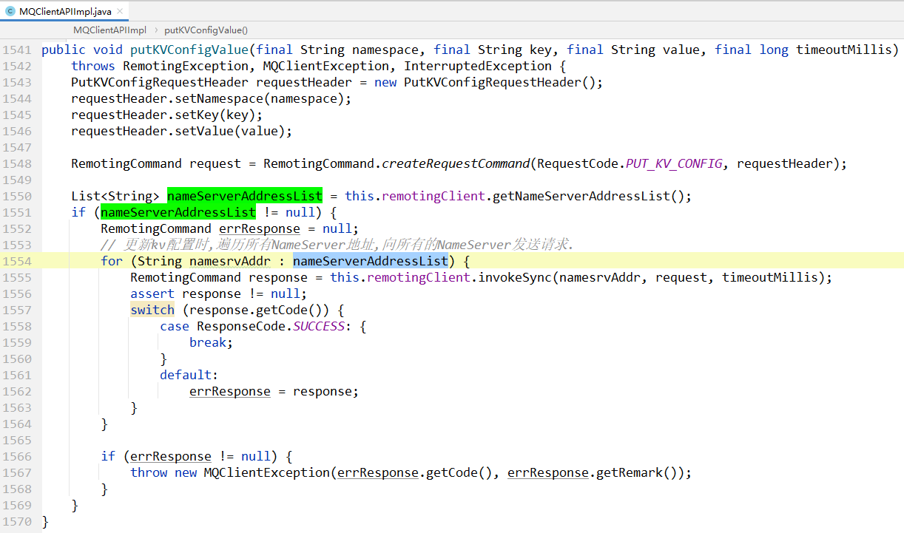

# 前言

RocketMQ的NameServer主要有三个模块

- kv配置管理器 （本文）
-  [请求处理器DefaultRequestProcessor.md](请求处理器DefaultRequestProcessor.md) 
-  [RouteInfoManager路由表管理器.md](RouteInfoManager路由表管理器.md) 

从RocketMQ的源码包也能看到：




# 描述

在RocketMQ集群中，如果RocketMQ中间件需要一些和各个角色都无关的配置项，或者，开发这想要自定义一些配置项，那么这些配置放到哪里比较合适呢？

对！就是放到NameServer中。


**NameServer来维护自定义kv配置：**提供配置的写入，配置的读取 相关api。

所以，就需要有对应的管理器：`KVConfigManager`


# kv配置管理器 

## 类结构

```java
package org.apache.rocketmq.namesrv.kvconfig;

public class KVConfigManager {
}
```

没有继承和实现任何类。还是很简单的。


## 属性

```java
private final NamesrvController namesrvController;
public KVConfigManager(NamesrvController namesrvController) {
    this.namesrvController = namesrvController;
}
```

这里存了一个 `NamesrvController` 的引用，为了方法中可以获取相关的`NamesrvConfig`配置等。


```java
/**
 * <pre>
 * 配置项
 *
 * 个人理解:无论是系统配置还是自定义配置,都可以放到这里(但是自定义配置的key不能和系统配置的key重复,否则会覆盖配置值)
 *         用到的时候去获取就行了.
 *         而且NameServer还对外暴露了接口,可以新增配置、修改配置、获取配置等. 详见: {@link DefaultRequestProcessor#putKVConfig}
 * </pre>
 */
private final HashMap<String/* Namespace */, HashMap<String/* Key */, String/* Value */>> configTable = 
    new HashMap<String, HashMap<String, String>>();
```


## 方法



从上图看到，方法都是对map的增删盖查，再加持久化和加载配置的方法。

需要注意的是：在更新配置之后，都需要调用`persist()持久化方法`，把内存中的配置，写到磁盘文件中。

另外`load()从磁盘文件加载配置到内存`这个方法，是在NameServer启动的时候调用的：




> 其他就没有什么东西了。
>
> 这个类代码很简单。就没有粘贴具体的代码。
>
> 有兴趣自己去看一下源码，保证一看就会。


# 提出一个问题

**NameServer节点之间没有数据同步，如果我向NameServer保存了一个kv配置，那这个配置值是写到所有的NameServer上，还是只写到了一个NameServer中了？是如何实现的呢？**

**解答：**

在更新kv配置时,会向所有的NameServer发送请求,把kv配置保存到所有的NameServer上.

**请求code：**

```java
public static final int PUT_KV_CONFIG = 100;
```

**方法：**




