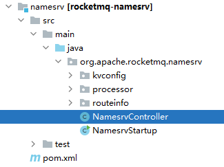

# nameServer 功能

- 维护broker服务地址及及时更新
- 给producer和consumer提供服务获取broker列表

# 启动类

org.apache.rocketmq.namesrv.NamesrvStartup


启动NameServer只有简单的两个步骤：

- 创建 [NameServer的控制器](NameServer的控制器.md)
- 然后 start 


# createNamesrvController(args)

在   [NameServer的控制器](NameServer的控制器.md) 中说了，`NamesrvController` 是整个`NameServer`的**业务入口**。

所以启动NameServer的过程，其实就是根据启动命令，解析启动命令，然后解析配置文件，然后new出来一个 `NamesrvController` 实例。

```java
// 伪代码
public static NamesrvController createNamesrvController(String[] args) throws IOException, JoranException {
    // nameServer配置
    NamesrvConfig namesrvConfig = new NamesrvConfig();
    // netty配置
    NettyServerConfig nettyServerConfig = new NettyServerConfig();
    // nameServer 默认端口号
    nettyServerConfig.setListenPort(9876);

    // 启动命令中使用c参数指定:启动时.properties配置文件.
    if (commandLine.hasOption('c')) {
        String file = commandLine.getOptionValue('c');
        if (file != null) {
            InputStream in = new BufferedInputStream(new FileInputStream(file));
            properties = new Properties();
            properties.load(in);
            MixAll.properties2Object(properties, namesrvConfig);
            MixAll.properties2Object(properties, nettyServerConfig);
            namesrvConfig.setConfigStorePath(file);
            in.close();
        }
    }
    
    return new NamesrvController(namesrvConfig, nettyServerConfig);
}
```

上面是简化之后的伪代码，省略掉了各种校验，各种日志等。

- 主要就是从main函数的args启动参数中，解析配置。
  - 比如 -c就指定启动配置文件的路径，解析配置文件到 `namesrvConfig` 、`nettyServerConfig` 中。

- 然后new NamesrvController


# 启动


---

# 更多

在RocketMQ的源码包中看NameServer相关源码：



分为三个模块：

- [kvconfig](请求处理器DefaultRequestProcessor.md)    kv配置存储、读取
- [processor](请求处理器DefaultRequestProcessor.md) 请求处理器
- [routeinfo](RouteInfoManager路由表管理器.md) 路由管理（管理broker的注册、topic路由表的维护）

另外还有两个：

- [NamesrvController](NameServer的控制器.md)    NameServer的控制器（和spring的controller类似，主要负责各种业务的入口。当然具体处理业务还是交给上面三个模块的类）
- [NamesrvStartup](NameServer启动.md)        NameServer的启动程序     

