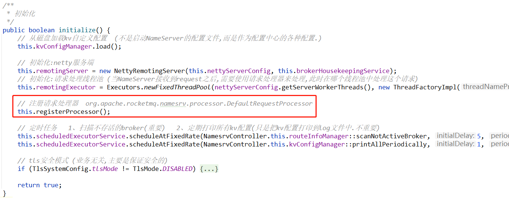
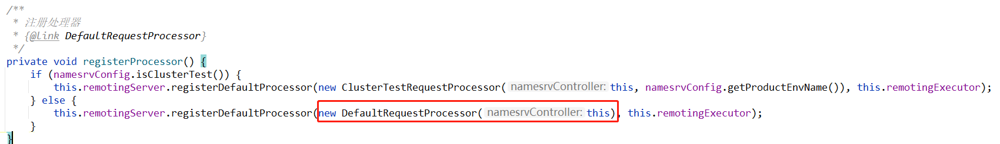
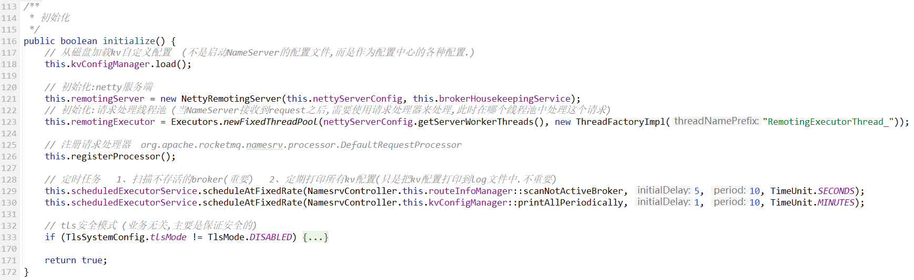

# NamesrvController

NameServer控制器 和spring的controller类似，主要负责各种业务的入口。

当然具体的处理逻辑，还是交给各自模块中的类去处理的。

> 建议先阅读完NameServer中的三大模块之后，再阅读本文。
>
> - [kvconfig](请求处理器DefaultRequestProcessor.md)    kv配置存储、读取
> - [processor](请求处理器DefaultRequestProcessor.md) 请求处理器
> - [routeinfo](RouteInfoManager路由表管理器.md) 路由管理（管理broker的注册、topic路由表的维护）


# 类结构

```java
package org.apache.rocketmq.namesrv;

public class NamesrvController {
}
```

没有继承和实现任何类。非常简单。


# 重要属性

## 配置

无论是NameServer、broker、consumer、producer都会有一些配置，在启动时可以根据这些配置进行优化，那么就需要去处理这些配置：

```java
    /**
     * 配置
     */
    private final NamesrvConfig namesrvConfig;

    private Configuration configuration;

    /**
     * 磁盘文件监听服务
     */
    private FileWatchService fileWatchService;
```


## netty server

NameServer在网络通信层面是作为`server`端的——NameServer只是接收request，不会主动给broker、producer、consumer发送请求，

所以会有netty server端的一些组件：

```java
    /**
     * netty服务配置
     */
    private final NettyServerConfig nettyServerConfig;

    /**
     * netty服务端
     */
    private RemotingServer remotingServer;

    /**
     * netty工作线程池
     * 线程数量:{@link NettyServerConfig#getServerWorkerThreads}
     */
    private ExecutorService remotingExecutor;

    /**
     * 其实是一个网络状态监听器.
     * 根据broker网络状态,来维护broker路由表
     */
    private BrokerHousekeepingService brokerHousekeepingService;
```


## 三个组件

> 在 [readme.md](readme.md) 中，我们知道NameServer有三个组件，分别是：kvconfig/processor/routeinfo

在  `NamesrvController` 中是需要有三个模块的引用的：

```java
    /**
     * kv配置控制器
     * 理解:可以理解NameServer作为一个配置中心,可以向NameServer中注册/读取配置
     */
    private final KVConfigManager kvConfigManager;

    /**
     * [broker路由控制器]
     * 主要是维护broker的连接信息的
     */
    private final RouteInfoManager routeInfoManager;
```

另外一个组件`processor`请求处理器，是在  [`initialize()`](#初始化) 方法中：



注册请求处理器 `registerProcessor()` ：




## 定时任务

```java
    /**
     * 定时线程池
     *  包含以下任务:
     *  - 定时扫描未存活的broker {@link RouteInfoManager#scanNotActiveBroker}
     *  - 定期打印所有kv配置(只是把kv配置打印到log文件中.不重要)  {@link KVConfigManager#printAllPeriodically}
     */
    private final ScheduledExecutorService scheduledExecutorService = 
            Executors.newSingleThreadScheduledExecutor(new ThreadFactoryImpl("NSScheduledThread"));
```

这里只是把定时任务线程池给实例化出来，在这里并没有向这个线程池中注册任务。

注册任务是在 [initialize()](#初始化) 方法中。


# 构造方法

```java
public NamesrvController(NamesrvConfig namesrvConfig, NettyServerConfig nettyServerConfig) {
    this.namesrvConfig = namesrvConfig;
    this.nettyServerConfig = nettyServerConfig;
    this.kvConfigManager = new KVConfigManager(this);
    this.routeInfoManager = new RouteInfoManager();
    this.brokerHousekeepingService = new BrokerHousekeepingService(this);
    this.configuration = new Configuration(log, namesrvConfig, nettyServerConfig);
    this.configuration.setStorePathFromConfig(this.namesrvConfig, "configStorePath");
}
```

构造方法中，传入两个配置：

- NamesrvConfig namesrvConfig                  NameServer配置
- NettyServerConfig nettyServerConfig        netty网络通信相关的配置

根据这两个配置，对上面的一些属性进行实例化。


# 初始化



这个初始化方法也是比较重要的，可以从中看出来 `NamesrvController` 都是由哪些组件来实现的：

- kv配置管理器 —— 从磁盘加载以前存储的配置
- netty服务器
- 请求处理器线程池、请求处理器
- 注册两个定时任务         [扫描不存活的broker](RouteInfoManager路由表管理器.md#scanNotActiveBroker)
- *tls  （略）*


# 启动

初始化之后，就启动。

其实就是`netty服务器和文件监听服务`，都启动了。

```java
public void start() throws Exception {
    this.remotingServer.start();

    if (this.fileWatchService != null) {
        this.fileWatchService.start();
    }
}
```


