# 前言

NameServer最重要的作用之一就是：**维护broker服务地址及及时更新**

# Topic路由注册、剔除机制

> 下图来自：https://www.bilibili.com/video/BV1p44y1Y7AR

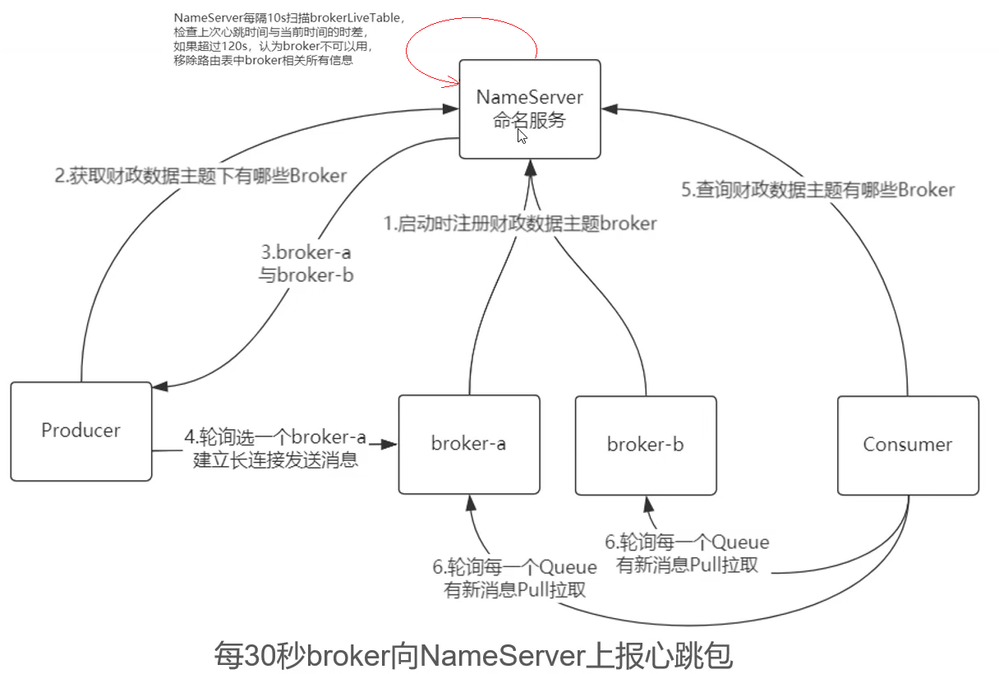

> 下图来自：https://www.bilibili.com/video/BV11Q4y1r7aW?p=9

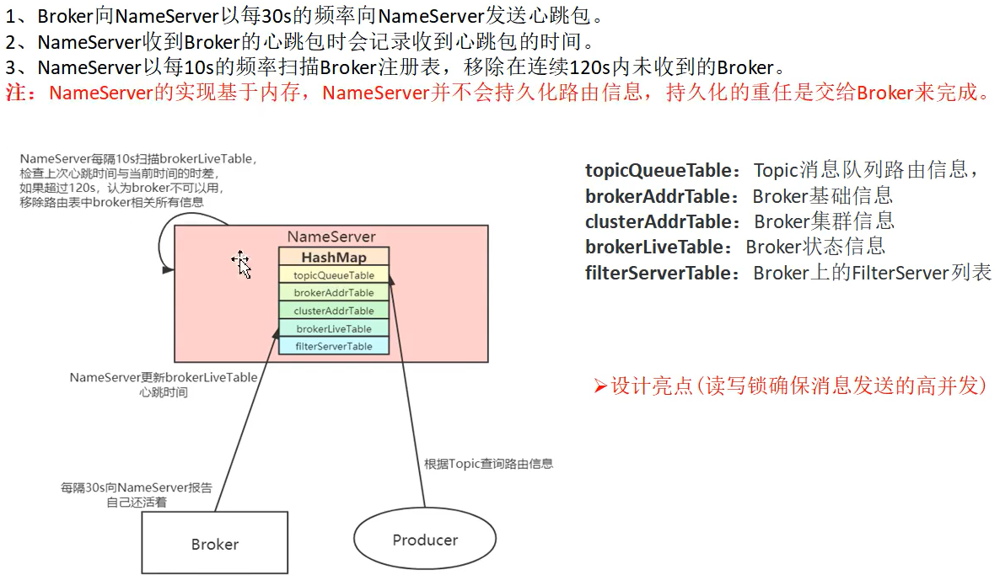

我们根据以上流程来分步骤看一下对应的源码。

## 1、broker每30s向NameServer发送心跳包

**请求类型**

```java
public static final int REGISTER_BROKER = 103;
```

**定时任务**

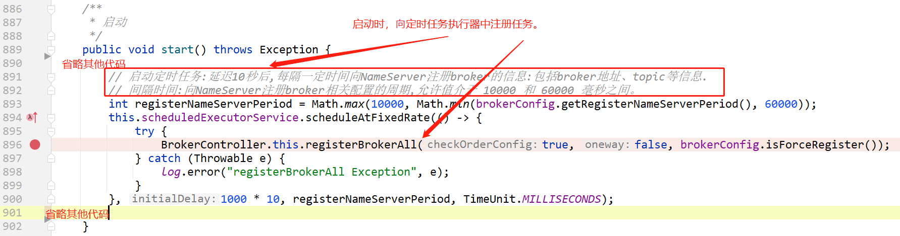

> 向NameServer发送心跳包，默认情况是30秒：
>
> ```java
> /**
>  * 向NameServer注册broker相关配置的周期
>  * 允许值介于 10000 和 60000 毫秒之间。
>  */
> private int registerNameServerPeriod = 1000 * 30;
> ```
>
> 也是可以自定义的，不过需要在 10s ~ 60s  之间。

**注册broker的具体逻辑**

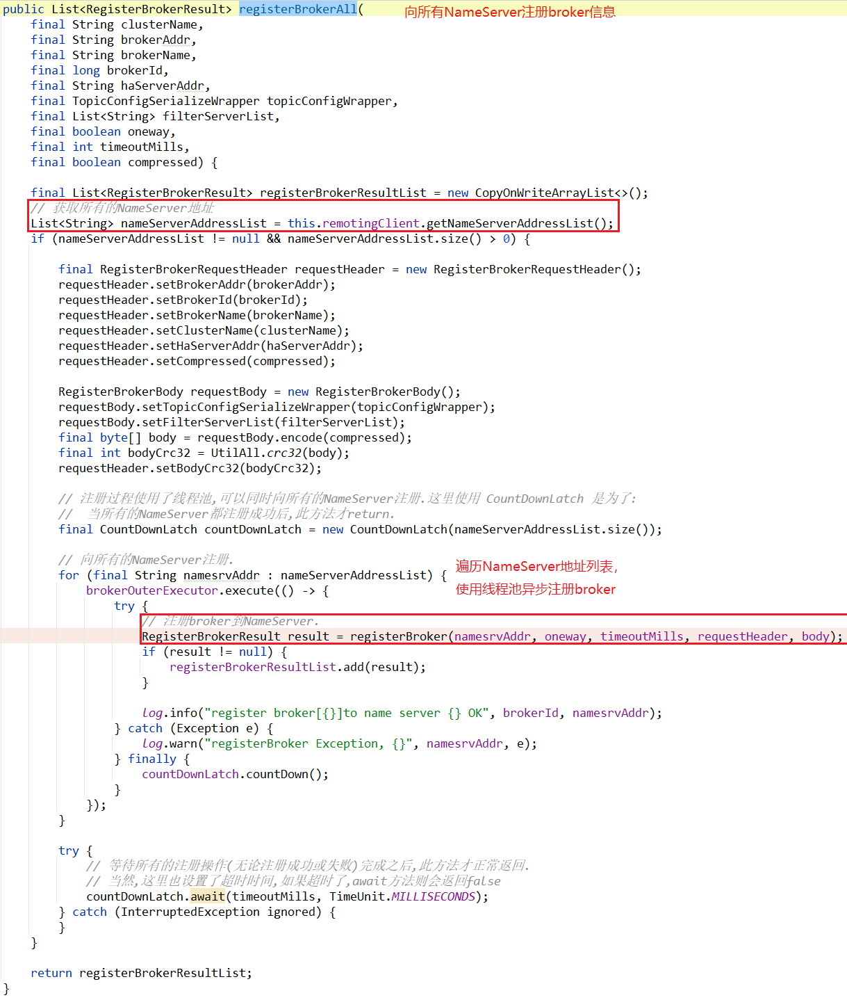

**向指定的NameServer注册broker：**

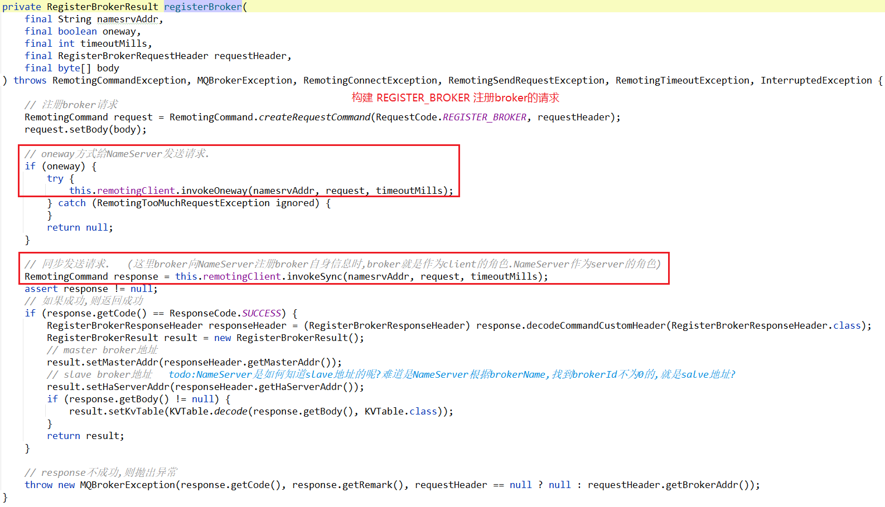


> 这里还有一个问题：
>
> 就是向NameServer发送的请求的byte[] body中的数据都是什么呢？

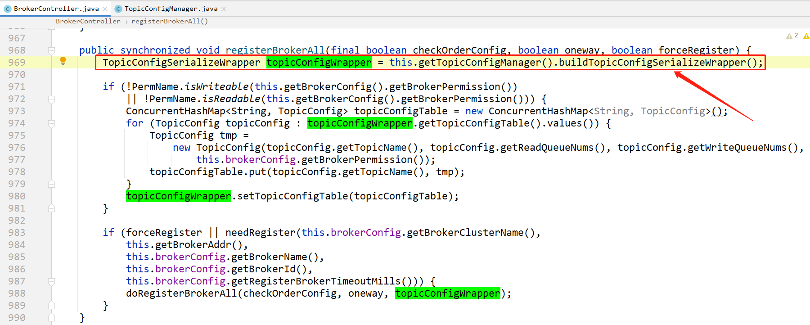

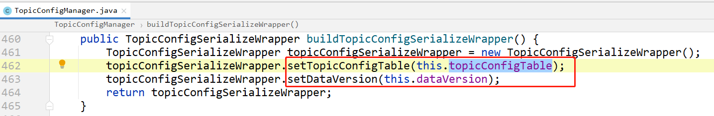

然后经过这个warpper的序列化，会把 `topicConfigTable` 和 `dataVersion` 序列化成`byte[] body` 字节数组。


## 2、NameServer收到broker的心跳包时会记录收到心跳包的时间

在NameServer的请求处理器中：

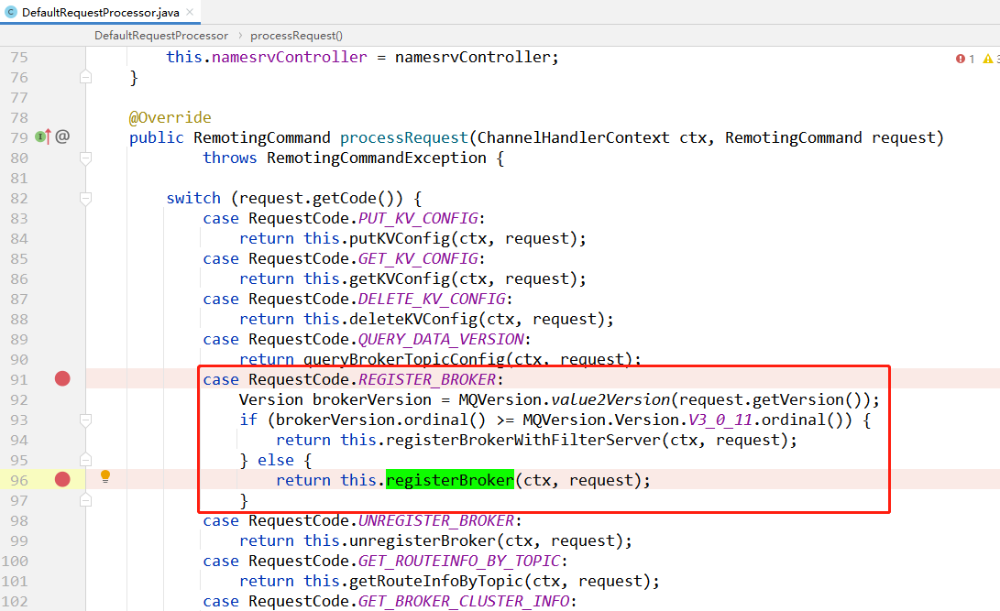


**this.registerBroker(ctx, request);**

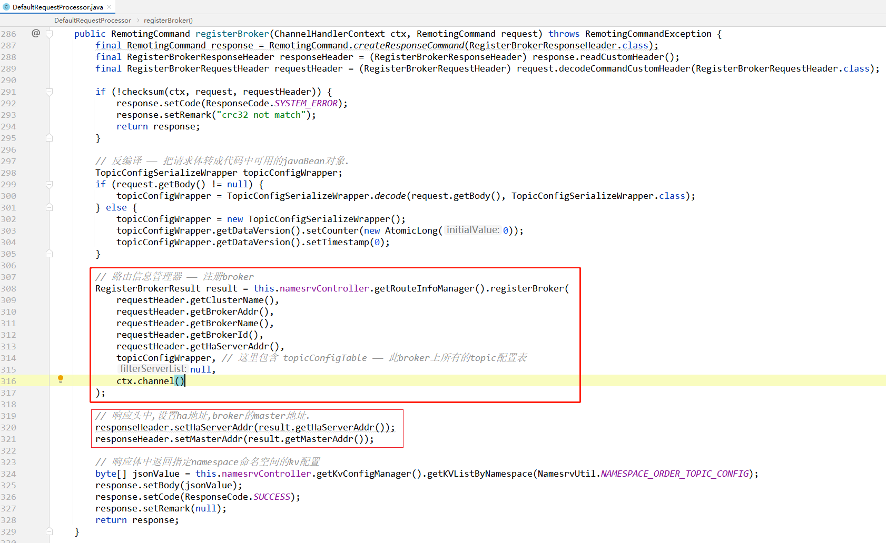

> NameServer收到broker的注册请求之后，会直接调用下面方法：使用路由表管理器，注册broker。
>
> ```java
> this.namesrvController.getRouteInfoManager().registerBroker()
> ```
>
> this.namesrvController.getRouteInfoManager().registerBroker()   方法中：
>
> - 申请写锁
> - 把brokerName记录到 `clusterAddrTable`
> - 把brokerData保存到 `brokerAddrTable`
> - 记录broker存户信息到 `brokerLiveTable`，并更新 `lastUpdateTimestamp` （用于判断broker是否存活用）
> - 保存 `filterServerTable`
> - 如果brokerId不是0,表示slave节点——则给slave返回master的地址和ha服务地址.
> - 释放写锁
>
> 小结：其实注册broker的逻辑，就是记录broker的各种信息，并提供接口让别人查询，另外就是记录broker的最后活跃的时间，如果超过120s，就移除broker。这也是路由信息管理器的主要作用。
>
> 备注：以上这些Table表，详见：[RouteInfoManager](#RouteInfoManager)


## 3、NameServer每10s扫描broker注册表，移除超时的broker。超时时间为120s

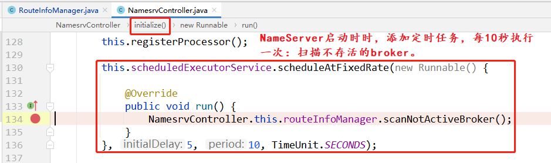


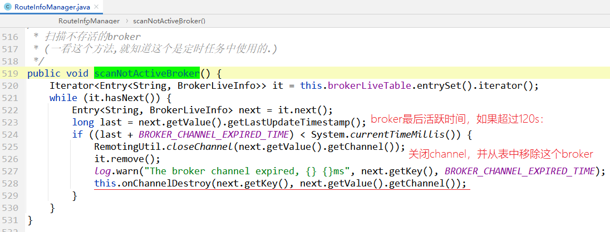

上面，关闭channel，并从 `brokerLiveTable` 移除之后，

会调用 `public void onChannelDestroy(String remoteAddr, Channel channel)` 方法，

这个方法是比较长的，就是维护各个Table中的信息，该删掉的都删掉。*细节就不粘贴出来了，有兴趣自己去看看。*


## 4、broker持久化路由信息


所以我们看一下broker的路由信息是如何持久化的。

**broker端存储topic信息表**

topic信息肯定是先在broker上创建的，然后由broker注册到NameServer上之后，producer和consumer才能从NameServer上获取到路由表。

那么在broker端肯定有个存储topic配置的地方，这就是 `TopicConfigManager` 。

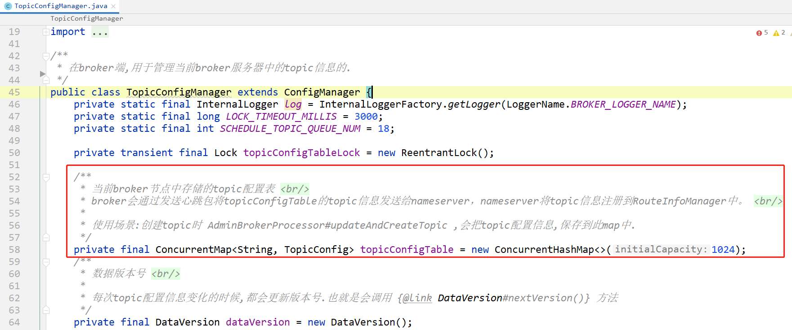

**持久化**

当broker中的topic信息变化的时候，也就是 `topicConfigTable` 变化的时候：

- 首先把最新的topic保存到 `topicConfigTable` 
- 然后更新版本号 `dataVersion`
- 持久化到磁盘
- 最后,把broker信息注册到所有的NameServer上。

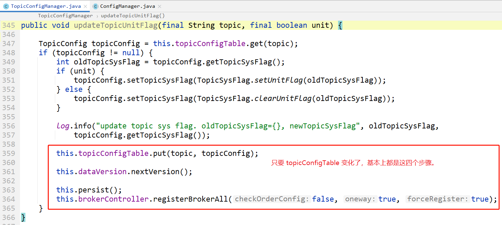


## 5、根据topic查询路由信息

一般producer在发送mq消息的时候，会根据指定的topic名称，从NameServer上查询这个topic所在的broker的ip，然后和broker之间创建长连接，把消息发送给broker。

所以下面看一下如何从NameServer查询topic路由信息的。


**请求code**

```java
/**
 * 根据topic名称获取路由表
 */
public static final int GET_ROUTEINFO_BY_TOPIC = 105;
```

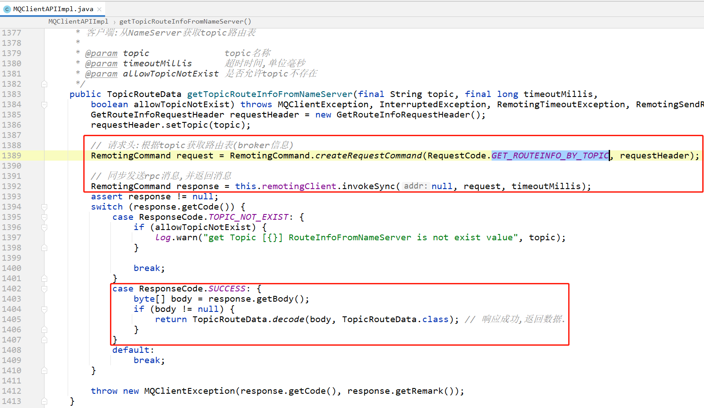

在client端，就是创建request，然后使用sync同步的方式发送并等待response。

**NameServer处理request**

> 上面说了，这个请求是client端发送给NameServer的，所以NameServer会有个请求处理器。
>
> NameServer只有一个请求处理器，org.apache.rocketmq.namesrv.processor.DefaultRequestProcessor

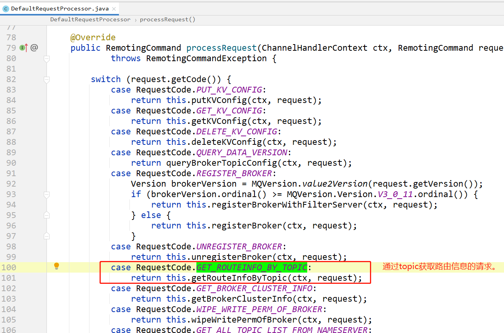


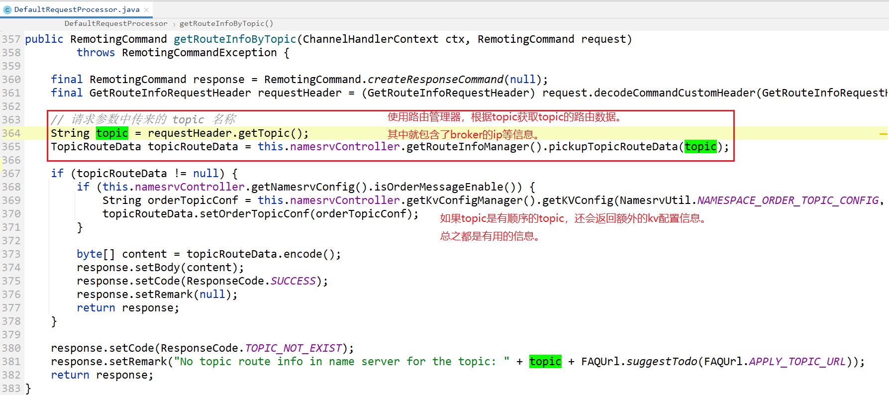


# 路由表管理器RouteInfoManager

还是先来看一下上面的流程图。


从上图，我们知道，只要broker配置了NameServer的ip端口，那么broker就会每30s主动上报心跳包，这个心跳包中包含了此broker节点的ip、brokerName、brokerId、还有topic信息等。

那么在NameServer端，就需要有个角色来管理这些配置，那就是 `RouteInfoManager`。

> 其实经过上面的1~5步骤，已经对RouteInfoManager有所了解了。这个小节只是列出对应的重要属性、重要方法等。

## **类结构**

```java
package org.apache.rocketmq.namesrv.routeinfo;


public class RouteInfoManager {
}
```

可以看到并没有继承和实现什么。类结构非常简单。


## **重要属性**

```java
/**
 * broker和NameServer之间连接超时时间. 默认是2分钟.
 */
private final static long BROKER_CHANNEL_EXPIRED_TIME = 1000 * 60 * 2;
```

### 路由表

```java
/**
 * <pre>
 * 路由表
 * key:topic名称
 * value:{@link QueueData} 列表 ——
 *
 * 可以理解为:
 *   topicName 对应-> brokerNameList
 *   也就是,根据 topicName ,可以获取到这个topic都在哪些broker节点上.
 *
 *
 * Producer将消息写入到某Broker中的某Queue中，其经历了如下过程：
 *  - Producer发送消息之前，会先向NameServer发出获取Topic路由信息的请求
 *  - NameServer返回该[Topic的路由表]及[Broker列表]
 *  - Producer根据代码中指定的Queue选择策略，从Queue列表中选出一个队列，用于后续存储消息
 *  - Produer对消息做一些特殊处理，例如，消息本身超过4M，则会报错
 *  - Producer向选择出的Queue所在的Broker发出RPC请求，将消息发送到选择出的Queue
 *  - 网络通信使用netty
 * </pre>
 */
private final HashMap<String/* topic */, List<QueueData>> topicQueueTable = 
    new HashMap<String, List<QueueData>>(1024);
```

### broker列表

```java
/**
 * <pre>
 * broker列表
 * key为broker名称
 * value为BrokerData
 *
 * 并不是一个Broker对应一个BrokerData实例:
 * 一套brokerName名称相同的Master-Slave小集群对应一个 BrokerData。
 *
 * BrokerData中包含brokerName及一个map。
 * 该map的key为brokerId，value为该 broker对应的地址。brokerId为0表示该broker为Master，非0表示Slave
 * </pre>
 */
private final HashMap<String/* brokerName */, BrokerData> brokerAddrTable = 
    = new HashMap<String, BrokerData>(128);
```

### 其他一些集合

```java
/**
 * 记录cluster集群中有多少个master的broker. <br/>
 *
 * 说明:master和slave的broker的brokerName相同.
 */
private final HashMap<String/* clusterName */, Set<String/* brokerName */>> clusterAddrTable =
    new HashMap<String, Set<String>>(32);
private final HashMap<String/* brokerAddr */, BrokerLiveInfo> brokerLiveTable = 
    new HashMap<String, BrokerLiveInfo>(256);
private final HashMap<String/* brokerAddr */, List<String>/* Filter Server */> filterServerTable = 
    new HashMap<String, List<String>>(256);
```


## **重要方法**

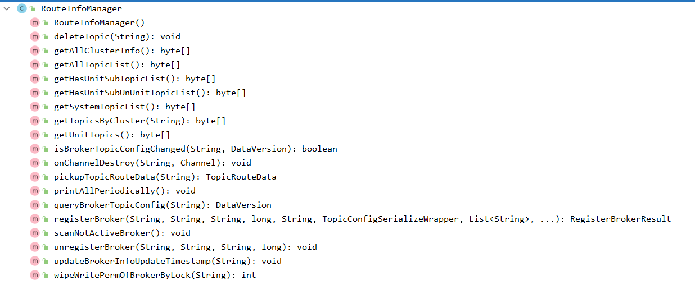


# broker探活服务

> 在RocketMQ早先版本，是使用ZooKeeper作为注册中心的（把集群中broker的元数据保存到注册中心，同时监控broker的注册状态），但是ZooKeeper太重了，所以就设计了一种轻量级的注册中心——NameServer。
>
> 本文前面的章节说了一种**使用心跳思想来保证broker存活**的手段：
>
> - broker使用心跳机制——每30秒给NameServer发送request，NameServer使用定时任务扫描超过120秒未发送心跳的broker。如果超时就移除broker。
>
> 但是还有一种场景：
>
> broker和NameServer之间使用netty长连接，如果在netty网络层面，监控到网络通道断开，那么就无需等待120s的定时扫描任务了。
>
> 所以有了：`BrokerHousekeepingService`

## BrokerHousekeepingService

**类结构**

```java
public class BrokerHousekeepingService implements ChannelEventListener {
    private final NamesrvController namesrvController;
    public BrokerHousekeepingService(NamesrvController namesrvController) {
        this.namesrvController = namesrvController;
    }
}
```

**接口**

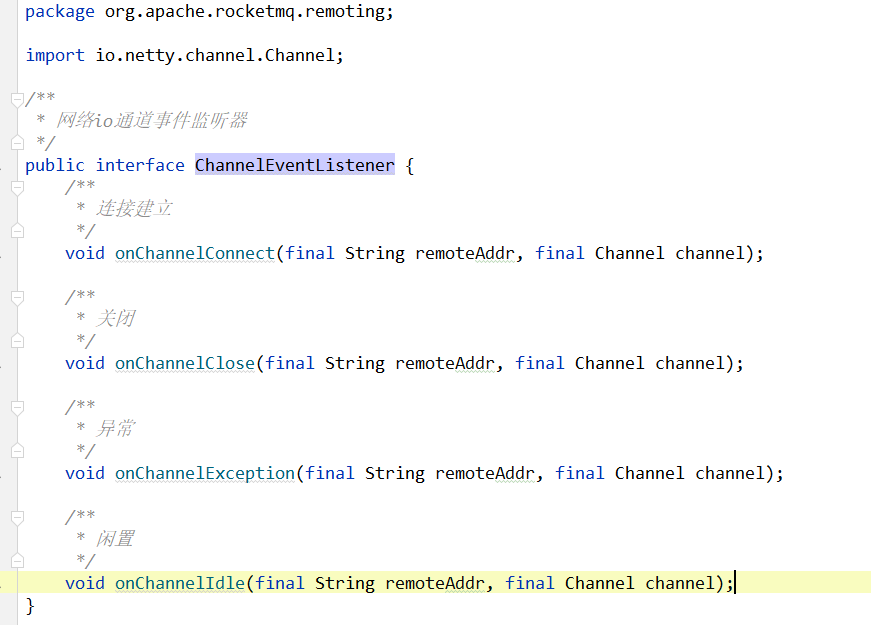

说明一下，这个监听器是RocketMQ自己定义的监听器，并不是netty的监听器。

但是我们只需要知道，当channel发生对应的事件之后，对应的方法就会被调用。


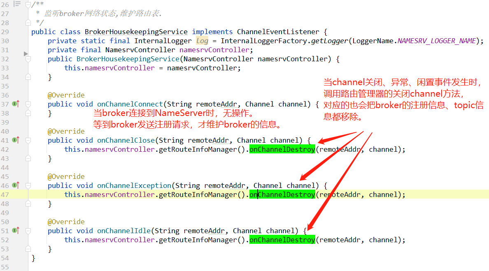

## 问题：

上面其实留了一个小疑问：org.apache.rocketmq.remoting.ChannelEventListener 是RocketMQ自定义的监听器，那么从源码的角度，是如何回调方法的呢？

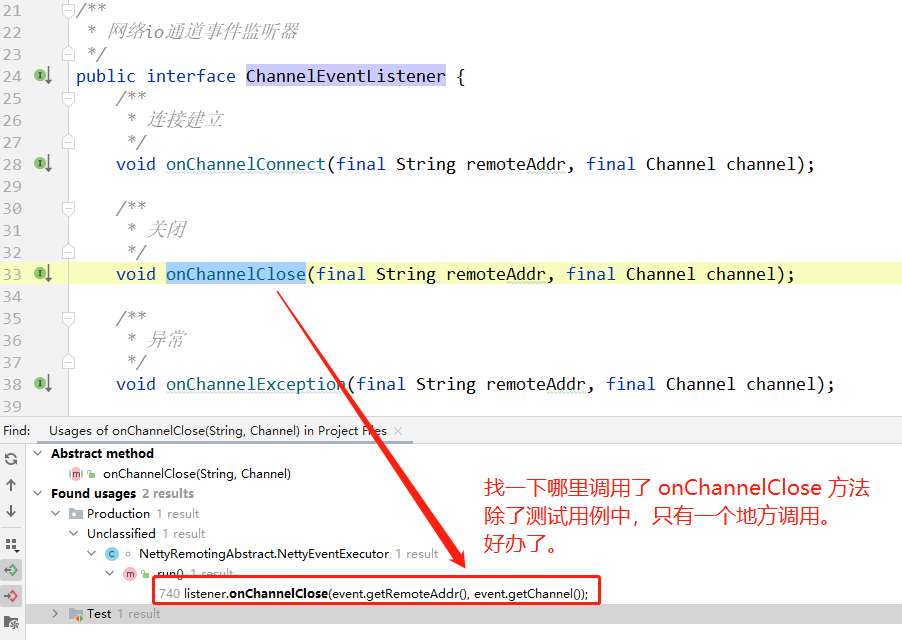


org.apache.rocketmq.remoting.netty.NettyRemotingAbstract.NettyEventExecutor

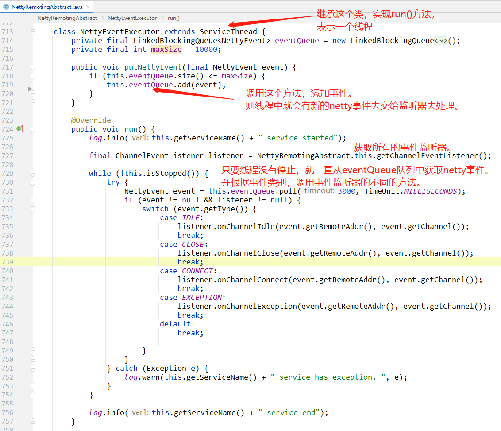


实例化线程

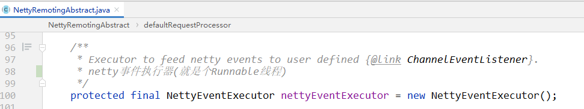


启动线程

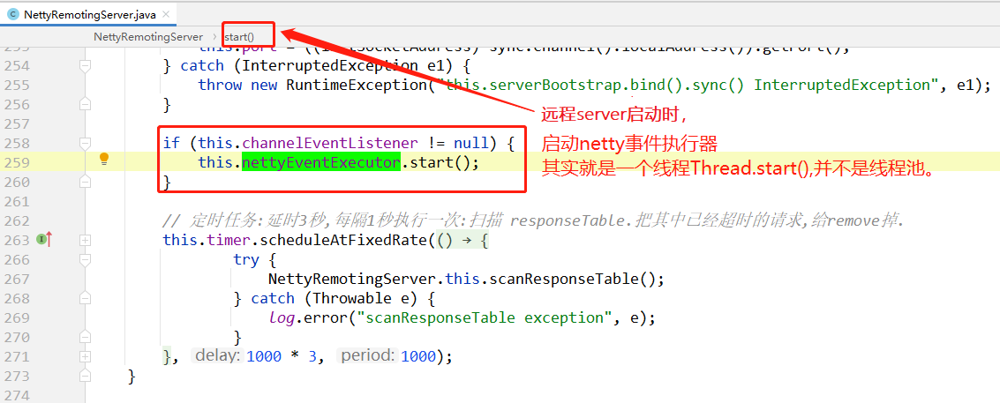

何时关闭这个线程呢？

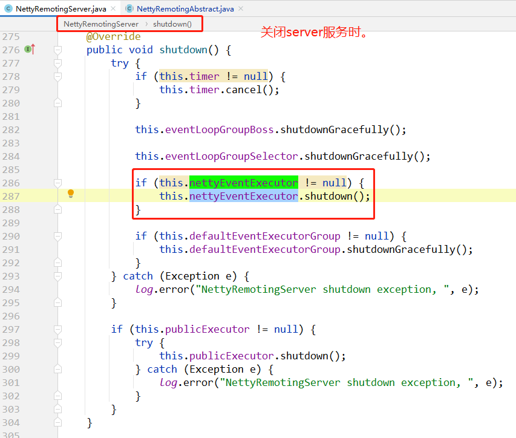


发送netty事件

> 在介绍这个线程的run方法时说了，会从`eventQueue` 队列中，拿取元素，
>
> 那么这个队列的元素是在什么时候放进去的呢？

NettyConnectManageHandler   类实现了  io.netty.channel.ChannelDuplexHandler  （看一下这个类的包，是io.netty的）

NettyConnectManageHandler   才是真正接收netty事件的，但是这个处理器把netty层面的事件，转成了 org.apache.rocketmq.remoting.netty.NettyEvent 这个RocketMQ自定义的事件。

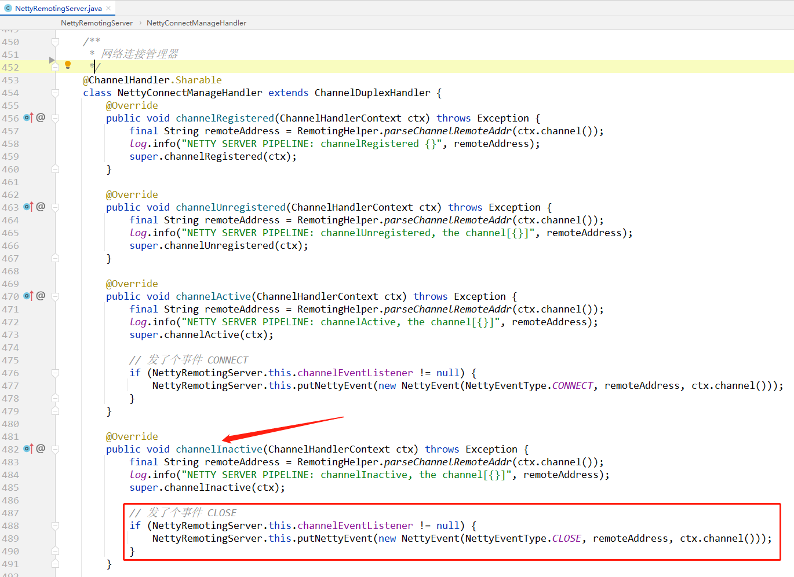

那CLOSE关闭’事件‘来说，是在`channelInactive()`方法中调用的，这个方法表示 `channel不活跃`。
这里这个方法是很重要的，因为这个是io.netty的方法：

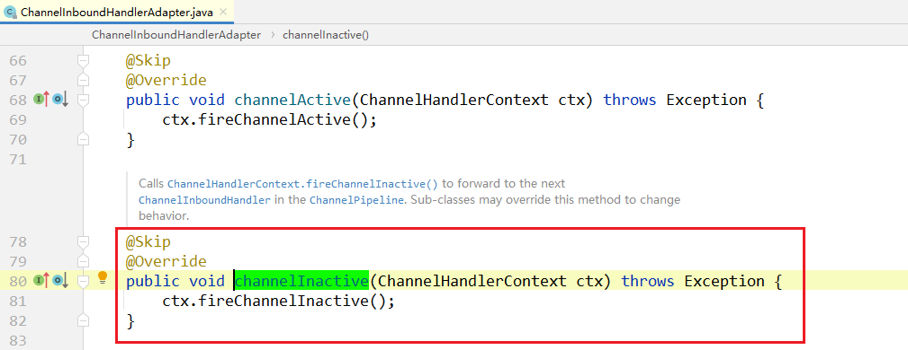

实现了这个方法，就和netty关联起来了。

**毕竟 `channel` 这个概念是在网络层才会有，而RocketMQ的网络传输层使用的是netty框架，我觉得是为了让channel的监听器简单化：**

**让开发这无需关注netty的细节，剥离netty的复杂度，所以RocketMQ又自己定义了一个【netty channel监听器】的接口—— org.apache.rocketmq.remoting.ChannelEventListener**

**开发者如果想要自己监听网络channel层面的’事件‘，就直接实现 org.apache.rocketmq.remoting.ChannelEventListener 接口就行了。**


