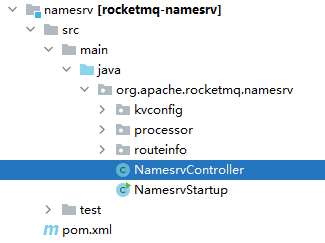

在RocketMQ的源码包中看NameServer相关源码：

分为三个模块：

- [kvconfig](请求处理器DefaultRequestProcessor.md)    kv配置存储、读取
- [processor](请求处理器DefaultRequestProcessor.md) 请求处理器
- [routeinfo](RouteInfoManager路由表管理器.md) 路由管理（管理broker的注册、topic路由表的维护）

另外还有两个：

- [NamesrvController](NameServer的控制器.md)    NameServer的控制器（和spring的controller类似，主要负责各种业务的入口。当然具体处理业务还是交给上面三个模块的类）
- [NamesrvStartup](NameServer启动.md)        NameServer的启动程序     

