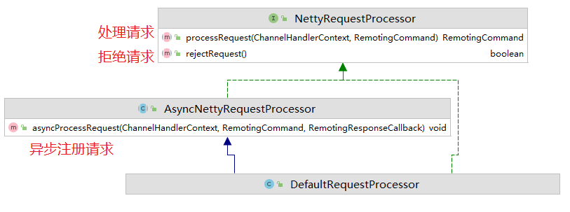
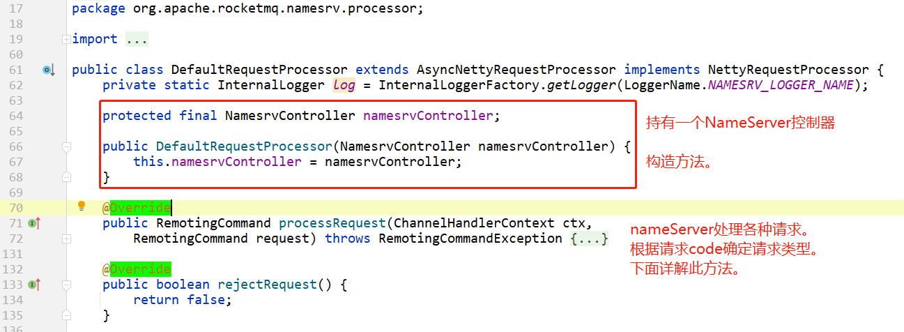
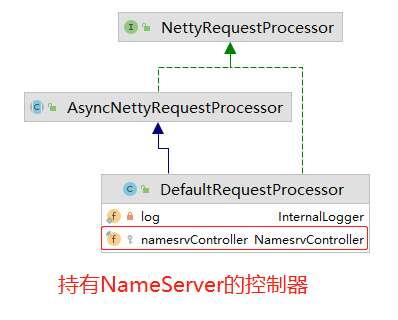
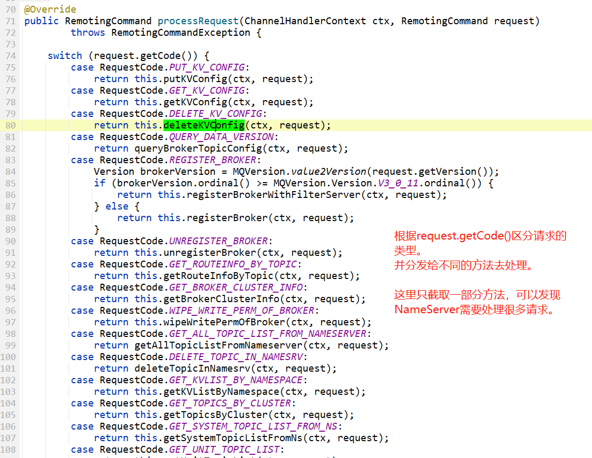
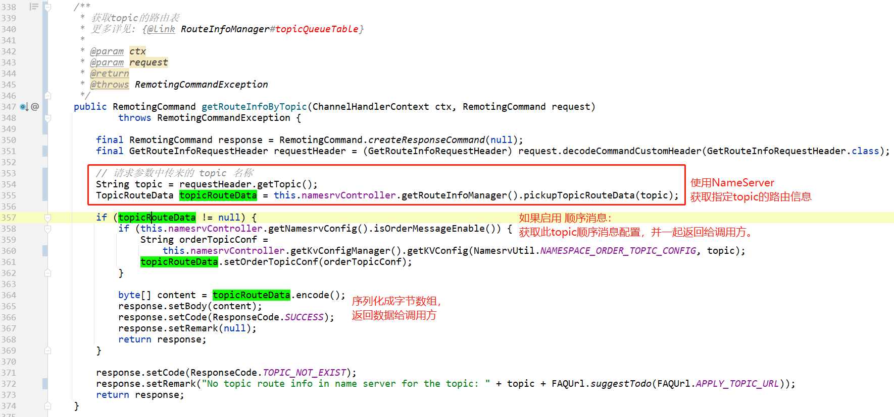

# DefaultRequestProcessor










## 处理请求的方法:processRequest



> 这里只截取一部分方法，可以发现NameServer需要处理很多类型的请求。
>
> 比如，我们之期看到过博客/文档上说：
>
> > Producer将消息写入到某Broker中的某Queue中，其经历了如下过程：
> >
> >  - Producer发送消息之前，会先向NameServer发出获取Topic路由信息的请求
> >  - NameServer返回该[Topic的路由表]及[Broker列表]
> >  - Producer根据代码中指定的Queue选择策略，从Queue列表中选出一个队列，用于后续存储消息
> >  - Produer对消息做一些特殊处理，例如，消息本身超过4M，则会对其进行压缩
> >  - Producer向选择出的Queue所在的Broker发出RPC请求，将消息发送到选择出的Queue
> >  - 网络通信使用netty
>
> 我们可以找一下这个请求，应该是：
>
> ```java
> case RequestCode.GET_ROUTEINFO_BY_TOPIC:
>     return this.getRouteInfoByTopic(ctx, request);
> ```
>
> 下面我们看一下这个方法的实现。

## 获取路由表请求

```java
case RequestCode.GET_ROUTEINFO_BY_TOPIC:
    return this.getRouteInfoByTopic(ctx, request);
```




## 画外音

DefaultRequestProcessor 这个类是 NameServer的请求处理器，

是很有代表性的，把这个 `processRequest` 方法大致看一下，就能知道 NameServer 主要提供了哪些服务。

> 这里就先不写了，还是建议自己去看源码。
>
> 不是看完别人的博客就代表你看过源码的，还是需要自己下载源码，自己加注释，找各种调用关系，甚至debug。
>
> 我这不是博客，只是记录自己看源码的一些过程，一些疑问，一些笔记而已。

如果看了这个 `请求处理器DefaultRequestProcessor ` 就能明白官方文档或者别人博客中写的：

- NameServer到底提供了哪些服务？
- NameServer到底是用来干啥的？


