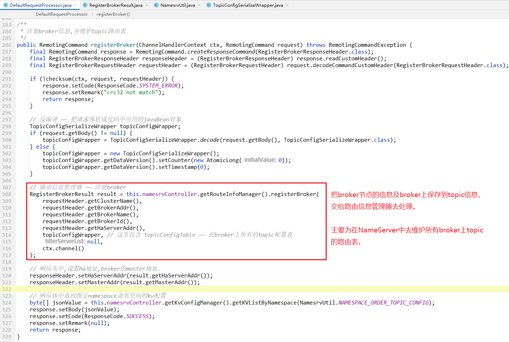

# DefaultRequestProcessor


## 处理请求的方法:processRequest


> 这里只截取一部分方法，可以发现NameServer需要处理很多类型的请求。
>
> 比如，我们之期看到过博客/文档上说：
>
> > Producer将消息写入到某Broker中的某Queue中，其经历了如下过程：
> >
> >  - Producer发送消息之前，会先向NameServer发出获取Topic路由信息的请求
> >  - NameServer返回该[Topic的路由表]及[Broker列表]
> >  - Producer根据代码中指定的Queue选择策略，从Queue列表中选出一个队列，用于后续存储消息
> >  - Produer对消息做一些特殊处理，例如，消息本身超过4M，则会对其进行压缩
> >  - Producer向选择出的Queue所在的Broker发出RPC请求，将消息发送到选择出的Queue
> >  - 网络通信使用netty
>
> 我们可以找一下这个请求，应该是：
>
> ```java
> case RequestCode.GET_ROUTEINFO_BY_TOPIC:
>     return this.getRouteInfoByTopic(ctx, request);
> ```
>
> 下面我们看一下这个方法的实现。

## 获取路由表请求

```java
case RequestCode.GET_ROUTEINFO_BY_TOPIC:
    return this.getRouteInfoByTopic(ctx, request);
```


## 注册broker信息

另一个比较重要的请求，就是NameServer处理broker注册请求。这里我们来看看。

```java
case RequestCode.REGISTER_BROKER:
    // 这里判断版本号。根据版本号去走不通的注册broker的逻辑。
    Version brokerVersion = MQVersion.value2Version(request.getVersion());
    if (brokerVersion.ordinal() >= MQVersion.Version.V3_0_11.ordinal()) {
        return this.registerBrokerWithFilterServer(ctx, request);
    } else {
        return this.registerBroker(ctx, request);
    }
```

我们无需关注每个版本的细微区别，我们只需要了解注册broker的大致流程，所以直接看 `this.registerBroker(ctx, request);` 方法：



注册broker的方法中，主要流程是：

- 解析request

- 解析request的请求体，从中获取到当前broker节点上的topic配置信息（其中有：topic信息、topic中有多少Queue、perms等）

- 向`RouteInfoManager` 注册broker—— 其实就是在NameServer中维护路由表 `topicQueueTable` ，记录下来每个broker节点的元数据信息而已。

  - 路由表：

    ```java
    /**
     * <pre>
     * 路由表
     * key:topic名称
     * value:{@link QueueData} 列表 ——
     *
     * 可以理解为:
     *   topicName 对应-> brokerNameList
     *   也就是,根据 topicName ,可以获取到这个topic都在哪些broker节点上.
     *
     *
     * Producer将消息写入到某Broker中的某Queue中，其经历了如下过程：
     *  - Producer发送消息之前，会先向NameServer发出获取Topic路由信息的请求
     *  - NameServer返回该[Topic的路由表]及[Broker列表]
     *  - Producer根据代码中指定的Queue选择策略，从Queue列表中选出一个队列，用于后续存储消息
     *  - Produer对消息做一些特殊处理，例如，消息本身超过4M，则会报错
     *  - Producer向选择出的Queue所在的Broker发出RPC请求，将消息发送到选择出的Queue
     *  - 网络通信使用netty
     * </pre>
     */
    private final HashMap<String/* topic */, List<QueueData>> topicQueueTable;
    ```

  - `this.namesrvController.getRouteInfoManager().registerBroker()` 方法逻辑有点多，这里就不细看了：其实主要就是把broker传过来的topic信息，保存到 `topicQueueTable` 中，并且在 `clusterAddrTable`中记录了当前cluster集群中有哪些brokerName：

    ```java
    /**
     * 记录cluster集群中有多少个master的broker. <br/>
     *
     * 说明:master和slave的broker的brokerName相同.
     */
    private final HashMap<String/* clusterName */, Set<String/* brokerName */>> clusterAddrTable;
    ```

  - 简单一句话：就是这个地方记录broker的元数据信息，并提供查询的方法。

- 注册完broker信息之后，最后给broker返回一些数据。


## NameServer会处理的请求类型

下面就是NameServer请求处理器会处理的请求类型：

| 请求code                                       | 描述                                  |
| ---------------------------------------------- | ------------------------------------- |
| RequestCode.PUT_KV_CONFIG                      | 向NameServer中存kv配置                |
| RequestCode.GET_KV_CONFIG                      | 从NameServer中获取kv配置              |
| RequestCode.DELETE_KV_CONFIG                   | 从NameServer中删除kv配置              |
| RequestCode.QUERY_DATA_VERSION                 | 查询数据版本号                        |
| RequestCode.REGISTER_BROKER                    | **注册broker信息**                    |
| RequestCode.UNREGISTER_BROKER                  | 注销broker信息                        |
| RequestCode.GET_ROUTEINFO_BY_TOPIC             | **通过topic名称获取路由信息**         |
| RequestCode.GET_BROKER_CLUSTER_INFO            | 获取broker的集群信息                  |
| RequestCode.WIPE_WRITE_PERM_OF_BROKER          |                                       |
| RequestCode.GET_ALL_TOPIC_LIST_FROM_NAMESERVER | 从NameServer中获取所有的topic列表     |
| RequestCode.DELETE_TOPIC_IN_NAMESRV            | 从NameServer中删除topic               |
| RequestCode.GET_KVLIST_BY_NAMESPACE            | 根据NameSpace命名空间获取kv配置列表   |
| RequestCode.GET_TOPICS_BY_CLUSTER              | 根据集群名称获取topic列表             |
| RequestCode.GET_SYSTEM_TOPIC_LIST_FROM_NS      | 从NameServer中获取系统保留的topic列表 |
| RequestCode.GET_UNIT_TOPIC_LIST                |                                       |
| RequestCode.GET_HAS_UNIT_SUB_TOPIC_LIST        |                                       |
| RequestCode.GET_HAS_UNIT_SUB_UNUNIT_TOPIC_LIST |                                       |
| RequestCode.UPDATE_NAMESRV_CONFIG              | 修改NameServer配置                    |
| RequestCode.GET_NAMESRV_CONFIG                 | 获取NameServer配置                    |


## 画外音

DefaultRequestProcessor 这个类是 NameServer的请求处理器，

是很有代表性的，把这个 `processRequest` 方法大致看一下，就能知道 NameServer 主要提供了哪些服务。

> 这里就先不写了，还是建议自己去看源码。
>
> 不是看完别人的博客就代表你看过源码的，还是需要自己下载源码，自己加注释，找各种调用关系，甚至debug。
>
> 我这不是博客，只是记录自己看源码的一些过程，一些疑问，一些笔记而已。

如果看了这个 `请求处理器DefaultRequestProcessor ` 就能明白官方文档或者别人博客中写的：

- NameServer到底提供了哪些服务？
- NameServer到底是用来干啥的？


